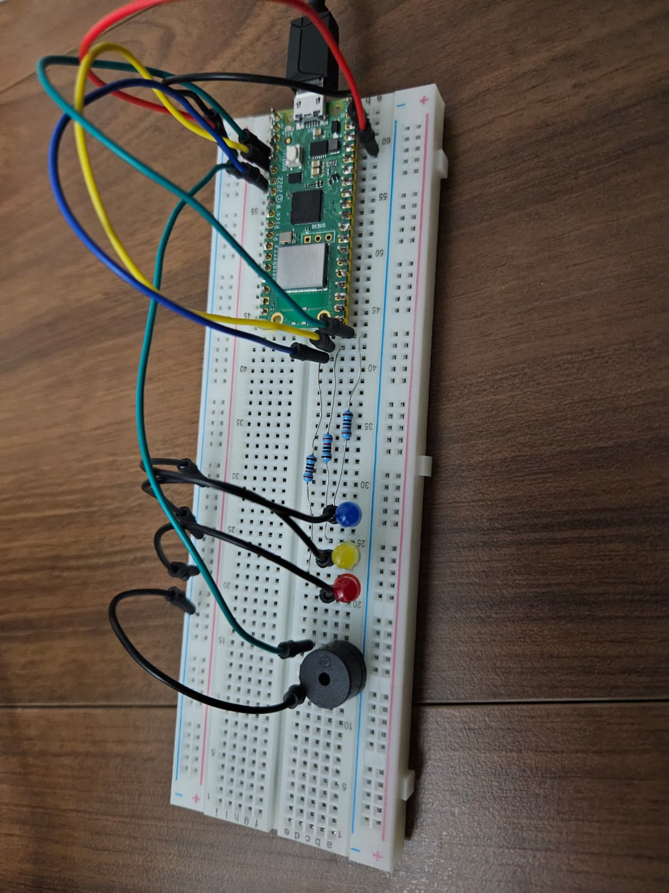

# RustyDucky

USB HID Attack Device with Discord Exfiltration

:::info

**Author**: Duica Vlad \
**GitHub Project Link**: https://github.com/UPB-PMRust-Students/project-dm-2025-DuicaVlad

:::

## Description

RustyDucky is a USB-based penetration testing tool built with Rust on the Raspberry Pi Pico W. The device emulates a USB keyboard to automatically execute commands on target systems and exfiltrates captured data via Discord webhook.

### Motivation

This project combines interests in cybersecurity (my passion), embedded systems, and Rust programming. It applies course knowledge including GPIO control, asynchronous programming, USB protocols, and real-time command execution in a practical security research context.

## Architecture

### Block Diagram
```text
┌─────────────────────────────────┐
│  Raspberry Pi Pico W (RP2040)   │
│  ┌───────────────────────────┐  │
│  │ USB HID Keyboard Emulator │◄─┼── Target Computer
│  └───────────────────────────┘  │
│  ┌───────────────────────────┐  │
│  │ Payload Execution Engine  │  │
│  └───────────────────────────┘  │
│  ┌───────────────────────────┐  │
│  │ Status Indicators         │  │
│  │ (3× LEDs + Buzzer)        │  │
│  └───────────────────────────┘  │
└─────────────────────────────────┘
          ↓
┌─────────────────────────────────┐
│ Discord Webhook                 │
│ (Data Exfiltration)             │
└─────────────────────────────────┘

```

### Components

* **USB HID Module**: Implements USB keyboard protocol using usbd-hid crate
* **Payload Engine**: Executes automated attack sequence with timing control
* **GPIO Interface**: Controls status LEDs and buzzer for visual/audio feedback
* **Data Exfiltration**: HTTP POST via curl to Discord webhook

## Log

| Week | Date Range | Work Done |
| --- | --- | --- |
| Week 1 | 17-23 Nov | Project research and documentation setup |
| Week 2 | 24-30 Nov | Hardware selection, ordered Raspberry Pi Pico 2 W |
| Week 3 | 1-7 Dec | Research on USB Rubber Ducky concepts and attack vectors |
| Week 4 | 8-14 Dec | Hardware arrived, studied component specifications and project architecture |
| Week 5 | 15-21 Dec | Development environment setup, initial code structure |
| Week 6 | 22-28 Dec | Component assembly, GitHub repository setup, serial communication testing |
| Week 7 | Jan 29-4 | Project research on Raspberry Pico 2w |
| Week 8 | Jan 5-11 | Libraries and code switched to Raspberry Pi Pico W |
| Week 9 | Jan 12-18 | Successful USB HID keyboard implementation and testing and discord webhook exfiltration, 3LEDs and buzzer indicators, final hardware integration |

## Hardware

Here is the final assembled device:

### Schematics

The Raspberry Pi Pico W integrates primary components. Breadboard adds status indicators.

**Pinout Description:**

```text
Raspberry Pi Pico W
├── RP2040 (Dual Cortex-M0+, 133MHz)
├── USB Port (Micro USB)
├── CYW43439 WiFi Module (not used)
└── 2MB Flash Storage

Breadboard (Status Indicators)
├── LED 1 (GP2) - Win+R stage
├── LED 2 (GP3) - Command collection
├── LED 3 (GP5) - Discord upload
└── Buzzer (GP4) - Upload alert

```

### Bill of Materials

| Component | Usage | Notes |
|-----------|-------|-------|
| [Raspberry Pi Pico W](https://www.optimusdigital.ro/ro/placi-raspberry-pi/12394-raspberry-pi-pico-w.html?search_query=pico+w&results=32) | Main microcontroller | RP2040 dual core |
| [Micro USB Cable](https://mediagalaxy.ro/cablu-usb-2-0-a-micro-usb-hama-200608-1-5m-negru/cpd/CAB200608/) | Programming & deployment | Standard USB-A to Micro-B |
| [Breadboard](https://www.optimusdigital.ro/ro/prototipare-breadboard-uri/8-breadboard-830-points.html?search_query=Breadboard&results=99) | Circuit prototyping | For LEDs and buzzer |
| [3× LEDs](https://www.optimusdigital.ro/ro/optoelectronice-led-uri/37-led-galben.html?search_query=led&results=661) | Status indicators | Any color, standard 20mA |
| [3× 220Ω Resistors](https://www.optimusdigital.ro/ro/componente-electronice-rezistoare/13607-set-rezistoare-110-rezistoare.html?search_query=Set+Rezistoare+%28110+rezistoare%29&results=10) | LED current limiting | For 3.3V GPIO |
| [Active Buzzer (3.3V)](https://www.optimusdigital.ro/ro/audio-buzzere/12247-buzzer-activ-de-33v-sau-3v.html?search_query=buzzer&results=47) | Payload alert | Connected to GP4 |
| [Jumper Wires](https://www.optimusdigital.ro/ro/fire-fire-mufate/888-set-fire-tata-tata-40p-20-cm.html?search_query=fire+tata+tata&results=62) | Connections | Standard breadboard jumpers |

## Software

### Technologies

- **Rust** (embassy-rp framework)
- **usbd-hid** (USB keyboard emulation)
- **embassy-usb** (USB device stack)
- **Static cell** (memory management)

### Software Architecture
```text
src/main.rs - Main
├── USB HID keyboard initialization
├── Payload execution engine
├── GPIO control (LEDs + Buzzer)
└── Timing and synchronization

```

### Payload Execution Flow

**Stage 1 (LED 1 - GP2 ON):**

* Wait 3 seconds for user preparation
* Press Win+R
* LED 1 turns on

**Stage 2 (LED 2 - GP3 ON):**

* Type "cmd" and press Enter
* Wait for CMD to open (2 seconds)
* Type collection command: `whoami > %temp%\info.txt && hostname >> %temp%\info.txt && ipconfig >> %temp%\info.txt`
* LED 2 turns on

**Stage 3 (LED 3 + Buzzer ON):**

* Press Enter (file collection runs, 3 seconds)
* Type Discord webhook curl command
* LED 3 + Buzzer activate on command completion
* Press Enter (file uploads to Discord)

**Total Execution Time**: ~8-10 seconds

## Results

**Completed:**

* USB HID keyboard enumeration on Windows
* Automated command execution via keystrokes
* System information collection (whoami, hostname, ipconfig)
* File-based data exfiltration to Discord
* Status LED indicators (3 stages)
* Buzzer audio alert to mark it done
* Hardware assembly and testing
* GitHub repository with full source

**Tested & Working:**

* Device recognized as USB keyboard
* Commands execute reliably on target
* Data appears in Discord channel within seconds
* LEDs light up at correct stages
* Cross-platform (tested on Windows)

## Technical Achievements

1. **Character Mapping**: Full US keyboard layout support (a-z, A-Z, 0-9, special chars, @, /, :, -, _, |, ., &, $, (, ), =, ', `, ,, >)
2. **Timing Synchronization**: Precise delays between stages to ensure OS readiness
3. **Minimal Code Footprint**: 300 lines of Rust (comments removed per requirements)
4. **Real Hardware Integration**: 3 status LEDs + buzzer for user feedback
5. **Zero Manual Intervention**: Completely automated from plug-in to Discord notification

## Conclusions

RustyDucky demonstrates practical application of embedded Rust for security research. The project successfully implements a USB HID attack device with automated command execution and data exfiltration to Discord. All components tested and validated on hardware.


## Links

1. [BadUSB Attack Explanation](https://www.youtube.com/watch?v=8obUvNkZdwc)
2. [USB Rubber Ducky Payloads](https://github.com/hak5/usbrubberducky-payloads)
3. [Raspberry Pi Pico Documentation](https://www.raspberrypi.com/documentation/microcontrollers/rp2040.html)
4. [embassy-rs Book](https://embassy.dev/book/)
5. [usbd-hid Crate](https://lib.rs/crates/usbd-hid)
6. [Discord Webhooks API](https://discord.com/developers/docs/resources/webhook)
