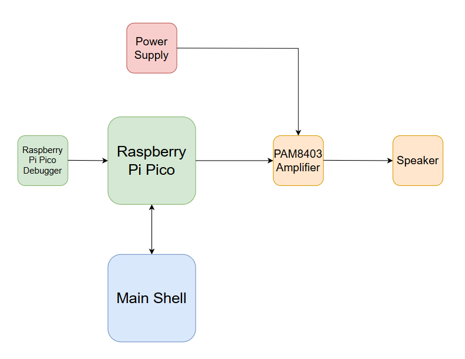
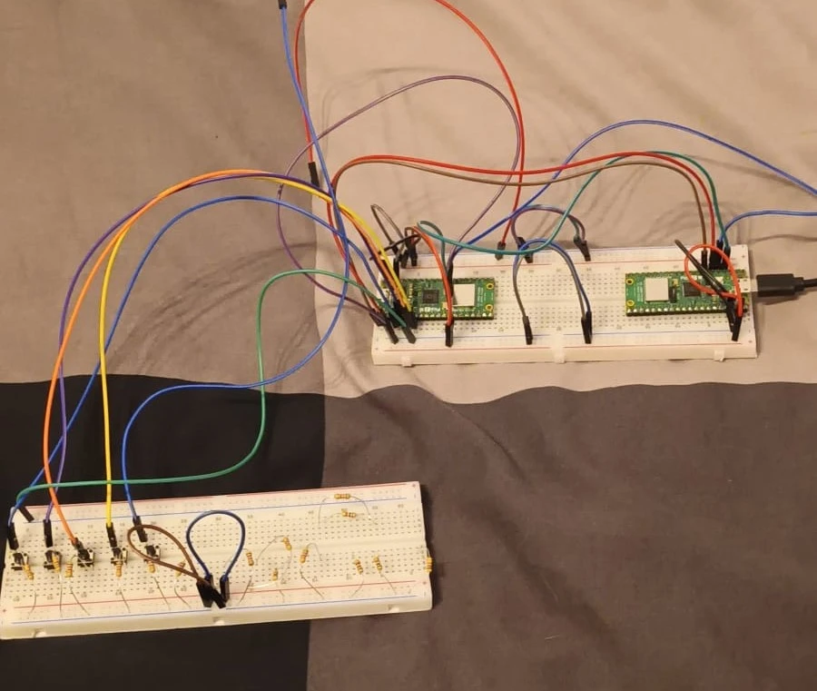
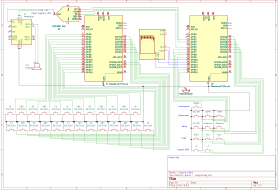

# Electric Piano
An electric piano made using mainly buttons and the Raspberry Pico 2W

:::info 

**Author**: Preda Vlad \
**GitHub Project Link**: [Github](https://github.com/UPB-PMRust-Students/project-Mrpokemon04)

:::

## Description

This project aims to create a functional electric piano using the Raspberry Pico's many GPIO ports. Alongside the standard function to play notes, I aim to implement several others, such as a metronome, the choice between 5 separate instruments, a delay feature, the option to offset the used octaves and a playback feature. The main shell of the project will essentially be a 3D printed hull whose keys will press down on buttons that activate a specific GPIO to play a specific note. On command, a signal will be sent which will play an audio file specific to the current settings through a speaker.

## Motivation

For a few years now, I've been learning to play the piano, using an old keyboard that I received a long time ago. Aside from the pleasure of playing, I have been interested in recreating the specific functions that my keyboard has, but also really wished it had more. The delay and playback features are not present on the keyboard I play, yet I feel my creativity could have fun with these features. Therefore, I chose such a topic out of love for music, but a desire to not be held back by the functionality of what I currently own.

## Architecture 

### Diagram

 

### Components

 The 2 Raspberry Pi Picos are used to control the entire project. One of them, on top of being used as a debugger, also lends its GPIO ports for the numerous buttons.
 For the note buttons, they cover 2 octaves + a note, and connect to GPIO pins from both Picos. The function buttons each cover a different purpose. There's a power supply which is needed to power a PAM8430 audio amplifier, which feeds into a speaker to play the sound of the note.

## Log

### Week 5 - 11 May

Since my project idea was approved, I started seriously organizing the tasks in my head. I gathered most of the components that I need, including the picos, a sound amplifier and the speaker. I still need to find the right buttons, though, since I ran into the issue that the standard buttons we use make too much noise when pressed down.

Nevertheless, I can start testing. I started creating a few rust files to test certain systems using the few buttons I got for early prototyping. I ran into the (probably forever-haunting) issue that two or more buttons will not register when pressed at the same time and also continued my work on the KiCAD scheme, which helped me organize the thoughts in my head.

I started collecting the audio files I need using FL Studio (which proved to have a rather unintuitive UI). Despite this, I collected all the notes I needed for a piano and a classical guitar. As I started testing, I created prototype files for the metronome and playback features, which involved battling with async functions in rust, but I eventually got the logic down.

### Week 12 - 18 May

I figured out some issues with my project. For example, I could not use the GPIO pins from the debugger pico, despite what I've been told. Nevertheless, I continued basic testing for certain functions. I wrote a prototype for the delay feature, and generally cleaned up the main file while implementing the rest. Hardware-wise, I figured out I would also need a Digital-to-Analog converter, so I will start looking for one. Apart from that, most of my components are in one place, however they are not fully connected since I still need to figure out the wiring for all the GPIO pins.

### Week 19 - 25 May

Some solutions started showing themselves. First comes the issue of the main hull. This could not be 3D printed as the dimensions are slightly too large. Thankfully, my father has a hobby in woodworking, so he will help me with the main frame, while I still need to 3D print the keys. A friend of mine, [@JavaKet](https://github.com/SeriouslyAndy), will help me with the printing. For the software, I managed to connect the SD Card to the pico and succesfully read if a file exists on the card or not. Now, I will need to find a way to implement a matrix grid system for the GPIOs, so that I can only use one pico. Still some work to do, though, as I need to set up the sound output, but most of the logic otherwise is written. Hopefully the transition from printing to playing will be smooth. Although I will be cutting it short, I have faith I can finish this project.

### Week 26 - 30 May (PM Fair)

I managed to implement the button matrix grid system. Even still, I'll probably have to scale back to only one octave, seeing as I've run into some limitations. Still, the 3D printed keys are almost here. I cleaned up what there was to clean up with the main file, and essentially combined all the prototype functions into it. Although the file is hefty, most of it is just a bunch of if statements, checking which button has been pressed. (Once for normal presses, and once more while recording a loop).

## Hardware

- *Raspberry Pico 2W*: The brain of the project, it handles all the the input/output signals regarding keys and other features.
- *SD Card Reader*: This is used to store all the audio files, since the Pico's storage is not large enough.
- *Speaker*: Used in order to play the sound files, hooked up to an amplifier.
- *Digital-to-Analog converter*: Used to convert the digital audio signal from the pico to an analog signal for the amplifier.
- *PAM8403 Amplifier*: This is used to strengthen the audio files to be later sent to the speaker.
- *Potentiometer*: Used to change volume.
- *Buttons*: Used for keys, as well as supplementary features.

### Photos

 
 
 

### Schematics

 

### Bill of Materials

| Device | Quantity |Usage | Price |
|--------|--------|--------|-------|
| [Raspberry Pi Pico 2W](https://www.raspberrypi.com/documentation/microcontrollers/raspberry-pi-pico.html) | 2 | The microcontroller | [39.66 RON](https://www.optimusdigital.ro/ro/placi-raspberry-pi/13327-raspberry-pi-pico-2-w.html) |
| Header pins | 2 |  Pins for the microcontroller + other modules | [2 RON](https://www.optimusdigital.ro/ro/componente-electronice-headere-de-pini/85-header-de-pini.html) |
| Amplifier module PAM8403 | 1 | Module for the speaker | [4 RON](https://www.optimusdigital.ro/ro/audio-amplificatoare-audio/165-amplificator-in-miniatura.html) |
| [Breadboard (830 points)](http://www.pgccphy.net/1020/datasheets/ELEGOO%20830%20430%20tie-points%20Breadboard.pdf) | 3 | Breadboards for picos and other components | [30 RON](https://www.optimusdigital.ro/ro/prototipare-breadboard-uri/8-breadboard-830-points.html) |
| Breadboard (400 points) | 2 | Smaller breadboards | [13.68 RON](https://www.optimusdigital.ro/ro/prototipare-breadboard-uri/44-breadboard-400-points.html?search_query=0104110000000156&results=1)
| 10k WH148 Potentiometer | 1 | Controlling volume | [2.39 RON](https://www.optimusdigital.ro/ro/componente-electronice-potentiometre/12360-rezistor-variabil-10k-wh148-poteniometru-fara-aiba-i-piulia.html) |
| Cap for potentiometer | 1 |  Covers the potentiometer | [1 RON](https://www.optimusdigital.ro/ro/altele/267-capac-colorat-pentru-potentiometru-.html) |
| Micro USB cable | 1 | Connecting to the microcontroller | [4 RON](https://www.optimusdigital.ro/ro/cabluri-cabluri-usb/11939-cablu-negru-micro-usb-1-m.html) |
| Speaker | 1 | Output for the audio signals | [4.28 RON](https://ardushop.ro/ro/componente-discrete/1084-difuzor-1w-8ohm-50mm-6427854014900.html) |
| Button | 50 | Keys + other functions | |
| Power Supply | 1 | Supplying power to the amp | [4.69 RON](https://www.optimusdigital.ro/ro/electronica-de-putere-stabilizatoare-liniare/61-sursa-de-alimentare-pentru-breadboard.html) | 
| 10cm Male-to-Male jumper wires | 2 | Connections between components | [5 RON](https://www.optimusdigital.ro/ro/fire-fire-mufate/884-set-fire-tata-tata-40p-10-cm.html) |
| 10cm Male-to-Female jumper wires | 1 | Connections between debug and main pico | [3 RON](https://www.optimusdigital.ro/ro/fire-fire-mufate/650-fire-colorate-mama-tata-10p.html) |

## Software

| Library | Description | Usage |
|---------|-------------|-------|
| [embassy-rp](https://docs.embassy.dev/embassy-rp/git/rp2040/index.html) | The HAL implements both blocking and async APIs for many peripherals. | Handles just about everything with the Picos
| [defmt](https://docs.rs/defmt/latest/defmt/) | Adds several debugging features | Logging/Debugging along the way
| [embassy-time](https://embassy.dev/book/dev/time_keeping.html) | Time management library  | Used for time-based operations such as delays |
| [embedded-sdmmc](https://docs.rs/embedded-sdmmc/latest/embedded_sdmmc/) | Crate for SD connections | Used to connect the SD card reader to the Pico
| [embassy-sync](https://docs.embassy.dev/embassy-sync/git/default/index.html) | Provides synchronization features | Used for channels and signals to send data between tasks |

## Links

<!-- Add a few links that inspired you and that you think you will use for your project -->

1. [RP2350 Documentation](https://datasheets.raspberrypi.com/rp2350/rp2350-datasheet.pdf)
2. [Inspiration](https://www.instructables.com/Electric-Piano/)