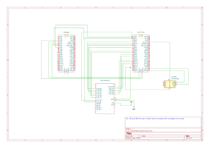

# HumanBenchmark

A human memory and reflexes tester

:::info

**Author**: Stoica Vlad-Alexandru

**Github Project Link**: https://github.com/UPB-PMRust-Students/project-Playsu

:::

## Description

A device that is used to see the reaction time and the memory score of people in a fun and interactive way.

## Motivation

I always liked to use sites like HumanBenchmark to see the differences between me and my friends. We used it in a competitive way and I figured that it would make an interesting project for this subject.

## Architecture

Here is the schematic of the project:

## Log

### Week 5 - 11 May

I bought all necessary components for the project. This involved researching and selecting the appropriate hardware specifications to match the project requirements and placing orders for all components.

### Week 12 - 18 May

I focused on building the complete hardware setup of the device. This included:
- Connecting the main Raspberry Pi Pico 2W to the LCD shield using the 8-bit parallel interface
- Setting up the AT24C256 EEPROM module with I2C connections to the main Pico
- Configuring the second Raspberry Pi Pico 2W as a debugger with SWD interface
- Assembling the power distribution system with the breadboard power supply and 12V adapter

By the end of the week, I had a fully assembled hardware prototype ready for the software implementation phase.

### Week 19 - 25 May

1. Issues Fixed

-LCD not working: Wrong interface type - switched from SPI to 8-bit parallel

-Slow rendering: Optimized data transfer with burst mode

-Pin corrections: Remapped all LCD connections to proper GPIO pins

2. Implementation

-Custom LCD driver for ILI9341 display

-EEPROM integration for high score storage

-Button debouncing for accurate timing

-Visual feedback with color-coded results

## Hardware

The project uses two Raspberry Pi Pico 2W boards - one runs the reaction test game and one works as a debugger. The display is a 2.4" LCD Shield with ILI9341 controller that shows the game screen. A button on GPIO12 is used for player input. For saving high scores, an AT24C256 EEPROM module stores the best reaction times. The system is powered by a 9V adapter through a breadboard power supply, providing 5V for the LCD. All parts are connected using jumper wires on a breadboard.

The main Pico 2W connects to the LCD using 8 data pins (D0-D7 on GPIO0-6 and GPIO15) plus control pins (RS, WR, RD, CS, RST on GPIO27, 8, 26, 9, 7). The EEPROM connects to the Pico using I2C (SDA on GPIO16, SCL on GPIO17). The second Pico 2W connects as a debugger using SWD pins, allowing code upload and debugging.

### Schematics

### Bill of Materials
| Device | Usage | Price |
|--------|-------|-------|
| [Raspberry Pi Pico 2W](https://www.raspberrypi.com/documentation/microcontrollers/pico-series.html) | Main microcontroller for running the game logic and interfacing with peripherals | [40 RON](https://www.optimusdigital.ro/en/raspberry-pi-boards/13327-raspberry-pi-pico-2-w.html?search_query=raspberry+pi+pico+2W&results=36) |
| [Raspberry Pi Pico 2W](https://www.raspberrypi.com/documentation/microcontrollers/pico-series.html) | Secondary microcontroller used as a debugger | [40 RON](https://www.optimusdigital.ro/en/raspberry-pi-boards/13327-raspberry-pi-pico-2-w.html?search_query=raspberry+pi+pico+2W&results=36) |
| 2.4" Arduino LCD Red with Touchscreen | Display for the game interface with touchscreen capabilities | [40 RON](https://www.optimusdigital.ro/en/lcds/12489-4-inch-touch-screen-tft-display-shield-for-arduino-uno-mega.html?search_query=arduino+lcd&results=66) |
| AT24C256 EEPROM Module | Non-volatile memory for storing high scores and game settings | [9 RON](https://www.optimusdigital.ro/en/memories/632-modul-eeprom-at24c256.html?search_query=eeprom+at&results=89) |
| Breadboard Kit HQ830 with Wires and Source | It is used for powering the Arduino Shield | 22 RON |
| 12V Power Adapter | Power source for the breadboard power supply | [19 RON](https://www.optimusdigital.ro/ro/electronica-de-putere-alimentatoare-priza/2885-alimentator-stabilizat-12v-1000ma.html?search_query=alimentator+stabilizat+12+V&results=12) |
| 2 Separate Breadboards | Prototyping platform for connecting components | 18 RON |
| 2 Micro-USB cables | Connecting the 2 Raspberry Pi Pico 2W | [8 RON](https://www.optimusdigital.ro/en/usb-cables/11939-micro-usb-black-cable-1-m.html?search_query=micro+usb+1m&results=474) |

## Software

# Software Libraries

| Library | Description | Usage |
|---------|-------------|-------|
| `embassy-rp` | Hardware Abstraction Layer for RP2350 | GPIO control, I2C communication, system initialization |
| `embassy-executor` | Async/await runtime for embedded systems | Task scheduling and async execution |
| `embassy-time` | Time and delay utilities | Timing measurements, delays, debouncing |
| `embedded-hal-async` | Async hardware abstraction traits | I2C trait for EEPROM communication |
| `defmt` | Efficient logging framework for embedded | Debug logging and diagnostics |
| `heapless` | Stack-allocated data structures | String formatting without heap allocation |
| `panic-probe` | Panic handler for embedded debugging | Error handling and debugging |
| `core::fmt` | Core formatting utilities | String formatting for display output |

## Custom Implementations

| Module | Description | Usage |
|--------|-------------|-------|
| `LcdDisplay` | Custom 8-bit parallel LCD driver | Display control for ILI9341-compatible LCD shield |
| `Eeprom` | AT24C256 EEPROM driver | High score storage and retrieval |
| `irqs` | Interrupt bindings | USB and I2C interrupt handling |

## Links
[Project Video](https://www.youtube.com/shorts/plnarpQn-Io)