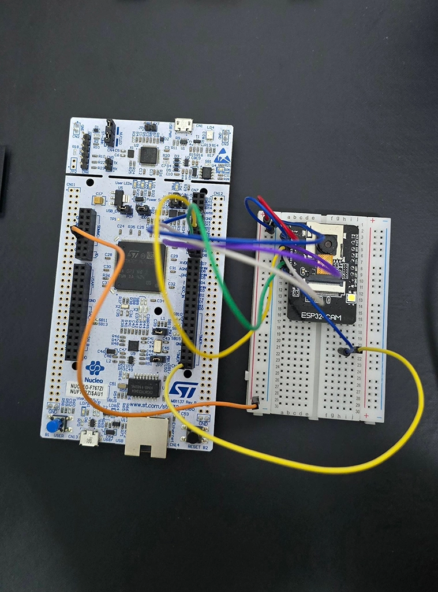
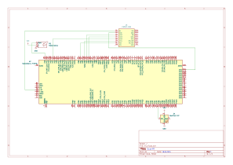

# ScanfM
ScanfM (Scan from Motion): A compact 3D scanning system using motion-based image reconstruction.

:::info 

**Author**: Chințoiu Vlăduț-Andrei \
**GitHub Project Link**: https://github.com/UPB-PMRust-Students/project-GameSkyRO

:::

## Description

ScanfM is a hardware-software system designed to bridge the gap between the physical and digital worlds through 3D reconstruction. Using Structure from Motion (SfM), the project utilizes an STM32F767ZI microcontroller, an ESP32, and an ESP32-CAM module to capture and transmit a series of precisely angled photographs of a physical object.

The object is placed on a rotating platform controlled by a servomotor, while a fixed ESP32-CAM module captures images at defined intervals. These images are triggered and ordered by the STM32 board and transmitted wirelessly for processing on a PC, where the 3D model is reconstructed using SfM algorithms. ScanfM enables 3D scanning with a clean separation between data acquisition (on-device) and processing (on-host).

## Motivation

For as long as I can remember, I’ve been passionate about games and game development, especially in 3D. Initially, I was drawn to coding, thinking it was the heart of game creation. But I soon discovered that game development involves much more than writing code. In fact, 3D modeling, rigging, and animation are often the real creative and technical challenges.

Curious, I began exploring the world of 3D design. While my main passion still lies in programming, this new dimension of development sparked my interest. That curiosity led me to this project: one that aims to bridge the gap between the physical and digital worlds.

Objects are central to our existence, from housing and food to tools and entertainment. While we can’t always reshape the real world to match our imagination, the digital world knows no limit. To truly create, however, we need a foundation - a reference. This is where my 3D scanner comes in: a way to digitize real-world objects and bring them into the creative realm as manipulable assets for design, games, or visualization.

## Architecture 

Main components:
 - STM32F767ZI board - handles the timing and processing of images during the 3D scanning process
 - ESP32-CAM module - captures grayscale images of the object being scanned

Secondary components
 - Servomotor - rotates the object at precise angles to capture images from multiple perspectives.
 - Button - initiates the 3D scanning sequence when pressed
 - Lights - provides optimal illumination to enhance the contrast between the object and its background

Connections:
 - ESP32-CAM &lt;-&gt; STM32 : SPI
 - STM32 &lt;-&gt; PC : UART
 - STM32 &lt;-&gt; Secondary components : PWM/Digital


## Log

### Week 21 - 27 April
Established communication between the ESP32 and the STM board via SPI, along with connectivity between the ESP32 and my computer.

### Week 28 April - 4 May
Tested functionality of ESP32-CAM module and different image formats.

### Week 5 - 11 May

### Week 12 - 18 May

### Week 19 - 25 May

## Hardware

Hardware Setup




- **STM32F767ZI Board**: Acts as the central controller, responsible for timing the capture of images and processing them. It coordinates the system and sends commands to other components.
- **ESP32-CAM Module**: A camera module used to capture grayscale images of the object. It is connected to the STM for image acquisition.
- **ESP32**: Used to wirelessly transmit the captured image data from the STM to a PC for further processing and 3D reconstruction.
- **Servomotor**: A motor used to rotate the object at precise angles to allow for multiple image captures from different perspectives.
- **Button**: Initiates the 3D scanning sequence when pressed, triggering the system to start the image capture process.
- **Lights**: Provide necessary illumination to enhance the contrast between the object and the background for clearer image capture.

### Schematics

KiCad Schematic


### Bill of Materials

<!-- Fill out this table with all the hardware components that you might need.

The format is 
```
| [Device](link://to/device) | This is used ... | [price](link://to/store) |

```

-->

| Device | Usage | Price |
|--------|--------|-------|
| [STM32F767ZI](https://www.st.com/en/evaluation-tools/nucleo-f767zi.html) | Main microcontroller | [136 RON](https://ro.mouser.com/ProductDetail/STMicroelectronics/NUCLEO-F767ZI?qs=7UaJ5Mrpeu0%2F%252BMRranB3%2Fw%3D%3D) |
| [ESP32](https://www.espressif.com/sites/default/files/documentation/esp32-wroom-32d_esp32-wroom-32u_datasheet_en.pdf) | Transmitter | [17 RON](https://www.aliexpress.com/item/1005005704190069.html?spm=a2g0o.productlist.main.7.3ed4elegelegGc&algo_pvid=9e6145b3-fcba-4997-81ca-037bc9cc0187&algo_exp_id=9e6145b3-fcba-4997-81ca-037bc9cc0187-3&pdp_ext_f=%7B%22order%22%3A%227047%22%2C%22eval%22%3A%221%22%7D&pdp_npi=4%40dis%21RON%2125.05%2122.80%21%21%2140.34%2136.72%21%402103963717462213747088339e45d1%2112000034061352780%21sea%21RO%210%21ABX&curPageLogUid=gV8oWAovS7f0&utparam-url=scene%3Asearch%7Cquery_from%3A) |
| [ESP32-CAM Module](https://docs.m5stack.com/en/unit/esp32cam?ref=blakadder) | Camera module | [62 RON](https://sigmanortec.ro/placa-dezvoltare-esp32-cam-wifi-bluetooth-ov2640-2mp?SubmitCurrency=1&id_currency=2&gad_source=1&gad_campaignid=22174019478&gbraid=0AAAAAC3W72O583Lr5l62Wu-ikqzQMfuL2&gclid=Cj0KCQjw2tHABhCiARIsANZzDWpji0-H7LcesN02tSijDlctpbIWYVvsIh_IgFbEKtBm5bmHqLP1Hp0aAtldEALw_wcB) |
| [Servomotor SG90](https://www.bitmi.ro/electronica/servomotor-sg90-180-grade-9g-10496.html) | Servomotor | [10 RON](https://www.bitmi.ro/electronica/servomotor-sg90-180-grade-9g-10496.html) |
| MM Jumper Cables | Cables |  [6 RON](https://www.optimusdigital.ro/ro/fire-fire-mufate/653-fire-colorate-mama-tata-40p-10-cm.html?search_query=%09Fire+Colorate+Tata-Tata+%2840p%29+10+cm&results=10) |
| MF Jumper Cables | Cables | [6 RON](https://www.optimusdigital.ro/ro/fire-fire-mufate/653-fire-colorate-mama-tata-40p-10-cm.html?search_query=%09Fire+Colorate+Mama-Tata+%2840p%29+10+cm&results=5) |
| FF Jumper Cables | Cables | [7 RON](https://www.optimusdigital.ro/ro/fire-fire-mufate/652-fire-colorate-mama-mama-40p-10-cm.html?search_query=%09Fire+Colorate+Mama-Mama+%2840p%29+10+cm&results=10) |
| Resistors | Resistors | [15 RON](https://www.optimusdigital.ro/ro/componente-electronice-rezistoare/10928-plusivo-kit-250-buc-rezistoare.html?search_query=plusivo&results=274) |


## Software

| Library | Description | Usage |
|---------|-------------|-------|
| [embassy](https://github.com/embassy-rs/embassy) | Modern, lightweight, and safe async framework for embedded systems | Used for async task handling and peripheral management |
| [esp-idf-hal](https://github.com/esp-rs/esp-idf-hal) | Embedded-hal implementation for Rust on ESP32 and ESP-IDF | Used for peripheral management |
| [esp-idf-svc](https://github.com/esp-rs/esp-idf-svc) | Type-Safe Rust Wrappers for various ESP-IDF services (WiFi, Network, Httpd, Logging, etc.) | Used for Wi-Fi management |

## Links

<!-- Add a few links that inspired you and that you think you will use for your project -->

1. [link](https://example.com)
2. [link](https://example3.com)
...
