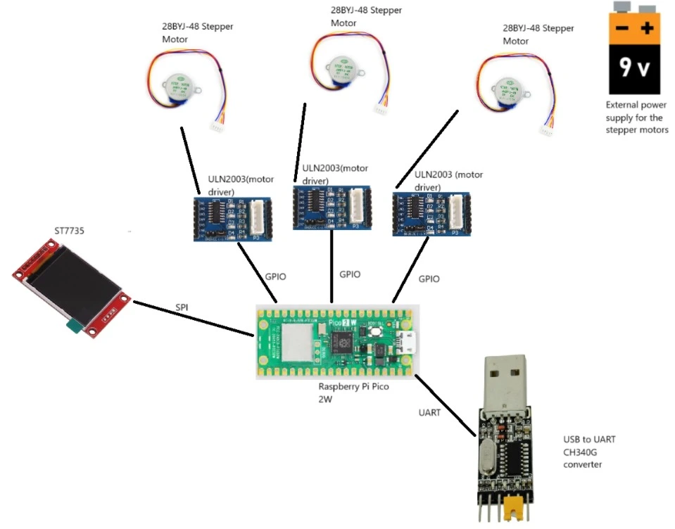
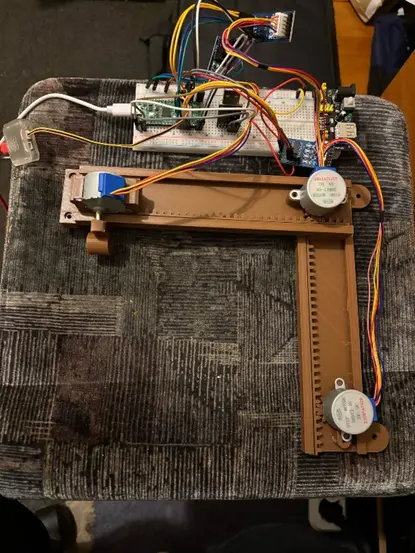
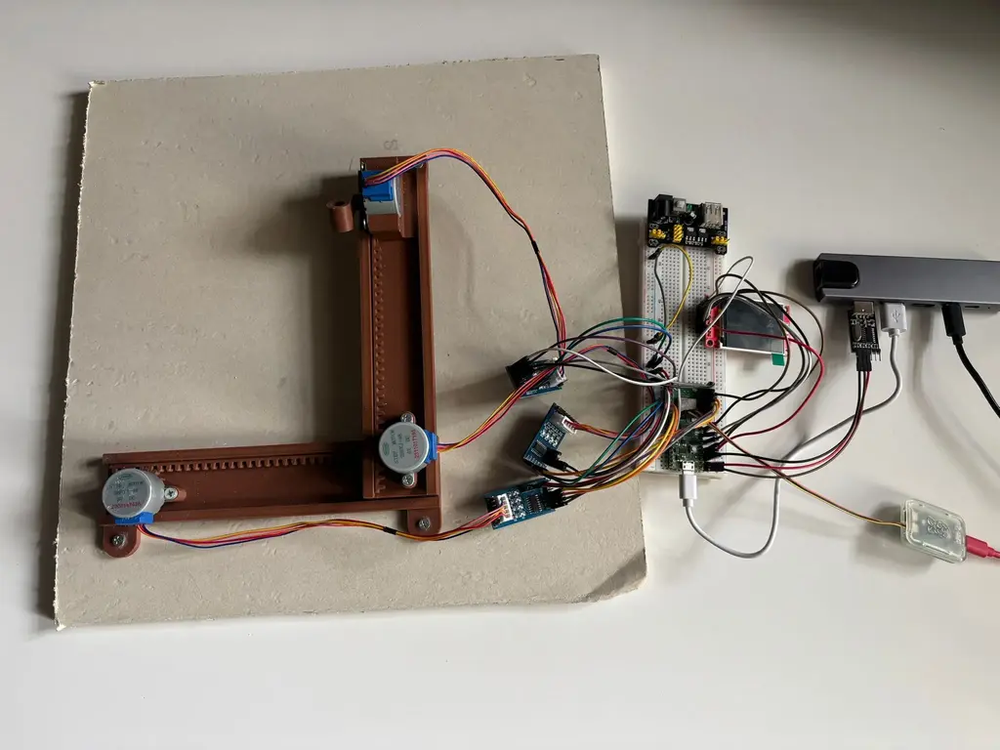
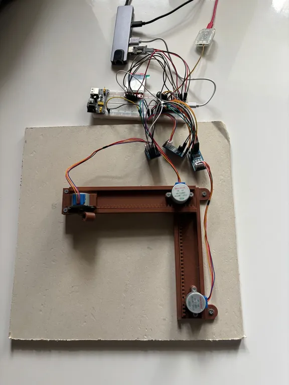
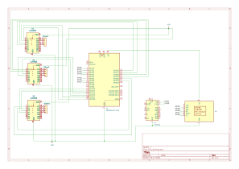

# PicoMatic

A compact CNC plotter controlled by a Raspberry Pi Pico 2W, moving a pencil in 3 axes (X, Y, Z) using stepper motors and drivers.

:::info 

**Author**: Aliwi Walid \
**GitHub Project Link**: https://github.com/UPB-PMRust-Students/project-AliwiWalid

:::


## Description

This project consists of building a CNC plotter machine that uses a pencil as its tool head. It is designed to move across three axes: X, Y, and Z, using stepper motors and motor drivers. The system is controlled by a Raspberry Pi Pico 2W microcontroller, which receives G-code commands via USB serial communication.
The commands are parsed on the Pico and translated into precise movements of the motors, allowing the machine to draw complex shapes automatically on paper. An external power supply is used to power the motors, providing enough current without overloading the Pico.


## Motivation

Initially I wanted to build a 3D printer, but due to the high cost, complexity and potential dangers with heating elements and mechanical failures, I decided to scale down the project to something safer and more achievable in the desired price range. The goal remained to build something which involves motion control and automation, where mechanical movement is precisely driven by software. And that is how I ended up choosing the CNC plotter as my project idea, as it shares a bunch of fundamental principles with a 3D printer, but clearly a lot cheaper and safer to build at home. This will help me continue my journey of learning about embedded programming and real time systems.

## Architecture 

 

## Log 

### Week 5 – 11 May

Since I had a clear idea of my project well before Week 7 and had already received approval, I ordered all the necessary components from AliExpress. This week, I 3D printed the structure of the CNC plotter and assembled the mechanical frame. I also created the initial architecture schematic and began researching which Rust crates I would need for motor control, serial communication, and other core features.
One obstacle I encountered was that the STL file source I used did not specify the required screw sizes, which delayed the mechanical assembly. Here's how the build looked at this stage:



### Week 12 – 18 May

This week, I secured all the components to the CNC structure using the correct screws and mounted everything onto a wooden base to give it a solid foundation. I also decided to add an LCD screen to the project, which will display the current status while the CNC is running, such as when it's starting, drawing, or finished. I updated the system architecture and KiCad schematics to include this new addition.

On the software side, I wrote the initial code to allow the CNC to draw basic shapes like squares. It's a good starting point, but I’ll continue improving it so the machine can handle more complex drawings in the coming updates.



### Week 19 -  25 May 

This week, i completed the code. I wrote the logic for all the GCode commands that i might use for my CNC, tested it on more complex drawings to make sure it can now draw arcs and full circles also using bresenham's algorithm, as suggested by my professor. I also completed the code for the display interface. 
To make it look better, i added a cardboard that will cover the wiring where there will also be a cutout for the display.

## Hardware

3× 28BYJ-48 Stepper Motors
Each stepper motor is used to drive movement along one of the three axes—X, Y, and Z. They are each controlled by a dedicated ULN2003 driver board, with signal lines connected to the Raspberry Pi Pico via GPIO as follows:

Stepper 1: GPIO 15, 14, 16, 17

Stepper 2: GPIO 18, 19, 13, 12

Stepper 3: GPIO 20, 21, 11, 10

1× 1.8 Inch LCD (ST7735, SPI)
Used to display messages like “CNC starting to plot…”, “CNC plotting…”, and “CNC has finished plotting!”. Connected to the Raspberry Pi Pico via SPI0 as follows:

MOSI: GPIO 3

SCK: GPIO 2

DC (A0): GPIO 6

RESET: GPIO 7

CS: GPIO 5

VCC and GND connected to 3.3V and GND respectively.

CH340G USB-to-UART Converter
This module establishes serial communication between the Raspberry Pi Pico and a host computer. It is used to send G-code commands from the host (via a Python script) to the Pico for real-time stepper control. The pin connections are:

CH340G TX → Pico GPIO 1 (UART0 RX)

CH340G RX → Pico GPIO 0 (UART0 TX)

External Power Supply
A separate 5V external power source is used to power the stepper motors through the ULN2003 driver boards. This is necessary to avoid overloading the Raspberry Pi Pico, which cannot provide sufficient current for motor operation. Ground from the external power supply is tied to the system ground to ensure a common reference.

Here is what the hardware is looking like so far:



### Schematics

KiCad Schematic


### Bill of Materials

<!-- Fill out this table with all the hardware components that you might need.

The format is 
```
| [Device](link://to/device) | This is used ... | [price](link://to/store) |

```

-->

| Device | Usage | Price |
|--------|--------|-------|
| [Raspberry Pi Pico 2W](https://www.raspberrypi.com/documentation/microcontrollers/raspberry-pi-pico.html) | The microcontroller | [39.66 RON](https://www.optimusdigital.ro/ro/placi-raspberry-pi/13327-raspberry-pi-pico-2-w.html?gad_source=1&gad_campaignid=19615979487&gbraid=0AAAAADv-p3AcTGZShwGGGHyKb6hmiamUi&gclid=Cj0KCQjwt8zABhDKARIsAHXuD7bAO3PSjO5VUcJr9qHfkmKVAr3Z09B3AA6rQCQr6-H1j137eukwUQIaAuujEALw_wcB) |
| [Debug Probe](https://www.raspberrypi.com/documentation/microcontrollers/debug-probe.html) | The debug probe | [66.17 RON](https://www.optimusdigital.ro/en/accesories/12777-raspberry-pi-debug-probe.html?srsltid=AfmBOoqRLhpWnsl_MLVLOVPS2vac9rBUAcFKuCQe_Yw-99inmJhG7OaJ) |
| [CH340G](https://static.efetividade.net/img/ch340g-datasheet-34852.pdf) | The USB to UART convertor | [2.52 RON](https://www.aliexpress.com/item/32840595066.html?src=google&pdp_npi=4%40dis!RON!2.93!2.57!!!!!%40!65055055161!ppc!!!&src=google&albch=shopping&acnt=298-731-3000&isdl=y&slnk=&plac=&mtctp=&albbt=Google_7_shopping&aff_platform=google&aff_short_key=UneMJZVf&gclsrc=aw.ds&&albagn=888888&&ds_e_adid=&ds_e_matchtype=&ds_e_device=c&ds_e_network=x&ds_e_product_group_id=&ds_e_product_id=en32840595066&ds_e_product_merchant_id=109253881&ds_e_product_country=RO&ds_e_product_language=en&ds_e_product_channel=online&ds_e_product_store_id=&ds_url_v=2&albcp=21564641029&albag=&isSmbAutoCall=false&needSmbHouyi=false&gad_source=1&gad_campaignid=21564641737&gbraid=0AAAAAqc5ie3gN_WTcoMiHw1qqrwXoOgWo&gclid=Cj0KCQjwt8zABhDKARIsAHXuD7YSrv_fn-OEWj1ayM029E8n2xmNgmmWrBtHJStsJMPdBYgHtHkIdGYaAn5VEALw_wcB) | 
| [28BYJ-48 + ULN2003](https://lastminuteengineers.com/28byj48-stepper-motor-arduino-tutorial/) | Stepper motors + drivers | [27.1 RON for a set of 3](https://www.aliexpress.com/item/1005008459804020.html?spm=a2g0o.productlist.main.1.472221F521F5lV&algo_pvid=fa09f8dd-b1aa-4823-864d-1b22b5867b0e&algo_exp_id=fa09f8dd-b1aa-4823-864d-1b22b5867b0e-0&pdp_ext_f=%7B%22order%22%3A%22212%22%2C%22eval%22%3A%221%22%7D&pdp_npi=4%40dis%21RON%2129.35%2127.10%21%21%2147.39%2143.76%21%4021038e1e17461121743717643e31bb%2112000045226842612%21sea%21RO%210%21ABX&curPageLogUid=cUGyI5R7byiR&utparam-url=scene%3Asearch%7Cquery_from%3A) |
| [Male to male/female jumper wires](https://www.cedist.com/sites/default/files/associated_files/s-w604_spec.pdf) | Wires | [0.1 * 23 = 2.3 RON](https://www.aliexpress.com/item/1005008590208433.html?spm=a2g0o.productlist.main.1.7b87ekDlekDlUc&algo_pvid=890a91ee-70aa-41f3-bb0a-5c23ababac74&algo_exp_id=890a91ee-70aa-41f3-bb0a-5c23ababac74-0&pdp_ext_f=%7B%22order%22%3A%22359%22%2C%22eval%22%3A%221%22%7D&pdp_npi=4%40dis%21RON%2116.84%216.00%21%21%2127.20%219.70%21%402103864c17461138312566697e492f%2112000045859835216%21sea%21RO%210%21ABX&curPageLogUid=cknCL6Z9dxQm&utparam-url=scene%3Asearch%7Cquery_from%3A) |
| [Breadboard Power Supply + battery](https://www.handsontec.com/dataspecs/mb102-ps.pdf) | External power for motors | [4.69 RON](https://www.optimusdigital.ro/ro/electronica-de-putere-stabilizatoare-liniare/61-sursa-de-alimentare-pentru-breadboard.html?gad_source=1&gad_campaignid=19615979487&gbraid=0AAAAADv-p3AcTGZShwGGGHyKb6hmiamUi&gclid=Cj0KCQjwt8zABhDKARIsAHXuD7YOxRovs32Q07WVmirNWilixqspoP2c5FE1Ab6qyN14nl4svQBPRkQaAuTXEALw_wcB) |
| [1.8 inch TFT LCD ST7735](https://cdn-learn.adafruit.com/downloads/pdf/1-8-tft-display.pdf) | LCD Display | [4.42 RON](https://www.aliexpress.com/item/1005006690968351.html?srcSns=sns_WhatsApp&spreadType=socialShare&bizType=ProductDetail&social_params=61107930956&aff_fcid=60f6be70f43f47fd97276124a372c9d8-1747465522772-00738-_EyRvIm2&tt=MG&aff_fsk=_EyRvIm2&aff_platform=default&sk=_EyRvIm2&aff_trace_key=60f6be70f43f47fd97276124a372c9d8-1747465522772-00738-_EyRvIm2&shareId=61107930956&businessType=ProductDetail&platform=AE&terminal_id=7b80dd8a4d4f42518da6116a2d93f65f&afSmartRedirect=y#nav-specification) |


## Software

| Library | Description | Usage |
|---------|-------------|-------|
| [embassy-executor](https://crates.io/crates/embassy-executor) | Async/await executor optimized for embedded systems | Runs asynchronous tasks without an OS |
| [embassy-embedded-hal](https://crates.io/crates/embassy-embedded-hal) | Collection of utilities to use `embedded-hal` and `embedded-storage` traits with Embassy | Used for shared SPI communication |
| [embassy-time](https://crates.io/crates/embassy-time) | Timekeeping, delays, and timeouts | Used for non-blocking delays and timeouts |
| [embassy-sync](https://crates.io/crates/embassy-sync) | no-std, no-alloc synchronization primitives with async support. | Used to create a mutex for sharing the SPI bus |
| [embassy-rp](https://crates.io/crates/embassy-rp) | Library for peripheral access | Interfaces with RP2350 peripherals (GPIO, UART, etc.) |
| [defmt](https://crates.io/crates/defmt) | Lightweight and efficient logging framework for embedded systems | Provides low-overhead debug output |
| [defmt-rtt](https://crates.io/crates/defmt-rtt) | RTT backend for defmt logging | Sends logs from device to host over RTT |
| [heapless](https://crates.io/crates/heapless) | `static`-friendly data structures without heap allocation | Used for queues, buffers, and collections without `alloc` |
| [cortex-m-rt](https://crates.io/crates/cortex-m-rt) | Minimal runtime for Cortex-M microcontrollers | Sets up vector table, stack, and entry point |
| [embedded-graphics](https://crates.io/crates/embedded-graphics) | 2D graphics library that is focused on memory constrained embedded devices | Used to display the messages on the LCD |
| [libm](https://crates.io/crates/libm) | A Rust implementations of the C math library | Used to calculate the coordinates of points along the circle's circumference |
| [beresenham](https://crates.io/crates/bresenham) | Iterator-based integer-only implementation of Bresenham's line algorithm | Used to calculate points along arcs and circles |
| [mipidsi](https://crates.io/crates/mipidsi) | MIPI Display Command Set compatible generic driver | Crate used to initalize the ST7735 display |
| [display-interface-spi](https://crates.io/crates/display-interface-spi) | SPI implementation for display interfaces | Used for implementing the interface of the ST7735 |

### Python

| [time](https://docs.python.org/3/library/time.html) | This module provides various functions to manipulate time values. | Used to pause the program for 4 seconds between sending each G-code command.
| [serial](https://pypi.org/project/pyserial/) | Allows communication with devices over a serial port (e.g., USB, UART) | Used to open a connection to the CNC machine via a specified serial port.  

## Links

<!-- Add a few links that inspired you and that you think you will use for your project -->

1. [inspiration](https://www.pcbway.com/project/shareproject/Build_a_simple_3D_Arduino_Mini_CNC_Plotter_e2c3f905.html)

