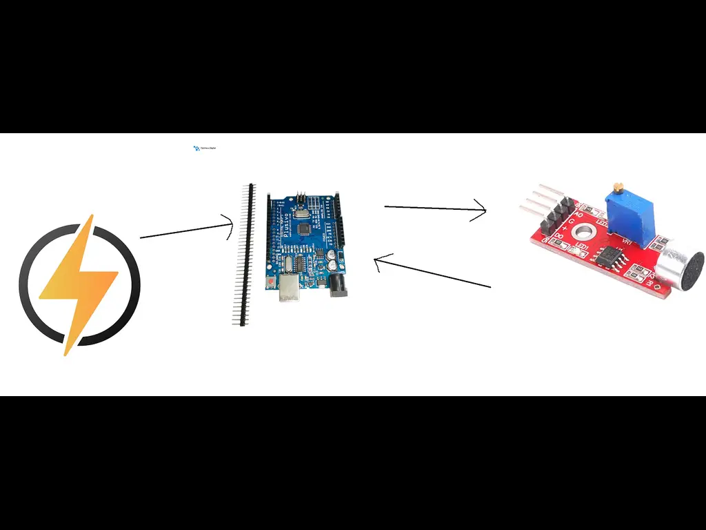
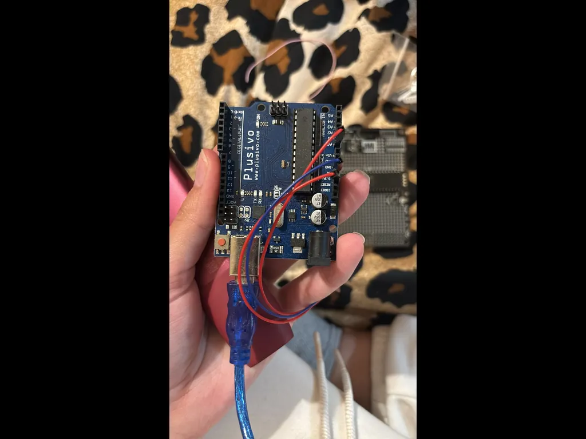
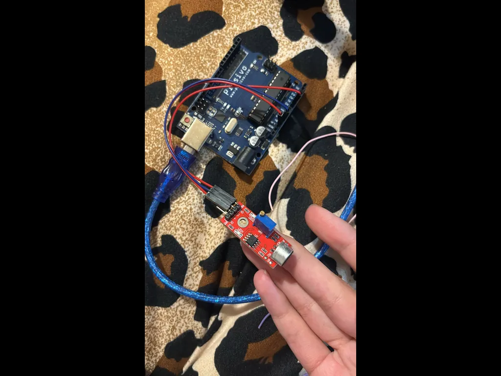

# Temperature Logger

A real-time Temperature sensor that writes to SD card and uses ATmega146A

:::info

**Author**: Yaris Rosioru \
**GitHub Project Link**: [Project Link](https://classroom.github.com/a/eG_xYHDU)

:::

## Description

This project takes the temperature around the room and sends it to an ATmega146A for processing. Then it is uploaded to an SD card.

## Motivation

I have worked with controllers, but never with an sd card so I figured it was a great opportunity

## Architecture

The diagram above shows the overall system architecture of the project.

## Architecture Details

### ATmega146A

**Role**: Processes the data given my the temperature sensor and writes it to the sd card.
**Connections**:

- SS, MOSI, MISO, SCK for SPI interface
- INT0 for interrupts
- GPIO pins for LEDs
- GND and VCC for power

### DHT22 sensor (Analog)

**Interface**: Single-Wire digital protocol
**Role**: Captures the temperature and humidity and sends it.
**Connections**:

- Signal output connected to INT0 pin
- Powered with 3.3V and GND

### MiscorSD Card Adaptor (SPI)

**Interface**: SPI
**Role**: Stores the detected tempereture and humitidy.
**Connections**:

- MOSI, SCK, MISO, SS
- Powered from vcc and GND

### Power Supply

**Interface**: USB or battery + regulator  
**Role**: Provides power to the whole system.  
**Connections**:

- USB via USB

## Log

### Week 5 - 11 May

Week was spent acquisitioning and solding the pieces on the board.

### Week 12 - 18 May

Week was spent developing the code for the project.

### Week 19 - 25 May

## Hardware

The system is built around a Raspberry Pi Pico W. It uses an analog microphone to capture the guitar sound, two push buttons to select the target note, and LEDs to indicate which note is currently selected. A small LCD display shows the detected frequency and tuning status. Initially, I planned to power the circuit using a 9V battery with a voltage regulator, but for now I decided to stick with USB power for simplicity and reliability during testing and development.

_Fig.1 - Board_

_Fig.2 - Board_

### Schematics

### Bill of Materials

| Device                                                                                                                                                                                                                                                                                                                         | Usage                                | Price     |
| ------------------------------------------------------------------------------------------------------------------------------------------------------------------------------------------------------------------------------------------------------------------------------------------------------------------------------ | ------------------------------------ | --------- |
| ATmega146A                                                                                                                                                                                                                                                                                                                     | The microcontroller                  | 35 RON    |
| [Modul senzor de umiditate si temperatura, DHT11 ](https://www.bitmi.ro/modul-senzor-de-umiditate-si-temperatura-dht11-ky-015-10637.html?gad_source=1&gad_campaignid=22005721655&gbraid=0AAAAADLag-nrRgYg4Rt1T2ecmHOAM_J4C&gclid=Cj0KCQjwotDBBhCQARIsAG5pinNzNMGnhpjJlUoXjkZ4TzaNTJ04LkMWAzBZeFRMGQgOKkdlPPTcqHAaAtwlEALw_wcB) | Reads values                         | ~13 RON   |
| [MiscorSD Card Adaptor](https://www.bitmi.ro/modul-citire-card-microsd-compatibil-arduino-10384.html?gad_source=1&gad_campaignid=22005142538&gbraid=0AAAAADLag-m83Lwiu1v5T4sZJbaq-0WjL&gclid=Cj0KCQjwotDBBhCQARIsAG5pinNazHpash8o6TZSiqc1cIQK1hN4zRnmVliNjI1x2qSiyOuL4TmbFcEaAllEEALw_wcB)                                     | Store values                         | ~4.12 RON |
| [LEDs x1](https://www.optimusdigital.ro/en/leds/931-5-mm-green-led-with-clear-lens.html?search_query=green+LED+&results=237)                                                                                                                                                                                                   | Indicate that the process is working | ~3 RON    |
| [Resistors & Board Wires](https://www.optimusdigital.ro/en/wires-with-connectors/12-breadboard-jumper-wire-set.html?search_query=Breadboard+Wires&results=142)                                                                                                                                                                 | For basic circuit setup              | ~15 RON   |

## Software

| Library                                                    | Description                                             | Usage                                           |
| ---------------------------------------------------------- | ------------------------------------------------------- | ----------------------------------------------- |
| [Rust Embedded HAL](https://crates.io/crates/embedded-hal) | A Hardware Abstraction Layer (HAL) for embedded systems | Used for interating with the controller         |
| [embedded-sdmmc](https://crates.io/crates/embedded-sdmmc)  | Interface for sd card                                   | Used to extract save data to sd card            |
| [ruduino](https://crates.io/crates/ruduino)                | Reusable components for AVR microcontrollers            | Used for serial ports, times and core functions |

## Links
