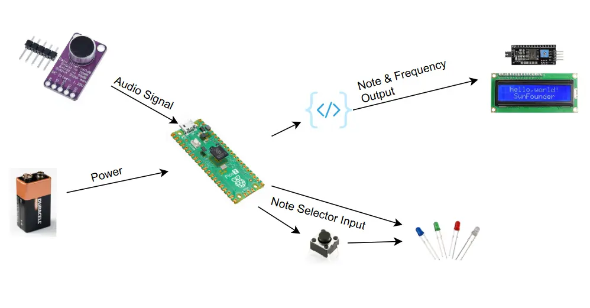
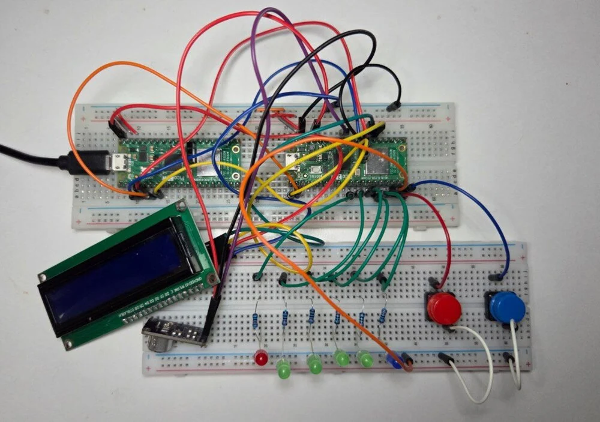
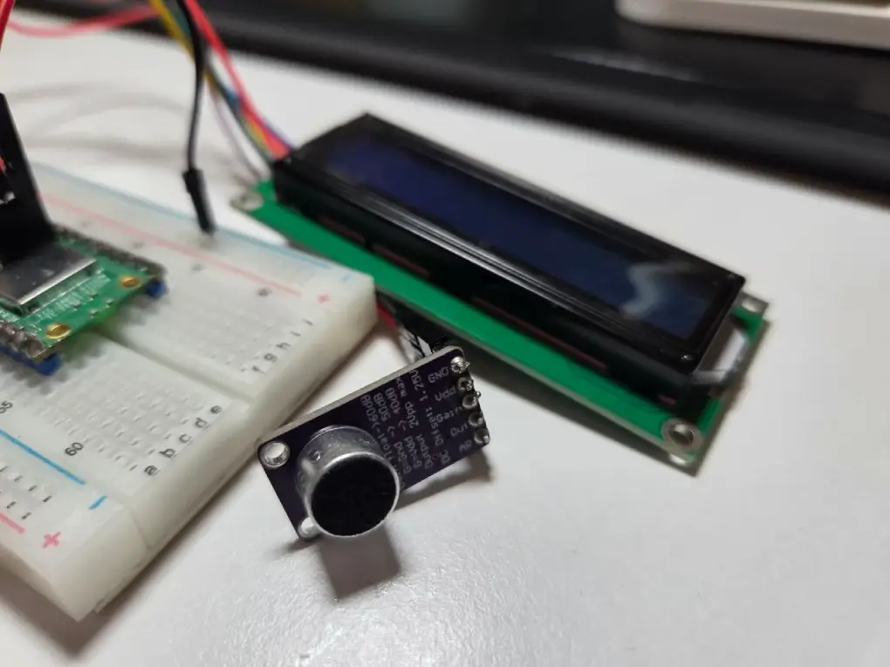
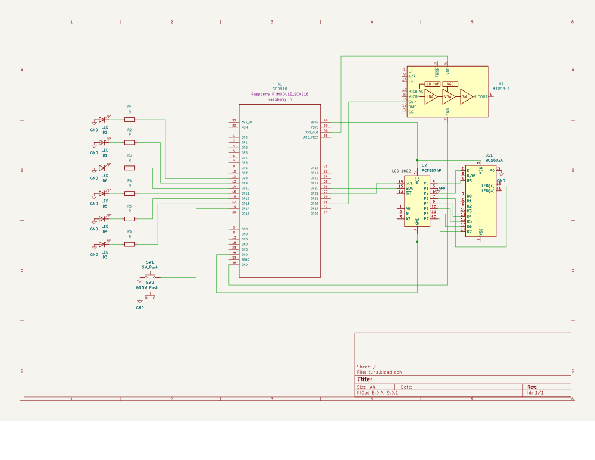

# GuitarE Tuner

A real-time guitar tuner using FFT on the Raspberry Pi Pico W

:::info

**Author**: Yelyzaveta Basiuk\
**GitHub Project Link**: [https://github.com/UPB-PMRust-Students/project-yomotoua](https://github.com/UPB-PMRust-Students/project-yomotoua)

:::

## Description

This project is a digital guitar tuner that captures audio signals through a microphone, processes the signal using Fast Fourier Transform (FFT), and displays the nearest musical note in real time. It runs on a Raspberry Pi Pico W using Rust.

## Motivation

I recently started learning how to play guitar, and I thought it would be fun and useful to build a tuner myself. I'm also just getting into embedded systems and Rust programming, so this project is a way to explore both while building something real. It’s a learning experience where I get to combine simple electronics, sound processing, and coding.

## Architecture

The diagram above shows the overall system architecture of the guitar tuner.

## Architecture Details

### Raspberry Pi Pico W

**Role**: Reads the analog signal from the microphone, processes the signal using FFT to extract the frequency, handles note selection from button input, controls the display, and manages LED output.  
**Connections**:

- ADC pin for microphone input
- GPIO pins for button inputs
- GPIO pins for LEDs
- I2C for the LCD display
- Powered via USB or regulated 5V from a battery

### Microphone Module (Analog)

**Interface**: ADC  
**Role**: Captures the sound produced by the guitar strings and converts it to an analog signal.  
**Connections**:
- Signal output connected to ADC pin
- Powered with 3.3V and GND

### Push Buttons (x2)

**Interface**: GPIO  
**Role**: Used to scroll left/right through available tuning notes (E, A, D, G, B, e).  
**Connections**:
- Each button connected to a GPIO pin
- Configured with pull-up/pull-down resistors and interrupts

### LEDs (x6)

**Interface**: GPIO  
**Role**: Indicates which note is currently selected by lighting up the corresponding LED.  
**Connections**:
- Connected to GPIO pins
- Each with a 220Ω current-limiting resistor

### LCD Display (I2C)

**Interface**: I2C\
**Role**: Displays the detected frequency, and a tuning status indicator (flat / in tune / sharp).  
**Connections**:
- SDA, SCL
- Powered from vbus and GND

### Power Supply

**Interface**: USB or battery + regulator  
**Role**: Provides power to the whole system.  
**Connections**:
- USB via micro-USB (for development)
- Optional 9V battery connected via voltage regulator (outputting 5V)

## Log

### Week 5 - 11 May

This week I finalized the basic design for the project and gathered all the necessary components. I focused on checking that everything works correctly and started outlining the system architecture. I also worked on the initial documentation. I began testing the microphone to see if I can get a stable signal through the ADC. If that works, I’ll move on to the next steps in signal processing and note detection.

### Week 12 – 18 May  
I focused on testing the microphone input and checking if I could get stable frequency detection and feedback on the LCD. I also began setting up the logic for note selection using two buttons and confirmed that the correct LED lights up based on the selected note. As well finished the hardware setup.

### Week 19 - 25 May

## Hardware

The system is built around a Raspberry Pi Pico W. It uses an analog microphone to capture the guitar sound, two push buttons to select the target note, and LEDs to indicate which note is currently selected. A small LCD display shows the detected frequency and tuning status. Initially, I planned to power the circuit using a 9V battery with a voltage regulator, but for now I decided to stick with USB power for simplicity and reliability during testing and development.

_Fig.1 – Setup on breadboard_

_Fig.2 – Display and microphone module_

### Schematics

_Fig.3 – Schematic_

### Bill of Materials

| Device                                                                                                                                                              | Usage                                         | Price                                                                                         |
| ------------------------------------------------------------------------------------------------------------------------------------------------------------------- | --------------------------------------------- | --------------------------------------------------------------------------------------------- |
| [Raspberry Pi Pico W](https://www.raspberrypi.com/documentation/microcontrollers/raspberry-pi-pico.html)                                                            | The microcontroller                           | [35 RON](https://www.optimusdigital.ro/en/raspberry-pi-boards/12394-raspberry-pi-pico-w.html) |
| [Amplificator Microfon MAX9814](https://www.emag.ro/amplificator-microfon-max9814-ai1095/pd/DJGRKFMBM/?ref=history-shopping_421198446_112784_1)                     | Captures guitar sound                         | ~10 RON                                                                                       |
| [I2C LCD Display](https://www.optimusdigital.ro/en/lcds/2894-1602-lcd-with-i2c-interface-and-blue-backlight.html?search_query=I2C+LCD+Display&results=30)           | Displays selected note and detected frequency | ~25 RON                                                                                       |
| [Push Buttons x2](https://www.optimusdigital.ro/en/buttons-and-switches/1119-6x6x6-push-button.html?search_query=Push+Buttons+&results=56)                          | Used to select target note                    | ~0.35 RON                                                                                     |
| [LEDs x6](https://www.optimusdigital.ro/en/leds/931-5-mm-green-led-with-clear-lens.html?search_query=green+LED+&results=237)                                        | Indicate selected note                        | ~3 RON                                                                                        |
| [Resistors & Breadboard Wires](https://www.optimusdigital.ro/en/wires-with-connectors/12-breadboard-jumper-wire-set.html?search_query=Breadboard+Wires&results=142) | For basic circuit setup                       | ~15 RON                                                                                       |
| [9V Battery + Holder](https://www.optimusdigital.ro/en/linear-regulators/61-breadboard-source-power.html?search_query=breadboard+power+supply&results=119)          | Power source                                  | ~8 RON                                                                                        |

## Software

| Library                                                        | Description                               | Usage                                                   |
| -------------------------------------------------------------- | ----------------------------------------- | ------------------------------------------------------- |
| [embassy](https://github.com/embassy-rs/embassy)               | Async embedded framework for Rust         | Used for async task management, timers, and peripherals |
| [microfft](https://github.com/vega002/microfft)                | Lightweight FFT implementation            | Used to extract frequency from microphone input         |
| [hd44780-driver](https://github.com/JohnDoneth/hd44780-driver) | LCD driver for HD44780-compatible screens | Used to display detected frequency and note             |
| [defmt](https://github.com/knurling-rs/defmt)                  | Embedded logging crate                    | Used for debugging and printing ADC/frequency values    |
| [libm](https://github.com/rust-lang/libm)                      | Math library for `no_std` environments    | Used for floating-point math in signal processing       |
| [num-complex](https://github.com/rust-num/num-complex)         | Complex number support                    | Used to work with FFT results from `microfft`           |

## Links

1. [link](https://www.youtube.com/watch?v=dQW4oFJt9c8)
2. [link](https://www.youtube.com/watch?v=koN-70ackHM)
   ...
