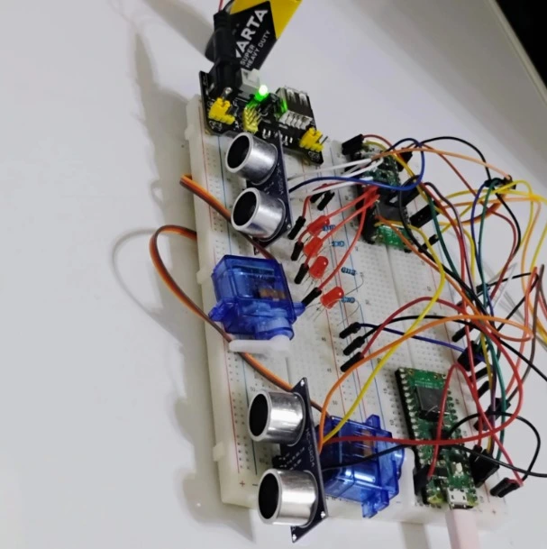

# Smart Parking Lot

 A smart system to monitor parking spaces and manage parking time for billing purposes.

:::info

**Author**: Zeinalabdin ISSA \
**GitHub Project Link**: https://github.com/UPB-PMRust-Students/project-zein409

:::
## Description

The Smart Parking Lot project automates parking spot allocation using sensors and tracks the time a car is parked for billing. The system provides real-time parking availability and uses a web interface for monitoring.

## Motivation

I chose this project to address the need for efficient parking management in crowded urban environments. The goal is to optimize parking space usage and provide real-time data to drivers.

## Architecture

# Schematic Diagram

The architecture of the Smart Parking Lot system includes the following main components:
- **Parking Sensors**: Detect free parking spaces.
- **Microcontroller (Raspberry Pi Pico W)**: Collects data from sensors and processes the information.
- **Web Interface**: Displays real-time parking availability and billing info.
- **Database**: Stores parking data such as time parked and billing information.

### How they connect:
- The Raspberry Pi Pico W communicates with the parking sensors to detect free or occupied spots.
- The microcontroller sends the data to the web interface, allowing users to view available spots.
- The system tracks parking time and calculates the bill based on the time spent.

## Log

### Week 5 - 11 May
- Started the project and gathered the necessary components.

### Week 12 - 18 May
- I started making the hardware work and figuring out how to put all parts together to make them work perfectly with each other. and made the Kicad schematics for the project.
### Week 19 - 25 May

## Hardware
The Raspberry Pi Pico controls the smart parking lot system using Ultrasonic sensors to detect cars, two servo motors to open and close the gates, and LEDs to indicate slot status. An I2C 1602 LCD displays messages such as time and availability. All components communicate through GPIO pins, with shared power and ground connections.

Here is the actual setup:

## Schematics

 

## Bill of Materials

| Device                | Usage                        |     Price     |
|-----------------------|------------------------------|---------------|
| Raspberry Pi Pico 2W  | The microcontroller          | 2 x 39    RON |
| Ultrasonic Sensors    | Used for cars detection      | 2 x 6.45  RON |
| ServoMotor            | Opens the gate for the cars  | 2 x 11.99 RON |
| LEDs                  | Lights up on detection       | 4 x 0.39  RON |
| LCD 1602              | Shows results on screen      | 16.34     RON |
| Wires                 | connections                  | 2 x 7.99  RON |
| Resistors 330ohm      | Used to limit the current    | 4 x 0.10  RON |

## Software

### Libraries

| Library              | Description                   | Usage                                |
|----------------------|-------------------------------|--------------------------------------|
| st7789               | Display driver for ST7789     | Used for the display for the Pico Explorer Base |
| embedded-graphics    | 2D graphics library           | Used for drawing to the display     |

## Links
