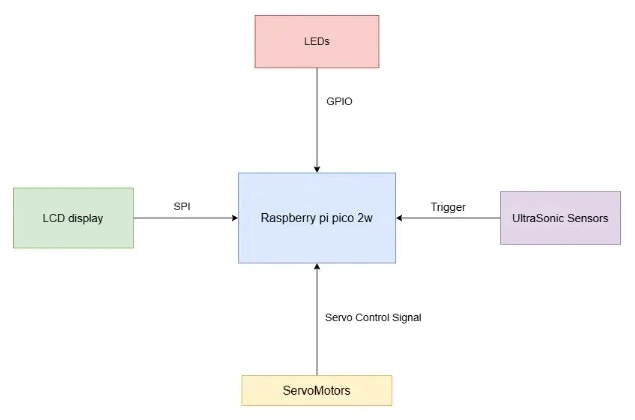
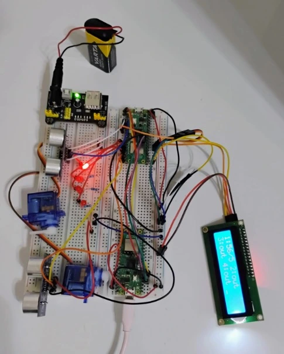
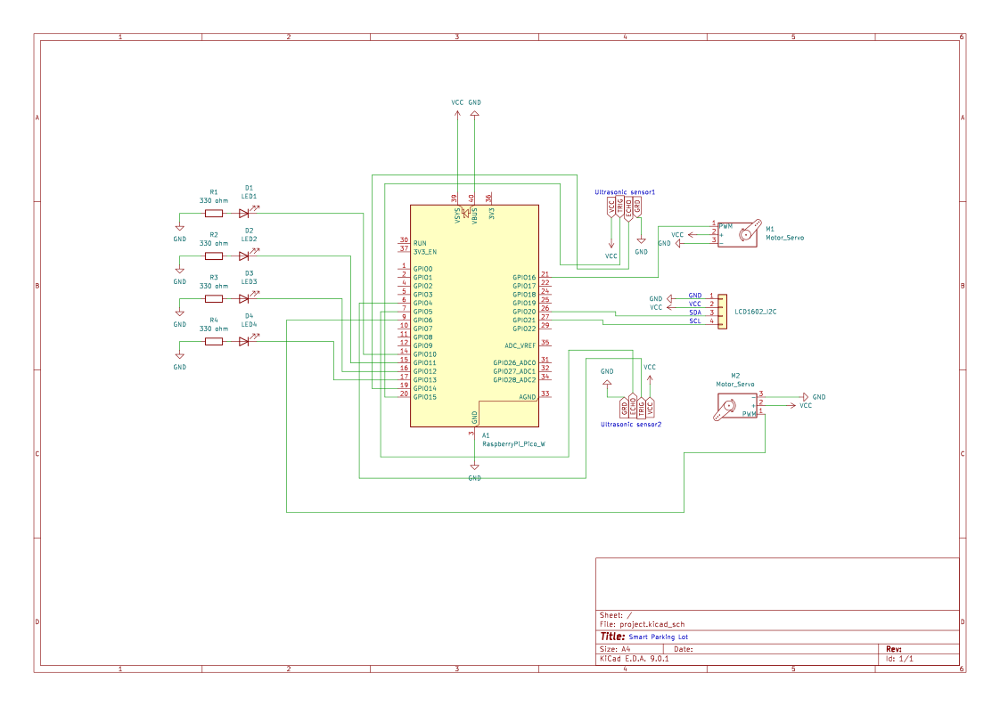

# Smart Parking Lot

 A smart system to monitor parking spaces and manage parking time for billing purposes.

:::info

**Author**: Zeinalabdin ISSA \
**GitHub Project Link**: https://github.com/UPB-PMRust-Students/project-zein409

:::
## Description

The Smart Parking Lot project automates parking spot allocation using sensors and tracks the time a car is parked for billing. The system provides real-time parking availability and uses a web interface for monitoring.

## Motivation

I chose this project to address the need for efficient parking management in crowded urban environments. The goal is to optimize parking space usage and provide real-time data to drivers.

## Architecture

# Schematic Diagram

The architecture of the Smart Parking Lot system includes the following main components:
- **Parking Sensors**: Detect free parking spaces.
- **Microcontroller (Raspberry Pi Pico W)**: Collects data from sensors and processes the information.
- **Web Interface**: Displays real-time parking availability and billing info.
- **Database**: Stores parking data such as time parked and billing information.

### How they connect:
- The Raspberry Pi Pico W communicates with the parking sensors to detect free or occupied spots.
- The microcontroller sends the data to the web interface, allowing users to view available spots.
- The system tracks parking time and calculates the bill based on the time spent.

## Log

### Week 5 - 11 May
- Started the project and gathered the necessary components.

### Week 12 - 18 May
- I started making the hardware work and figuring out how to put all parts together to make them work perfectly with each other. and made the Kicad schematics for the project.
### Week 19 - 25 May
- Initialized the software repository and structured the codebase.
- Implemented asynchronous tasks using Embassy for sensor and servo control.
- Integrated LCD display using the `hd44780-driver` over I2C.
- Added logic for tracking parking duration and calculating billing.
- Tested individual components: ultrasonic sensors, servos, LEDs, and LCD.
- I started working on the software part of the project on VScode. and when i was done with it, i started working on the project appearance.
## Hardware
The Raspberry Pi Pico controls the smart parking lot system using Ultrasonic sensors to detect cars, two servo motors to open and close the gates, and LEDs to indicate slot status. An I2C 1602 LCD displays messages such as time and availability. All components communicate through GPIO pins, with shared power and ground connections.

Here is the actual setup:

## Schematics

 

## Bill of Materials

| Device                | Usage                        |     Price     |
|-----------------------|------------------------------|---------------|
| Raspberry Pi Pico 2W  | The microcontroller          | 2 x 39    RON |
| Ultrasonic Sensors    | Used for cars detection      | 2 x 6.45  RON |
| ServoMotor            | Opens the gate for the cars  | 2 x 11.99 RON |
| LEDs                  | Lights up on detection       | 4 x 0.39  RON |
| LCD 1602              | Shows results on screen      | 1 x 16.34 RON |
| Wires                 | connections                  | 2 x 7.99  RON |
| Resistors 330ohm      | Used to limit the current    | 4 x 0.10  RON |
| Bread Board           | Used to connect part together| 2 x 8.99  RON |

## Software

### Libraries

| Library              | Description                                     | Usage                                                              |
|----------------------|-------------------------------------------------|--------------------------------------------------------------------|
| [embassy](https://embassy.dev/)              | Async embedded framework for Rust               | Core async runtime for the project                                 |
| [embassy-rp](https://github.com/embassy-rs/embassy/tree/main/embassy-rp)           | RP2040 support crate in Embassy                 | Access to GPIO, PWM, I2C, etc. on Raspberry Pi Pico                |
| [embassy-time](https://github.com/embassy-rs/embassy/tree/main/embassy-time)         | Timer and delay utilities for Embassy           | Used for non-blocking delays and time tracking                     |
| [embassy-executor](https://github.com/embassy-rs/embassy/tree/main/embassy-executor)     | Async task executor for Embassy                 | Manages async tasks and scheduling                                 |
| [embassy-rp-pwm](https://github.com/embassy-rs/embassy/blob/main/embassy-rp/src/pwm.rs)       | PWM peripheral driver for RP2040                | Controls servo motors for entry/exit gates                         |
| [embassy-rp-gpio](https://github.com/embassy-rs/embassy/blob/main/embassy-rp/src/gpio.rs)      | GPIO peripheral driver for RP2040               | Reads ultrasonic sensors and controls LEDs                         |
| [embassy-rp-i2c](https://github.com/embassy-rs/embassy/blob/main/embassy-rp/src/i2c.rs)       | I2C peripheral driver for RP2040                | Communicates with the 1602 LCD display                             |
| [hd44780-driver](https://crates.io/crates/hd44780-driver)       | Driver for HD44780 LCDs (I2C support)           | Displays parking information on the 1602 LCD                       |
| [heapless](https://crates.io/crates/heapless)             | Fixed-size, no_std data structures              | Used for `String` formatting on the LCD                            |
| [defmt](https://github.com/knurling-rs/defmt)                | Logging framework for embedded Rust             | Debugging and logging system events                                |
| [panic-probe](https://crates.io/crates/panic-probe)          | Minimal panic handler for embedded Rust         | Handles panics and outputs debug info                              |
| [fixed](https://crates.io/crates/fixed)                | Fixed-point arithmetic library                  | Used for accurate PWM timing and calculations                      |
| [core](https://doc.rust-lang.org/core/)                 | Rust core library for no_std environments       | Provides essential types and traits                                |

## Links
