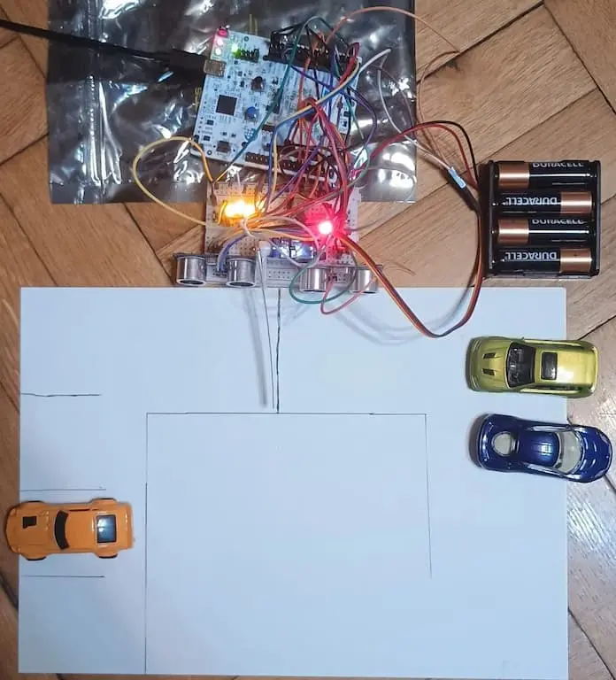
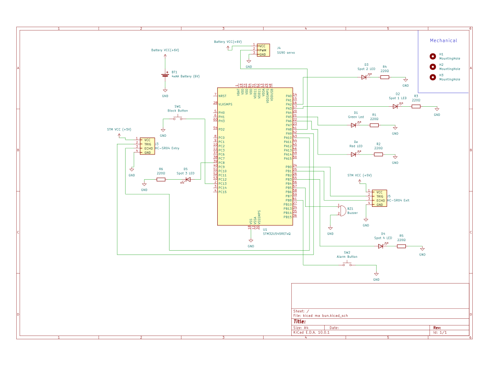

# RustParking

An embedded project that simulates a real-life parking, using a barrier to allow cars to enter and exit a parking lot

:::info

*Author:* Tzikas Alexandros \

*GitHub Project Link:* https://github.com/UPB-PMRust-Students/fils-project-2026-AlexTzikas

:::

## Description
This project is designed to be a model of a real-life parking; it uses two ultrasonic sensor to detect cars approaching a barrier (operated by a SG90 servomotor), both entering and exiting the parking, opening the barrier for exiting cars and opening the barrier for entering cars. If the parking is full or blocked (entry can be temporarly blocked via a button), the barrier will not open for any cars attempting to enter. A buzzer will play a sound effect when a car tries to enter/exit. The number of available parking slots is shown by 4 LEDs that will be lit for free spaces and unlit for occupied spaces. An alarm button can be pressed to block the barrier, make an alarm sound and make a red led blink. The computations and processing are all done by the microcontroller (STM32-NUCLEO-U545RE-Q).

## Motivation
I chose this project because it is a real-life application witch can help me learn rust better, as it help me understand subjects such as real-time sensor integration; it was also suggested to me by a coleague as beeing a reliable project idea.

## Architecture

Input: 

*HC-SRO4* ultrasonic sensor will receive signals to see the ditance of a car from the sensor and will send the signals through a GPIO pin

*Block Button* will be high/low depending on whether it is pushed or not, used for temporarly blocking the barrier.

*Alarm Button* will be high/low depending on whether its pushed or not, used to make the parking enter an aalarm state

Processing:

*STM32-NUCLEO-U545RE-Q* will do computations and signal processing and send data to the laptop via USB.

Output:

*SG90 servomotor* will receive signals to open/close a barrier when a car enters/exits

*status LEDs* a green and a red led will be set high/low depending on whether the barrier is open or closed

*parking space LEDs* 4 yellow LEDs will be set high/low depending on the number of available parking spots.

*Buzzer* will go high/low at frequencies specified by the code to produce different sounds

## Log

### Week 13 April - 19 April

I got the components (except the ESP32-CAM) and set up the start of my project (memory.x,cargo.toml,Config.toml,build.rs) and also created the GitHub page for the project

### Week 20 April - 26 April

I got the rest of the components (the ESP32-CAM, some wires and a battery holder) and started assembling the project, starting with the servomotor; I wired the servomotor and wrote some code to test it, worked mostly fine, but each time would stop working after a while; suspected it was because of insuficient power so I decided to get some batteries for power. Afterwards wired the first sensor and started testing; had errors, as sensor would not correctly detect distance - did a lot of debugging to narrow down the problem. 

### Week 27 April - 3 May

The problem with the servomotor got fixed after I got some batteries to power it with. I wasted a lot of time on the sensor problem and failed fixing it even after several attemps, because I had incorrectly identified the problem's source as beeing a faulty connection; in the meantime, I added a green and a red led, with the green led lighting up when the barrier was supposed to open and the red led beeing lit for the rest of the time (will probably change in future); also worked on writing code for more tests with the sensor and did more research on how it worked; work stalled for a few days as I was trying to figure out the actual problem with the sensor;

### Week 4 May - 10 May

After more debugging I finally found the problem with the sensor and fixed it; I added the second sensor and transitioned from the testing code to the code for the final parking system - spent some time doing research on how to write the code, and more time debugging/fixing errors and unexpected problems

### Week 11 May - 17 May
More software - base form of the project was completed; also rearanged things on the breadboard, as it was a bit messy. Towards the week's end, I started looking into implementing authorization via an ESP-CAM. After some hours, it became clear that I would not be able to finish such a feature in time, due to forgetting an important hardware component neccesary for the implementation, but mostly due to a lack of time as next week I had to focus on other projects/examinations.

### Week 18 May - 24 May
Not much done during the week due to a lack of time because of other projects/examinations; I got some cardboard for the actual parking lot and started adding some extra things - a buzzer that would play tunes for succesful entry/exit, 4 LED's to show parking availability and a button to block the barrier from opening. Rearranged stuff again due to lack of space on the breadboard, also attached servo to make the barrier stationary.

### Week 25 May - Pm fair
Started week by revising code. Added an alarm button that makes a red led light on and off and makes the buzzer play an alarm like sound while blocking the barrier both for entry and exit.

## Hardware

*STM32-NUCLEO-U545RE-Q* will do computatiosn, signals processing and transmit data to the laptop

*HC-SRO4 ultrasonic sensor* – a sensor witch receives and transmis signals to measure distance

*SG90 servo motor* will open/close the barrier

*LED* will provide visual feedback during testing

*Buzzer* will play different chimes for succesful entry/exit and for failed entry

*Buttons* one will temporarly block the barrier from beeing opened, one will make the parking enter an alarm state

## Schematics

## Bill of Materials

| Device                                                                                                           | Usage                                     | Price                     
| --------------------------------------------------------------------------------------------------------------------------------------------------------------------------------------------------------------------------------------------- | ------------------------- | ------------------------------------
| STM32-NUCLEO-U545RE-Q | microcontroller | borrowed from politehnica
| [HC-SRO4 ultrasonic sensor x 2](https://www.emag.ro/set-2-senzori-distanta-ultrasonic-digital-3-3-5v-45x20x15mm-multicolor-9344435370736/pd/DCPK2H3BM/?ref=history-shopping_484549223_232871_1)          | measuring distance from barrier  | 36 Lei
| [SG90 servo motor x 4](https://www.emag.ro/set-servomotor-sg90-unghi-de-lucru-180-grade-4-bucati-3874783591898/pd/DLHDYTYBM/?ref=history-shopping_484549223_157633_1)   | moving the barrier       | 48 Lei
| [Breadboard kit](https://www.emag.ro/kit-electronica-pentru-incepatori-cu-modul-esp8266-si-placa-d1-compatibil-cu-arduino-ideal-pentru-proiecte-diy-be000116/pd/D15YQF3BM/?ref=history-shopping_484549223_206277_1)         | Connecting components   | 124 Lei
| [female-male wires](https://www.emag.ro/10-x-fire-dupont-mama-tata-20cm-ai306-s459/pd/DZJ66JBBM/?ref=history-shopping_485848746_38837_2)   | connecting components   | 1 Leu
| [female-female wires](https://www.emag.ro/10-x-fire-dupont-mama-mama-10cm-ai310-s450/pd/DWF66JBBM/?ref=history-shopping_485848746_38837_3)   | connectign components   | 2 Lei
| [4xAA battery holder](https://www.emag.ro/suport-pentru-baterii-4xaa-r6-tensiune-6v-din-plastic-abs-fire-conexiune-10cm-32011303/pd/DMHWLB2BM/?ref=history-shopping_485848746_7099_1)   |  holding batteries for power  | 8 lei

## Software

| Library  | Description  | Usage   |
| ------------------------------------------------------|--------|---------|
| [embassy-stm32](https://github.com/embassy-rs/embassy) | async HAL for STM32 microcontrollers  | controls PWM(servo, sensor), UART (ESP32), GPIO  |
| [embassy-time](https://github.com/embassy-rs/embassy) |  timing and delay for embassy projects | used for delays, timing measurements, ultrasonic echo timing and servo contorl intervals |
| [embassy-executor](https://github.com/embassy-rs/embassy) | async task executor  | runs synchronous tasks, currently servomotor control and readinf of ultrasonic sensor  |
| [embedded-hal](https://github.com/rust-embedded/embedded-hal) | hardware abstraction for embedded rust | PWM traits like enablind PWM and setting duty cycle |
| [defmt](https://github.com/knurling-rs/defmt) | logging for embedded rust | print debugging information like sensor state, distances from sensor, system status |
| [defmt-rrt](https://github.com/knurling-rs/defmt) | rrt backend for defmt | send debug logs from STM to laptop |
| [panic-probe](https://github.com/knurlings-rs/probe-run) | panic handler | used to report problems during debuggging

## Links

| [Sensor documentation](https://web.eece.maine.edu/~zhu/book/lab/HC-SR04%20User%20Manual.pdf) |
| [Sensor tutorial](https://projecthub.arduino.cc/Isaac100/getting-started-with-the-hc-sr04-ultrasonic-sensor-7cabe1) |
| [Sensor tutorial](https://controllerstech.com/hcsr04-ultrasonic-sensor-and-stm32/) |
| [Servomotor documentation](http://www.ee.ic.ac.uk/pcheung/teaching/DE1_EE/stores/sg90_datasheet.pdf) |
| [STM documentation](https://www.st.com/en/evaluation-tools/stm32-nucleo-boards/documentation.html) |
| [Servomotor tutorial](https://www.electronics-lab.com/project/using-sg90-servo-motor-arduino/) |
| [Buzzer tutorial](https://controllerstech.com/interface-passive-buzzer-with-stm32/) |
| [Buzzer help](https://www.omnicalculator.com/other/note-frequency) |
| [Rust Book](https://docs.rust-embedded.org/book/) |
| [Embassy Intro](https://embassy.dev/) |
| [PullUp resistors](https://learn.sparkfun.com/tutorials/pull-up-resistors) |
| [Pin Map](https://embedded-rust-101.wyliodrin.com/docs/fils_en/lab/02) |
| [Other](https://embedded-rust-101.wyliodrin.com/docs/fils_en/category/lab) |

