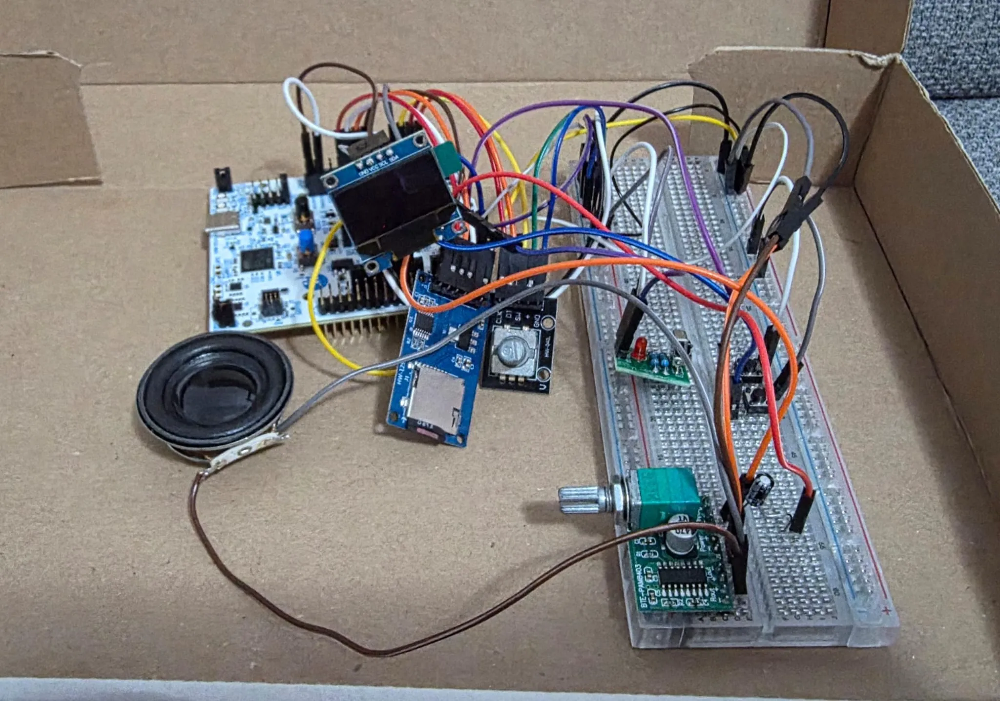
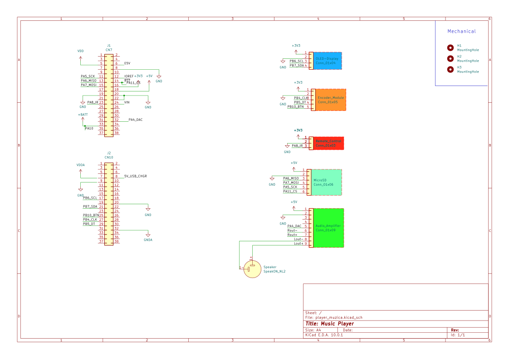

# DIY Embedded Music Player

A hardware digital audio player built on STM32 using Rust and internal DAC audio processing.

:::info
**Author:** Marioara Alexandru \
**GitHub Project Link:** https://github.com/UPB-PMRust-Students/fils-project-2026-StrumfoAlex
:::

## Description
This project implements a standalone, fully functional digital music player. It reads audio files from a MicroSD card and outputs sound using the microcontroller's internal DAC (Digital-to-Analog Converter) combined with an external PAM8403 analog amplifier. The system features a graphical interface on an OLED display and allows hardware control via a rotary encoder, IR remote, and tactile buttons.

## Motivation
Music is an essential part of my daily life, and listening to it is a habit I enjoy every single day. This inspired me to build a digital music player from scratch, turning an everyday activity into a complex engineering challenge. From a technical standpoint, this project allows me to combine multiple communication protocols (SPI, I2C) and core microcontroller peripherals (Timers, DMA, DAC) into a single, cohesive product. Instead of using off-the-shelf "smart" modules that do the decoding automatically, I want the STM32 to handle the raw data stream and precisely output it through the internal DAC. This forces me to step out of my comfort zone and tackle real-time asynchronous data streaming using Rust's `embassy` framework.

## Architecture

The system architecture is centralized around the STM32 microcontroller which handles data fetching, UI updates, and audio signal generation.

```text
                    [POWER & DEBUGGING SECTION]

+-----------------------+             +--------------------------+
|       Host PC         |             |       Host PC            |
|    (USB Power 5V)     |             |    (Serial Debugging)    |
+-----------+-----------+             +------------+-------------+
            |                                      ^
            | (5V & 3.3V)                          | [UART / USB]
            v                                      v
+----------------------------------------------------------------+
|                                                                |
|                     NUCLEO STM32U545RE-Q                       |
|                   (Main Microcontroller)                       |
|                                                                |
+-------+---------------+---------------+---------------+--------+
        |               |               |               |
      [SPI]           [I2C]       [GPIO / EXTI]       [DAC]
        |               |               |               |
        v               v               v               v
+---------------+ +-------------+ +-------------+ +--------------+
|               | |             | |             | |              |
| MicroSD Card  | | 0.96" OLED  | | Buttons &   | |   PAM8403    |
| Module        | | Display     | | Rotary Enc. | |  Amplifier   |
|               | |             | |             | |              |
+---------------+ +-------------+ +-------------+ +-------+------+
 (Stores Audio)     (UI/Visuals)  (User Controls)         |
                                                          | [Analog]
                                                          v
                                                  +--------------+
                                                  |              |
                                                  | 52mm 4 Ohm   |
                                                  | 5W Speaker   |
                                                  +--------------+

```

The system architecture revolves around the STM32U545RE microcontroller:
1. **Input:** Data is read asynchronously from the MicroSD card via SPI. User input is captured via a Rotary Encoder, an IR sensor (for remote control), and tactile buttons.
2. **Processing:** The STM32 parses the WAV file format and feeds the raw PCM audio data into memory buffers.
3. **Output:** The data is pushed via DMA to the internal DAC to generate an analog audio signal. This signal is then boosted by a PAM8403 amplifier to drive the speaker. The UI state (current song, volume) is updated on the I2C OLED display.

## Log
* **Week 1 - 9:** Finalized component list, established architecture using the internal DAC to avoid I2S complexity, and set up the documentation website.
* **Week 9 - 11:** Assembling the hardware circuit. Initializing the code on the board and verifying the components. Making the KiCad schematics.
* **Week 11 - 14:** Finishing the code and testing each function of the project. Making short ajustment in the hardware for a better performing. Finishing the documentation website.

## Hardware
The core of the digital audio player is the STM32U545RE microcontroller, which handles file reading, user interface, and audio signal generation. Storage is managed via a MicroSD card module communicating over the SPI protocol, while visual feedback is provided by an SSD1306 OLED display connected via I2C. User input for navigating the playlist and controlling playback is handled through a rotary encoder.

For the audio output, the internal DAC of the STM32 generates an 8-bit PCM raw signal. Because this signal includes a DC offset of approximately 1.6V, a 10µF electrolytic capacitor is placed in series to act as an AC coupling filter, blocking the direct current and allowing only the audio waveform to pass. The filtered, AC-coupled signal is then routed directly into the PAM8403 Class-D audio amplifier for playback.

For the audio output, the internal DAC of the STM32 generates an 8-bit PCM raw signal. Because this signal includes a DC offset of approximately 1.6V, a 10µF electrolytic capacitor is placed in series to act as an AC coupling filter, blocking the direct current and allowing only the audio waveform to pass.


### Schematics


### Bill of Materials
| Device | Usage | Price |
| ----------- | ----------- | ----------- |
| STM32 Nucleo-U545RE | Main microcontroller (Brain) | 126 RON |
| PAM8403 Amplifier | Amplifies the analog signal from the STM32 DAC | ~6 RON |
| 4 Ohm Speaker | Audio output | ~8 RON |
| MicroSD Card Module | SPI storage for music files | ~5 RON |
| 0.96" OLED Display | I2C UI Display | ~17 RON |
| IR Receiver & Remote | Wireless user interface control | ~7 RON |
| Rotary Encoder & Buttons| Physical user interface controls | ~15 RON |

## Software
The project is built entirely in Rust (no_std) utilizing the asynchronous Embassy framework.

| Library | Description | Usage |
| ----------- | ----------- | ----------- |
| [`embassy-stm32`](https://docs.embassy.dev/embassy-stm32/0.6.0/stm32c011d6/index.html) | Hardware Abstraction Layer | Controls peripherals (SPI, I2C, DAC, DMA, Timers, GPIO) |
| [`embassy-executor`](https://crates.io/crates/embassy-executor) | Async Execution Environment | Manages asynchronous tasks and threads |
| [`embassy-time`](https://crates.io/crates/embassy-time) | Time Management | Handles delays and timing (e.g., `Timer::after_millis`) |
| [`embedded-sdmmc`](https://docs.rs/embedded-sdmmc/latest/embedded_sdmmc/) | FAT32 File System | Reading WAV files from the SD Card |
| [`ssd1306`](https://cdn-shop.adafruit.com/datasheets/SSD1306.pdf) | Display Driver | Controlling the OLED screen |
| [`embedded-graphics`](https://crates.io/crates/embedded-graphics) | Graphics Library | Renders text and UI elements on the display |
| [`defmt`](https://crates.io/crates/defmt) | Logging Framework | Sends fast, low-overhead debug messages via USB |
| [`panic-probe`](https://crates.io/crates/panic-probe) | Debugging Utility | Captures and reports critical errors (panics) |
| [`infrared`](https://crates.io/crates/infrared) | IR Decoding | Decodes NEC protocol pulses from the remote control |


## Links
1. [Rust Embassy Documentation](https://embassy.dev/)
2. [Embedded Graphics](docs.rs/embedded-graphics/latest/embedded_graphics/)
3. [Crates.io - Storage](crates.io/crates/embedded-sdmmc)
4. [Reading .WAV files](https://www.youtube.com/watch?v=5F6Y1Ttpg-A)
