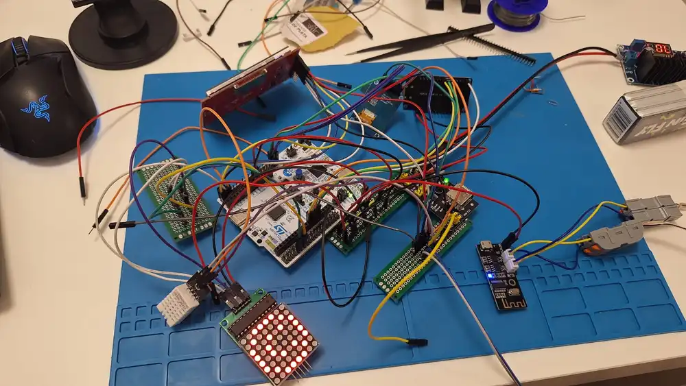
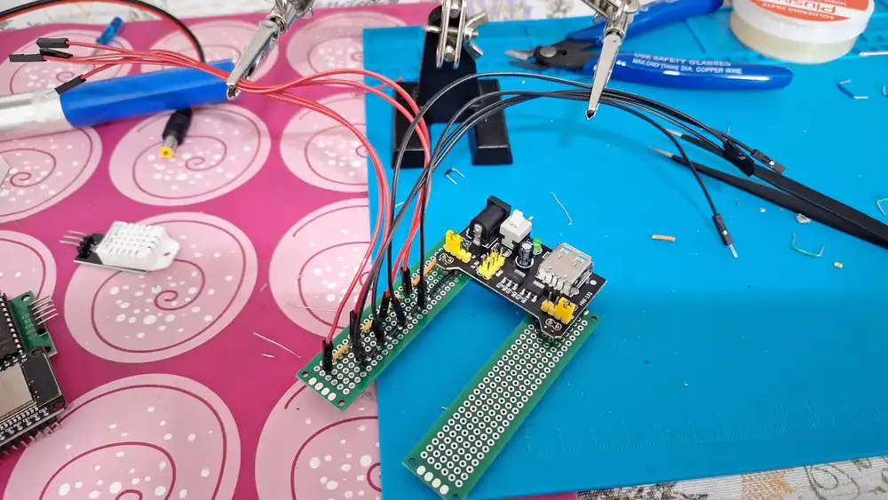
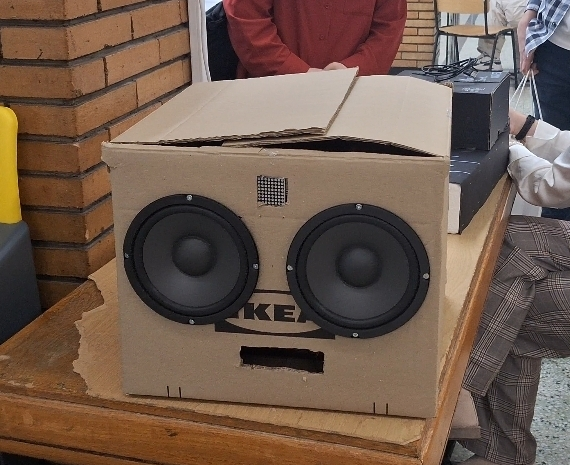
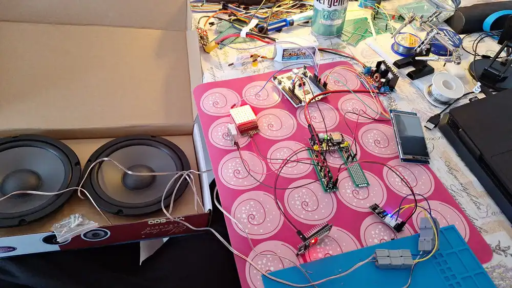
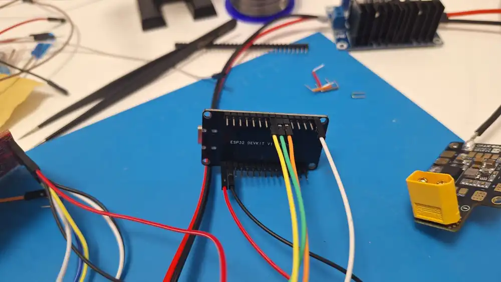
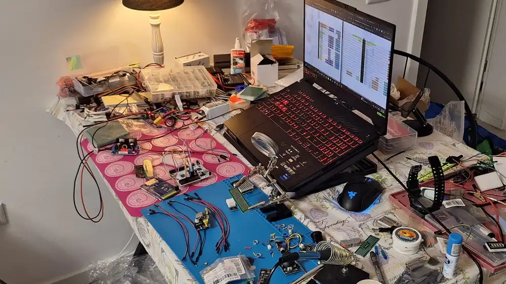
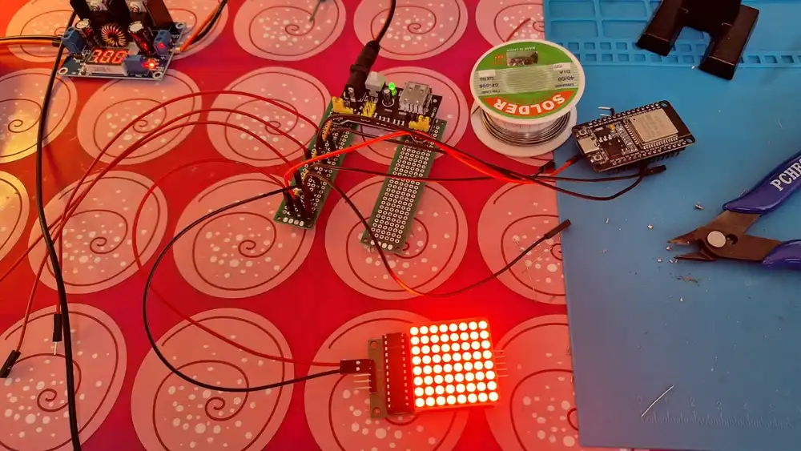

# KaraBox
A Bluetooth-enabled karaoke device built around an STM32 brain board and an ESP32 wireless bridge, programmed primarily in Rust.

:::info

**Author**: Neagu Alexandru-Florin \
**Group**: 1222EEB \
**GitHub Project Link**: https://github.com/UPB-PMRust-Students/fils-project-2026-ithinktoomuch05

:::

<!-- do not delete the \ after your name -->

## Description

This project represents a **karaoke device** that lets a user pick a song from their phone, stream it via bluetooth to a small dedicated speaker system, and see synchronized lyrics scroll on both their phone and a tiny on-device display - all while a separate display shows the temperature and a small fun LED matrix goes through different colours.

The system is split into **two physical boards** that cooperate over Bluetooth and SPI:

- The **audio path** is a hardware-only board built around an MH-M38 Bluetooth audio receiver that drives a small amplifier and the speakers. The phone pairs to it directly.
- The **brain board** runs a Rust firmware on an **STM32U545RE-Q**, drives a small **ST7789V TFT display**, a **MAX7219 8x8 LED matrix** and a **DHT22 temperature/humidity sensor**, and talks to an **ESP32-WROOM-32** over SPI. The ESP32 acts as the Bluetooth Classic bridge that hands lyrics and control commands from the phone to the STM32.

## Motivation

I chose this project because karaoke is fun and my last project idea sadly died after my motor microcontrollers decided to not work and 2 of them were fried. Fortunately karaoke is even more fun!

## Architecture

This is the diagram regarding how the project is organized:


These are the current KiCAD diagrams for the project depicting the power distribution and the communication protocols between the STM32 brain board and its peripherals (the ST7789V display over SPI1, the MAX7219 matrix over SPI2, the ESP32 link over SPI3, and the DHT22 sensor on a single GPIO line with an external pull-up).w


## Main components:

## Log

<!-- write your progress here every week -->
### Week 6: 30 March - 6 April

Coming up with possible project ideas.

### Week 7: 6 - 12 April

Conceptual stage, thinking how I would want my gimbal project to work, coming up with ideas regarding components and spending a *lot* of time looking for correct/compatible components, as I think this project is a bit complex for my current level of understading.

### Week 8: 12 - 18 April

Ordering a big part of components (motors, drivers+encoders, STM32 board). More research.

### Week 9: 19 - 25 April

Ordering next batch of components (IMU, battery and charger). More research x2. Changed to attempting CAN connection (lord have mercy).

### Week 10: 26 April - 2 May

Arrival of most components. Realised I need for the CAN bus a twisted pair insulated wire, had lots of trouble finding some available in Romania till I found some and ordered. Started working on the 3D printed components, the motor magnet couplings, the driver cages and the arms, alongside prototyping ways for cable management in Fusion 360.

### Week 11: 3 - 9 May

Finished designing the driver cages, still working on the rest of the components. Cable arrived. Realised my drivers have small can cables which I need to further connect to perfboards to fulfill CAN Bus conditions. Starting thinking about the KiCAD schematic and the different communication protocols required for pin connections between the board and the peripherals.


### Week 12: 10 - 16 May

Finished the KiCAD schematic and submitted to Git branch for review by lab assistants. Worked on setting up motor drivers and motors with USB-C connection and integrated ODrive Python programs developed for MKS XDRive Mini. Still working on 3D design for arms and rails for coupling the 3 axis components.

### Week 13: 18 - 23 May

Things started going horribly wrong. 2 drivers fried, lots of components purchased and unusable, I ended up changing my project idea from SteadyFrame to KaraBox, the karaoke idea... Very little available working time. Lots of stress.

### Week 14: 25 - 30 May

Components started arriving and I started assembly whenever I didnt have tests (mostly nights...). Managed to get everything working, relatively well.

Added photos during the building process and a final one with the box and the speakers from after the PM Fair.
















## Hardware

Hardware used for creating this project: STM32 NUCLEO-U545RE-Q board, ESP32-WROOM-32 DevKit v1, MH-M38 Bluetooth audio receiver with onboard amplifier, ST7789V 2.8" TFT display, ST7789V 1.3" TFT display, MAX7219 8x8 LED matrix, DHT22 temperature/humidity sensor, a 4Ω  speaker pair, and the power distribution with the RC car battery and the DC-DC step down converter setup I had to DIY.

### Schematics


### Bill of Materials
#### --- WORK IN PROGRESS, NOT FINISHED ---
<!-- Fill out this table with all the hardware components that you might need.

The format is
```
| [Device](link://to/device) | This is used ... | [price](link://to/store) |

```

-->

| Device | Usage | Price |
|--------|--------|-------|
| [STM32 NUCLEO-U545RE-Q](https://www.st.com/en/evaluation-tools/nucleo-u545re-q.html) | The main board - runs the Rust firmware, drives the display and LED matrix, reads the sensor, and commands the ESP32 over SPI | [105 RON](https://eu.mouser.com/ProductDetail/STMicroelectronics/NUCLEO-U545RE-Q?qs=mELouGlnn3cp3Tn45zRmFA%3D%3D&utm_id=6470900573&utm_source=google&utm_medium=cpc&utm_marketing_tactic=emeacorp&gad_source=1&gad_campaignid=6470900573&gbraid=0AAAAADn_wf2Ze69Mgt017AUQG-reYmnQU&gclid=CjwKCAjw8uTQBhAdEiwAVvtJyoyoNvEEJ0kHJzDJIbrfFLwW7a67yCtoePbJmUCs3eXXRTMiaUHP2BoCqZEQAvD_BwE) |
| [ESP32-WROOM-32 DevKit v1](https://documentation.espressif.com/esp32-wroom-32_datasheet_en.pdf) | The wireless bridge - exposes a Bluetooth Classic SPP server to the phone, forwards commands and lyrics to the STM32 over SPI1 | [35 RON](https://sigmanortec.ro/placa-dezvoltare-esp32-cu-wifi-si-bluetooth) |
| [MH-M38 Bluetooth Audio Receiver](https://www.hadex.cz/files/documments/product/m424c-1774055138-kIOe.pdf) | The audio path - pairs with the phone as a standard A2DP sink and drives the speakers through its onboard amplifier; no firmware needed | [25 RON](https://sigmanortec.ro/modul-audio-bluetooth-42-ble-stereo-mh-m38-2x5w) |
| [ST7789V 2.8" TFT Display (240x320, SPI)](https://newhavendisplay.com/content/datasheets/ST7789V.pdf) | The main display - shows the current song title, artist, lyric line being sung | [59 RON](https://www.emag.ro/display-tft-spi-2-8-inch-240x320-lcd-cu-touchscreen-driver-st7789v-arduino-emg359/pd/DP347SYBM/?ref=history-shopping_489679109_221614_1) |
| [Display TFT 1.3 cu ST7789V 240x240 OKY4029)](https://www.scribd.com/document/512133947/ST013-01) | The other display - used for displaying sensor data | [31 RON](https://www.emag.ro/display-tft-1-3-cu-st7789v-240x240-oky4029/pd/DFXT46MBM/) |
| [MAX7219 8x8 LED Matrix](https://www.analog.com/media/en/technical-documentation/data-sheets/max7219-max7221.pdf) | The accent display - shows a heart icon when Bluetooth is paired, a VU bar while playing, and an idle animation otherwise | [12 RON](https://sigmanortec.ro/modul-matrice-led-8x8-max7219-5v) |
| [DHT22 AM2302](https://cdn.sparkfun.com/assets/f/7/d/9/c/DHT22.pdf) | Environmental telemetry - shows current ambient conditions on the status bar (it gets surprisingly warm inside a karaoke enclosure) | [40 RON](https://sigmanortec.ro/senzor-temperatura-si-umiditate-dht22-am2302-original-modul) |
| 2x 4Ω speakers | The audio output, driven directly by the MH-M38's onboard amplifier | [30 RON]() |
| [LiPo GENS ACE G-Tech Soaring 4S 14.8 V 2200mA](https://gensace.de/pages/lipo-battery-guide) | The battery - supplies power to all components | [150 RON](https://www.emag.ro/acumulator-lipo-gens-ace-g-tech-soaring-14-8-v-2200-ma-30c-xt60-men-ip-415004/pd/DF4XMTYBM/) |
| [LM2596S](https://www.ti.com/lit/ds/symlink/lm2596.pdf) | DC-DC Buck Step Down Convertor LM2596S 4.0~40V to 1.25-37V - for supplying correct voltage to STM32 board| [48 RON](https://www.emag.ro/modul-dc-dc-buck-step-down-lm2596s-dc-dc-4-0-40v-la-1-25-37v-regulator-de-tensiune-reglabil-cu-voltmetru-led-stlxy-741050522578/pd/DKNQT83BM/?ref=sponsored_products_search_f_b_1_5&recid=recads_1_b90d01a332c40f582acfccf6bf3bca72edcfc042cd11701d2d49ef94121cef69_1777211422&aid=549a3d7e-f438-11f0-801c-06eaf0d4245d&oid=302862900&scenario_ID=1) |
| [Gens Ace iMars mini G-Tech](https://gensace.de/products/gens-ace-imars-mini-g-tech-usb-c-2-4s-60w-rc-battery-charger-with-power-supply-adapter-and-adpter-cable-eu) | The battery charger - charges the battery when needed | [245 RON]
| Wires, perfboard, headers | No exact count, still figuring out | - |
| | Total: | ~700 RON |


## Software

| Library | Description | Usage in this project |
|---------|-------------|------------------------|
| [embassy-stm32](https://crates.io/crates/embassy-stm32) | Hardware abstraction layer for STM32 microcontrollers | Main HAL used for GPIO, SPI, DMA, timers, and peripheral initialization on the STM32U545RE-Q |
| [embassy-executor](https://crates.io/crates/embassy-executor) | Async executor for embedded Rust | Provides the entry point and is still used to spawn the ESP32 SPI slave task |
| [embassy-time](https://crates.io/crates/embassy-time) | Async timers and delays | Used for DHT22 polling, LED matrix animation timing, display retry loops, and startup delays |
| [embassy-sync](https://crates.io/crates/embassy-sync) | Async synchronization primitives | Used for global channels between modules |
| [embassy-futures](https://crates.io/crates/embassy-futures) | Async combinators such as `join4` | Used in `main.rs` with `join4(...)` to run the DHT22 reader, main LCD display, LED matrix, and small temperature display concurrently |
| [embassy-embedded-hal](https://crates.io/crates/embassy-embedded-hal) | Adapters between Embassy and embedded-hal traits | Allowss multiple devices to share the same SPI bus with separate chip-select pins |
| [embedded-hal](https://crates.io/crates/embedded-hal) | Common embedded hardware abstraction traits | Used by the SPI device drivers |
| [mipidsi](https://crates.io/crates/mipidsi) | MIPI-DCS display driver supporting ST7789 and other displays | Drives both ST7789V displays through SPI and provides display |
| [embedded-graphics](https://crates.io/crates/embedded-graphics) | 2D drawing library for embedded displays | Used to draw text and clear screen regions on both ST7789V displays |
| [heapless](https://crates.io/crates/heapless) | Fixed-capacity data structures for `no_std` systems | Used for fixed-size strings when formatting temperature and humidity text for the small display |
| [defmt](https://crates.io/crates/defmt) | Compact logging framework for embedded devices | Used for logging startup messages, sensor values, display updates, SPI frame errors, and debugging information |
| [defmt-rtt](https://crates.io/crates/defmt-rtt) | RTT transport backend for `defmt` | Sends `defmt` logs through the ST-Link RTT channel |
| [panic-probe](https://crates.io/crates/panic-probe) | Panic handler for embedded Rust | Reports panics through the debug probe during development |

For the **ESP32 side** of the project, the firmware is written in C++ on top of the Arduino-ESP32 framework, since the BT Classic SPP stack there is the most mature option available. The dependencies for that part are:

| Library | Description | Usage |
|---------|-------------|-------|
| Arduino-ESP32 core | Espressif's official Arduino framework for the ESP32 | Provides the BluetoothSerial library (BT Classic SPP server) and the SPI master driver |
| ArduinoJson 7 | JSON serialization and parsing for Arduino | Parses the line-JSON command protocol from the phone and serializes telemetry events back to it |

For the **Android app**, the dependencies are:

| Library | Description | Usage |
|---------|-------------|-------|
| Jetpack Compose | Modern declarative UI toolkit for Android | The entire UI (connection status, song picker, transport controls, lyrics view) |
| AndroidX Lifecycle | ViewModel and lifecycle-aware components | Holds the playback state and survives configuration changes |
| Kotlinx Coroutines | Structured concurrency for Kotlin | Drives the BT socket reader loop |

## Links

<!-- Add a few links that inspired you and that you think you will use for your project -->

1. [Embassy book - the official guide for async Rust on embedded](https://embassy.dev/book/)
2. [LRC lyrics file format reference](https://en.wikipedia.org/wiki/LRC_(file_format))
3. [ESP32 BluetoothSerial library examples](https://github.com/espressif/arduino-esp32/tree/master/libraries/BluetoothSerial)
4. [ST7789V datasheet and init sequence notes](https://newhavendisplay.com/content/datasheets/ST7789V.pdf)
5. [mipidsi driver design write-up](https://github.com/almindor/mipidsi)
6. [Bluetooth Classic SPP UUID and the standard service record format](https://learn.microsoft.com/en-us/windows-hardware/drivers/bluetooth/bluetooth-services)

...
