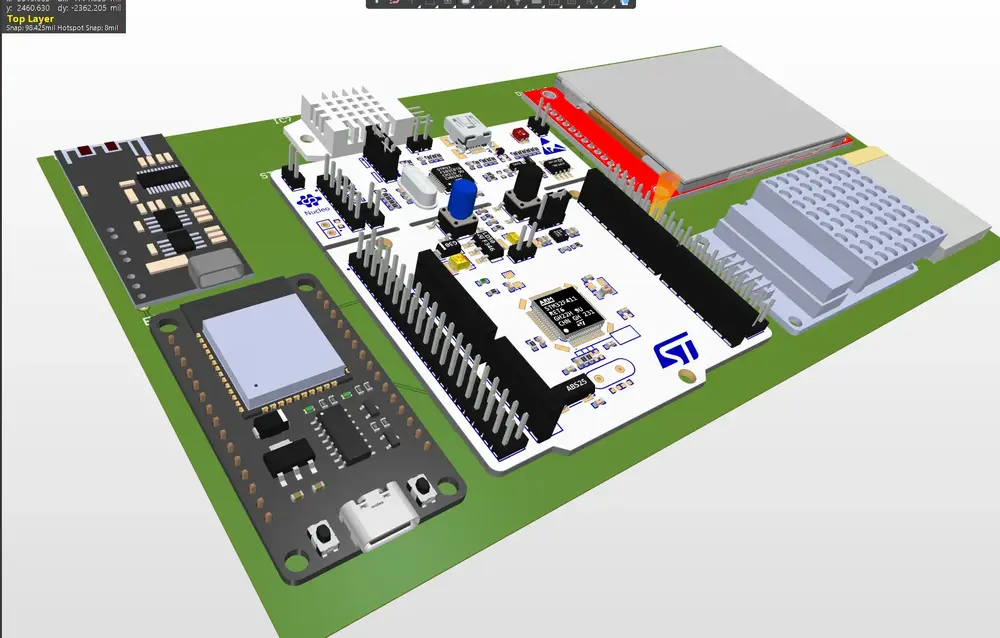
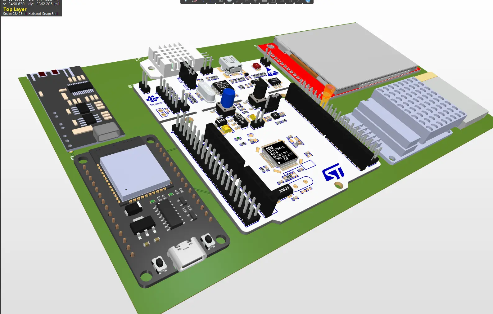
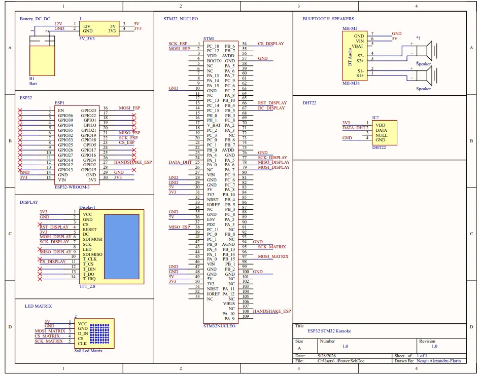
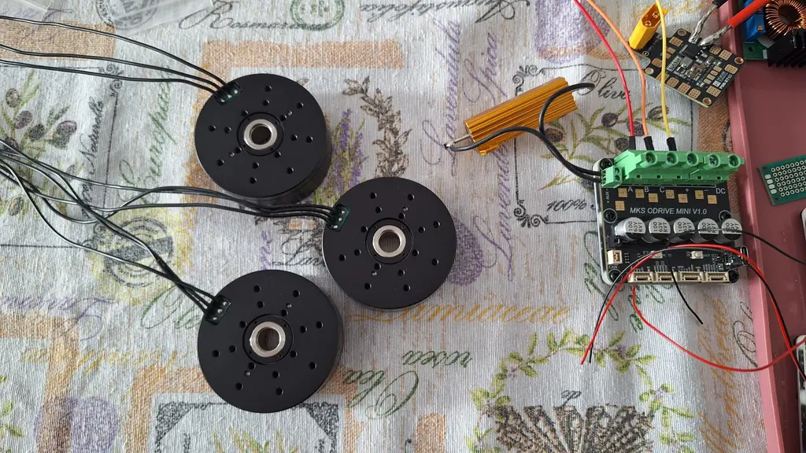
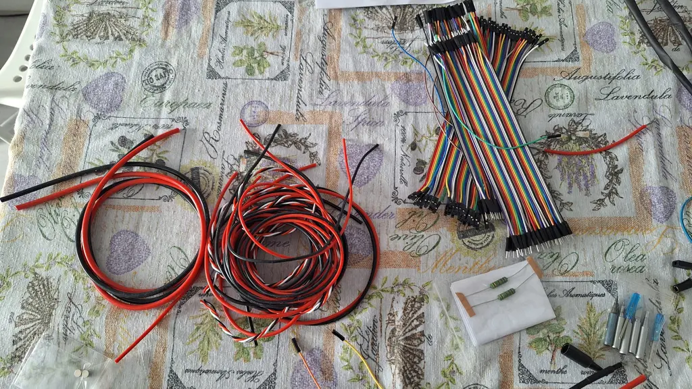
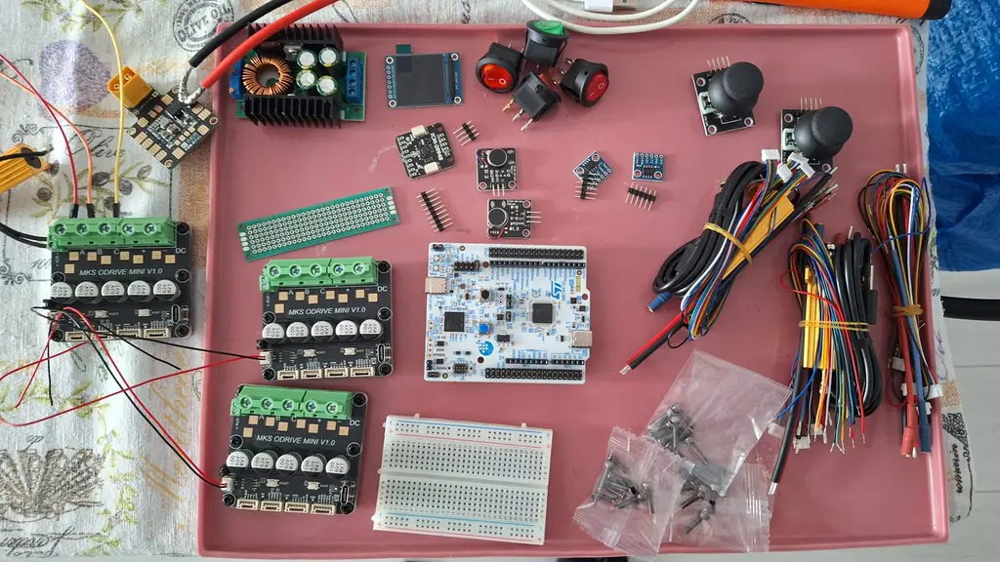

# KaraBox
A handheld Bluetooth-enabled karaoke device built around an STM32 brain board and an ESP32 wireless bridge, controlled from a custom Android app and programmed primarily in Rust.

:::info

**Author**: Neagu Alexandru-Florin \
**Group**: 1222EEB \
**GitHub Project Link**: https://github.com/UPB-PMRust-Students/fils-project-2026-ithinktoomuch05

:::

<!-- do not delete the \ after your name -->

## Description

This project represents a **portable karaoke device** that lets a user pick a song from their phone, stream it wirelessly to a small dedicated speaker system, and see synchronized lyrics scroll on both their phone and a tiny on-device display - all while a status panel shows environmental info and a small LED matrix animates in time with the audio.

The system is split into **two physical boards** that cooperate over Bluetooth and SPI:

- The **audio path** is a hardware-only board built around an MH-M38 Bluetooth audio receiver that drives a small amplifier and the speakers. The phone pairs to it directly for A2DP audio streaming - no firmware involved on this side.
- The **brain board** runs a Rust firmware on an **STM32U545RE-Q**, drives a small **ST7789V TFT display**, a **MAX7219 8x8 LED matrix** and a **DHT22 temperature/humidity sensor**, and talks to an **ESP32-WROOM-32** over SPI. The ESP32 acts as the Bluetooth Classic bridge that hands lyrics and control commands from the phone to the STM32.

## Motivation

I chose this project because karaoke is fun and my last project idea sadly died after my motor microcontrollers decided to not work and 2 of them were fried. Fortunately karaoke is even more fun!

## Architecture

This is the diagram regarding how the project is organized:




These are the current KiCAD diagrams for the project depicting the power distribution and the communication protocols between the STM32 brain board and its peripherals (the ST7789V display over SPI1, the MAX7219 matrix over SPI2, the ESP32 link over SPI3, and the DHT22 sensor on a single GPIO line with an external pull-up).




## Main components:

## Log

<!-- write your progress here every week -->
### Week 6: 30 March - 6 April

Coming up with possible project ideas.

### Week 7: 6 - 12 April

Conceptual stage, thinking how I would want my gimbal project to work, coming up with ideas regarding components and spending a *lot* of time looking for correct/compatible components, as I think this project is a bit complex for my current level of understading.

### Week 8: 12 - 18 April

Ordering a big part of components (motors, drivers+encoders, STM32 board). More research.

### Week 9: 19 - 25 April

Ordering next batch of components (IMU, battery and charger). More research x2. Changed to attempting CAN connection (lord have mercy).

### Week 10: 26 April - 2 May

Arrival of most components. Realised I need for the CAN bus a twisted pair insulated wire, had lots of trouble finding some available in Romania till I found some and ordered. Started working on the 3D printed components, the motor magnet couplings, the driver cages and the arms, alongside prototyping ways for cable management in Fusion 360.

### Week 11: 3 - 9 May

Finished designing the driver cages, still working on the rest of the components. Cable arrived. Realised my drivers have small can cables which I need to further connect to perfboards to fulfill CAN Bus conditions. Starting thinking about the KiCAD schematic and the different communication protocols required for pin connections between the board and the peripherals.








### Week 12: 10 - 16 May

Finished the KiCAD schematic and submitted to Git branch for review by lab assistants. Worked on setting up motor drivers and motors with USB-C connection and integrated ODrive Python programs developed for MKS XDRive Mini. Still working on 3D design for arms and rails for coupling the 3 axis components.

### Week 13: 18 - 23 May

Things started going horribly wrong. 2 drivers fried, lots of components purchased and unusable, I ended up changing my project idea from SteadyFrame to KaraBox, the karaoke idea...

### Week 14: 25 - 30 May

Components started arriving and I started assembly whenever I didnt have tests (mostly nights...)

## Hardware

Hardware used for creating this project (list currently WIP): STM32 NUCLEO-U545RE-Q board, ESP32-WROOM-32 DevKit v1, MH-M38 Bluetooth audio receiver with onboard amplifier, ST7789V 2.8" TFT display, MAX7219 8x8 LED matrix, DHT22 temperature/humidity sensor, a small 4Ω 3W speaker pair, and a USB power bank for portability. Photos of the assembled prototype will be added as the build progresses.

### Schematics


### Bill of Materials
#### --- WORK IN PROGRESS, NOT FINISHED ---
<!-- Fill out this table with all the hardware components that you might need.

The format is
```
| [Device](link://to/device) | This is used ... | [price](link://to/store) |

```

-->

| Device | Usage | Price |
|--------|--------|-------|
| STM32 NUCLEO-U545RE-Q | The brain board - runs the Rust firmware, drives the display and LED matrix, reads the sensor, and commands the ESP32 over SPI | 105 RON |
| ESP32-WROOM-32 DevKit v1 | The wireless bridge - exposes a Bluetooth Classic SPP server to the phone, forwards commands and lyrics to the STM32 over SPI3 | 35 RON |
| MH-M38 Bluetooth Audio Receiver | The audio path - pairs with the phone as a standard A2DP sink and drives the speakers through its onboard amplifier; no firmware needed | 25 RON |
| ST7789V 2.8" TFT Display (240x320, SPI) | The on-device UI - shows the current song title, artist, lyric line being sung, and the sensor readout | 31 RON |
| MAX7219 8x8 LED Matrix | The accent display - shows a heart icon when Bluetooth is paired, a VU bar while playing, and an idle animation otherwise | 12 RON |
| DHT22 Temperature & Humidity Sensor | Environmental telemetry - shows current ambient conditions on the status bar (it gets surprisingly warm inside a karaoke enclosure) | 18 RON |
| 2x 4Ω 3W speakers | The audio output, driven directly by the MH-M38's onboard amplifier | 30 RON |
| USB Power Bank (5V, 2A) | Portable power source for the brain board and the ESP32 | 50 RON |
| Wires, perfboard, headers | No exact count, still figuring out | 20 RON |
| | Total: | ~327 RON |


## Software

| Library | Description | Usage |
|---------|-------------|-------|
| [embassy-stm32](https://crates.io/crates/embassy-stm32) | HAL for STM32 microcontrollers, with drivers for GPIO, SPI, EXTI, timers and DMA | The main hardware abstraction layer for the STM32U545RE-Q, used to drive the three SPI buses (display, LED matrix, ESP32 link) and the DHT22 GPIO line |
| [embassy-executor](https://crates.io/crates/embassy-executor) | Async executor for embedded Rust | Runs the four concurrent tasks - UI rendering, LED matrix animation, sensor polling, and the ESP32 link - without a heap, with statically allocated tasks |
| [embassy-time](https://crates.io/crates/embassy-time) | Timekeeping, delays, and timeout utilities | Used for the display refresh cadence, DHT22 polling intervals, MAX7219 animation timing, and general async delays |
| [embassy-sync](https://crates.io/crates/embassy-sync) | Async synchronization primitives (channels, signals, mutexes) | Used for the `Channel<UiEvent>` that feeds the UI task and the `Signal<MatrixCmd>` that updates the LED matrix |
| [embassy-futures](https://crates.io/crates/embassy-futures) | `select` and `join` combinators for async embedded code | Used in the matrix task to race the animation timer against incoming commands |
| [embedded-hal](https://crates.io/crates/embedded-hal) | Common hardware abstraction traits for embedded systems | The generic interface layer used by all peripheral drivers (display, LED matrix, sensor) |
| [embedded-hal-bus](https://crates.io/crates/embedded-hal-bus) | Bus-sharing helpers for `embedded-hal` (ExclusiveDevice, RefCellDevice, ...) | Wraps the async SPI bus into a blocking `SpiDevice` for drivers that expect the blocking trait, like `max7219` |
| [mipidsi](https://crates.io/crates/mipidsi) | Generic MIPI-DCS display driver with built-in support for ST7789 and many others | Drives the ST7789V over SPI1, exposes a `DrawTarget` to `embedded-graphics` |
| [embedded-graphics](https://crates.io/crates/embedded-graphics) | 2D drawing primitives, fonts, and text layout for embedded displays | Used to render the status bar, song title, current lyric line and volume bar on the ST7789V |
| [max7219](https://crates.io/crates/max7219) | Driver for the MAX7219 LED matrix controller | Controls the 8x8 LED matrix - power-on, intensity, raw frame writes |
| [dht-sensor](https://crates.io/crates/dht-sensor) | Bit-banged 1-wire driver for DHT11/DHT22 temperature & humidity sensors | Reads ambient temperature and humidity once every few seconds over a single GPIO pin |
| [heapless](https://crates.io/crates/heapless) | Static-friendly data structures that do not require dynamic memory allocation | Used for fixed-capacity strings (song title, artist, current lyric) and buffers in the ESP32 link protocol |
| [static_cell](https://crates.io/crates/static_cell) | Runtime-initialized static storage for no_std applications | Used to allocate the shared SPI1 bus mutex and the DCS scratch buffer that `mipidsi` requires |
| [defmt](https://crates.io/crates/defmt) | Compact logging framework for resource-constrained embedded targets | Debug logging, sensor diagnostics and protocol error reporting during development |
| [defmt-rtt](https://crates.io/crates/defmt-rtt) | RTT transport for defmt logs | Streams logs over the ST-Link's onboard RTT channel so they show up in `probe-rs` |
| [panic-probe](https://crates.io/crates/panic-probe) | Panic handler that prints over defmt | Used to report panics cleanly during firmware development and debugging |

For the **ESP32 side** of the project, the firmware is written in C++ on top of the Arduino-ESP32 framework, since the BT Classic SPP stack there is the most mature option available. The dependencies for that part are:

| Library | Description | Usage |
|---------|-------------|-------|
| Arduino-ESP32 core | Espressif's official Arduino framework for the ESP32 | Provides the BluetoothSerial library (BT Classic SPP server) and the SPI master driver |
| ArduinoJson 7 | JSON serialization and parsing for Arduino | Parses the line-JSON command protocol from the phone and serializes telemetry events back to it |

For the **Android app**, the dependencies are:

| Library | Description | Usage |
|---------|-------------|-------|
| Jetpack Compose | Modern declarative UI toolkit for Android | The entire UI (connection status, song picker, transport controls, lyrics view) |
| AndroidX Lifecycle | ViewModel and lifecycle-aware components | Holds the playback state and survives configuration changes |
| Kotlinx Coroutines | Structured concurrency for Kotlin | Drives the BT socket reader loop and the 100ms playhead ticker |
| `android.bluetooth` (system) | Android's built-in Bluetooth Classic API | Opens the SPP RFCOMM socket to the ESP32; pairing with the MH-M38 is handled transparently by the OS audio framework |
| `android.media.MediaPlayer` (system) | Built-in media player | Plays the user-picked audio file; routes automatically to whichever A2DP sink the OS is currently connected to (the MH-M38) |

## Links

<!-- Add a few links that inspired you and that you think you will use for your project -->

1. [Embassy book - the official guide for async Rust on embedded](https://embassy.dev/book/)
2. [LRC lyrics file format reference](https://en.wikipedia.org/wiki/LRC_(file_format))
3. [ESP32 BluetoothSerial library examples](https://github.com/espressif/arduino-esp32/tree/master/libraries/BluetoothSerial)
4. [ST7789V datasheet and init sequence notes](https://newhavendisplay.com/content/datasheets/ST7789V.pdf)
5. [mipidsi driver design write-up](https://github.com/almindor/mipidsi)
6. [Bluetooth Classic SPP UUID and the standard service record format](https://learn.microsoft.com/en-us/windows-hardware/drivers/bluetooth/bluetooth-services)

...
