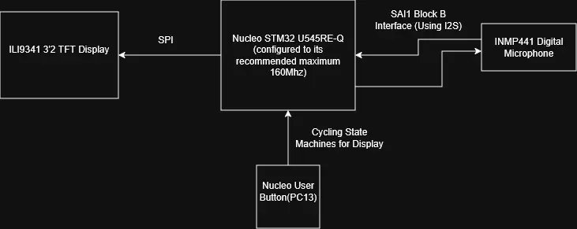
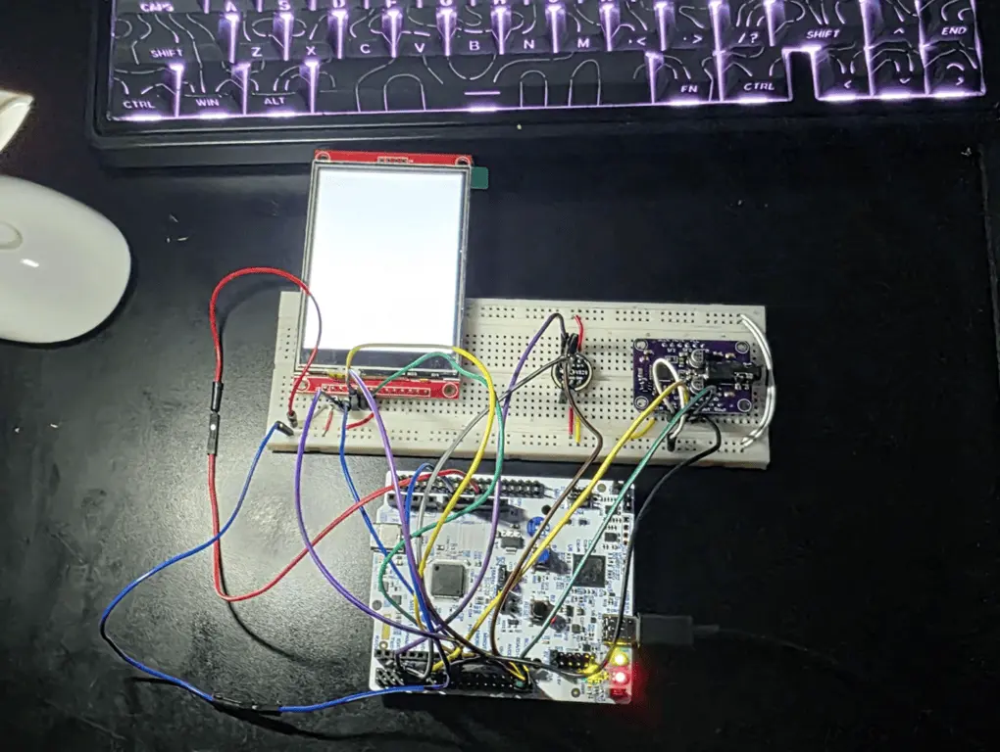
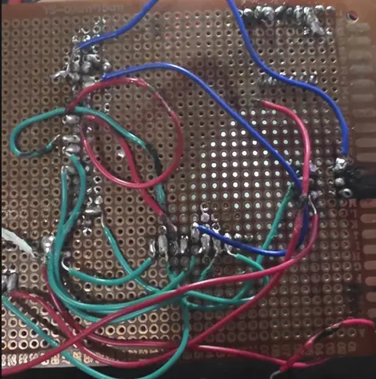
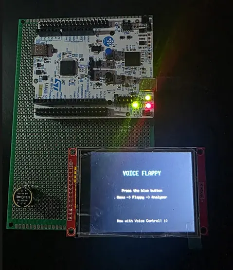
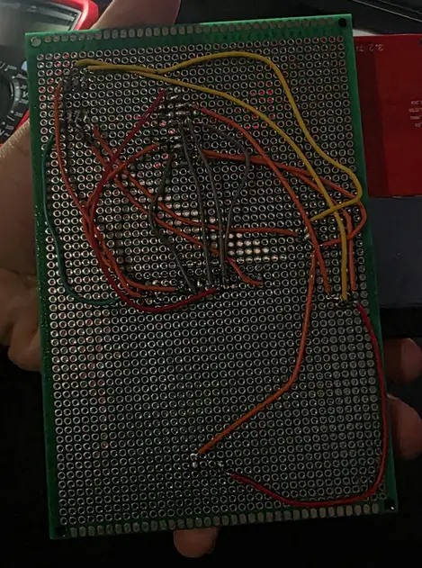
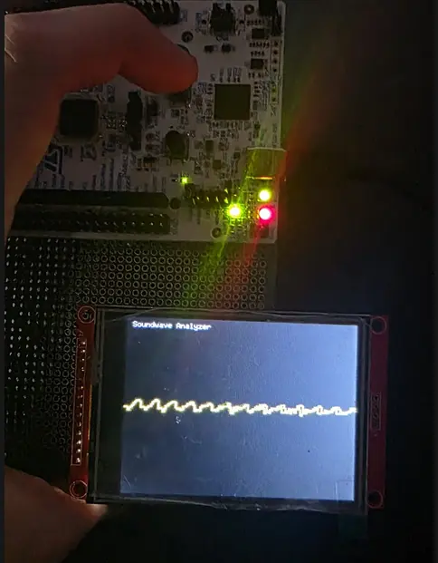
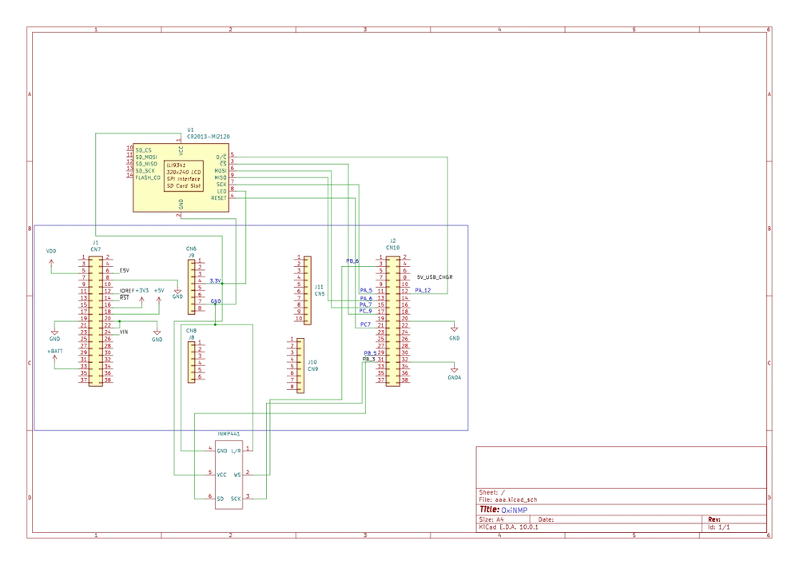

# OxiNMP
A visualiser of your voice and a game where you can also use your voice as a controller

:::info 

**Author**: Khalghamouz Ali-Nicolas \
**GitHub Project Link**: https://github.com/UPB-PMRust-Students/fils-project-2026-K-Nicolas-10

:::

<!-- do not delete the \ after your name -->

## Description

My project's purpose is to use my voice to control different stuff. My first Idea was a waveform analyzer, but then as I procrastinated (like everyone, on short-form content) I came across another one of those type of filter-game videos( the one with flappy birds controlled by your voice), so.... another state to my loop was added: FlappyApp! 

## Motivation

Choosing this project was because of a mix of my interest in mathematics, signals and wanting to learn DMA (used for audio input/output and SPI, leaving the processor more power to render the states of the display) more in-depth.

## Architecture 

- **INMP441 Module:** It sends clean digital audio arryas straight to the STM32 via I2S
- **STM32U545REQ:** Provides the User Button, computing power, and a (quite helpful for my waveform analyzer) FPU for my project.
- **SPI TFT LCD Display:** Chose an SPI screen over a I2C screen because it handles video better than I2C. I2C is too slow for smooth video.

## Log

<!-- write your progress here every week -->

### The 3 Week Sprint (*week 12,13,14*)

**Disclaimer: This project was partailly changed as you probably saw (previously, a DSP and sound visualiser) because of my AMAZING soldering skills and AMAZING electronics knowledge (I burnt my first DAC and couldn't get the 2nd one to work properly...) I suspected many things, including low impedance headphones, but none of my fixes quite worked and reached a good conclusion. So I did what an engineer would and found another way to use the components I already had in Week 2**
#### Week I
This week was a week of just learning stuff, understanding and, well headaches with the clock tree diagram from the official stm datasheet... I needed to understand the MSIS and Master Clock and PLL math so I can run my board at 160Mhz for the purpose of running the Screen at a smoother 20Mhz.
I configured the PLL by the end of the week, set up the Mic and read a lot about buffers (ring buffers, DMA)
#### Week II
Week 2 I thought about my project (this was the week where I realised I couldn't possibly get my DAC work and I tried a lot of DMA fixes and everything I could find online...)
After pivoting to this Visualiser and Game Idea I mapped out a state machine and how the display would work and the game logic for optimizing SPI so It doesn't run at 2 frames per second. I thought about how the pipes of the game would appear/dissapear so I don't update the display at every game event(moving forward, pipes appearing on-screen, dying, etc) 
#### Week III
Final week(this was a packed week):
Added DC Cut Off filter. Layered out my files and directories to be easy to access and read. Soldered everything together on a perfboard again and actually got better audio. Added game logic and Visualiser logic (optimized for the SPI display). Final polishes and good luck to me! 

## Hardware

Microcontroller: STM32U545RE Nucleo (Core logic + User Button) 

Input: INMP441 I2S Microphone (Captures audio)

Display: SPI TFT LCD (Shows States: Menu -> Flappy -> Visualiser)

**First Iteration (MVP):**

*My amazing Soldering Skills(failed attempt):*

**My final iteration of this project's hardware**

    I used a star point for 3V3 and GND. I tried keeping wires as short as possible (4-10cm) because of the SPI and I2S connection as these can be really skewed from the electromagnetic fields generated by the current (wires act as antennas).
    I could have also soldered a capacitor between 3V3 and GND but didn't have any at my disposal and the electrical noise was quite manageable, so I was satisfied. 

### Schematics

### Bill of Materials

| Device | Usage | Price |
|--------|--------|-------|
|[STM32 Nucleo-U545RE](__https://www.st.com/en/evaluation-tools/nucleo-u545re.html__) | The microcontroller | [Borrowed]() |
| [INMP441 I2S Microphone](__https://invensense.tdk.com/products/inmp441/__) | Captures ambient audio digitally via I2S, bypassing analog ADC noise. | [21 RON](__https://www.bitmi.ro/module-electronice/modul-microfon-omnidirectional-interfata-i2s-mems-inmp441-11003.html__) |
| [ILI9341 3.2" TFT LCD Touchscreen](__https://www.adafruit.com/product/1743__) | Displays UI, audio visualizations, and status information; touch input via SPI. | [84 RON](__https://www.emag.ro/display-tft-lcd-3-2-inch-320x240-touchscreen-14pini-spi-ili9341-arduino-rx407/pd/D7Q411YBM/__) |
| [Starting Electronics Kit](__https://www.emag.ro/kit-start-componente-electronice-ai777/pd/DXRJ4TMBM/__) | Contains Miscellaneous components like resistors,breadboard,etc | [51 RON](__https://www.emag.ro/kit-start-componente-electronice-ai777/pd/DXRJ4TMBM/__) |

## Software

| Library | Description | Usage |
|---------|-------------|-------|
| [embassy-stm32](https://crates.io/crates/embassy-stm32) | Hardware Abstraction Layer (HAL) for STM32 microcontrollers | Async Embassy framework for STM32 peripherals |
| [embassy-executor](https://crates.io/crates/embassy-executor) | Lightweight `no_std` async executor | Task scheduling and execution on embedded systems |
| [embassy-sync](https://crates.io/crates/embassy-sync) | Synchronization primitives for Embassy | Signals, channels, and mutexes between async tasks |
| [embassy-time](https://crates.io/crates/embassy-time) | Timekeeping and timer utilities | Delays, timeouts, and periodic timers |
| [embassy-futures](https://crates.io/crates/embassy-futures) | Future extensions and utilities | Combining and managing async futures |
| [embassy-embedded-hal](https://crates.io/crates/embassy-embedded-hal) | Bridge between Embassy and `embedded-hal` traits | Compatibility with standard embedded-hal drivers |
| [embedded-graphics](https://crates.io/crates/embedded-graphics) | 2D graphics library for embedded systems | Drawing primitives, text, and shapes on displays |
| [mipidsi](https://crates.io/crates/mipidsi) | Display driver framework for MIPI DSI/SPI displays | Driving the ILI9341 screen |
| [heapless](https://crates.io/crates/heapless) | Stack-allocated data structures | Strings and Vecs without dynamic memory allocation |
| [defmt](https://crates.io/crates/defmt) & [defmt-rtt](https://crates.io/crates/defmt-rtt) | Efficient deferred formatting framework | Logging over RTT during development |
| [cortex-m](https://crates.io/crates/cortex-m) & [cortex-m-rt](https://crates.io/crates/cortex-m-rt) | Low-level Cortex-M hardware access and startup runtime | Core ARM peripheral access and boot initialization |
| [panic-probe](https://crates.io/crates/panic-probe) | Panic handler for `defmt` and `probe-run` | Printing panic messages and exiting cleanly |
| [static_cell](https://crates.io/crates/static_cell) | Safe lock-free static variable initialization | Initializing DMA buffers and drivers as statics |
| [embedded-hal-bus](https://crates.io/crates/embedded-hal-bus) | Utilities for sharing SPI/I2C buses | Safely sharing buses among multiple devices |
| [cortex-m-semihosting](https://crates.io/crates/cortex-m-semihosting) | Semihosting support for Cortex-M | Debug I/O via the debug probe connection |

<!-- Add a few links that inspired you and that you think you will use for your project -->
## Links
1. [The best channel ever](https://www.youtube.com/@Rohde-Schwarz)
2. [The I2S implementation that made me understand](https://www.youtube.com/watch?v=qNLvoSQCx60)
3. [Embassy-rs Official Book](https://embassy.dev/book/)
4. [STM32 NUCLEO-U545RE Board Documentation](https://www.st.com/en/evaluation-tools/nucleo-u545re.html#documentation)
5. [INMP441 I2S Digital Microphone Official Datasheet](https://invensense.tdk.com/wp-content/uploads/2015/02/INMP441.pdf)
6. [Adafruit UDA1334A I2S DAC Guide](https://learn.adafruit.com/adafruit-i2s-stereo-decoder-uda1334a/overview)
7. [embedded-graphics Rust Crate Documentation](https://docs.rs/embedded-graphics/latest/embedded_graphics/)
8. [mipidsi Rust Crate Documentation](https://docs.rs/mipidsi/latest/mipidsi/)
9. [STM32U5 Series Reference Manual](https://www.st.com/resource/en/reference_manual/rm0456-stm32u575585-armbased-32bit-mcus-stmicroelectronics.pdf)