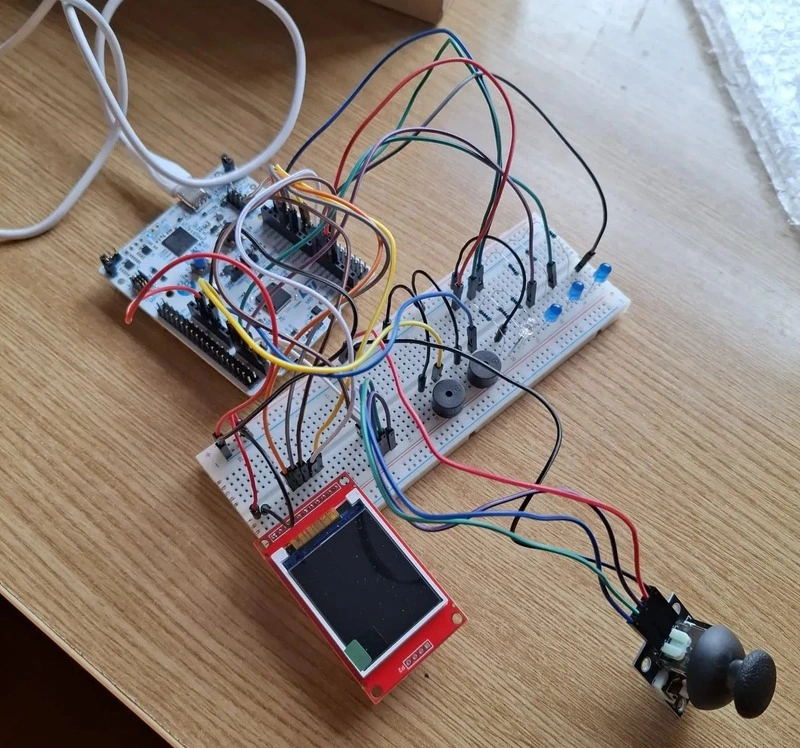
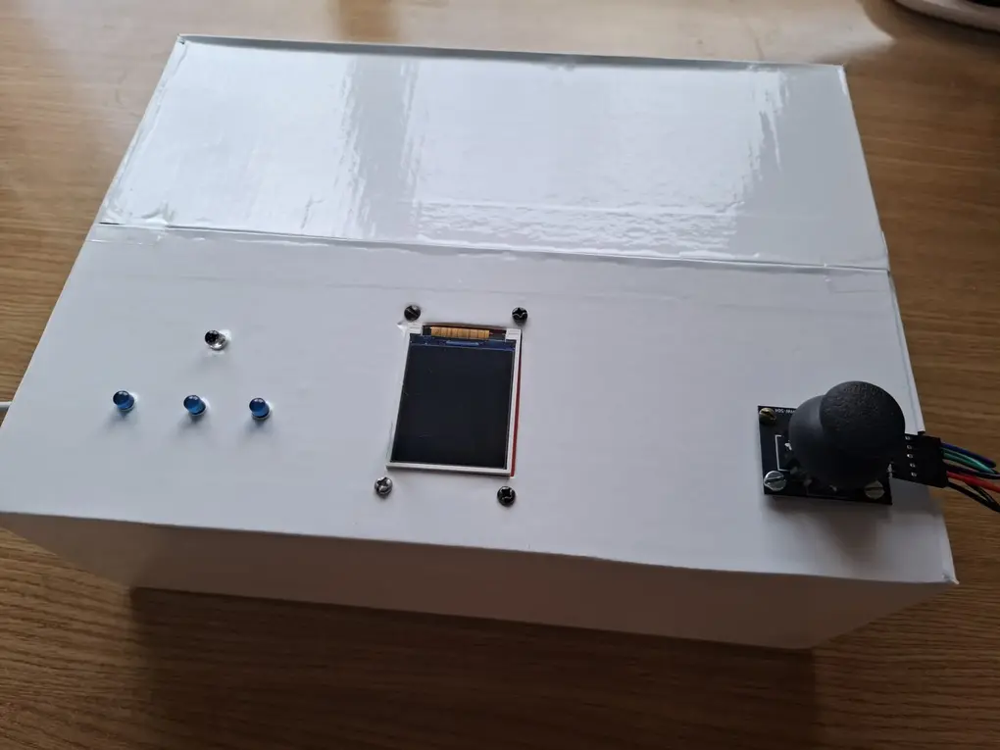
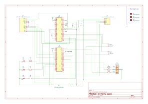

# Catch the falling apples
A remake of a classic arcade game where you catch as many apples as you can

:::info

**Author**: Radu Ana-Maria-Gabriela \
**Github Project Link**: https://github.com/UPB-PMRust-Students/fils-project-2026-anamariaradu6

:::

## Description

“Catch the falling apples” is a classic arcade game controlled by the STM32 Nucleo-U545RE-Q. The game is displayed on a 1.8-inch screen, where apples fall from the top of the screen and the user has to catch them using a basket. The movement of basket is controlled with a biaxial joystick.

## Motivation

Ever since I was a kid, I’ve been passionate about playing games in my free time. When I started learning how to code, I wanted to start making my own game. However, building a modern and complex game requires a lot of time, resources and knowledge. So for this project, I decided to recreate a classic game from my childhood, with the help of hardware components, not only digitally.

## Architecture

This project's architecture revolves around the STM32 Nucleo-U545RE-Q microcontroller.

- **STM32 Nucleo-U545RE-Q**
- **Breadboard**: allows easy connections among the components of the project
- **LCD SPI 128x160 Module**: the screen where the game will be displayed.
- **Joystick breakout board**: the joystick which will be used to move the basket to the left or to the right.
- **3 Blue LEDs**: the LEDs which will show the remaining lives of the player. They are all turned on when the game starts and one of them turns off when an apple falls on the ground.
- **1 RGB LED**: this LED will turn green when the player catches and apple, red when an apple falls on the ground and when the player loses the game, and yellow for a 3-seconds countdown before the game starts.
- **2 Passive Buzzers**: one of these buzzers will make a sound each time the player loses one life. The other buzzer will make different sounds when the game starts and when it ends.

## Log

### Week 30 March - 5 April
I sent my project idea and received feedback.

### Week 6 - 12 April
I ordered the components based on the feedback and picked them up.

### Week 13 - 19 April
I did some initial testing to see if the components work.

### Week 20 - 26 April
I continued the testing, wrote the page of the website and started writing the actual code of the project.

### Week 27 April - 3 May
I had an issue where my screen would stay white, regardless of the commands written in code. I managed to fix it by using a different crate. Also, I found a way of drawing my objects by importing images modified on a website which created an array of pixels. I had to find a way to remove the white background of the pictures, which turned out to be different shades of white, so I couldn't just manually exclude those pixels.

### Week 4 - 10 May
I had a problem where the buzzers were not working, but I fixed it. I finished the wiring, which will be slightly changed later on, and I finished the KiCAD schematic.

### Week 11 - 17 May
I worked more on my code and decided to make separate files for pins, display, leds and buzzers, which created a few problems with the pins initialization. I was able to solve them and had to change the initial implementations of my components as well.

### Week 18 - 24 May
I had a problem with reading the joystick values and solved it using DMA. 

Also, I needed to make the box used to carry the project look nicer and not have all the wires visible. This is why, I made some holes on the top part to have only the leds, display and joystick visible and left the buzzers on the breadboard. I covered the box in white sticker, which took two people and a lot of patience, then cut the holes again. After attaching the display and the joystick and wiring them, I realised that my wires are not long enough to connect the leds too from where they were initially on the breadboard. Here, I was faced with two choices: either order longer wires and pick them up the next day or move the led wires closer and the buzzers more to the side (they were in the middle). I spent the next hour rewiring them, only to then realise that my box would not close anymore. I was able to close it after a bit of struggle and then ran my code again to make sure that everything was working well and no wires were disconnected by mistake.

### Week 25 - 29 May
During the final week, I only worked on the code and finalized the game logic, as well as the other game effects.

## Hardware

### Schematic

### Bill of materials

| Device | Usage | Price |
| ----------- | ----------- | ----------- |
| STM32 Nucleo-U545RE-Q | Main microcontroller | borrowed |
| [Breadboard](https://ardushop.ro/ro/electronica/2297-breadboard-830-puncte-mb-102-6427854012265.html) | Connects the microcontroller to the components | 21.18 RON |
| [LCD SPI 128x160 Module](https://ardushop.ro/ro/electronica/2124-modul-lcd-spi-128x160-6427854032546.html) | Displays the game | 24.59 RON |
| [Joystick breakout board](https://www.optimusdigital.ro/ro/senzori-senzori-de-atingere/742-modul-joystick-ps2-biaxial-negru-cu-5-pini.html?search_query=joystick&results=27) | Controls the movement of the basket | 5.35 RON |
| [Blue LEDs](https://www.optimusdigital.ro/ro/optoelectronice-led-uri/12237-led-albastru-de-5-mm.html?search_query=led+albastru&results=58) | Shows the remaining lives of the player | 0.87 RON |
| [RGB LED](https://www.optimusdigital.ro/ro/optoelectronice-led-uri/483-led-rgb-catod-comun.html?search_query=led+albastru&results=58) | Shows visual cues | 1 RON |
| [Passive Buzzers](https://www.optimusdigital.ro/ro/audio-buzzere/12247-buzzer-pasiv-de-33v-sau-3v.html?search_query=buzzer&results=44) | Audio cues | 2 RON |
| [Male-Female Jumper Wires](https://www.optimusdigital.ro/en/wires-with-connectors/214-fire-colorate-mama-mama-10p.html?search_query=male+to+female+wires&results=89) | Connection of devices to breadboard and microcontroller | 8 RON |
| [Male-Male Jumper Wires](https://www.optimusdigital.ro/ro/fire-fire-mufate/93-fire-colorate-tata-tata-20cm.html?srsltid=AfmBOopz-AFHtwzfOEi-P-QewcvRUUoiXWLzARuhPmKm0ZhG_AUWEK1s) | Connection of devices to breadboard and microcontroller | 12 RON |

## Software
| Library/Crate | Description | Usage in project |
| ------------- | ----------- | ---------------- |
| [`embassy-stm32`](https://github.com/embassy-rs/embassy) | Hardware abstraction layer for STM32 | Provides type-safe access to peripherals (SPI, GPIO, PWM, ADC, timers) |
| [`embassy-sync`](https://github.com/embassy-rs/embassy) | Provider of synchronization primitives | Allows tasks to communicate without blocking each other |
| [`embassy-futures`](https://github.com/embassy-rs/embassy) | Collection of utilities for working with Futures | Makes sure the game does not freeze and keeps running |
| [`embassy-executor`](https://github.com/embassy-rs/embassy) | The async runtime | Runs main game loop |
| [`embassy-time`](https://github.com/embassy-rs/embassy) | Efficient for async embedded applications | Controls falling speed timing, delays and time durations |
| [`defmt`](https://github.com/knurling-rs/defmt) | Efficient embedded logging framework | Debugs and tracks game changes |
| [`defmt-rtt`](https://docs.rs/defmt-rtt/latest/defmt_rtt/) | Backend for `defmt` to output logs via probe-rs | Used in all files |
| [`panic-probe`](https://docs.rs/panic-probe/latest/panic_probe/) | Panic handler that prints to defmt | Used in all files |
| [`embedded-graphics`](https://github.com/embedded-graphics/embedded-graphics) | 2D graphics library for `no_std` embedded devices | Draws the apples, basket and score text |
| [`embedded-hal`](https://github.com/rust-embedded/embedded-hal) | Traits for reading analog values and digital pins | Reads joystick axis and converts raw ADC values to screen positions |
| [`mipidsi`](https://github.com/almindor/mipidsi) | Display driver to connect to TFT displays | Initializes and controls my ST7735 display |
| [`heapless`](https://github.com/rust-embedded/heapless) | Stack allocated strings for `no_std` | Used for displaying text on start and game over screens |

## Links
1. [Rust Embassy Book](https://embassy.dev/book/)
2. [Screen connection documentation](https://emalliab.wordpress.com/2020/10/10/arduino-and-a-cheap-tft-display/) - explains what each pin of the screen is used for and how to connect them.
3. [Joystick Datasheet](https://naylampmechatronics.com/img/cms/Datasheets/000036%20-%20datasheet%20KY-023-Joy-IT.pdf)
4. [Joystick Documentation](https://www.watelectronics.com/ky-023-joystick-module/) - more information about the joystick
5. [KiCAD schematic pins documentation](https://www.st.com/en/evaluation-tools/nucleo-u545re-q.html#cad-resources)
6. [image2cpp](https://javl.github.io/image2cpp/) - website where you can turn an image into an array of pixels
