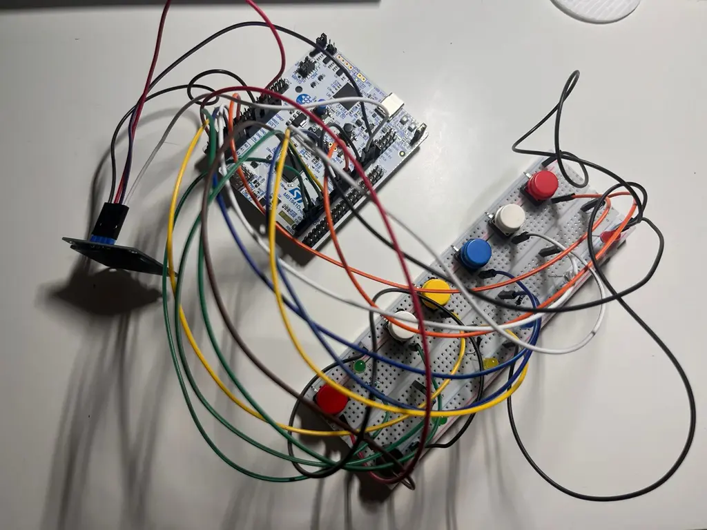

# Embedded Rhythm Music Box Game

A real-time embedded rhythm game where the user must press buttons in sync with LED cues and music.

:::info

**Author:** Andra-Sara-Maria Duminica  \
**Project GitHub Link:** https://github.com/UPB-PMRust-Students/fils-project-2026-Asmd-44  

:::

---

## Description

This project implements a real-time embedded rhythm and memory game using an STM32 microcontroller. 

The gameplay is based on two different modes: 
-**Rhythm Mode**: the device plays melodies using a passive buzzer while LEDs light up in predefined sequences corresponding to the rhythm. Each LED is mapped to a specific button, and the player must press the correct button at the correct time.
-**Memory Mode**: the player must memorize and reproduce LED sequences of increasing complexity.

The game evaluates both timing accuracy and input correctness. Correctly timed inputs increase the score, while missed or incorrect presses reduce the player’s performance. In Memory Mode, the score depends on how accurately the user reproduces the generated LED patterns and stops at the first wrong hit. The system also stores separate high scores for different game modes and difficulty levels.

The game includes multiple songs and difficulty levels selectable directly from the OLED menu interface. The system also uses two SG90 servo motors to provide physical animated feedback during boot and when the player achieves a new high score, making the experience more dynamic and interactive.

---

## Motivation

I chose this theme for my project because I'm interested in both music and visual design and wanted to combine them into an interactive embedded system. I am especially passionate about the aesthetics and digital culture of the 2000s era, including its nostalgic visual style and retro electronic sound. This project allowed me to combine those artistic influences with real-time embedded programming, hardware interaction, and game design.

---

## Architecture

The system is structured as a set of interacting modules:

- **Main Controller** – coordinates the entire system and manages game flow
- **Menu System** – handles navigation between game modes, songs, and difficulty levels
- **Melody Manager** – handles song playback and rhythm timing
- **LED Controller** – generates visual gameplay and feedback effects
- **Button Handler** – reads and debounces user input
- **Rhythm Checker** – verifies timing accuracy of button presses in Rhythm Mode
- **Memory Engine** – generates and validates LED memory sequences
- **Score System** – computes scores, penalties, and high scores
- **Buzzer Controller** – generates audio output and sound effects
- **OLED Controller** – displays menus, scores, and gameplay feedback
- **Servo Controller** – controls animated physical feedback during boot and high-score events

The modules communicate through the microcontroller, which acts as the central unit coordinating all operations.

---

## Log

### Week 5 – 11 May

- Defined the project idea and overall architecture
- Chose the hardware components
- Tested LEDs and push buttons on STM32
- Tested OLED display communication over I2C
- Implemented melody playback using PWM and passive buzzer
- Implemented rhythm gameplay logic

### Week 12 – 18 May

- Implemented the OLED menu system
- Added multiple songs and difficulty selection
- Implemented score calculation and gameplay feedback
- Added Memory Mode gameplay logic
- Improved button handling and timing accuracy
- Added high-score tracking system
- Integrated OLED feedback screens and score display

### Week 19 – 25 May

- Added SG90 servo motor support
- Implemented boot and high-score animations
- Redesigned GPIO pin mapping and button layout
- Improved gameplay stability and timing synchronization
- Finalized hardware integration and debugging
- Built the case for the components
  
---

## Hardware

The system uses the following hardware components:

- STM32 Nucleo board  
- Passive buzzer  
- 6 LEDs (5 gameplay LEDs + 1 status LED) 
- 5 Push buttons
- SSD1306 OLED display (I2C)  
- Breadboard and jumper wires
- 2 SG90 servo motors
- MB102 breadboard power supply module  
- Header pins for cartridge system
- Resistors

---

## Schematics

---

## Bill of Materials (Estimated Cost)

- 1x Passive buzzer – 1 RON  
- LEDs and Resistors set – 23 RON    
- 5x Push buttons – 10 RON  
- 1x I2C OLED display – 22 RON  
- 3x Breadboards – 30 RON  
- Jumper wires – 25 RON  
- 2x SG90 servo motors - 23 RON
- 1x MB102 breadboard power supply module - 4 RON
- Case building materials- 60 RON

**Total cost: 198 RON**

---

## Software

| Library | Usage |
|----------|--------|
| embassy-stm32 | STM32 peripheral access and GPIO control |
| embedded-hal | Hardware abstraction layer |
| ssd1306 | OLED display driver |
| embedded-graphics | OLED text rendering |
| cortex-m | Low-level ARM Cortex-M support |
| cortex-m-rt | Runtime and startup code |
| panic-halt | Panic handling for embedded systems |

---

## Links

