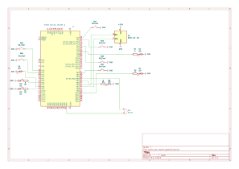

# Embedded Rhythm Music Box Game

A real-time embedded rhythm game where the user must press buttons in sync with LED cues and music.

:::info

**Author:** Andra-Sara-Maria Duminica  \
**Project GitHub Link:** https://github.com/UPB-PMRust-Students/fils-project-2026-Asmd-44  

:::

---

## Description

This project implements a real-time embedded rhythm game using an STM32 microcontroller. The player must follow the rhythm of a melody by pressing buttons in sync with LED cues and audio playback.

The device plays melodies using a passive buzzer while LEDs light up in predefined sequences corresponding to the rhythm. Each LED is mapped to a specific button, and the player must press the correct button at the correct time.

The system evaluates the user’s input in real time, checking both correctness and timing accuracy. An additional feedback LED lights up whenever the player successfully hits the correct button at the right moment. Based on the player’s performance, a scoring system calculates metrics such as correct hits, missed inputs, and overall accuracy. At the end of the song, the final score is displayed on an OLED screen.

The system uses three interchangeable cartridges, each corresponding to a different melody and difficulty level, allowing easy switching between game modes.

---

## Motivation

I chose this theme for my project because I'm interested in both music and visual design and wanted to combine them into an interactive embedded system. I am especially passionate about the aesthetics and digital culture of the 2000s era, including its nostalgic visual style and retro electronic sound. This project allowed me to combine those artistic influences with real-time embedded programming, hardware interaction, and game design.

---

## Architecture

The system is structured as a set of interacting modules:

- **Main Controller** – coordinates the entire system  
- **Cartridge Decoder** – detects which of the three cartridges is inserted  
- **Melody Manager** – handles song playback and timing  
- **LED Controller** – generates visual rhythm cues  
- **Button Handler** – reads and debounces user input  
- **Rhythm Checker** – verifies timing accuracy of button presses  
- **Score System** – computes performance metrics  
- **Buzzer Controller** – generates audio output  
- **OLED Controller** – displays feedback and final results  

The modules communicate through the microcontroller, which acts as the central unit coordinating all operations.

---

## Log

### Week 5 – 11 May

- Defined the project idea and overall architecture
- Chose the hardware components
- Tested LEDs and push buttons on STM32
- Tested OLED display communication over I2C
- Implemented melody playback using PWM and passive buzzer
- Implemented rhythm gameplay logic

### Week 12 – 18 May
 

### Week 19 – 25 May

---

## Hardware

The system uses the following hardware components:

- STM32 Nucleo board  
- Passive buzzer  
- 6 LEDs (5 gameplay LEDs + 1 status LED) 
- Push buttons (5 gameplay buttons + 1 start button)
- SSD1306 OLED display (I2C)  
- Breadboard and jumper wires  
- Header pins for cartridge system
- Resistors

---

## Schematics

---

## Bill of Materials (Estimated Cost)

- STM32 Nucleo board – ~120–180 RON  
- Passive buzzer – ~5–15 RON  
- LEDs – ~10–20 RON  
- Resistors – ~5–10 RON  
- Push buttons – ~10–20 RON  
- SSD1306 OLED display – ~30–60 RON  
- Breadboard – ~15–30 RON  
- Jumper wires – ~10–20 RON  
- Header pins (cartridge system) – ~5–10 RON  

**Total estimated cost: ~200–350 RON**

---

## Software

| Library | Usage |
|----------|--------|
| embassy-stm32 | STM32 peripheral access |
| embassy-time | Timing and delays |
| embedded-hal | Hardware abstraction |
| ssd1306 | OLED display driver |
| embedded-graphics | OLED text rendering |

---

## Links

