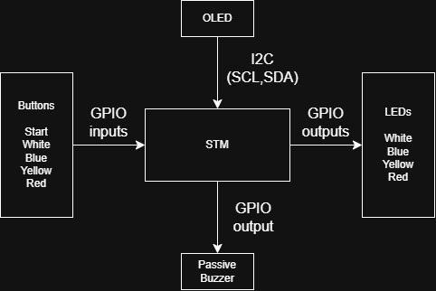
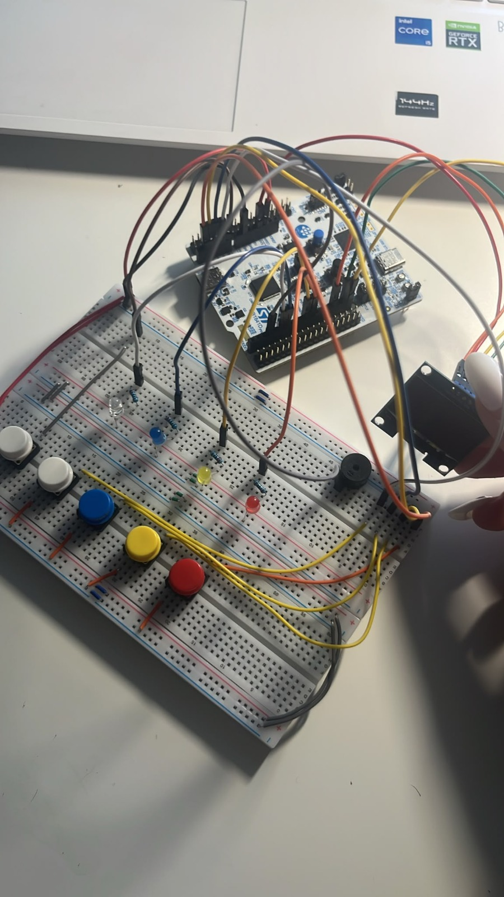

# STM32 Memory Game

A memory game implemented on an STM32 microcontroller where the player has to memorize and reproduce an increasingly long sequence of colored LEDs.

:::info

**Author:** Andra-Sara-Maria Duminica  
**Project GitHub Link:** https://github.com/UPB-PMRust-Students/fils-project-2026-Asmd-44  

:::

---

## Description

This project implements a memory game using an STM32 microcontroller, four colored LEDs, four corresponding push buttons, a START button, a passive buzzer, and an OLED display.

When the system is idle, the OLED displays "PRESS START" while the LEDs light up one by one. The game begins when the player presses the START button.

At the beginning of each level, the microcontroller generates a new random color and adds it to the existing sequence. The complete sequence is then displayed using the LEDs. Each color also has a different sound generated by the passive buzzer.

The player must memorize the sequence and reproduce it by pressing the corresponding colored buttons in the correct order.

If the complete sequence is entered correctly, the score increases by one and the game continues to the next level with a longer sequence. If the player presses a wrong button, the game ends immediately and the final score is displayed on the OLED.

The maximum level is 20. If the player successfully completes all 20 levels, the OLED displays "YOU WIN" together with the final score.

After the game ends, the score remains visible for two seconds and the system automatically returns to the idle state, ready for another game.

---

## Motivation

I chose to create a memory game because it provides a simple way to combine several embedded-system concepts in one interactive project.

The project uses digital inputs and outputs, button handling, LED control, sound generation, I2C communication with an OLED display, timing, and simple pseudo-random sequence generation.

It also allowed me to create a complete game using relatively simple hardware components while learning how different peripherals can be coordinated by a microcontroller.

---

## Architecture

The STM32 microcontroller acts as the central controller of the system.

The project consists of the following main components:

- **STM32U545RETxQ** – controls the game logic and all peripherals
- **START Button** – starts a new game
- **Color Buttons** – allow the player to reproduce the displayed sequence
- **LEDs** – display the generated color sequence and provide visual feedback
- **Passive Buzzer** – generates a different tone for each color and additional game feedback sounds
- **OLED Display** – displays the idle message, final score, and win message

The five buttons are connected to GPIO inputs configured with internal pull-up resistors.

The four LEDs and the passive buzzer are controlled through GPIO outputs.

The OLED display communicates with the STM32 using the I2C protocol.

---

## Log

### Week 1

- Defined the main idea and rules of the Memory Game
- Selected the required hardware components and assigned the STM32 GPIO pins
- Connected and tested the four LEDs and their corresponding push buttons
- Added the START button and implemented the idle state
- Implemented the random sequence generation and stored the sequence for each level
- Added the main game logic for displaying and checking the player sequence
- Connected the passive buzzer and added different tones for each color
- Connected the OLED display using I2C
- Added the `PRESS START`, score, and `YOU WIN` screens
- Added the LED animation while waiting for the game to start
- Tested the complete game and fixed button debounce and game-over behavior
- Added the automatic return to the idle state after the final score is displayed
- Finalized the hardware connections and tested the complete system

---

## Hardware

The system uses the following hardware components:

- STM32 Nucleo board (STM32U545RETxQ)
- 4 LEDs (White, Blue, Yellow, Red)
- 5 Push buttons (1 START button + 4 color buttons)
- 4x 220 Ω resistors
- Passive buzzer
- 0.96" OLED display (I2C)
- Breadboard
- Jumper wires

### Pin Mapping

| Component | STM32 Pin | Function |
|-----------|-----------|----------|
| START Button | PA0 | GPIO Input |
| White Button | PA1 | GPIO Input |
| Blue Button | PA4 | GPIO Input |
| Yellow Button | PB0 | GPIO Input |
| Red Button | PC1 | GPIO Input |
| White LED | PB4 | GPIO Output |
| Blue LED | PB10 | GPIO Output |
| Yellow LED | PC6 | GPIO Output |
| Red LED | PC9 | GPIO Output |
| Passive Buzzer | PB3 | GPIO Output |
| OLED SCL | PB6 | I2C Clock |
| OLED SDA | PB7 | I2C Data |

The push buttons use the internal pull-up resistors of the STM32. When a button is pressed, the corresponding GPIO input is connected to GND and becomes LOW.

Each LED is connected to a GPIO output through a 220 Ω current-limiting resistor.

---

## Schematics

The hardware schematic was created using KiCad.

.svg)

The five push buttons are connected between their corresponding GPIO inputs and GND.

The four LEDs are connected to GPIO outputs through 220 Ω resistors.

The passive buzzer is connected to PB3 and GND.

The OLED display is connected using I2C, with PB6 used as SCL and PB7 used as SDA. The OLED is powered from 3.3 V.

---

## Bill of Materials (Estimated Cost)

| Component | Quantity | Estimated Cost |
|-----------|----------|----------------|
| STM32 Nucleo board | 1 | Development board |
| Passive buzzer | 1 | 1 RON |
| LEDs and resistors set | 1 | 23 RON |
| Push buttons | 5 | 10 RON |
| 0.96" I2C OLED display | 1 | 22 RON |
| Breadboard | 1 | 10 RON |
| Jumper wires | As required | 25 RON |

---

## Software

The project is written in Rust using the Embassy embedded framework.

| Library | Usage |
|----------|-------|
| embassy-stm32 | STM32 peripheral access, GPIO and I2C control |
| embassy-executor | Asynchronous program execution |
| embassy-time | Timers and delays |
| embedded-hal | I2C hardware abstraction |
| panic-probe | Panic handling |
| defmt-rtt | Debug transport required by the embedded environment |

The program uses `#![no_std]` and `#![no_main]` because it runs directly on the STM32 microcontroller without a standard operating system.

### Software Design

The software is based around a main game loop that controls the different states of the game.

At startup, the program initializes the STM32 peripherals, including the GPIO pins for the LEDs, buttons and buzzer, as well as the I2C interface used by the OLED display.

After initialization, the game enters the idle state. The OLED displays "PRESS START" and the LEDs light up one by one. During this period, the random seed is continuously modified.

When the START button is pressed, the display is cleared and a new game begins with a score of zero.

For every level, a new pseudo-random value between 0 and 3 is generated and added to the sequence. Each value represents one of the four colors:

- 0 – White
- 1 – Blue
- 2 – Yellow
- 3 – Red

The complete sequence is then shown to the player. For every element of the sequence, the corresponding LED is activated and the passive buzzer generates the frequency associated with that color.

After the sequence has been displayed, the program waits for the player to reproduce it using the four color buttons.

Every button press activates the corresponding LED and tone to provide immediate feedback to the player.

The player's input is compared with the stored sequence after every button press. If the pressed button does not match the expected value, the game immediately ends.

If the complete sequence is reproduced correctly, the score increases by one and the next level begins.

The game continues until the player makes a mistake or successfully completes all 20 levels.

When a mistake occurs, the final score is displayed on the OLED and a low-frequency game-over sound is played.

If the player completes all 20 levels, the OLED displays "YOU WIN" and the LEDs and buzzer provide a victory effect.

The result remains visible for two seconds. The program then automatically returns to the idle state and waits for the START button again.

### Random Sequence Generation

The game uses a simple pseudo-random number generator to generate the sequence.

The generated values are stored in an array that can contain a maximum of 20 elements, corresponding to the maximum number of levels.

The random seed is continuously changed while the system is in the idle state. Since the player presses the START button at a different moment each time, this helps produce different sequences between games.

### Button Handling

The five buttons are configured as GPIO inputs using the STM32 internal pull-up resistors.

This means that a button input is normally HIGH. When a button is pressed, the input is connected to GND and becomes LOW.

The program periodically checks the state of the buttons and waits for the button to be released before accepting another input.

### LED Control

The four LEDs represent the four possible values in the generated sequence.

Only the required LED is activated when a color is displayed. The LEDs are also used to provide visual feedback when the player presses a button.

During the idle state, the LEDs are activated one after another to indicate that the system is waiting for the game to start.

### Buzzer Control

The passive buzzer is controlled through GPIO pin PB3.

A square-wave signal is generated by repeatedly switching the GPIO output between HIGH and LOW with a delay determined by the required frequency.

Each color has a different frequency:

| Color | Frequency |
|-------|-----------|
| White | 523 Hz |
| Blue | 659 Hz |
| Yellow | 784 Hz |
| Red | 988 Hz |

A 1200 Hz tone is used when a level is completed successfully, while a 300 Hz tone is used for the game-over effect.

### OLED Control

The OLED display communicates with the STM32 through the I2C interface.

The display uses address `0x3C`, with PB6 connected to SCL and PB7 connected to SDA.

The program sends commands and display data directly through I2C. A small character font is stored in the program and is used to display the required text.

The OLED is used to display:

- `PRESS START` during the idle state
- `SCORE: XX` when the game ends
- `YOU WIN` when all 20 levels are completed

code: https://github.com/Asmd-44/code/tree/main
