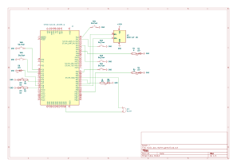

# STM32 Memory Game

A memory game implemented on an STM32 microcontroller where the player has to memorize and reproduce an increasingly long sequence of colored LEDs.

:::info

**Author:** Andra-Sara-Maria Duminica  \
**Project GitHub Link:** https://github.com/UPB-PMRust-Students/fils-project-2026-Asmd-44  

:::

---

## Description

This project implements a memory game using an STM32 microcontroller, four colored LEDs, four corresponding push buttons, a START button, a passive buzzer, and an OLED display.

When the system is idle, the OLED displays "PRESS START" while the LEDs light up one by one. The game begins when the player presses the START button.

At the beginning of each level, the microcontroller generates a new random color and adds it to the existing sequence. The complete sequence is then displayed using the LEDs. Each color also has a different sound generated by the passive buzzer.

The player must reproduce the sequence by pressing the corresponding colored buttons in the correct order.

If the complete sequence is entered correctly, the score increases by one and the game continues to the next level with a longer sequence. If the player presses a wrong button, the game ends immediately and the final score is displayed on the OLED.

The maximum level is 20. If the player successfully completes all 20 levels, the OLED displays "YOU WIN" together with the final score.

After the game ends, the score remains visible for two seconds and the system automatically returns to the idle state, ready for another game.
---

## Motivation

I chose to create a memory game because it provides a simple way to combine several embedded-system concepts in one interactive project.

The project uses digital inputs and outputs, button handling, LED control, sound generation, I2C communication with an OLED display, timing, and simple pseudo-random sequence generation.

It also allowed me to create a complete game using relatively simple hardware components while learning how different peripherals can be coordinated by a microcontroller.

---

## Architecture

The STM32 microcontroller acts as the central controller of the system.

The project consists of the following main components:

STM32U545RETxQ – controls the game logic and all peripherals
START Button – starts a new game
Color Buttons – allow the player to reproduce the displayed sequence
LEDs – display the generated color sequence and provide visual feedback
Passive Buzzer – generates a different tone for each color and additional game feedback sounds
OLED Display – displays the idle message, final score, and win message

The five buttons are connected to GPIO inputs configured with internal pull-up resistors.

The four LEDs and the passive buzzer are controlled through GPIO outputs.

The OLED display communicates with the STM32 using the I2C protocol.

---

## Log

### Week 1

* Defined the main idea and rules of the Memory Game
* Selected the required hardware components and assigned the STM32 GPIO pins
* Connected and tested the four LEDs and their corresponding push buttons
* Added the START button and implemented the idle state
* Implemented the random sequence generation and stored the sequence for each level
* Added the main game logic for displaying and checking the player sequence
* Connected the passive buzzer and added different tones for each color
* Connected the OLED display using I2C
* Added the `PRESS START`, score, and `YOU WIN` screens
* Added the LED animation while waiting for the game to start
* Tested the complete game and fixed button debounce and game-over behavior
* Added the automatic return to the idle state after the final score is displayed
* Finalized the hardware connections and tested the complete system

---

## Hardware

The system uses the following hardware components:

- STM32 Nucleo board (STM32U545RETxQ)
- 4 LEDs (White, Blue, Yellow, Red)
- 5 Push buttons (1 START button + 4 color buttons)
- 4x 220 Ω resistors
- Passive buzzer
- 0.96" OLED display (I2C)
- Breadboard
- Jumper wires

---

## Schematics

---

## Bill of Materials (Estimated Cost)

- 1x Passive buzzer – 1 RON  
- LEDs and Resistors set – 23 RON    
- 5x Push buttons – 10 RON  
- 1x I2C OLED display – 22 RON  
- 3x Breadboards – 30 RON  
- Jumper wires – 25 RON  

---

## Software

| Library | Usage |
|----------|--------|
| embassy-stm32 | STM32 peripheral access and GPIO control |
| embedded-hal | Hardware abstraction layer |
| ssd1306 | OLED display driver |
| embedded-graphics | OLED text rendering |
| cortex-m | Low-level ARM Cortex-M support |
| cortex-m-rt | Runtime and startup code |
| panic-halt | Panic handling for embedded systems |

---

## Links

