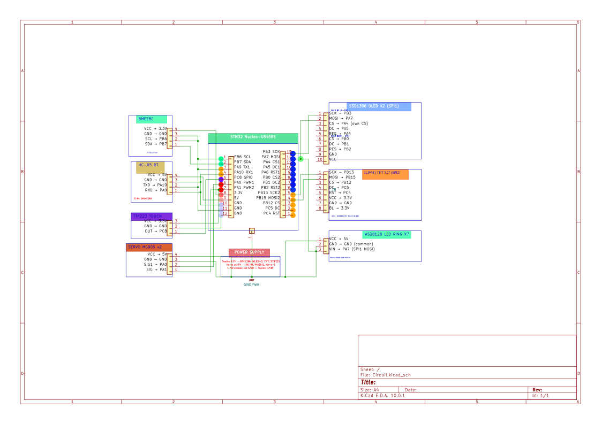

# AWARE-GUIN

An interactive companion robot developed on STM32 using Async Rust (Embassy).

:::info

**Author**: [DASCALESCU ANDREI] \

**GitHub Project Link**: [AWARE-GUIN Repository](https://github.com/UPB-PMRust-Students/fils-project-2026-yvcc28s62s-cmd)

:::

## Description
AWARE-GUIN is an intelligent desktop companion designed to react to its environment through visual expressions and light feedback. The "brain" of the project is a state-of-the-art STM32U5 microcontroller, programmed exclusively in Rust. The system runs on the `Embassy` asynchronous framework, concurrently managing an SPI display for the face/UI, a smart LED ring (NeoPixel) for expressing moods, and I2C sensors for gathering environmental data.

## Motivation
The primary motivation for this project was born from a desire to bridge digital pop culture and bare-metal hardware by bringing to life an interactive desktop companion. The aesthetic and personality of AWARE-GUIN were heavily inspired by a beloved character from the "Creative Monkeyz" sketches (massive respect and credits to Codin and Ramona Pop), combined with the chaotic, lovable energy of Gunter from *Adventure Time*. 

Beyond the creative vision, this project served as an advanced technical sandbox to explore the modern, memory-safe embedded ecosystem provided by Rust. By leveraging the `Embassy` framework, the system pushes the boundaries of cooperative multitasking, implementing highly efficient, non-blocking asynchronous routines. It demands precise peripheral orchestration and direct Hardware Abstraction Layer (HAL) manipulation to manage high-speed SPI and I2C communication buses concurrently, ensuring deterministic execution and seamless sensory feedback.

## Architecture 
```text
+-----------------+ +-----------------+ +-----------------+
|    LEFT EYE     | | MAIN TFT ECRAN  | |    RIGHT EYE    |
|  (SPI Display)  | |  (SPI Display)  | |  (SPI Display)  |
+-----------------+ +-----------------+ +-----------------+
| VCC --- 3.3V    | | VCC --- 5V      | | VCC --- 3.3V    |
| GND --- GND     | | GND --- GND     | | GND --- GND     |
| SCK --- PB13    | | SCK --- PA5     | | SCK --- PC10    |
| MOSI -- PB15    | | MOSI -- PA7     | | MOSI -- PC12    |
| RES --- PC7     | | MISO -- PA6     | | RES --- PD2     |
| DC  --- PC6     | | RES --- PB1     | | DC  --- PC8     |
| CS  --- PC9     | | DC  --- PA4     | | CS  --- PB8     |
|                 | | CS  --- PB0     | |                 |
|                 | | LED --- 3.3V    | |                 |
+--------+--------+ +--------+--------+ +--------+--------+
         |                   |                   |
         +-------------------+-------------------+
                             | (SPI Buses)
+---------------------------------------------------------+
|                                                         |
|                 STM32 NUCLEO-U5 BOARD                   |
|                   (AWARE-GUIN CORE)                     |
|                                                         |
+---------+-------------------------------------+---------+
          |                                     |
   (I2C & GPIO)                           (PWM Signals)
          |                                     |
+---------+---------+                 +---------+---------+
|    PERCEPTION     |                 |      ACTION       |
+-------------------+                 +-------------------+
| [ BME280 Sensor ] |                 | [ Servo Motor 1 ] |
| VIN --- 3.3V      |                 | VCC --- MB102 5V  |
| GND --- GND       |                 | GND --- MB102 GND |
| SDA --- PB7       |                 | SIG --- A0        |
| SCL --- PB6       |                 |                   |
|                   |                 | [ Servo Motor 2 ] |
| [ TTP223 Touch ]  |                 | VCC --- MB102 5V  |
| VIN --- 3.3V      |                 | GND --- MB102 GND |
| GND --- GND       |                 | SIG --- A1        |
| I/O --- PC0       |                 |                   |
+-------------------+                 +-------------------+
```
## Log
### Week 5 - 11 May
* Researched STM32U5 documentation and set up the Rust embedded toolchain (`probe-rs`, `defmt`).
* Configured the Embassy async framework and successfully ran an async Blinky task.
* Conducted initial SPI communication tests and hardware initialization for the TFT display.

### Week 12 - 18 May
* Performed advanced hardware debugging on the SPI bus (resolving "white screen" issues and adjusting clock polarity - MODE_0 / MODE_3).
* Successfully integrated the `mipidsi` and `embedded-graphics` crates.
* Controlled the WS2812 LED ring via SPI using the `smart-leds` crate and generated non-blocking animations.

### Week 19 - 25 May
* Wired and tested the I2C environmental sensors.
* Unified all components (Display, LEDs, Sensors) into a single asynchronous `main` execution loop.
* Optimized the codebase for the `release` profile and finalized the hardware schematics.

## Hardware
The system relies on an STM32 Nucleo board as the central processing unit, expanded with peripheral modules connected directly to the exposed header pins.

### Schematics


### Bill of Materials
| Device | Usage | Price |
|--------|--------|-------|
| [STM32U545RE Nucleo](https://www.st.com/en/evaluation-tools/nucleo-u545re-q.html) | The main microcontroller running the Rust logic | [~110 RON](#) |
| [SPI TFT Display (ST7789/ILI9341)](https://www.optimusdigital.ro/) | The screen used to render the robot's face | [~40 RON](#) |
| [Display OLED, 128 x 64 px, 0.96", Interfata I2C, SPI, SH1106, 3.3 V, Multicolor](https://www.emag.ro/) |We have two displays like this used for the eyes simulation. |[~31 RON](#) |
| [I2C Sensor Module](https://www.optimusdigital.ro/) | Gathering environmental data | [~20 RON](#) |
| Dupont Wires & Breadboard | Physical connections between components | [~25 RON](#) |

## Software
| Library | Description | Usage |
|---------|-------------|-------|
| [embassy-stm32](https://github.com/embassy-rs/embassy) | Async HAL for the STM32 family | Configuring system clocks, I2C, SPI, and GPIO pins. |
| [mipidsi](https://github.com/almindor/mipidsi) | Universal display driver | Low-level communication and hardware initialization for the screen controller. |
| [embedded-graphics](https://github.com/embedded-graphics/embedded-graphics) | 2D graphics library | Hardware-agnostic rendering of text, geometries, and expressions on the screen. |
| [ws2812-spi](https://github.com/smart-leds-rs/ws2812-spi) | WS2812 driver | Driving the smart LED ring directly through SPI pins. |
| [defmt](https://defmt.ferrous-systems.com/) | Ultra-fast logging framework | Printing system logs (Info, Debug, Error) via the debugging probe interface. |

## Links
1. [Embassy Book - Official Documentation for Rust Async Embedded](https://embassy.dev/book/dev/index.html)
2. [Embedded Graphics - Visual guide and examples](https://docs.rs/embedded-graphics/latest/embedded_graphics/)
3. [Rust on STM32 - The Embedded Rust Book](https://docs.rust-embedded.org/book/)
