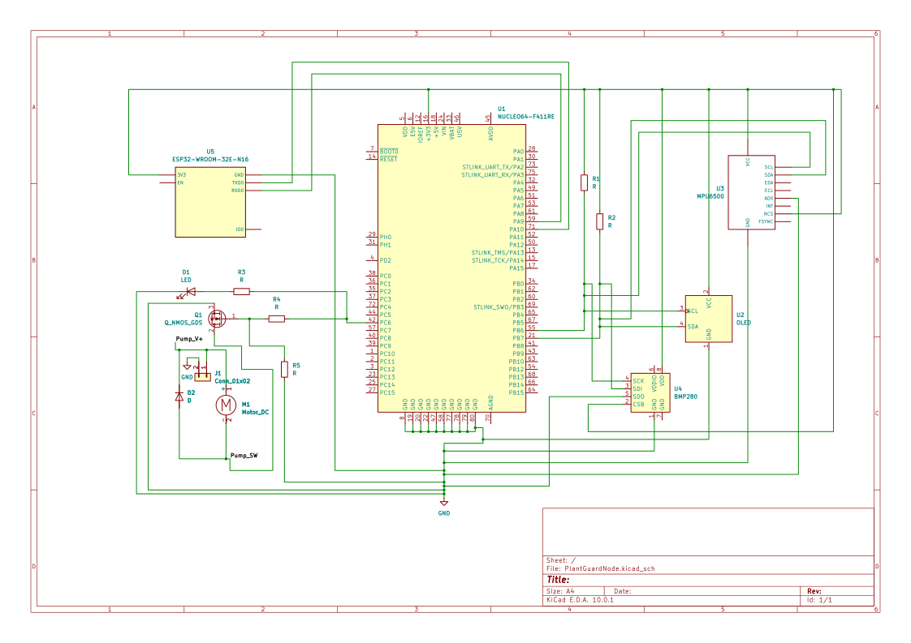
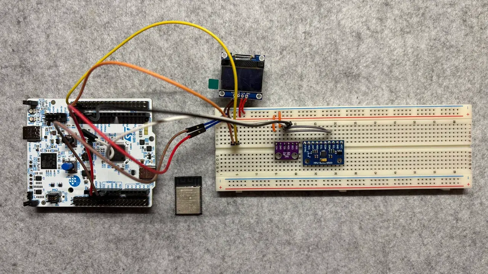

# PlantGuard Node

Embedded Rust smart plant care system with automatic watering and Wi-Fi monitoring.

:::info

**Author**: Andrei-Ştefan FLOREA \
**GitHub Project Link**: https://github.com/UPB-PMRust-Students/fils-project-2026-Andrei-20

:::


## Description

PlantGuard Node is a compact embedded plant monitoring and watering system built around the STMicroelectronics NUCLEO-U545RE-Q development board. The firmware is written in Rust for a `no_std` embedded environment using the Embassy asynchronous framework.

The system monitors soil moisture and environmental conditions, including temperature, relative humidity, and atmospheric pressure. When the measured soil moisture drops below a configured threshold and the water reservoir is not empty, the system activates a small 5V water pump for a controlled interval. A reservoir level sensor prevents the pump from running dry. Local status is shown on an SSD1306 display, while live measurements and manual watering control are exposed through a Wi-Fi-based browser interface.

The network part of the project uses an ESP32-class Wi-Fi module as an external Wi-Fi coprocessor connected to the STM32 over UART. This avoids the need for a LAN cable during the presentation and makes the project easier to demonstrate in a real environment. The Wi-Fi module can either connect to an existing network, such as a phone hotspot, or expose a local access point that allows a phone or laptop to connect directly to the PlantGuard Node.

## Motivation

I chose this project because plant care is a practical problem where embedded systems can provide clear value. Manual watering is often inconsistent and based on estimation, which can lead to both underwatering and overwatering. PlantGuard Node solves this by using measured soil and environmental data instead of guesswork.

From an engineering perspective, the project combines multiple embedded topics in one coherent system: analog sensing through ADC, digital sensor communication over I2C, UART communication with an external Wi-Fi coprocessor, GPIO-based actuation, local display rendering, and asynchronous task coordination in Rust. The change from Ethernet to Wi-Fi also makes the project more realistic for a live demo, because the system can be presented without depending on wired LAN infrastructure. It can be powered, connected from a phone or laptop, and demonstrated as a standalone smart plant-care node.

The project also has a small but important safety aspect: the pump must not run when the reservoir is empty. For that reason, the watering control logic always checks the tank level sensor before activating the pump.

## Architecture

Main software and system components:

- Sensor Acquisition Module: periodically reads the capacitive soil moisture sensor through ADC and the BME280 environmental sensor over I2C.
- Reservoir Safety Module: reads the float switch or water level sensor and reports whether the water reservoir is available or empty.
- Shared Application State: stores the latest soil moisture, temperature, humidity, pressure, reservoir state, pump state, Wi-Fi state, and fault status.
- Watering Control Module: compares soil moisture against a configured threshold and activates the pump only when watering is needed and the reservoir contains water.
- Pump Driver Module: controls the 5V mini water pump through a logic-level N-channel MOSFET and protects the microcontroller side from direct motor current.
- Display Module: renders live measurements and system status on the SSD1306 display using embedded graphics.
- Wi-Fi Communication Module: communicates with the ESP32 Wi-Fi coprocessor over UART and exchanges live measurements, pump state, warnings, and manual control commands.
- Web Control Interface: provides a simple browser-accessible interface for reading live values and triggering manual watering.
- Alert Module: drives a status LED and optional buzzer for local indication of normal, watering, warning, or fault states.
- Timing and Scheduling Layer: uses Embassy tasks and timers to run sensor sampling, display updates, pump control, UART communication, and command handling concurrently.

The planned communication split is:

- STM32 NUCLEO-U545RE-Q: real-time embedded controller, sensor acquisition, watering decision, pump safety logic, local display.
- ESP32 Wi-Fi module: wireless connectivity, browser-accessible web page, HTTP/WebSocket-style interface or simple TCP/serial bridge.
- UART link: structured data exchange between STM32 and ESP32.

This split keeps the safety-critical part on the STM32 and lets the ESP32 handle Wi-Fi, which is a more complex and less deterministic communication subsystem.

How components connect:

```text
                         +--------------------------------+
                         | Phone / Laptop Browser         |
                         | Live Data + Manual Watering    |
                         +---------------^----------------+
                                         |
                                         | Wi-Fi
                                         |
                         +---------------+----------------+
                         | ESP32 Wi-Fi Module             |
                         | AP Mode / Station Mode         |
                         | Web Interface / Serial Bridge  |
                         +---------------^----------------+
                                         |
                                         | UART
                                         |
+------------------+      ADC      +-----+------+
| Capacitive Soil  |-------------> |            |
| Moisture Sensor  |               |            |
+------------------+               |            |
                                   |            |
+------------------+      I2C      |            |
| BME280 Sensor    |<------------->|            |
| Temp/Hum/Press   |               |            |
+------------------+               |            |
                                   |            |
+------------------+      I2C      | STM32      |
| SSD1306 Display  |<------------->| NUCLEO-    |
| Local Status     |               | U545RE-Q   |
+------------------+               |            |
                                   |            |
+------------------+     GPIO IN   |            |
| Tank Level       |-------------> |            |
| Sensor / Switch  |               |            |
+------------------+               |            |
                                   |            |
+------------------+     GPIO OUT  |            |
| Status LED       |<------------- |            |
+------------------+               |            |
                                   |            |
+------------------+     GPIO OUT  |            |
| Optional Buzzer  |<------------- |            |
+------------------+               |            |
                                   +-----+------+
                                         |
                                         | GPIO OUT
                                         v
                              +----------+----------+
                              | Logic-Level         |
                              | N-Channel MOSFET    |
                              +----------+----------+
                                         |
                                         | Switched 5V pump current
                                         v
+------------------+      +-------------+-------------+      +------------------+
| External 5V PSU  |----->| 5V Mini Water Pump         |----->| Tube to Plant    |
| Pump Supply      |      | Flyback Diode Protection   |      | Soil             |
+------------------+      +---------------------------+      +------------------+
```

Control flow:

```text
Sensor Task
  |
  | reads ADC + I2C sensors
  v
Shared Application State
  |
  +--> Display Task -> SSD1306 local status
  |
  +--> Wi-Fi UART Task -> ESP32 -> Browser interface
  |
  +--> Control Task
          |
          | if soil is dry AND reservoir is not empty
          v
       Pump Driver Task
          |
          | activates pump for limited interval
          v
       Stabilization Delay
          |
          v
       Re-check soil moisture
```

Wi-Fi communication flow:

```text
Browser
  |
  | HTTP request / Web UI action
  v
ESP32 Wi-Fi Module
  |
  | UART command, for example:
  | GET_STATE
  | WATER_NOW
  | SET_THRESHOLD=45
  v
STM32 NUCLEO-U545RE-Q
  |
  | UART response, for example:
  | STATE,soil=38,temp=24.1,hum=51,press=1008,tank=OK,pump=OFF
  v
ESP32 Wi-Fi Module
  |
  | updates browser page
  v
Browser
```

The pump is never driven directly from a microcontroller pin. The STM32 GPIO controls only the MOSFET gate. The pump uses an external 5V supply, and the flyback diode protects the switching circuit from inductive voltage spikes generated when the motor is turned off.

## Log

### Week 5 - 11 May

- Finalized the PlantGuard Node project idea and defined the main functional requirements.
- Selected the STM32 NUCLEO-U545RE-Q as the main controller.
- Chose the core peripherals: capacitive soil moisture sensor, BME280 environmental sensor, SSD1306 display, ESP32 Wi-Fi module, water level sensor, and 5V pump.
- Replaced the original Ethernet-based communication plan with a Wi-Fi-based approach to make the project easier to demonstrate without a LAN cable.
- Defined the first version of the system architecture and separated the project into sensing, control, display, Wi-Fi communication, and actuation modules.
- Studied the required peripheral interfaces: ADC for soil moisture, I2C for BME280/SSD1306, UART for the ESP32 Wi-Fi module, and GPIO for pump, LED, buzzer, and tank level sensing.

### Week 12 - 18 May

- Planned the hardware wiring and power separation between the STM32 board, the ESP32 Wi-Fi module, and the external 5V pump supply.
- Designed the pump switching circuit using a logic-level N-channel MOSFET and a flyback diode.
- Planned the UART communication protocol between the STM32 and the ESP32 module.
- Planned the shared application state structure for sensor values, pump state, threshold configuration, Wi-Fi status, and fault status.
- Started firmware structure planning with separate Embassy tasks for sensor sampling, display refresh, pump control, UART communication, and command processing.
- Defined the automatic watering algorithm: read soil moisture, compare with threshold, check tank level, activate pump for a fixed interval, wait for stabilization, then re-check.

### Week 19 - 25 May

- Planned the first bring-up tests for each hardware block independently.
- Prepared the expected test order: GPIO LED test, ADC soil sensor test, I2C BME280 test, I2C SSD1306 display test, UART ESP32 communication test, Wi-Fi browser interface test, then pump MOSFET test with external power.
- Planned the local display layout for showing soil moisture, temperature, humidity, pressure, pump state, reservoir status, and Wi-Fi connection state.
- Planned the Wi-Fi browser interface with live readings and a manual watering command.
- Defined safety behavior for the empty reservoir condition: disable pump activation, show a warning locally, and report the fault through Wi-Fi.
- Planned a fallback demo mode where the ESP32 creates its own Wi-Fi access point, allowing a phone or laptop to connect directly to the PlantGuard Node without relying on classroom network access.

## Hardware

The hardware platform is based on the STM32 NUCLEO-U545RE-Q development board. The system reads soil moisture using an analog capacitive sensor connected to an ADC input. Environmental data is acquired from a BME280 sensor over I2C. A small SSD1306 OLED display shares the I2C bus and provides local system feedback.

Wi-Fi connectivity is provided by an ESP32-class module connected to the STM32 over UART. This module is responsible for wireless communication and the browser-accessible interface. The STM32 remains responsible for sensor acquisition, pump control, safety checks, and local status display.

The watering actuator is a 5V mini water pump controlled through a logic-level N-channel MOSFET. The pump is powered from an external 5V supply, not directly from the STM32 board. A flyback diode is placed across the pump terminals for inductive load protection. A float switch or water level sensor is used as a GPIO input to detect an empty reservoir and prevent unsafe pump operation.

### Schematics



### Hardware Pictures



### Bill of Materials

| Device | Usage | Price |
|--------|--------|-------|
| [STM32 NUCLEO-U545RE-Q](https://www.st.com/en/evaluation-tools/nucleo-u545re-q.html) | Main microcontroller development board | ~125 RON |
| [ESP32-C3 / ESP32-WROOM Wi-Fi Module](https://www.espressif.com/en/products/modules) | Wi-Fi coprocessor for browser interface and wireless monitoring | ~25 RON |
| [Capacitive Soil Moisture Sensor](https://components101.com/sensors/capacitive-soil-moisture-sensor) | Measures soil moisture through ADC | ~10 RON |
| [BME280 Environmental Sensor Module](https://www.bosch-sensortec.com/products/environmental-sensors/humidity-sensors-bme280/) | Measures temperature, humidity, and pressure over I2C | ~25 RON |
| [SSD1306 OLED Display](https://cdn-shop.adafruit.com/datasheets/SSD1306.pdf) | Local display for measurements and system state | ~20 RON |
| [5V Mini Water Pump](https://components101.com/motors/mini-water-pump) | Watering actuator | ~20 RON |
| Logic-Level N-Channel MOSFET | Switches pump current from GPIO control | ~5 RON |
| Flyback Diode | Protects switching circuit from pump inductive kickback | ~1 RON |
| Float Switch / Water Level Sensor | Detects empty water reservoir | ~10 RON |
| Status LED + Resistor | Local visual system indication | ~2 RON |
| Buzzer Module (optional) | Acoustic warning for empty reservoir or fault state | ~5 RON |
| Breadboard | Prototype assembly | ~15 RON |
| Jumper Wires | Electrical connections between modules | ~10 RON |
| External 5V Power Supply | Separate supply for pump current | ~25 RON |
| Tubing for Water Delivery | Carries water from pump to plant | ~10 RON |
| Small Water Container / Reservoir | Stores water for the pump | ~10 RON |
| Misc. Connectors and Mounting Materials | Integration and mechanical support | ~20 RON |

Estimated total: ~338 RON

The prices are approximate component estimates and will be updated until the project is finalized.

## Software

| Library / Tool | Description | Usage |
|---------|-------------|-------|
| [embassy-executor](https://github.com/embassy-rs/embassy) | Asynchronous embedded task executor | Runs concurrent firmware tasks such as sensing, display, UART communication, and pump control |
| [embassy-stm32](https://github.com/embassy-rs/embassy) | STM32 hardware abstraction layer | Access to ADC, I2C, UART, GPIO, interrupts, DMA, and clocks on the STM32U545RE-Q |
| [embassy-time](https://github.com/embassy-rs/embassy) | Embassy timers and delays | Periodic sensor sampling, pump activation interval, stabilization delay, and display refresh timing |
| [embassy-sync](https://github.com/embassy-rs/embassy) | Synchronization primitives | Shared application state between asynchronous tasks |
| [embedded-hal](https://github.com/rust-embedded/embedded-hal) | Common embedded HAL traits | Hardware abstraction for drivers and peripheral access |
| [embedded-hal-async](https://github.com/rust-embedded/embedded-hal) | Async embedded HAL traits | Asynchronous I2C/UART-style driver interfaces where supported |
| [embedded-io-async](https://github.com/rust-embedded/embedded-hal/tree/master/embedded-io-async) | Async I/O traits | UART stream abstraction for communication with the ESP32 module |
| [heapless](https://github.com/rust-embedded/heapless) | Fixed-capacity collections for `no_std` Rust | Buffers, strings, and command frames without dynamic allocation |
| [defmt](https://github.com/knurling-rs/defmt) | Embedded logging framework | Compact firmware logs during development and debugging |
| [defmt-rtt](https://github.com/knurling-rs/defmt) | RTT transport for `defmt` logs | Sends debug logs from the target board to the host |
| [panic-probe](https://github.com/knurling-rs/probe-run/tree/main/panic-probe) | Panic handler for embedded debugging | Reports panics during firmware development |
| [ssd1306](https://github.com/rust-embedded-community/ssd1306) | SSD1306 OLED display driver | Controls the local OLED display over I2C |
| [embedded-graphics](https://github.com/embedded-graphics/embedded-graphics) | 2D graphics library for embedded displays | Renders text, values, and status indicators on the SSD1306 display |
| [bme280](https://crates.io/search?q=bme280) | BME280-compatible Rust sensor driver | Reads temperature, humidity, and atmospheric pressure over I2C |
| [static-cell](https://github.com/embassy-rs/static-cell) | Safe static initialization helper | Stores long-lived Embassy driver state without a heap |
| [portable-atomic](https://github.com/taiki-e/portable-atomic) | Atomic operations support for embedded targets | Useful dependency for some async/shared-state embedded crates |
| [cortex-m](https://github.com/rust-embedded/cortex-m) | Low-level Cortex-M support | Core ARM Cortex-M functionality |
| [cortex-m-rt](https://github.com/rust-embedded/cortex-m-rt) | Cortex-M runtime | Startup/runtime support for bare-metal Rust firmware |
| ESP32 AT firmware or custom ESP32 firmware | Wi-Fi-side firmware | Provides AP/station mode, browser interface, and UART bridge to STM32 |
| Simple UART text protocol | Application protocol between STM32 and ESP32 | Transfers state updates and commands such as `GET_STATE`, `WATER_NOW`, and `SET_THRESHOLD` |

The previous Ethernet-specific items are intentionally removed:

- `W5500 Ethernet module` is replaced by an ESP32 Wi-Fi module.
- `SPI W5500 communication` is replaced by UART communication.
- `embassy-net-wiznet` is removed because it is specific to Wiznet Ethernet controllers.
- `embassy-net` is no longer mandatory on the STM32 side if the ESP32 handles the Wi-Fi and web server. The STM32 can remain focused on deterministic sensing, control, and UART communication.

## Links


1. [Embassy framework](https://embassy.dev)
2. [Embassy GitHub repository](https://github.com/embassy-rs/embassy)
3. [STM32 NUCLEO-U545RE-Q product page](https://www.st.com/en/evaluation-tools/nucleo-u545re-q.html)
4. [Espressif ESP32 Modules](https://www.espressif.com/en/products/modules)
5. [ESP-AT Firmware Documentation](https://docs.espressif.com/projects/esp-at/en/latest/)
6. [BME280 Environmental Sensor](https://www.bosch-sensortec.com/products/environmental-sensors/humidity-sensors-bme280/)
7. [SSD1306 OLED Display Datasheet](https://cdn-shop.adafruit.com/datasheets/SSD1306.pdf)
8. [embedded-graphics documentation](https://docs.rs/embedded-graphics)
9. [Rust Embedded Book](https://docs.rust-embedded.org/book/)
10. [Capacitive Soil Moisture Sensor Reference](https://components101.com/sensors/capacitive-soil-moisture-sensor)
11. [Mini Water Pump Reference](https://components101.com/motors/mini-water-pump)

