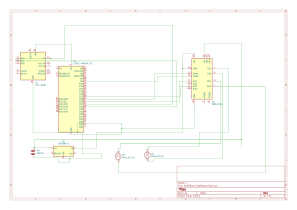

# Self-Balancing drone
An autonomous two‑wheel platform featuring real‑time stabilization and Rust‑based embedded control.

:::info

**Author:** Jidovu Andrei‑Bogdan  \
**GitHub Project Link:** https://github.com/UPB-PMRust-Students/fils-project-2026-Moti452

:::

---

# Description
This project implements a two‑wheel self‑balancing robot built entirely using **Rust** on an **ESP32** microcontroller.  
The system uses an **MPU6050** IMU to measure tilt angle and angular velocity, while a pair of **156:1 Metal Gearmotor 20D×44L mm 6V CB** motors provide actuation.  
A PID control loop written in Rust continuously adjusts motor speed to maintain balance.

The robot is designed as a compact demonstration of real‑time control, embedded Rust programming, and sensor‑driven actuation.  
Optional BLE communication can be added using the `esp-radio` and `trouble-host` crates, enabling wireless telemetry or remote control.

---

# Motivation
I chose this project because I wanted to explore real‑time control systems using Rust.  
Self‑balancing robots are a classic challenge that combine physics, control theory, and embedded programming into a single, elegant system.

Unlike traditional Arduino‑based balancing robots, this project demonstrates that Rust can be used for precise timing, safe concurrency, and low‑level hardware access.

The robot is intended as a prototype for future small‑scale reconnaissance robots — a compact ground‑based drone that is harder to detect — but it can also be a fun educational platform.

---

# Architecture

## Main Components

### Sensing Layer
- **MPU6050 IMU**  
  Measures pitch angle and angular velocity using accelerometer + gyroscope fusion.

### Control Core
- **ESP32 running Rust**  
  Executes the PID loop, reads IMU data over I²C, and drives the motors using PWM.  
  Optional BLE support via `esp-radio` + `trouble-host`.

### Actuation Layer
- **Two 156:1 Metal Gearmotor 20D×44L mm 6V CB motors**  
- **Motor driver** for direction and PWM speed control

### Power Layer
- **2× 18650 Li‑ion cells**  
- **Buck converter** for stable 5V logic power  
- Motors powered directly from battery rail for high current capability

---

# Component Connection

### Sensor Link (I²C)
Connects the MPU6050 to the ESP32 and provides real‑time angle and angular velocity data.

### Control Loop (Rust + PID)
Runs at a fixed update rate.  
Combines IMU data with PID output to compute motor commands.

### Execution Link (PWM/GPIO)
Connects the ESP32 to the motor driver.  
Controls motor speed and direction.

### Optional Wireless Link (BLE)
If enabled, uses:
- `esp-radio` for radio stack  
- `trouble-host` for BLE host  

Allows telemetry or remote control.

---

# Log

### Week 23 – 29 March
Planned the project and defined the architecture.

### Week 30 March – 5 April
Got the idea approved and ordered all required components.

### Week 6 – 12 April
Waiting for components, started looking for wheels as they were the last component needed.

### Week 13 – 19 April
Found a 3D schematic for the wheels and got it printed.  
Still waiting for my buck converter in order to start testing.

### Week 20 – 26 April
Waiting week, buck converter got lost and had to order a new one but eventually arrived.

### Week 27 April – 3 May
Testing week, the buck converter has a 0.03V error, but that should be fine.
The robot chassis was supposed to be a cardboard box, but cardboard can't hold the weight, I have to learn how to 3d model a box

### Week 4 – 10 May
3d moddeling and learning week, found out how an "inverted pendulum" works, what formulas i should use, and finally finishing the last version of my robot chassis

### Week 11 – 17 May
Work week- the robot finally works. The code flashes fine, tries to balance but fails, i seem to be getting close. It could be the hardware or software. Online forums keep saying that a 60rpm motor is doable but hard, so i ordered 500 rpm motors to be sure. 

### Week 18 – 24 May
Robot finally works. The 60rpm motors worked by using a different "Bang-bang" logic compared to other robots. This makes the robot look more chaotic, but gives it more speed when controlling it.

By the end of the week everything went downhill and the robot suddently stopped working. I suspected it's the chinese motor driver, but after replacing it nothing happened. I tested the motors to find out they worn out and had HUGE striction. New motors seem to need new logic and a lighter box. No time left since i didn't take into consideration the fact that such reliable motors would wear this qucikly. The problem might've been the bang-bang logic the motors weren't designed for.

---

# Hardware

# Bill of Materials

| Device | Usage | Price |
|--------|--------|--------|
| ESP32 DEVKIT V1 | Main control unit running Rust | X lei |
| MPU6050 | IMU for angle measurement | X lei |
| 156:1 Metal Gearmotor 20D×44L mm 6V CB (2 pcs) | Actuation | X lei |
| Motor driver | PWM motor control | X lei |
| 2× 18650 Li‑ion cells | Power | X lei |
| Buck converter | 5V regulation | X lei |
| 3D‑printed wheels | Locomotion | X lei |
| Jumper wires | Connections | X lei |
| Breadboard | Prototyping | X lei |

Prices not added, i lost the reciepts, but the robot with all the fails can easily reach 800 ron. It could've been doable with less, but I took it as more of a learning project and the sum doesn't bother me since i felt like i actually learned some valuable concepts in robotic engineering.

---

# Software

| Library | Description | Usage |
|---------|-------------|--------|
| Rust | Systems programming language | Core implementation |
| esp-hal | ESP32 HAL | GPIO, I²C, PWM |
| embedded-hal | Hardware abstraction | Peripheral interfaces |
| esp-idf-sys / esp-wifi | Optional WiFi/BLE support | Wireless |
| esp-radio | ESP32 radio stack | BLE (optional) |
| trouble-host | BLE host | BLE (optional) |
| nalgebra / micromath | Math utilities | PID + filtering |
| heapless | Fixed‑size data structures | No‑std buffers |

