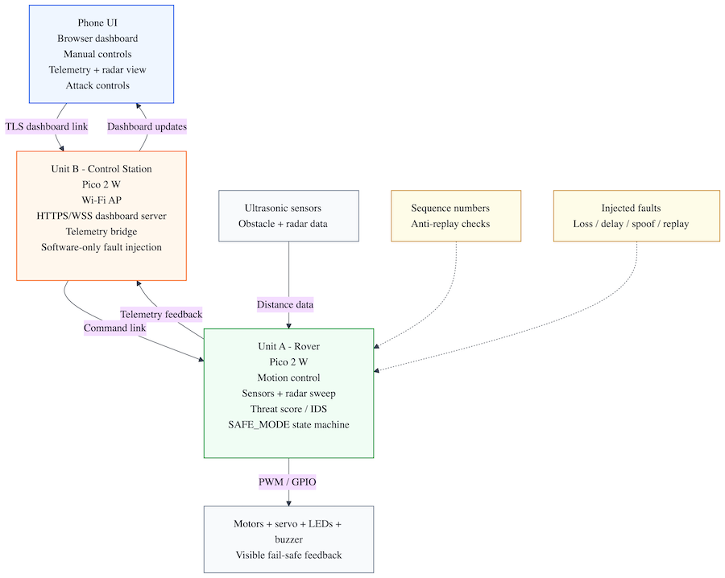
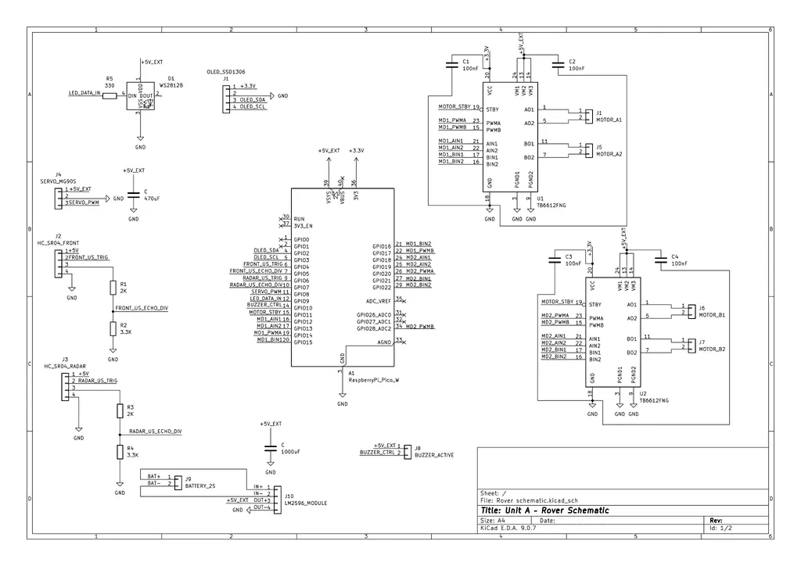
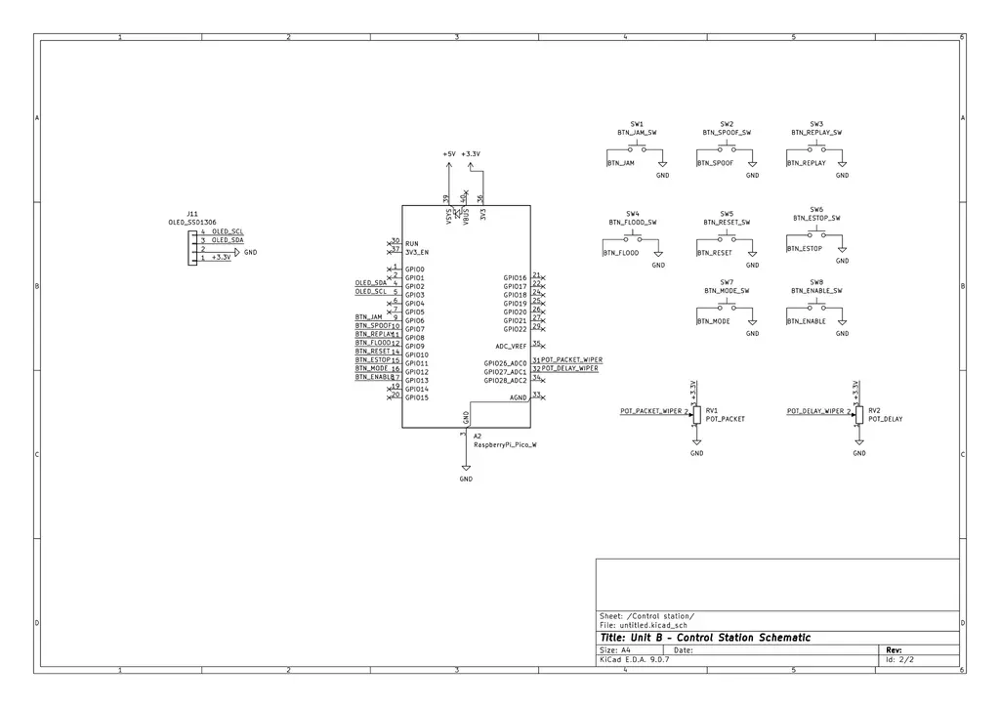
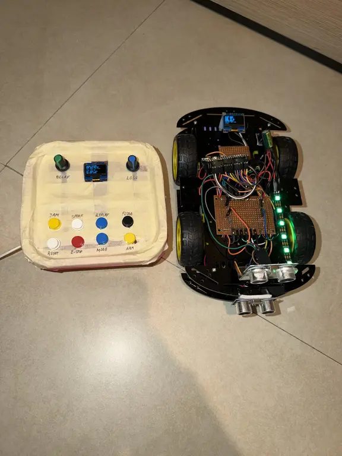

# Secure Autonomous Rover Under Simulated Electronic Warfare

A cyber-resilient autonomous rover system with a secure browser dashboard, live telemetry, and software-only communication fault simulation.

:::info 

**Author**: Andrei-Cristian Popescu \
**Group**: 1221EC \
**GitHub Project Link**: https://github.com/UPB-PMRust-Students/project-2026-YouFoundTheDev
:::

<!-- do not delete the \ after your name -->

## Description

This project implements a secure autonomous ground rover built as a two-node embedded Rust system with a browser-based dashboard. The platform is split into three roles: **Unit A - the rover**, **Unit B - the control station**, and a **browser dashboard** used from a phone or laptop.

The rover can operate in manual mode or autonomous patrol mode, detect nearby obstacles, perform a radar-style ultrasonic sweep, and react to degraded or suspicious communication by entering a protected fail-safe state.

The control station is the supervisory embedded node. It creates the local wireless network, maintains the station-to-rover command and telemetry path, exposes physical controls, and injects **software-only fault conditions** such as packet loss, delay, spoofing, replay, and flooding. These conditions simulate hostile or degraded communication in a safe, legal, and fully controlled way. The project does **not** perform RF jamming, real-world interference, or unauthorized electronic attack.

A core design goal is to separate **transport security** from **embedded resilience logic**. In the current implementation, the **browser-to-station path** runs through a secure HTTPS development bridge/service built in `station-sim`. The **station-to-rover link** remains a lightweight embedded UDP channel with anti-replay checks, sequence validation, timeouts, anomaly detection, and SAFE_MODE recovery behavior.

Another important change from the earlier plan is that the **control station is now the single command authority**. The final control flow is:

- `dashboard -> station authority -> rover`
- `local station controls -> same station authority -> rover`

The dashboard no longer acts as a second direct packet source to the rover.

The current final result is a working system that demonstrates autonomy, telemetry, visual threat feedback, communication fault simulation, intrusion-style detection logic, and safe recovery under abnormal communication conditions.

## Motivation

I chose this project because it combines several areas that are both technically challenging and highly relevant in modern embedded systems: robotics, wireless communication, secure interfaces, telemetry, autonomy, and resilience against abnormal or malicious traffic. I wanted to build something that feels closer to a real cyber-physical system than a simple student rover.

What makes the project especially interesting is the combination of **physical behavior** and **network security concepts**. The rover does not only receive commands and move, it must also evaluate whether communication still looks trustworthy, react when the link degrades, and protect itself by entering a safe operating mode. This mirrors real-world concerns in connected vehicles, field robotics, industrial robots, and unmanned systems, where the device must continue behaving safely even when communication becomes unreliable.

Another motivation was to create a project with strong demo value. The audience can see the rover moving, see the radar sweep, interact with the secure dashboard, inject faults from the control station, and observe the system transition through `READY`, `UNDER_ATTACK`, and `SAFE_MODE` states. This makes the project both technically serious and easy to demonstrate.

## Architecture 

The system is intentionally divided into three roles so that the implementation and demo remain easy to understand.

### Main architecture components

**Browser dashboard**  
The browser is the user-facing interface. In the current demo path it connects to a local HTTPS bridge/service running from `station-sim`, which then talks to the station firmware. This is a real TLS-protected browser connection in the current working development setup.

Responsibilities:
- manual driving controls
- mode switching
- live telemetry display
- event log
- radar visualization
- attack simulation controls and sliders
- system status monitoring

**Unit B - Control Station**  
The control station is the embedded supervision and fault-injection hub. It creates the local Wi-Fi access point, runs the embedded station runtime, receives browser commands through the secure bridge/service, merges them with local physical controls, and produces the single authoritative rover command stream.

Responsibilities:
- hosts local Wi-Fi access point
- acts as the single command authority
- reads 8 local buttons and 2 potentiometers
- maintains the lightweight UDP rover link
- receives rover telemetry
- forwards station/rover status back to the dashboard bridge
- injects packet loss, delay, spoof, replay, and flood conditions
- provides local status on its own OLED screen

**Unit A - Rover**  
The rover is the autonomous and safety-critical node. It executes motion control, sensing, radar sweep logic, obstacle avoidance, communication monitoring, threat scoring, and recovery logic.

Responsibilities:
- manual and autonomous motion
- front obstacle detection
- servo-mounted radar sweep
- telemetry generation
- state machine execution
- anomaly detection on incoming commands
- visual and audible threat signaling
- SAFE_MODE entry and recovery

### High-level architecture diagram



The diagram shows the complete communication path of the system. The browser dashboard communicates securely with the dashboard bridge/service, which passes commands into the station runtime. The station runtime is the single authority that sends lightweight embedded commands to the rover. The rover validates received commands using sequence numbers and replay protection, processes sensor data, controls the motors and feedback devices, and reports telemetry back through the station.

Unit B can also inject software-only communication faults such as packet loss, delay, spoofing, and replay. These simulated conditions are used only to test the rover resilience logic and do not involve real RF jamming or unauthorized interference.

### Functional flow

1. The browser opens the secure dashboard over HTTPS.
2. The dashboard bridge/service forwards browser commands into the station runtime.
3. Local station buttons and potentiometers also update the same station runtime.
4. The station sends the single authoritative command stream to the rover over the embedded Wi-Fi UDP link.
5. The rover validates commands, updates its state machine, and publishes telemetry.
6. The station receives telemetry and exposes it back to the secure dashboard layer.
7. Fault conditions can be enabled from the station side for resilience testing.
8. If thresholds are exceeded, the rover enters `UNDER_ATTACK` or `SAFE_MODE`.
9. When communication stabilizes, the rover recovers without requiring a reboot.

### Expected demo behavior

- In normal mode, the rover can be driven manually or switched into patrol mode.
- The radar sensor scans the environment and the dashboard displays the sweep.
- When communication faults are injected, the rover detects the anomalies.
- LEDs, buzzer, OLED messages, and dashboard alerts indicate rising threat level.
- The rover limits or changes its behavior in response to detected faults.
- In severe cases, the rover enters `SAFE_MODE`.
- When conditions normalize, the rover returns to normal operation safely.

### Security and resilience model

This project uses two complementary layers.

**1. Secure dashboard access**
- HTTPS / TLS for browser access to the dashboard bridge/service
- authenticated HTTPS requests for dashboard commands and telemetry polling
- keeps the browser path separate from the embedded rover protocol

**2. Lightweight embedded resilience**
- compact rover command packets
- rolling sequence counters
- anti-replay validation
- timeout detection
- rate anomaly detection
- payload sanity checks
- fail-safe state transitions

This separation keeps the system realistic for an embedded student project while still addressing the requirement for standard secure transport.

## Log

<!-- write your progress here every week -->

### Week 5 

- Chose the project direction: a secure autonomous rover under simulated electronic attack.
- Defined the overall concept around a rover, a control station, and a browser dashboard.
- Established the main demo goal: the rover should operate normally, then react visibly and safely to communication faults.
- Selected Raspberry Pi Pico 2 W for both embedded nodes because Wi-Fi support is essential to the architecture.

### Week 10 

- Finalized the hardware list for both units.
- Defined the main sensing and feedback modules for the rover: chassis, motor drivers, ultrasonic sensors, servo, OLED, LED strip, and buzzer.
- Defined the control station interaction elements: OLED, buttons, and potentiometers for configurable attack simulation.
- Documented power regulation constraints, common ground requirements, and safe interconnection rules.
- Exported the KiCad schematics for both embedded nodes and added them to the project documentation.
- Integrated teacher feedback by planning TLS for the dashboard channel between browser and control station.

### Week 13

- Defined the embedded software stack in Rust for async tasks, networking, telemetry, and UI rendering.
- Refined the resilience model around replay, spoof, delay, loss, and flood simulation.
- Clarified the split between secure transport and lightweight rover-side anomaly detection.
- Defined the target demo as a full detection-to-recovery cycle with visible system state transitions.

### Final integration update

- Completed and tested the rover firmware runtime on Pico 2 W.
- Completed and tested the control station firmware runtime on Pico 2 W.
- Brought up the wireless station-to-rover link with the station as Wi-Fi AP and the rover as client.
- Implemented the working secure dashboard bridge/service through `station-sim`.
- Refactored the system so the station is the single command authority.
- Completed the end-to-end demo path:
  - browser dashboard
  - secure bridge/service
  - station runtime
  - rover link
  - rover telemetry back to browser

## Hardware

The hardware is organized into two physical embedded devices, plus one browser-based software interface.

### Unit A - Rover

The rover is the main autonomous platform. It uses a Raspberry Pi Pico 2 W as the main controller and integrates a mobile chassis, motor drivers, sensing modules, and local feedback peripherals.

Main hardware for Unit A:
- Raspberry Pi Pico 2 W
- 4WD TT chassis with motors
- 2x TB6612FNG motor driver modules
- 2x HC-SR04 ultrasonic sensors
- 1x MG90S servo
- 1x 0.96 inch SSD1306 I2C OLED display
- 1x WS2812B LED strip
- 1x active buzzer module
- 18650 battery pack or equivalent rover power source
- LM2596 buck converter
- wiring, connectors, prototyping materials, resistors, capacitors, and headers

Purpose of Unit A:
- movement and patrol
- obstacle detection
- radar sweep sensing
- telemetry generation
- threat indication
- fail-safe state transitions

### Unit B - Control Station

The control station is a second embedded node built around another Raspberry Pi Pico 2 W. It is not just a remote control; it is the supervisory node and software fault-injection hub.

Main hardware for Unit B:
- Raspberry Pi Pico 2 W
- 1x 0.96 inch SSD1306 I2C OLED display
- 8x push buttons for attack mode and control actions
- 2x 10k potentiometers with knobs for loss percentage and delay strength
- USB power bank or equivalent 5 V supply
- enclosure, panel cutouts, connectors, and prototyping materials

Purpose of Unit B:
- hosts Wi-Fi access point
- runs the station authority runtime
- bridges the secure dashboard/service path to the embedded rover link
- forwards telemetry
- injects loss / delay / spoof / replay / flood faults
- provides physical operator controls

### Browser dashboard

The user interface is implemented as a browser-accessible dashboard. It does not require a native mobile application. In the current development/demo setup, the browser connects over HTTPS to the local dashboard bridge/service, which then communicates with the station runtime.

Functions:
- secure access through HTTPS
- mode switching
- manual drive commands
- telemetry display
- event log
- radar display
- attack simulation control UI
- system status visualization

### Power and protection notes

- HC-SR04 `ECHO` lines must be reduced to safe GPIO voltage levels before connection to the Pico.
- The LM2596 output must be adjusted and verified before powering the rover electronics.
- The WS2812B data line should use a series resistor and the LED rail should include bulk capacitance.
- All grounds must be common across motor drivers, sensors, MCU boards, and power regulation.
- The rover power stage should be tested separately before connecting all logic components.
- Mechanical mounting should be finalized only after an electronics fit test.

### Schematics

The hardware design is split into two KiCad sheets, matching the two physical embedded nodes of the project. Unit A contains the rover electronics, while Unit B contains the control station electronics used for operator input and software fault simulation.

#### Unit A - Rover KiCad schematic



The rover schematic connects the Raspberry Pi Pico 2 W to the complete mobile platform: two TB6612FNG motor drivers for the four DC motors, two HC-SR04 ultrasonic sensors, the MG90S radar servo, the SSD1306 OLED display, the WS2812B status LED, the active buzzer, and the external power regulation stage.

The design keeps the high-current motor supply and the Pico logic supply explicit, while sharing a common ground between the battery pack, LM2596 module, motor drivers, sensors, and controller. The HC-SR04 echo signals are protected with voltage dividers before reaching Pico GPIO pins, and the WS2812B data input uses a series resistor.

#### Unit B - Control Station KiCad schematic



The control station schematic focuses on the user-facing hardware for the embedded station node. A second Raspberry Pi Pico 2 W drives an SSD1306 OLED display, reads the physical buttons, and samples two potentiometers that configure packet loss and delay intensity. The buttons are wired to ground and use internal pull-ups in firmware.

In the current working build, the control station uses the OLED, 8 buttons, and 2 potentiometers. Older optional control ideas such as a rotary encoder are not part of the active implementation path.

This separation keeps the rover electronics dedicated to movement, sensing, and fail-safe behavior, while the control station handles the station runtime and the dashboard bridge integration path.

#### Rover pin map

| Pico pin | Net | Destination |
|---|---|---|
| GP0 | `UART0_TX` | UART debug header TX |
| GP1 | `UART0_RX` | UART debug header RX |
| GP2 | `OLED_SDA` | Rover OLED SDA |
| GP3 | `OLED_SCL` | Rover OLED SCL |
| GP4 | `FRONT_US_TRIG` | Front HC-SR04 TRIG |
| GP5 | `FRONT_US_ECHO_DIV` | Front HC-SR04 ECHO after divider |
| GP6 | `RADAR_US_TRIG` | Radar HC-SR04 TRIG |
| GP7 | `RADAR_US_ECHO_DIV` | Radar HC-SR04 ECHO after divider |
| GP8 | `SERVO_PWM` | MG90S signal |
| GP9 | `LED_DATA_IN` | WS2812B data through 330Ω resistor |
| GP10 | `BUZZER_CTRL` | Active buzzer signal |
| GP11 | `MOTOR_STBY` | Shared STBY for both TB6612 modules |
| GP12 | `MD1_AIN1` | TB6612 #1 AIN1 |
| GP13 | `MD1_AIN2` | TB6612 #1 AIN2 |
| GP14 | `MD1_PWMA` | TB6612 #1 PWMA |
| GP15 | `MD1_BIN1` | TB6612 #1 BIN1 |
| GP16 | `MD1_BIN2` | TB6612 #1 BIN2 |
| GP17 | `MD1_PWMB` | TB6612 #1 PWMB |
| GP18 | `MD2_AIN1` | TB6612 #2 AIN1 |
| GP19 | `MD2_AIN2` | TB6612 #2 AIN2 |
| GP20 | `MD2_PWMA` | TB6612 #2 PWMA |
| GP21 | `MD2_BIN1` | TB6612 #2 BIN1 |
| GP22 | `MD2_BIN2` | TB6612 #2 BIN2 |
| GP28 | `MD2_PWMB` | TB6612 #2 PWMB |

#### HC-SR04 echo protection

The HC-SR04 `ECHO` pin gives a 5V signal, so I should not connect it directly to a Pico GPIO. For both ultrasonic sensors I used a simple voltage divider:

```text
HC-SR04 ECHO ── 2.0kΩ ── ECHO_DIV ── 3.3kΩ ── GND
                         │
                         └── Pico GPIO input
```

This brings the echo signal down to about 3.1V, which is safe enough for the Pico input pins.

#### Control station pin map

| Pico pin | Net | Destination |
|---|---|---|
| GP0 | `UART0_TX` | UART debug TX |
| GP1 | `UART0_RX` | UART debug RX |
| GP2 | `OLED_SDA` | Station OLED SDA |
| GP3 | `OLED_SCL` | Station OLED SCL |
| GP6 | `BTN_JAM` | JAM / LOSS button to GND |
| GP7 | `BTN_SPOOF` | SPOOF button to GND |
| GP8 | `BTN_REPLAY` | REPLAY button to GND |
| GP9 | `BTN_FLOOD` | FLOOD button to GND |
| GP10 | `BTN_RESET` | RESET button to GND |
| GP11 | `BTN_ESTOP` | E-STOP / SAFE button to GND |
| GP12 | `BTN_MODE` | MODE button to GND |
| GP13 | `BTN_ENABLE` | ENABLE / ARM button to GND |
| GP26 | `POT_PACKET_WIPER` | Packet loss potentiometer wiper |
| GP27 | `POT_DELAY_WIPER` | Delay potentiometer wiper |
| PIN_23 (internal) | `CYW43_PWR` | Pico 2 W internal Wi-Fi power control |
| PIN_24 (internal) | `CYW43_DIO` | Pico 2 W internal Wi-Fi data line |
| PIN_25 (internal) | `CYW43_CS` | Pico 2 W internal Wi-Fi chip-select |
| PIN_29 (internal) | `CYW43_CLK` | Pico 2 W internal Wi-Fi clock line |

Buttons use internal pull-ups in firmware. Each button shorts its GPIO net to `GND` when pressed. Potentiometer high side connects to `+3V3`, low side to `GND`, and wiper to the ADC GPIO.

The Wi-Fi lines listed above are internal Pico 2 W board connections used by the CYW43 firmware path; they are not external panel controls.

### Final hardware



This picture shows the current final hardware used for the project demo. It includes the rover platform and the control station hardware that are used in the working implementation path.

### Bill of Materials

Prices are estimated Romanian retail prices and can change. Shipping is not included.

| Device | Usage | Price |
|--------|-------|-------|
| [2x Raspberry Pi Pico 2 W](https://www.optimusdigital.ro/ro/placi-raspberry-pi/13327-raspberry-pi-pico-2-w.html) | Main MCU for the rover and control station | [79.32 RON](https://www.optimusdigital.ro/ro/placi-raspberry-pi/13327-raspberry-pi-pico-2-w.html) |
| [2x TB6612FNG dual H-bridge motor driver module](https://share.temu.com/qUuEGUbVpzB) | Independent motor control for the 4WD rover | [26.54 RON](https://share.temu.com/qUuEGUbVpzB) |
| [4WD Smart Car chassis with 4 motors](https://ty.gl/tb3z3g37d8cmo) | Mobile platform for the rover unit | [72.99 RON](https://ty.gl/tb3z3g37d8cmo) |
| [2x HC-SR04 ultrasonic sensor](https://cleste.ro/senzor-ultrasonic-hc-sr04.html) | Front obstacle sensing and radar sweep sensing | [12.34 RON](https://cleste.ro/senzor-ultrasonic-hc-sr04.html) |
| [MG90S metal gear servo](https://share.temu.com/lVqiH94LsrB) | Rotates the radar ultrasonic sensor | [15.03 RON](https://share.temu.com/lVqiH94LsrB) |
| [2x OLED SSD1306 I2C 0.96 inch display](https://share.temu.com/QjHlDN7hW7B) | Local status display on the rover and control station | [13.68 RON](https://share.temu.com/QjHlDN7hW7B) |
| [WS2812 RGB addressable LED strip 10 cm](https://sigmanortec.ro/Banda-LED-adresabila-RGB-WS2812-60led-m-IP67-10cm-p166125661) | Threat visualization on the rover | [3.25 RON](https://sigmanortec.ro/Banda-LED-adresabila-RGB-WS2812-60led-m-IP67-10cm-p166125661) |
| [Active buzzer 5 V](https://sigmanortec.ro/Buzzer-activ-5v-p126421597) | Audible warning and safe mode alert | [1.11 RON](https://sigmanortec.ro/Buzzer-activ-5v-p126421597) |
| [10x momentary push buttons](https://share.temu.com/IPk8bltH9TB) | Station control and fault-mode buttons | [18.49 RON](https://share.temu.com/IPk8bltH9TB) |
| [2x 10k potentiometer ](https://sigmanortec.ro/Potentiometru-1K-5K-10K-20K-50K-100K-p136286400) | Packet loss and delay configuration on the control station | [2.62 RON](https://sigmanortec.ro/Potentiometru-1K-5K-10K-20K-50K-100K-p136286400) |
| [18650 holder 2S with switch](https://sigmanortec.ro/Suport-baterie-18650-2S-cu-capac-si-intrerupator-p192040353) | Battery holder for the rover | [7.41 RON](https://sigmanortec.ro/Suport-baterie-18650-2S-cu-capac-si-intrerupator-p192040353) |
| [Set 2x 18650 Li-Ion cells](https://ty.gl/97oqra0r3n1zy) | Mobile battery supply for the rover | [28.50 RON](https://ty.gl/97oqra0r3n1zy) |
| [LM2596 adjustable DC-DC step-down module](https://sigmanortec.ro/Modul-coborator-tensiune-adjustabil-LM2596-DC-DC-4-5-40V-3A-p134532509) | Stable 5V power rail for rover electronics | [6.69 RON](https://sigmanortec.ro/Modul-coborator-tensiune-adjustabil-LM2596-DC-DC-4-5-40V-3A-p134532509) |
| [2x perfboard / prototype board](https://sigmanortec.ro/Placa-PCB-prototipare-o-fata-5x7-p159914959) | Integration and soldering | [7.00 RON](https://sigmanortec.ro/Placa-PCB-prototipare-o-fata-5x7-p159914959) |
| [Jumper wires / wire set](https://share.temu.com/o1hsXV5KYrB) | Wiring and prototyping | [17.84 RON](https://share.temu.com/o1hsXV5KYrB) |
| [Headers and connectors set](https://sigmanortec.ro/Conector-Wago-3-Pini-p141736866) | Module and sensor connectors | [10.12 RON](https://sigmanortec.ro/Conector-Wago-3-Pini-p141736866) |
| [Resistor assortment](https://sigmanortec.ro/kit-rezistori-30-valori-20-bucati) | Voltage dividers, pull-ups, and LED data resistor | [15.16 RON](https://sigmanortec.ro/kit-rezistori-30-valori-20-bucati) |
| [Capacitor assortment](https://sigmanortec.ro/Kit-300-condensatori-ceramici-multistrat-10-valori-50V-cutie-p184736410) | Decoupling and bulk capacitors | [46.79 RON](https://sigmanortec.ro/Kit-300-condensatori-ceramici-multistrat-10-valori-50V-cutie-p184736410) |
| **Estimated total** | Including shipping | **384.88 RON** |

## Software

The software stack is organized around three major concerns:
1. embedded runtime and peripherals
2. secure browser dashboard bridge/service
3. resilience and safety logic

### Embedded software architecture

The current software is split into three main code areas:

- **`rover-core`** for shared rover-side protocol, state, resilience, and telemetry logic
- **rover firmware** for the embedded Unit A runtime
- **station firmware + station runtime logic** for Unit B, including authority handling and UDP communication
- **`station-sim` + dashboard assets** for the current secure browser bridge/service

On the embedded side, the runtime is structured around async tasks and periodic servicing for:
- motor control
- ultrasonic sensing
- radar sweep
- telemetry publishing
- rover link monitoring
- station Wi-Fi / UDP communication
- OLED updates
- buzzer and LED feedback

### Implemented rover state machine

The rover behavior is centered on the following implemented states:
- `BOOT`
- `READY`
- `MANUAL`
- `PATROL`
- `UNDER_ATTACK`
- `SAFE_MODE`
- `RECOVERY`

This structure makes system behavior explicit and easier to debug, demonstrate, and document.

### Networking model

**Browser ↔ secure dashboard bridge/service**
- HTTPS for dashboard delivery
- authenticated HTTPS requests for control and telemetry in the current demo path
- TLS is currently implemented in the local bridge/service, not directly on the Pico station firmware

**Station ↔ Rover**
- station creates the Wi-Fi AP
- rover joins as a client
- lightweight embedded UDP messaging
- compact command and telemetry packets
- sequence validation
- replay rejection
- timeout handling
- degraded-link detection
- transition to safe behavior on suspicious traffic

### Command packet structure

The command path is currently implemented around compact packets containing sequence information, timing information, control payload, and validation logic. The rover rejects packets with replayed or invalid sequence behavior, suspicious timing patterns, or malformed payloads.

### Threat scoring logic

The rover increases its threat score when it detects replayed packets, missing packets, excessive command rate, long delays, or invalid command payloads. Low threat scores only trigger warnings, medium scores enter `UNDER_ATTACK`, and high scores force `SAFE_MODE`.

### Software libraries

| Library | Description | Usage |
|---------|-------------|-------|
| [embassy](https://embassy.dev/) | Async embedded framework | Core async task execution on both embedded nodes |
| [embassy-rp](https://github.com/embassy-rs/embassy) | HAL support for Raspberry Pi Pico and Pico 2 W class boards | GPIO, PWM, timers, I2C, and board peripheral access |
| [embassy-time](https://docs.embassy.dev/embassy-time/) | Async timing utilities | Scheduling, timeouts, periodic telemetry, and recovery timers |
| [embedded-hal](https://github.com/rust-embedded/embedded-hal) | Common embedded hardware abstraction traits | Driver compatibility and abstraction for sensors and peripherals |
| [cyw43](https://github.com/embassy-rs/embassy/tree/main/cyw43) | Wireless driver support for Pico W class boards | Wi-Fi management for the station and rover communication model |
| [embassy-net](https://github.com/embassy-rs/embassy/tree/main/embassy-net) | Embedded network stack | Station↔rover UDP communication |
| [static_cell](https://crates.io/crates/static_cell) | Static initialization helper | Safe initialization of static resources used by async embedded tasks |
| [heapless](https://github.com/rust-embedded/heapless) | Fixed-capacity data structures | Deterministic buffers for no_std command packets and telemetry |
| [serde](https://serde.rs/) | Serialization framework | Structured command and telemetry representation |
| [postcard](https://crates.io/crates/postcard) | Compact no_std serialization format | Lightweight rover command and telemetry packets |
| [ssd1306](https://crates.io/crates/ssd1306) | OLED display driver | Local status display on the rover and control station |
| [embedded-graphics](https://github.com/embedded-graphics/embedded-graphics) | 2D graphics library for embedded displays | Text, indicators, and simple status UI rendering |
| [smart-leds](https://crates.io/crates/smart-leds) | Addressable LED abstraction crate | Threat status visualization using WS2812 LEDs |
| [ws2812-pio](https://crates.io/crates/ws2812-pio) | WS2812 driver using RP2040/RP2350 PIO | Low-level rover LED strip control |
| [rustls](https://github.com/rustls/rustls) | TLS library | HTTPS dashboard bridge/service for the current development path |
| [defmt](https://defmt.ferrous-systems.com/) | Efficient embedded logging framework | Compact debug logs during firmware development |
| [probe-rs](https://probe.rs/) | Flashing and debugging tool | Firmware deployment and hardware debugging |
| [cargo](https://doc.rust-lang.org/cargo/) | Rust build system and package manager | Building and managing the Rust firmware projects |
| [git](https://git-scm.com/) | Version control system | Source tracking and milestone progress |

### Software deliverables

The software side of the project currently demonstrates:
- embedded Rust on two cooperating physical nodes
- secure browser control through the development bridge/service
- live telemetry and radar visualization
- injected communication anomalies
- anomaly detection and threat scoring
- visible fail-safe behavior
- recovery without reboot
- single-command-authority station control flow

## Links

1. [Raspberry Pi Pico documentation](https://www.raspberrypi.com/documentation/microcontrollers/)
2. [TB6612FNG motor driver overview](https://www.sparkfun.com/products/14451)
3. [HC-SR04 ultrasonic sensor reference](https://components101.com/sensors/ultrasonic-sensor-working-pinout-datasheet)
4. [OWASP Transport Layer Security guidance](https://cheatsheetseries.owasp.org/cheatsheets/Transport_Layer_Security_Cheat_Sheet.html)
