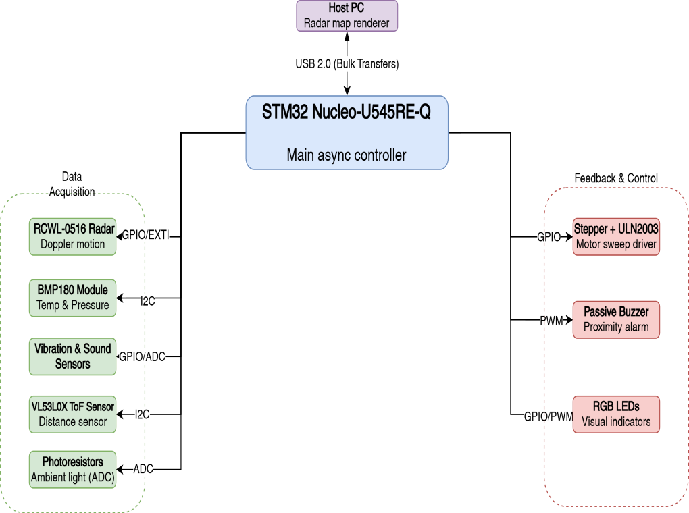
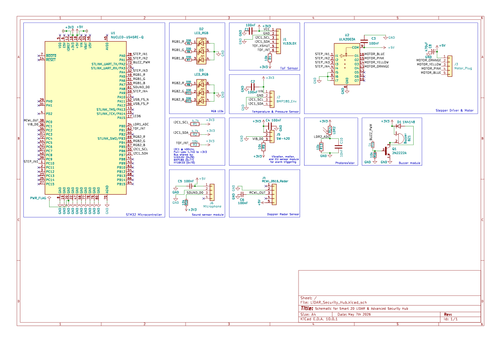
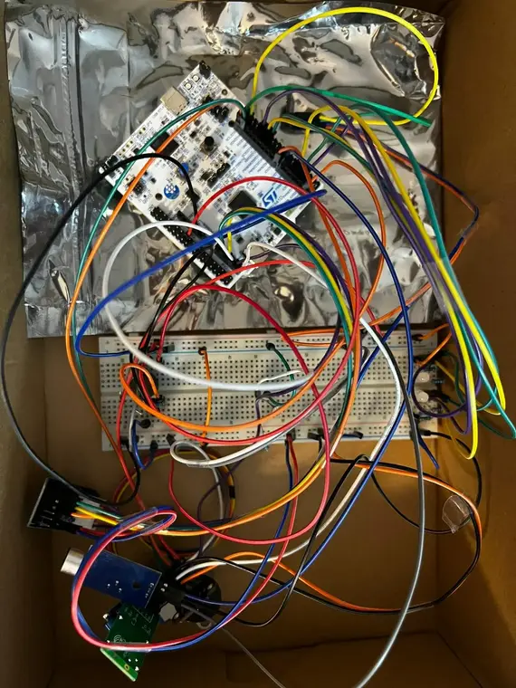
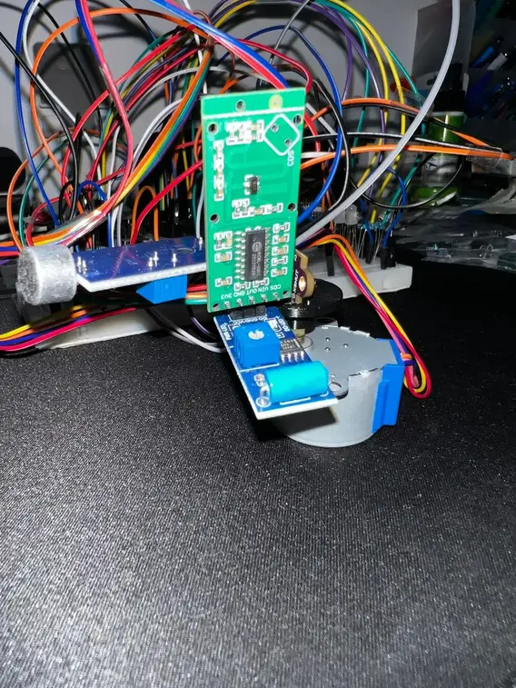
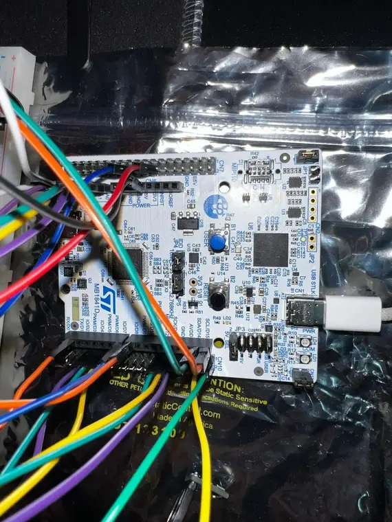

# Smart 2D LiDAR Radar & Advanced Security Hub
A comprehensive bare-metal 2D scanning system and multi-sensor security alarm built with Rust and Embassy on the STM32.

:::info 

**Author**: DULCE Andrei-Marian \
**GitHub Project Link**: [https://github.com/UPB-PMRust-Students/fils-project-2026-andrrei509](https://github.com/UPB-PMRust-Students/fils-project-2026-andrrei509)

:::
## Description

This project is an advanced, multi-layered active security and environmental monitoring hub built on the STM32. The core feature is a 2D scanning system using a VL53L0X Time-of-Flight (ToF) sensor mounted on a 28BYJ-48 stepper motor, which performs a 180° back-and-forth sweep and streams 18-byte Cartesian coordinate frames to a laptop via USB CDC ACM to render a real-time radar map in Python (pygame). Additional sensors — a Doppler radar, vibration sensor, sound sensor, photoresistor, and BMP180 barometer — provide intrusion detection and environmental telemetry. Two RGB LEDs give local visual feedback for proximity zones and security status, while a PWM-driven buzzer sounds proximity alerts.

## Motivation

I chose this project because it combines precise motor control, real-time data acquisition from a vast array of sensors, and PC-device USB communication into a single robust system. It is a highly practical and technically challenging way to explore asynchronous embedded programming in Rust.

## Architecture

Main software and system components:
- **Scanning Module**: reads distance from VL53L0X via I2C (or generates mock ghost-room data when the sensor is unavailable) and steps the motor via GPIO in a strict ping-pong sweep.
- **Intrusion Detection Module**: reads Doppler radar (RCWL-0516), vibration (SW-420), and sound sensors with multi-sample polling to catch short pulses.
- **Environmental Module**: reads BMP180 temperature/pressure (I2C) and photoresistor ambient light (ADC) for night mode detection.
- **Local Feedback Module**: drives two RGB LEDs (proximity zones + security status) and a PWM buzzer for proximity alarms.
- **Communication Module**: streams serialized 18-byte ScanPoint payloads via USB CDC ACM to the PC, and receives single-byte motor commands (Auto/Right/Left/Stop).

## Log

### Week 4
- Established the project idea and worked on the component list.

### Week 5-6
- Ordered all hardware components (STM32, VL53L0X, stepper motor, etc.).
- Researched the Embassy framework and USB Bulk transfer implementation in Rust.

### Week 7
- Components arrived, started testing and tinkering with them.

### Week 8-9 
- Hardware Integration. Began assembling the core scanning module by mounting the VL53L0X ToF sensor to the 28BYJ-48 stepper motor shaft.
- Circuit Prototyping. Mapped out the pin connections on the 830-point breadboard for the I2C bus (sensor), GPIO sequence (ULN2003 driver), and the security sensor array.
- Software Design. Drafted the Embassy task architecture, defining the synchronization channels between the scanning task and the USB communication task.

## Hardware

The system uses an STM32 Nucleo-U545RE-Q as the central hub. It orchestrates a VL53L0X ToF sensor mounted on a 5V stepper motor for spatial scanning, alongside a suite of security sensors (Doppler radar, vibration, sound) and environmental sensors (BMP180, photoresistor). Two RGB LEDs provide local visual feedback and a PWM buzzer handles proximity alerts. Everything is wired on a universal 830-point breadboard.

### Schematics
 

  <em>Complete system schematic for the Smart 2D LiDAR Security Hub.</em>

### Breadboard Assembly

  <em>Breadboard wiring setup - view 1.</em>

  <em>Breadboard wiring setup - view 2.</em>

  <em>Breadboard wiring setup - view 3.</em>

### Bill of Materials

| Device | Usage | Price |
|--------|-------|-------|
| [STM32 Nucleo-U545RE-Q](https://ro.mouser.com/ProductDetail/STMicroelectronics/NUCLEO-U545RE-Q?qs=mELouGlnn3cp3Tn45zRmFA%3D%3D&utm_id=6470900573&utm_source=google&utm_medium=cpc&utm_marketing_tactic=emeacorp&gad_source=1&gad_campaignid=6470900573&gbraid=0AAAAADn_wf3z_FgLPlEhiqyMV9mn0tbtQ&gclid=CjwKCAjwqazPBhALEiwAOuXqdOdLtJJ-VfXVsbLczCE73wrj-NLHNWA5hmh-ZEuzBuzdJ_4QBonQeBoCZrcQAvD_BwE) | The main microcontroller | 106.59 RON |
| [VL53L0X ToF Sensor](https://www.emag.ro/senzor-de-masurare-a-distantei-tof-vl53l0x-ai280-s366/pd/DS9D93MBM/) | Distance measurement (I2C) | 28.00 RON |
| [Universal Breadboard 830 points](https://www.emag.ro/breadboard-universal-830-puncte-5904162803408/pd/DLQMNLMBM/) | Prototyping base | 15.67 RON |
| [28BYJ-48 5V Stepper Motor + ULN2003 Driver](https://www.optimusdigital.ro/en/stepper-motors/2487-step-by-step-28byj048-5v-motor-and-uln2003-driver-green-.html?search_query=28BYJ-48&results=1) | Motor for sensor sweeping | 15.00 RON |
| [RCWL-0516 Doppler Radar Sensor](https://sigmanortec.ro/Senzor-Doppler-Radar-RCWL-0516-p125423439) | Microwave motion detection | 6.20 RON |
| [BMP180 Sensor Module](https://sigmanortec.ro/Senzor-presiune-atmosferica-temperatura-BMP180-p126182252) | Temperature and pressure sensing (I2C) | 4.50 RON |
| [Passive Buzzer 3.3V](https://www.optimusdigital.ro/en/buzzers/12247-3-v-or-33v-passive-buzzer.html?search_query=0104210000081527&results=1) | Proximity audio alarm (PWM) | 3.00 RON |
| [Photoresistors](https://www.optimusdigital.ro/en/others/28-5528-photoresistor.html?search_query=0104210000002072&results=1) | Ambient light sensing (ADC) | 7.60 RON |
| [Vibration / Tilt Sensor](https://sigmanortec.ro/Senzor-vibratie-miscare-inclinare-p126008775) | Tamper detection | 6.00 RON |
| [Microphone / Sound Sensor](https://sigmanortec.ro/Modul-microfon-senzor-sunet-p126025149) | Acoustic trigger | 5.00 RON |
| 2× RGB LED 5mm (Common Cathode + Common Anode) | Proximity zones and system status indicators | 5.00 RON |
| [Transistors (2N2222) & Diodes (1N4148)] | Buzzer transistor driver and flyback protection | 10.00 RON |
| [Assorted Resistors (330Ω, 1kΩ, 10kΩ)] | Current limiting (LEDs) and pull-ups/downs | 5.00 RON |
| [Capacitors (100uF, 470uF, 100nF)] | Power filtering and decoupling | 15.00 RON |
| [Dupont Wires (M-M, M-F, F-F)] | Establishing connections | 25.00 RON |
| [Switches & PCB Buttons] | Power control and inputs | 15.00 RON |
| **Total** | | **272.56 RON** |

## Software

| Library | Description | Usage |
|---------|-------------|-------|
| [embassy-stm32](https://github.com/embassy-rs/embassy) | Async HAL for STM32 | Hardware access for I2C, GPIO, ADC, PWM, and USB |
| [embassy-executor](https://github.com/embassy-rs/embassy) | Async task executor | Schedules 7 concurrent firmware tasks |
| [embassy-time](https://github.com/embassy-rs/embassy) | Embedded timers | Delay management and periodic sensor polling |
| [embassy-usb](https://github.com/embassy-rs/embassy) | USB device stack | Implementing USB CDC ACM endpoints for PC communication |
| [embassy-sync](https://crates.io/crates/embassy-sync) | Async synchronization primitives | Channels and Signals to safely move sensor data between tasks |
| [embassy-embedded-hal](https://crates.io/crates/embassy-embedded-hal) | Adapter for Embedded HAL | Bridging Embassy drivers with the standard Rust embedded ecosystem |
| [embassy-futures](https://crates.io/crates/embassy-futures) | Future combinators | `join3` for running USB device, TX, and RX concurrently |
| [serde](https://serde.rs/) | Data serialization framework | Derive macros for ScanPoint and SystemStatus structs |
| [cortex-m](https://crates.io/crates/cortex-m) | ARM Cortex-M low-level access | Handling low-level CPU operations and critical sections |
| [cortex-m-rt](https://crates.io/crates/cortex-m-rt) | Startup and runtime for ARM | Managing the reset handler and memory initialization of the STM32 |
| [panic-probe](https://crates.io/crates/panic-probe) | Debug panic handler | Catching code crashes and printing the stack trace over the debug probe |
| [defmt](https://defmt.ferrous-systems.com/) | Deferred formatting | High-efficiency logging to debug sensor values in real-time |
| [defmt-rtt](https://crates.io/crates/defmt-rtt) | RTT transport for defmt | Sends defmt log frames over the debug probe's RTT channel |
| [micromath](https://github.com/tarcieri/micromath) | `no_std` math library | Computing sin/cos for polar-to-Cartesian coordinate mapping |
| [vl53l0x](https://crates.io/crates/vl53l0x) | ToF Sensor Driver | Reading distance data from the laser sensor over I2C |
| [bmp180-embedded-hal](https://crates.io/crates/bmp180-embedded-hal) | BMP180 Sensor Driver | Reading temperature and pressure over I2C |
| [static_cell](https://crates.io/crates/static_cell) | Static allocation | Safe `'static` references for USB buffers, channels, and shared I2C bus |
| [embedded-hal](https://crates.io/crates/embedded-hal) | Embedded HAL traits | Common trait interface used by sensor drivers |

## Links

1. [Embassy Framework Documentation](https://embassy.dev)
2. [STM32U545RE Reference Manual](https://www.st.com/resource/en/reference_manual/rm0456-stm32u5-series-armbased-32bit-mcus-stmicroelectronics.pdf)
3. [Rust Embedded Book](https://docs.rust-embedded.org/book/)
4. [VL53L0X API and Documentation](https://www.st.com/en/imaging-and-photonics-solutions/vl53l0x.html)
