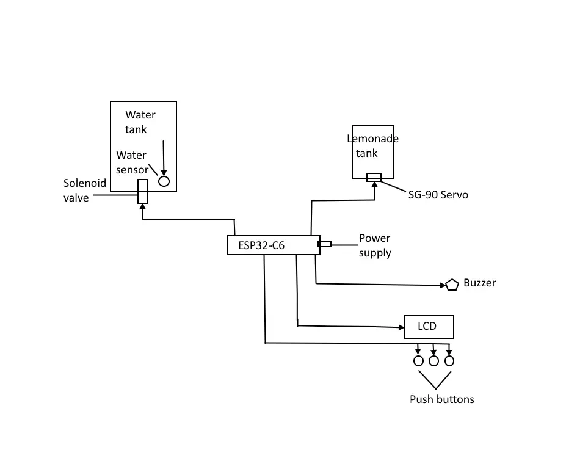
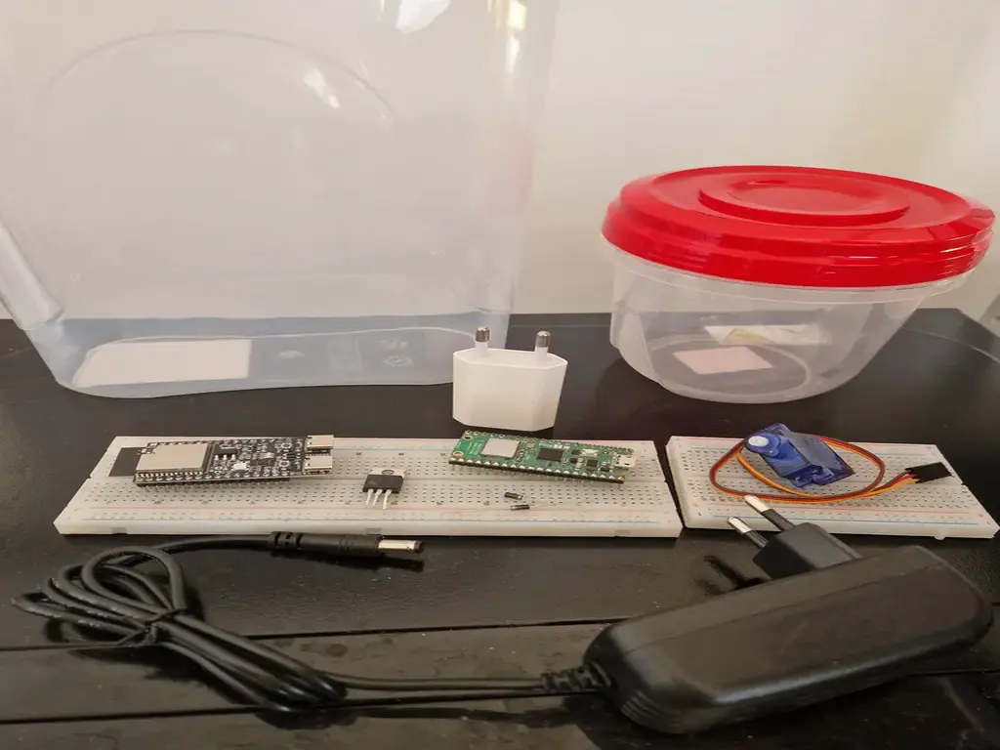
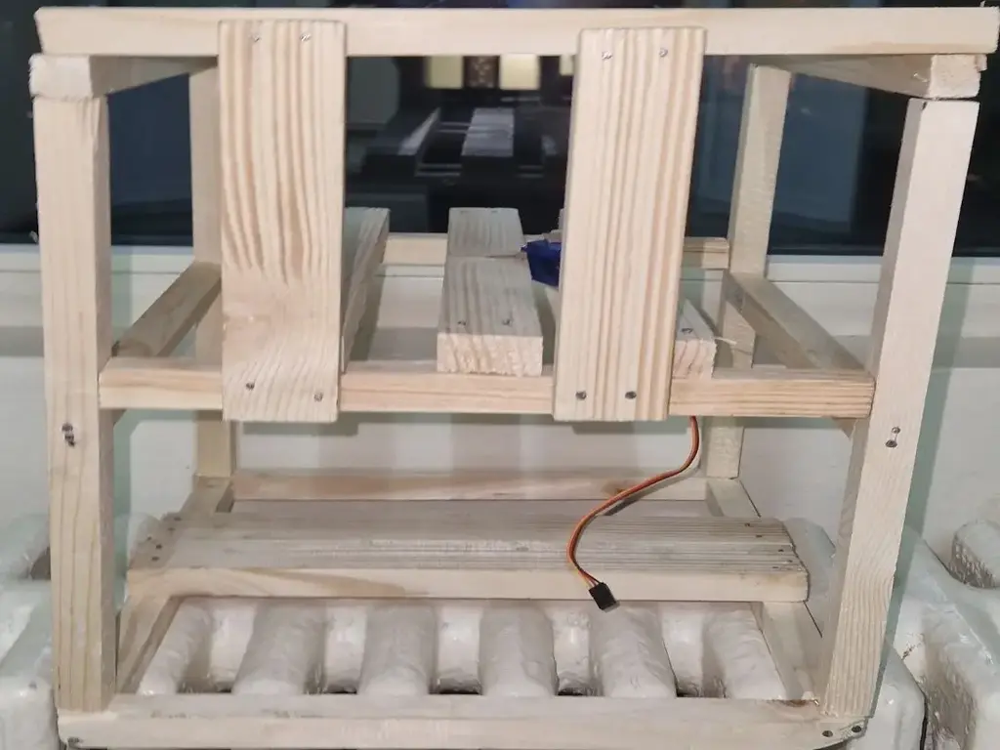
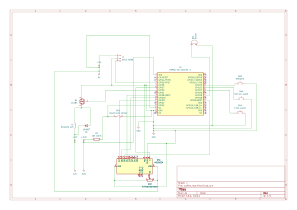

# Ali lemon
lemonade vending machine with drinks selection options, based on ESP-32-C6 chip.

:::info

**Author:** Artem Lebedev (group 1221EB, FILS) \
**GitHub Project Link:** [Ali lemonade](https://github.com/UPB-PMRust-Students/fils-project-2026-artemlebedev)

:::

## Description

This project is a lemonade vending machine capable of creating a variety of lemonade drinks using a gravity- and time-based dispenser of hot water and instant lemonade. To implement this idea, we'll use a solenoid valve for the water tank, a servo motor with a flap for the lemonade container, drink selection buttons, and a host of additional features: an LCD screen displaying the brewing process and water level, a buzzer to notify when the lemonade is ready, and a float sensor to indicate when the water level is low. At the core of all these devices will be an ESP32-C6 chip; the enclosure will be a wooden T-shaped structure.

## Motivation

My desire to build a lemonade machine, rather than any other device, is easy to explain – I'm a big fan of this aromatic drink, and if I'm going to do anything, it's going to be something I personally wouldn't shy away from using. Of course, my design is a far cry from a professional lemonade machine, but at the same time, I think it will provide worthy competition to the machines dotted around campus.

## Architecture

The system is organized into three functional layers:

**Input Layer**
- Three tactile push buttons select the drink mode: Standard, Extra Sweet, or Not-so-sweet.
- A float switch liquid level sensor monitors the water tank and signals when it is empty.

**Control Layer**
- The ESP32-C6 SuperMini runs the main async task loop via Embassy.
- On button press, a mode-specific timing profile is selected, and serving sugar with lemon acid and water for the correct duration starts.
- The water sensor is polled continuously; if the tank is empty, dispensing is blocked and the display shows a warning.

**Output Layer**
- A 12V solenoid valve (normally closed) controls water flow from the tank to the cup, driven by an DL-4184 MOSFET module gate resistor.
- A servo motor (SG90) opens and closes a mechanical gate on the sugar/acid powder container.
- An SSD1306 OLED display (0.96", I2C) shows brewing status and warnings.

All components share a common ground. The 12V rail powers the solenoid valve and is supplied by an external 12V 2A DC adapter. The ESP32-C6 is powered via USB.

## Diagram

## Log

### Week 5 - 11 May 

Awaiting arrival of remaining components, added minor changes in the hardware by replacing 100 Ohm resistor for 1K and 10K ones and IRF540N transistor for IRF3205PBF as well as GPIO's of some devices; also the power supply of solenoid been changed to direct supply from adaptor. 

### Week 12 - 18 May

Gathered all the hardware, proceed to create first prototypes. Replace the IRF-3205 for DL-4184 module due to not working transistor. 

### Week 19 - 25 May

Changed SSD1306 screen for 1602A 5V. Made the shell of the machine.

## Hardware

The system is built around the ESP32-C6 SuperMini microcontroller, which manages all inputs and outputs over GPIO, PWM (LEDC), and I2C. Two food-grade plastic containers (1–2L) serve as the water and lemonade powder tanks, each mounted above the dispensing point to allow gravity-fed flow.

Water flow is controlled by a 12V normally-closed solenoid valve. When the ESP32-C6 pulls the MOSFET gate high, the valve opens and hot water flows through a silicone tube into the cup. The MOSFET (IRF540N) is connected with a 100Ω resistor on the gate to limit switching transients.

Lemonade powder is dispensed through a mechanical gate controlled by the SG90 servo. At rest, the gate is closed. When activated, the servo rotates 90° to open the gate, powder falls by gravity, and the servo returns to close it after the timed duration.

### Pin Connections

| ESP32-C6 GPIO | Function | Connected To |
|---|---|---|
| GPIO23 | Button – Espresso | Tactile button → GND |
| GPIO22 | Button – Double Espresso | Tactile button → GND |
| GPIO21 | Button – Americano | Tactile button → GND |
| GPIO2 | Solenoid valve control | Load DL-4184|
| GPIO06 | RC | A1602 |
| GPIO07 | E | A1602 |
| GPIO08 | D4 | A1602 |
| GPIO09 | D5 | A1602 |
| GPIO10 | D6 | A1602 |
| GPIO11 | D7 | A1602 |
| GPIO5 | Servo PWM (LEDC) | SG90 signal wire |
| GPIO3 | Water level sensor | Float switch → GND |
| GPIO19 | Buzzer | Active buzzer |
| 3.3V | Power | SG90 VCC, Float switch |
| 5V | Power | A1602 |
| 12V | Power | Solenoid, DL-4184 |
| GND | Common ground | All GND rails |

### Schematics

## Bill of Materials

| Device | Usage | Price |
|---|---|---|
| ESP32-C6 | Main microcontroller | 50 RON |
| Solenoid Valve 12V N/C | Water flow control | 45 RON |
| IRF3205PBF MOSFET | Solenoid valve driver | 6 RON |
| DL-4184 MOSFET module | Solenoid valve driver | 6 RON |
| Resistor 1KΩ and 10KΩ | 1 RON |
| Servo SG90 | Lemonade powder gate control | 13.5 RON |
| OLED SSD1306 0.96" I2C | Status display | 15 RON |
| A1602 screen | Status display | 10 RON |
| Float Switch Liquid Level Sensor | Water tank monitoring | 30 RON |
| Food-grade plastic container 1–2L (×2) | Water and lemonade powder tanks | 30 RON |
| Silicone tube (thermoresistant) | Water delivery from tank to cup | 25 RON |
| Silicone hermetic | Water delivery from tank to cup | 35 RON |
| Tactile push buttons (×3) | Mode selection | 5 RON |
| Breadboard 830 points | Prototyping platform | 10 RON |
| Dupont jumper wires (M-M, M-F, F-F set) | Component connections | 25 RON |
| 12V 2A DC power adapter | Powers solenoid valve | 20 RON |
| Wood for shelf |  | 40 RON |
| **TOTAL** | | **366.5 RON** |

***

## Software

| Library | Description | Usage |
|---|---|---|
| `esp-hal` | Hardware Abstraction Layer for ESP32-C6 | GPIO, LEDC PWM, I2C peripheral control |
| `esp-hal-embassy` | Embassy runtime adapter for ESP32 | Enables async task execution on ESP32-C6 |
| `embassy-executor` | Async task executor | Runs concurrent tasks: buttons, dispensing, display |
| `embassy-time` | Async time utilities | `Timer::after()` for precise dispensing durations |
| `embedded-hal` | Hardware abstraction traits | Standard interface for GPIO and PWM |
| `embedded-hal-async` | Async hardware abstraction traits | `wait_for_falling_edge()` for button and sensor input |
| `embedded-graphics` | 2D graphics primitives | Text rendering on the OLED display |
| `esp-backtrace` | Panic handler with serial output | Debugging — prints panic traces over UART |
| `esp-println` | `println!` macro over UART | Logging timing and sensor values during development |
