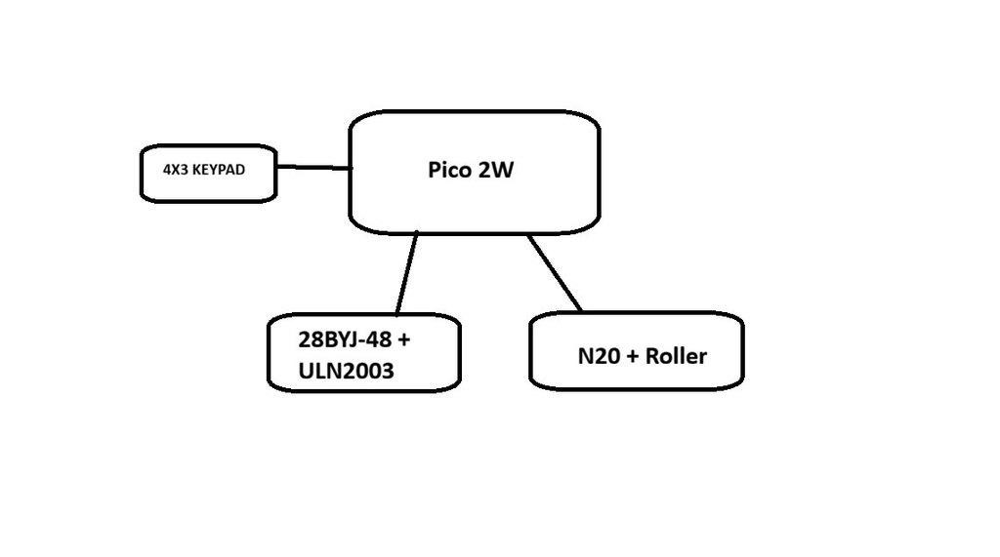
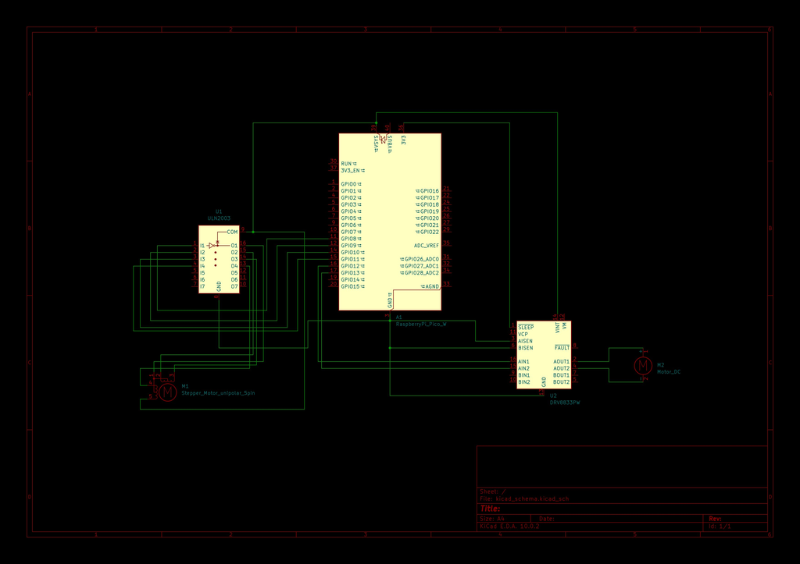

# Cigarette dispenser

A circcular device that, when prompted from a keypad, will spin to a preloaded chamber like a tank autoloader and push out the product selected, in this prototype case, a cigarette.

:::info

**Author:** Bîrgu Bogdan-Andrei \
**GitHub Project Link:** https://github.com/UPB-PMRust-Students/fils-project-2026-bogdan-3301

:::

---

# Description
The project I decide to work on can be classified as a dispenser or vending machine that works with a single type of product and that I will try to make using a mechanism similar to a tank autoloader. The original idea was to use bottles but since that would be too big and costly I will use cigarettes. 
They will be loaded into the circular, disc shaped device. When prompted with a number, the top part of the disc will spin to the correct chamber and push the cigarette out. This action can pe repeated.

---

# Architecture

## Main Components

### Input Layer
- *4×4 Matrix Keypad*
  Used for all user interaction: entering date of birth for age verification, and entering the chamber number to dispense from.
  Connected directly to 8 GPIO pins on the Pico (4 row outputs, 4 column inputs).

### Control Core
- *Raspberry Pi Pico 2W running Rust*
  Executes the main state machine: idle → age input → verify → chamber select → rotate disc → eject → idle.
  Drives the stepper motor sequence and PWM signal for the servo, and scans the keypad at a fixed polling rate.

### Actuation Layer
- *28BYJ-48 Stepper Motor + ULN2003 Driver*
  Rotates the circular disc to align the selected chamber with the ejection point. Driven by a 4-step sequence from the Pico via the ULN2003 driver board.
- *SG90 Servo Motor*
  Pushes the cigarette out of the aligned chamber. Controlled via a 50 Hz PWM signal from the Pico.

### Power Layer
- *5V USB Power Supply*
  Powers the Pico via USB. The VSYS pin supplies 5V to the servo and the ULN2003 driver board. GND is shared across all components.

---
# Component Connection

### Input Link (GPIO)
Connects the 4×4 keypad to the Pico.
The firmware scans 4 row output pins and reads 4 column input pins to detect keypresses.
Provides age verification input and chamber number selection to the control loop.

### Control Loop (Rust State Machine)
Runs in the main firmware loop at a fixed polling rate.
Collects keypad digits, parses the entered birth date, computes age, and — upon a valid result — accepts a chamber number and computes the required stepper rotation.

### Rotation Link (Stepper / GPIO)
Connects the Pico to the ULN2003 driver board, which drives the 28BYJ-48 stepper motor.
The firmware steps through a 4-phase sequence to rotate the disc by the exact angle needed to align the target chamber.

### Ejection Link (PWM / GPIO)
Connects the Pico to the SG90 servo signal wire.
The firmware generates a 50 Hz PWM signal, sweeping pulse width from ~1 ms (closed) to ~2 ms (open) to push the cigarette out, then returns to closed.

---

# Log

### Week 23 – 29 March
Planned the project and defined the concept. Decided on the tank-autoloader mechanism and outlined the age-verification + chamber-selection flow.

### Week 30 March – 5 April
Got the idea approved and ordered all required components.

### Week 6 – 12 April
Waiting for components. Started reading the RP2040 datasheet and exploring the rp2040-hal and embedded-hal crates for GPIO, PWM, and timer access in Rust.

### Week 13 – 19 April
Worked on the documentation.

### Week 20 – 26 April
(Work in progress)

### Week 27 April – 3 May
(Work in progress)

### Week 4 – 10 May
(Work in progress)

### Week 11 – 17 May
(Work in progress)

### Week 18 – 24 May
(Work in progress)

---

# Hardware

The physical setup consists of:
- Raspberry Pi Pico 2W as the central controller on a breadboard
- 4×4 matrix keypad wired to GP0–GP7
- ULN2003 driver board connected to GP8–GP11, driving the 28BYJ-48 stepper motor
- SG90 servo connected to GP12 (PWM) for the ejection arm
- All components powered from a 5V USB supply via VSYS and shared GND
- Circular disc chassis (3D-printed or hand-built) with numbered chambers

---

# Schematics

---

# Bill of Materials

| Device | Usage | Price |
|--------|-------|-------|
| Raspberry Pi Pico | Main control unit running Rust firmware | ///unsure |
| 4×4 Matrix Keypad | User input — age verification & chamber selection | ///unsure |
| 28BYJ-48 Stepper Motor | Rotates the disc to the selected chamber | ///unsure |
| ULN2003 Driver Board | Drives the stepper motor from Pico GPIO | ///unsure |
| SG90 Servo Motor | Pushes the cigarette out of the aligned chamber | ///unsure |
| 5V USB Power Supply | Powers Pico + stepper driver + servo | ///unsure |
| Micro-USB Cable | Programming & power delivery to the Pico | ///unsure |
| Jumper Wires | All electrical connections between modules | ///unsure |
| Breadboard | Prototyping and connection layout | ///unsure |
| Circular Disc Chassis | Houses the numbered chambers (3D-printed or custom-built) | ///unsure |

Prices not confirmed yet; some components may change.

---

# Software

| Library | Description | Usage |
|---------|-------------|-------|
| Rust (no_std) | Systems programming language | Core firmware implementation |
| rp2040-hal | Hardware Abstraction Layer for RP2040 | GPIO, PWM, timers, clocks |
| embedded-hal | Portable hardware abstraction traits | Peripheral interfaces (digital I/O, PWM) |
| cortex-m-rt | Minimal runtime for ARM Cortex-M | Startup, interrupt vector table, stack setup |
| cortex-m | Low-level access to ARM Cortex-M CPU | Critical sections, delay loops |
| heapless | Fixed-size data structures (no heap) | Input buffer for keypad digit collection |
| panic-halt | Panic handler that halts the CPU | Safe fault handling in no_std context |
