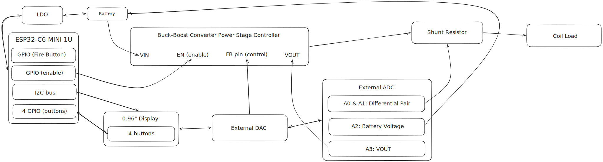
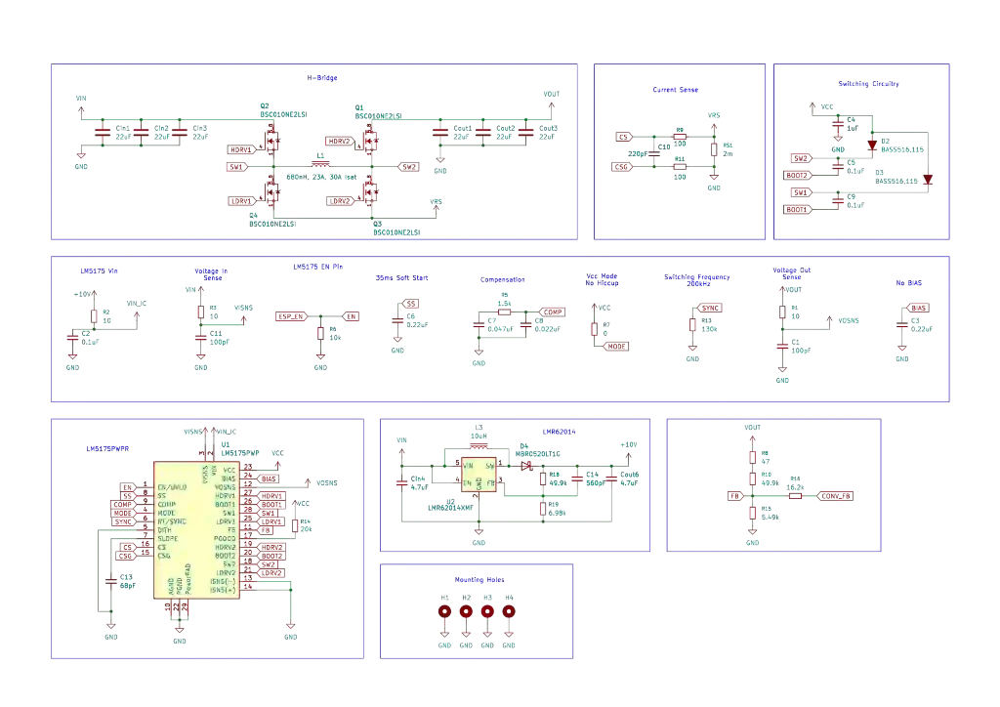
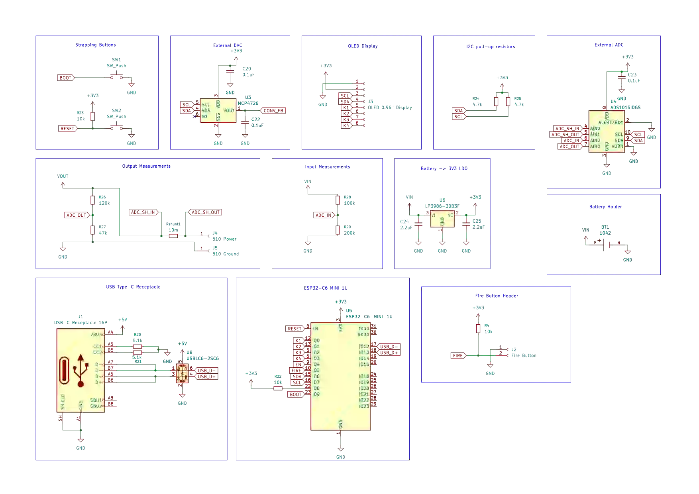
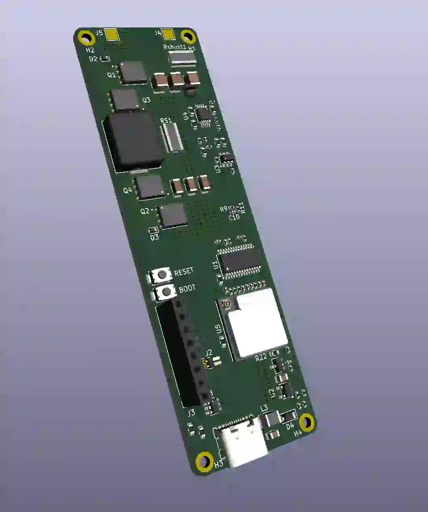
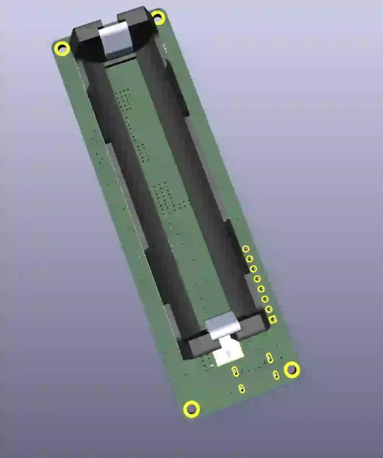

# Helix 
A device for the consumption of alternative products with Nicotine.

:::info 

**Author**: Soare Cătălin-Ștefan \
**GitHub Project Link**: https://github.com/UPB-PMRust-Students/fils-project-stevensun369
:::

## Description

The basic functioning principle of an E-Cigarette is pretty simple: a power source connected to a resistor. Inside of the coiled resistor, there's an absorbant material, that is irrigated by "vape juice" (Propylene Glycol and Vegetal Glycerin) which may or may not contain Nicotine. 

Yet, modern vaping devices (and Helix by extension) are not as simple. Helix can deliver up to 60W to the heating element from a single 18650 high-draw cell. The device is controllable both in Voltage mode and in Wattage mode, and has automatic coil resistance detection. The device is safe to operate in all conditions, with Low-Voltage Lockout, Over-Current protection and most importantly Temperature Control. 

Temperature Control is based on the Temperature Coefficient of Resistance. The most widely-used materials for building vape coils (Stainless Steel, Nickel and Titanium) predictibly change their resistance as the coil gets hotter. Therefore with a PID loop, you can keep the device at a steady temperature, ensuring a smooth, predictable experience. Temperature Control also allows Dry Puff Protection - when the coil gets way too hot in too narrow of an interval (due to dryness in the cotton used in the tank atomizer), the system can disable the power circuitry, and notify the user to fill the tank with E-juice again.

## Motivation

After being a long time smoker and as an attempt to better myself, I have switched to alternative products for the consumption of nicotine. I had noticed a lack of well-built, feature-packed, yet accessible options on the market, and took upon the challenge to design a product that fulfilled my needs.

## Architecture 

## Software
As my hardware knowledge was limited, I decided to offload safety features to the microcontroller code. As I've always "seen" the Buck-Boost Converter stage as a black box from that perspective, the Microcontroller is only truly aware of the EN pin on the LM5175 (which is the kill switch). Besides that, controlling the device through the DAC and reading the values with the ADC are rather encoded in configuration files, and helper functions for "birthing" the I2C messages. 

The firmware is designed to be as asynchronous as possible. The main component is the I2C delegator (which is another abstraction layer) that receives what the main loop (while firing) needs to do, and (eventually) returns the results through those aforementioned helper functions. This delegator is also responsible for buffering and drawing the screens on the OLED display. 

The other part of the firmware is the "settings". The user can select the wattage that they need, the coil material they're using, the temperature they want to get up to and they can request a remeasure of the coil. They are also aware of the battery level, and duration of each "puff". All of these settings are saved in flash memory, with sequential reads and writes (for wear levelling).

Reading the buttons is also done asynchronously, using interrupts and debouncing. The device automatically transitions into a Deep Sleep mode when not in use to save power, and the buttons have been wired in such a way to "wake up" the device when pressed (connected to the ESP's LP_GPIOx pins). The press, hold and release events are then sent to the respective tasks either to: start the "fire" sequence, stop the "fire" sequence, change the Display State Machine and adjust settings.

I have tried to architect the firmware in such a way that it is extensible, decoupled and easy to understand, although it is still very very dependent on the hardware.

## Hardware

The Buck-Boost Converter stage (crudely) has: 2x banks of ceramic Capacitors (for "cleaning" the signal), 4x N-Channel, 25V 33A MOSFETS in an H-bridge configuration and a Shielded, Powdered Iron 680nH 35A inductor. The Converter Stage is controlled by the TI LM5175 Synchronous 4-Switch Buck-Boost Controller. For the design of the Converter Circuitry, I have used the PMP20410 reference implementation board from TI, which is custom designed for use in E-Cigarettes.

Ultimately, I fell upon the ESP32-C6 family of microcontrollers, more specifically the MINI-1U variant. The Microcontroller choice is a compromise between my technical know-how of circuit design and the ability to still run debuggable code "in-production". But the ESP32-C6 comes with a... less desirable ADC. Not to count the fact that it doesn't have an onboard DAC. It's pretty powerful, it has a Low-Power operation mode, and that has been enough. 

The external DAC (MCP4726) and external ADC (ADS1015) have mostly been chosen based on simplicity. Ultimately, I have foregone the use of their respective existent drivers in the Rust world (due to the shared I2C bus). They are necessary for more granular precision both in measurement of the coil's resistance and for the control of the LM5175 controller. Basing the design on a single 18650 cell was the natural choice, as it's the most widely used in E-Cigarettes.

For whoever is interested, the design files that have gone into production are available on the [GitHub repository](https://github.com/stevensun369/helix-vape-design).

### Schematics
Schematic of the Converter Circuitry

Schematic of the Microcontroller Peripherals and Connections

And the final PCB, front and back views

### Bill of Materials

| Device | Usage | Price |
|--------|--------|-------|
| Final PCB | Assembled Board | 600RON/board |
| Molicel 18650 28A 3000mAh | Battery | 50RON / part |
| 0.96" OLED display | User Interface | 25RON |
| Tactile Button | User Interface | 2RON |
| Copper Cable | Connector for the battery and other components | Free (had some laying around) |
| 510 Connector | Connector for the atomizer | Free (vape shop parts bin) |
| Atomizer | Contains the load coil | Free (vape shop borrow) |

## Software

| Library | Description | Usage |
|---------|-------------|-------|
| [embassy](https://github.com/embassy-rs/embassy) | Asynchronous HAL implementation (specifically for the RP2350 MCU) | The backbone of the project |
| [embedded-graphics](https://github.com/embedded-graphics/embedded-graphics) | 2D graphics library | Used for drawing the User Interface to the display |
| [ssd1306](https://docs.rs/ssd1306/latest/ssd1306/) | Display driver over I2C | Used for communicating with the 0.96" OLED monochrome display |
| [pid](https://docs.rs/pid/latest/pid/) | no_std PID library | The Temperature Control feature and Dry Puff Detection |

## Links
1. [STM Smoke](https://github.com/vasimv/StmSmoke/)
2. [Ghetto Vape III](https://github.com/juliancoy/ghettovape-III)
3. [Evolv DNA60 (E-cigarette board)](https://www.evolvapor.com/products/dna60)
