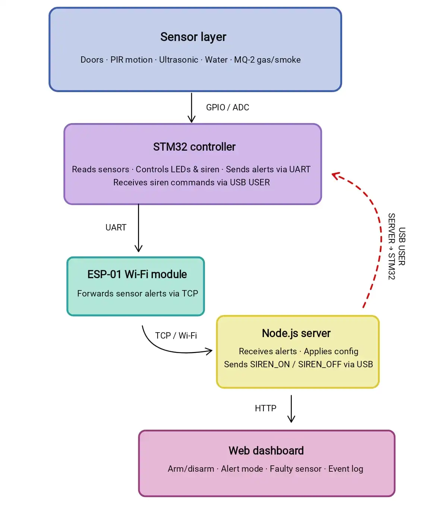
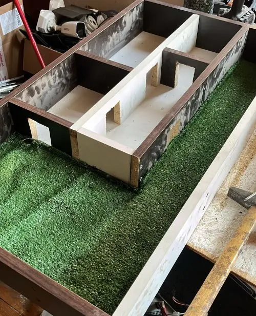
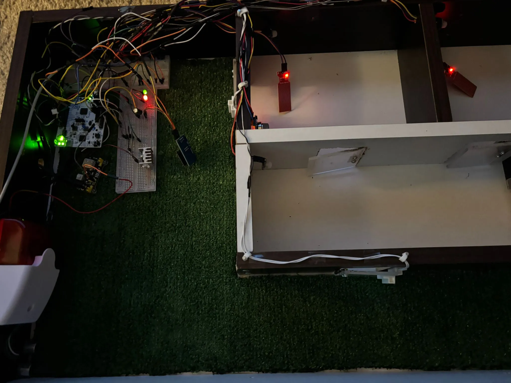
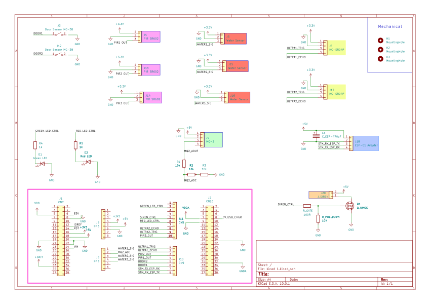

# Smart Security System 

A modular smart security system for a miniature house with multi-sensor detection, a web dashboard, Wi-Fi alerts, and physical siren control.

:::info

**Author**: Cranganu Claudia \
**GitHub Project Link**: [https://github.com/UPB-PMRust-Students/fils-project-2026-clufluturas](https://github.com/UPB-PMRust-Students/fils-project-2026-clufluturas)

:::

## Description

This project is a modular smart security system built for a miniature house. It uses an STM32 development board together with several sensors placed around the model: magnetic sensors for the front and back doors, PIR sensors for indoor motion detection, ultrasonic sensors for perimeter monitoring, water sensors for flood detection, and an MQ-2 sensor for gas/smoke detection.

The system is controlled through a web dashboard, where each sensor can be configured individually. The user can arm or disarm each module, choose between notification, loud alarm, or both, and mark a sensor as faulty if it does not behave correctly. Alerts from the STM32 are sent to the Node.js server through the ESP-01 Wi-Fi module. For reliable physical siren control, the server sends commands back to the STM32 through the board’s USB USER port.

## Motivation

The inspiration for this project came from my own house, which already has security systems in place for things like doors and flood detection. I wanted to recreate something similar in a miniature form, combining the sensors I find most useful in real life into one system that I could actually build and control myself. It was a good opportunity to understand how these kinds of systems work from the inside.

## Architecture

The system is organized into several components that work together for detection, communication, remote configuration, and physical alert control.

- **Sensor Layer:** This layer includes all the sensors installed on the miniature house: magnetic sensors for the front and back doors, PIR sensors for indoor motion detection, ultrasonic sensors for perimeter monitoring, water sensors for flood detection, and the MQ-2 gas/smoke sensor. Each sensor detects a specific type of event and sends its signal to the STM32 board through GPIO or ADC pins.

- **STM32 Controller:** The STM32 is the embedded core of the system. It reads all sensor inputs, detects state changes, handles local sensor logic, and sends alert messages when an event occurs. It also controls the physical LEDs and the siren output, but the final decision for when the siren should sound is received from the web application through the USB USER port.

- **ESP-01 Wi-Fi Module:** The ESP-01 module is used for communication from the STM32 to the Node.js server. When a sensor is triggered, the STM32 sends an alert message through UART to the ESP-01, which forwards it to the server. This path is used for sensor alerts and status updates.

- **Node.js Server:** The Node.js server receives alerts from the STM32, stores the current system state, applies the configuration selected by the user, and updates the web dashboard. It decides whether an event should be treated as a notification, a loud alarm, or both.

- **USB USER Command Channel:** The board's USB USER port is used as a direct command channel from the Node.js server back to the STM32. This is used for reliable physical siren control. When the web application decides that a loud alarm is needed, the server sends `SIREN_ON` through USB. When the alarm is cleared, it sends `SIREN_OFF`.

- **Web Dashboard:** The web dashboard is the user interface of the system. It allows the user to arm or disarm each sensor, choose the alert mode, mark faulty sensors, view notifications, clear alarms, and monitor the current state of the miniature house.

## Log

### Week 5

I finalized the main idea of the project and decided on the overall direction of the system. I spent time researching similar security solutions and thinking about which features would be the most useful to include in my own project. I also ordered the STM32 development board and completed the initial idea documentation.

### Week 6-7

I ordered the rest of the hardware components needed for the project. After receiving them, I began testing some of them individually to better understand how they work and to make sure they could be integrated into the final system.

### Week 8-9

I started working on the physical structure of the project by building the miniature house. I began cutting the main parts, shaping the doors, and preparing the layout so the sensors could later be integrated into the correct positions.

### Week 10-11

I tested all sensors together with the siren and status LEDs. At this stage, the siren was triggered by any active sensor, which helped me verify the basic detection logic. I organized the wiring, updated the schematic, and started integrating everything into the miniature house.

I also built the doors from hard plexiglass and attached them with small hinges so the magnetic door sensors could be tested more realistically.

### Week 12-13

I started working on the Wi-Fi communication using the ESP-01 module and its adapter. I also added a capacitor for better power stability. During this stage, I tested how alerts are sent from the STM32 to the Node.js server and worked on the first version of the web dashboard.

The dashboard was updated to display sensor alerts, event logs, notifications, and individual sensor settings.

### Week 14

I finalized the communication and alert system. Since sending the siren decision back through the ESP-01 was not reliable, I used the board’s USB USER port as a direct command channel from the Node.js server to the STM32. This allows the dashboard to turn the physical siren on or off depending on the selected alert mode.

I also finished the final dashboard design, added per-sensor options such as armed/disarmed, notification/loud/both, and faulty sensor marking, then tested the full system on the miniature house.

## Hardware

The system uses an STM32 development board as the main controller. It receives input from all sensors, processes the local detection logic, controls the status LEDs and the physical siren output, and communicates with the web application through the ESP-01 Wi-Fi module and the board’s USB USER port.

The hardware setup includes multiple sensors, each covering a different security or safety scenario. Two magnetic sensors are used for the front and back doors, three PIR sensors are used for indoor motion detection, two ultrasonic sensors are used for perimeter monitoring, three water sensors are used for flood detection, and an MQ-2 sensor is used for gas/smoke detection. The system also includes visual feedback LEDs, a physical siren for loud alarms, and an ESP-01 module with an adapter for Wi-Fi communication.

The ESP-01 module sends alerts from the STM32 to the Node.js server, while the USB USER connection is used as a direct command channel from the server back to the STM32 for reliable siren control.

## Schematics

## Bill of Materials

| Device | Usage | Price |
|--------|-------|-------|
| STM32 Development Board | Main microcontroller | 120 RON |
| Ultrasonic Sensor (HC-SR04P) x2 | Perimeter monitoring | 20 RON |
| Water Sensor x3 | Flood detection | 5 RON |
| Gas / Smoke Sensor (MQ-2) | Gas / smoke detection | 10 RON |
| Breadboard (MB102) | Circuit prototyping and connections | 17 RON |
| Magnetic Door Sensor (MC38) x2 | Front and back door monitoring | 12 RON |
| Wi-Fi Module (ESP8266 ESP-01) | Wireless communication with the server | 21 RON |
| ESP-01 Adapter Module | 5V adapter for the ESP-01 module | 10 RON |
| Electrolytic Capacitor 470uF, 25V | ESP-01 power stabilization | 0.5 RON |
| LEDs + Resistors + Jumpers | Visual indicators and circuit support | 15 RON |
| PIR Sensor (SR602) x3 | Indoor motion detection | 25 RON |
| Alarm Siren | Physical loud alarm output | 23 RON |

## Software

| Library / Tool | Description | Usage |
|----------------|-------------|-------|
| `embassy-stm32` | Embassy HAL for STM32 microcontrollers | GPIO, ADC, UART, USB, timers, and sensor integration |
| `embassy-executor` | Async task executor | Running the main embedded application |
| `embassy-time` | Async timing library | Delays, stabilization periods, debouncing, and periodic sensor checks |
| `embassy-futures` | Async utilities | Running the USB control task and the sensor monitoring task in parallel |
| `embassy-usb` | USB support for Embassy | USB USER communication between the Node.js server and the STM32 |
| `defmt` | Embedded logging framework | Structured debug and status logs during development |
| `defmt-rtt` | RTT transport for `defmt` logs | Displaying STM32 logs through the debugger |
| `panic-probe` | Panic handler for embedded debugging | Printing panic information through the probe/debug interface |
| `cortex-m` | ARM Cortex-M support crate | Low-level support for the STM32 microcontroller |
| `cortex-m-rt` | Runtime crate for Cortex-M devices | Startup and interrupt vector support |
| ESP8266 AT commands | UART-based communication with the ESP-01 module | Connecting to Wi-Fi and sending sensor alerts to the Node.js server |
| Node.js | JavaScript runtime | Running the web dashboard server and alert receiver |
| Node.js `http` module | Built-in HTTP server module | Serving the dashboard and API routes |
| Node.js `net` module | Built-in TCP server module | Receiving alert messages from the STM32 through the ESP-01 |
| Node.js `usb` package | USB communication package | Sending `SIREN_ON` and `SIREN_OFF` commands from the server to the STM32 |
| HTML / CSS / JavaScript | Frontend technologies | Web dashboard interface, sensor cards, notifications, settings, and event log |

## Links

1. [Embassy documentation](https://embassy.dev/)
2. [Embassy Book](https://embassy.dev/book/)
3. [STM32 NUCLEO-U545RE-Q product page](https://www.st.com/en/evaluation-tools/nucleo-u545re-q.html)
4. [ESP-01 Wi-Fi Module datasheet](https://academy.cba.mit.edu/classes/networking_communications/ESP8266/esp01.pdf)
5. [HC-SR04 ultrasonic sensor datasheet](https://cdn.sparkfun.com/datasheets/Sensors/Proximity/HCSR04.pdf)
6. [MQ-2 gas sensor datasheet](https://www.pololu.com/file/0J309/MQ2.pdf)
7. [SR602 PIR sensor datasheet](https://uelectronics.com/wp-content/uploads/2026/01/AR4812-SR602-Mini-Sensor-PIR-Datasheet.pdf)
8. [Node.js USB package](https://www.npmjs.com/package/usb)