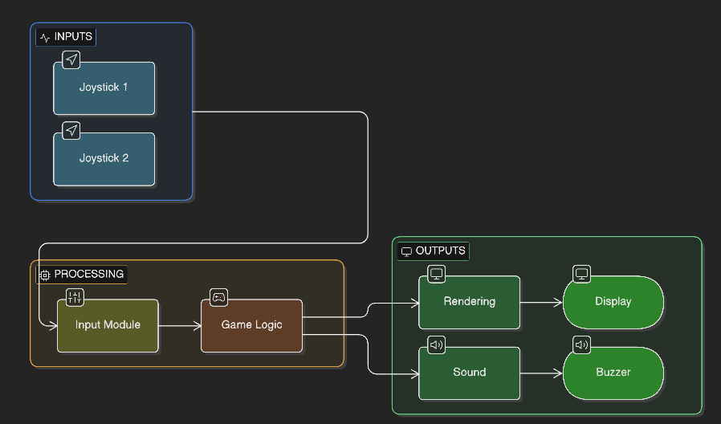

# Project Name
2D Pong Game

:::info 

**Author**: Sirbu Constantin Radu \ 4th year
**GitHub Project Link**: link_to_github

:::

<!-- do not delete the \ after your name -->

## Description

A 2D pong game with two joysticks and one buzzer. The buzzer triggers when losing the game.

## Motivation

I tried doing this project since 2nd year and I never managed to do it so I kept wanting to do this project.

## Architecture 

Add here the schematics with the architecture of your project. Make sure to include:
 - what are the main components (architecture components, not hardware components)
 - how they connect with each other
 
 

## Log


### Week 5 - 11 May
thought about the project
### Week 12 - 18 May
bought the components
### Week 19 - 25 May
-
## Hardware


### Schematics

Place your KiCAD or similar schematics here in SVG format.

### Bill of Materials

<!-- Fill out this table with all the hardware components that you might need.

The format is 
```
| [Device](link://to/device) | This is used ... | [price](link://to/store) |

```

-->

| Device | Usage | Price |
|--------|--------|-------|
| [Raspberry Pi Pico](https://www.raspberrypi.com/documentation/microcontrollers/raspberry-pi-pico.html) | The microcontroller | [35 RON](https://www.optimusdigital.ro/en/raspberry-pi-boards/12394-raspberry-pi-pico-w.html) |
| [2.8" SPI LCD Module with ILI9341 Controller (240 x 320 px)] | The LED | [70 RON] (https://www.optimusdigital.ro/en/resealed/3550-modul-lcd-de-28-cu-spi-i-controller-ili9341-240x320-px.html?gad_source=1&gad_campaignid=19615979487&gbraid=0AAAAADv-p3AvX4X0POF837lfSI6Nsjqij&gclid=Cj0KCQjw77bPBhC_ARIsAGAjjV93YEA_iIiZ_EqFrtgMEX54VtURUpo1L3nTDXg4l05saqf8g_Uji5AaAkG_EALw_wcB)|
| [Joystick] | The Joystick | [5 RON](https://www.optimusdigital.ro/ro/senzori-senzori-de-atingere/742-modul-joystick-ps2-biaxial-negru-cu-5-pini.html?search_query=joystick&results=27) |


## Software

| Library | Description | Usage |
|---------|-------------|-------|
| [st7789](https://github.com/almindor/st7789) | Display driver for ST7789 | Used for the display for the Pico Explorer Base |
| [embedded-graphics](https://github.com/embedded-graphics/embedded-graphics) | 2D graphics library | Used for drawing to the display |

## Links

<!-- Add a few links that inspired you and that you think you will use for your project -->

1. [link](https://example.com)
2. [link](https://example3.com)
...
