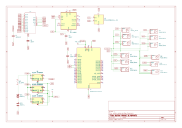
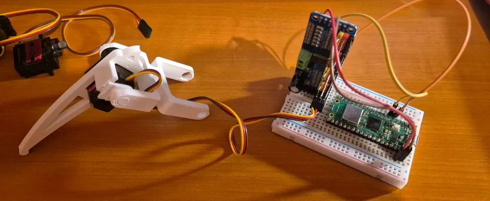
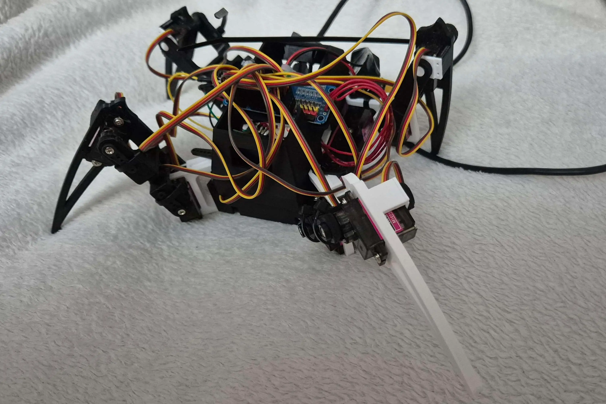
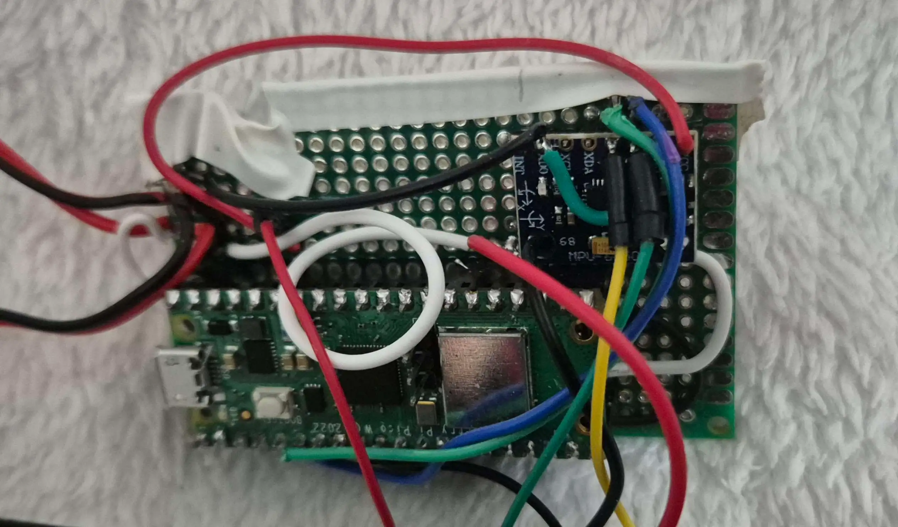

# WidowMaker-Pico
A 4 legged 3 degrees of freedom per leg spider robot controlled via WiFi, phone app control, capable of walking in all directions and stabilizing itself.

:::info


**Author**: Gociu Cristian \
**Github Project Link**: [Code](https://github.com/UPB-PMRust-Students/fils-project-2026-cristiang888/tree/main)

:::

## Description

A 4 legged spider robot controlled via a PC/mobile app over WiFi with a TCP server for real time commands. The robot uses 12 MG90S servo motors (3 per leg) controlled by a PCA9685 PWM 16 channel controller with a Raspberry Pi Pico W running Rust firmware via Embassy-rs. The robot will have a walking pattern with inverse kinematics, will be PC/phone controlled with joystick movement via WiFi, it will have emote animations, faces display and body pose tilting via the MPU6050 gyroscope that I will also use for body orientation sensing and auto leveling.

## Motivation

I chose this project because I always was interested in the design and mechanical movement of robots, practically I wanted to combine mechanical design with embedded programming into this project. Building a walking robot would make me learn and understand inverse kinematics, real time control and sensor fusion, all implemented in a Rust microcontroller, also the app should add a practical and fun user interface that makes the robot interactive.

## Architecture


The system consists of three main components:

1. **Pico W**: Runs Embassy-rs async tasks for WiFi, gait engine, servo control, IMU reading
2. **I2C Peripherals**: PCA9685 servo driver, MPU6050 gyroscope, OLED SSD1306 display all on a shared I2C bus
3. **PC App**: TCP client with joystick, emote buttons and body pose control

### Task Architecture

| Task | Frequency | Purpose |
|------|-----------|---------|
| `wifi_task` | Event-driven | CYW43 WiFi driver background processing |
| `tcp_server_task` | Event-driven | Accept connections, parse JSON commands |
| `gait_task` | 50 Hz | Compute walking foot trajectories and IK |
| `servo_task` | 50 Hz | Write angles to PCA9685 via I2C |
| `imu_task` | 100 Hz | Read MPU6050, complementary filter |
| `display_task` | Event-driven | Render faces on SSD1306 OLED |
| `emote_task` | Event-driven | Play pre-defined animation sequences |

Tasks communicate via Embassy `Channel` and `Signal` primitives

## Log

### Week 5 - 8
I brainstormed ideas, chose my desired topic and got its approval. I ordered components. Verified Pico W blink and I2C channel.

### Week 9
Downloaded Fusion, learned how to use it and designed chassis and legs.

### Week 10
Implemented PCA9685 servo control. Calibrated all 12 servos. Implemented inverse kinematics for 3-DOF legs.

### Week 11
Implemented trot gait engine. Robot can now walk forward/backward. Started the Wifi TCP server.

### Week 12
MPU6050 integration. Body pose control allowing auto-leveling while walking. OLED display with multiple emotion faces.

### Week 13
App with joystick control. Robot responds to phone commands. Added emote animations.

## Hardware

### Components

The system uses a Raspberry Pi Pico W (RP2040) as the main controller and for WiFi, a PCA9685 16-channel as a servo driver, 12 MG90S servos as leg joints, a MPU6050 (GY-521) gyroscope for body orientation sensingm an OLED SSD1306 display and a 7.4V 2S LiPo battery as power source.

### Schematics



### Pin Connections

| Pico W Pin | GPIO | Function | Connected to |
|-----------|------|----------|-------------|
| Pin 6 | GP4 | I2C0 SDA | PCA9685, MPU6050, SSD1306 |
| Pin 7 | GP5 | I2C0 SCL | PCA9685, MPU6050, SSD1306 |
| Pin 36 | 3V3 | Power | All I2C device VCC |
| Pin 39 | VSYS | 5V input | Buck Converter output |

### Power Architecture

```
7.4V LiPo → Switch → UBEC (3A 5V) → Pico W VSYS
                    → Buck Converter (5A 5V) → PCA9685 V+
Pico W 3V3 → PCA9685 VCC, MPU6050 VCC, SSD1306 VCC
```

### Photos







## Bill of Materials

| Device | Usage | Price |
|--------|-------|-------|
| [Raspberry Pi Pico W](https://www.emag.ro/placa-de-baza-raspberry-pi-pico-w-cu-wifi-rp2040-dual-core-133mhz-microcontroller-pentru-iot-si-electronica-ai2381/pd/D4KJVK2BM/?cmpid=146081&utm_source=google&utm_medium=cpc&utm_campaign=(RO:eMAG!)_3P_NO_SALES_>_Componente_PC&utm_content=115828323769&gad_source=1&gad_campaignid=11606737084&gclid=Cj0KCQjwlerQBhDMARIsAB16H-X47ohi8x_ZajxT4Qqahgs9r3cvm7XMjS7f97ifEeb607jUoSyS3-oaAn2oEALw_wcB) | Main controller | 64 RON |
| [Pca9685 Servo Driver](https://www.temu.com/ro/1-2-3-buc-module-pca9685-pca9685-iic-pentru-motoare-servo-pwm-cu-16--și-12-biți-pentru-roboți--g-601100355496589.html?_oak_mp_inf=EI3Vp6mp1ogBGiA4NjI2N2Q3ZTU1YjI0YjM2YWEwYWExYzVhMjQyNzIwNiCU3YLm2TM%3D&top_gallery_url=https%3A%2F%2Fimg.kwcdn.com%2Fproduct%2Ffancy%2Fa5c07b12-b3bc-40b6-a326-81d4e2f11a92.jpg&spec_gallery_id=601100355496589&refer_page_sn=10009&freesia_scene=2&_oak_freesia_scene=2&_oak_rec_ext_1=MjQ2Mg&_oak_gallery_order=1191312462%2C531230121%2C743531249%2C1358287204%2C1877606605&search_key=PCA9685&refer_page_el_sn=200049&refer_page_name=search_result&refer_page_id=10009_1776450097701_g29sw4ggxi&_x_sessn_id=ey611lbklu&is_back=1&no_cache_id=tgkk7) | 16 channel PWM I2C servo driver | 42 Ron (for 2) |
| [MG90S Servo Motor](https://www.temu.com/ro/6-12-buc--servo-metalic-digital-180-360-grade-9g-servo-pentru-rc-elicopter-avion-barcă-mașină-pentru-robot-rc-g-601103280126641.html?_oak_mp_inf=ELH18Ju01ogBGiA4ZDY2NWY4MTY5MzU0ZmJjYTY5NmJmYWIwNGMzM2QxMiDqo4PS5zM%3D&top_gallery_url=https%3A%2F%2Fimg.kwcdn.com%2Fproduct%2Falgo_framework%2FImageCm2InAlgo%2Fc22de7f0-8588-11f0-abf5-0a580aae06eb.jpg&spec_gallery_id=21257169865&refer_page_sn=10009&freesia_scene=2&_oak_freesia_scene=2&_oak_rec_ext_1=NzU3NA&_oak_gallery_order=1180319558%2C1715555062%2C896524721%2C1030074420%2C1861831648&search_key=mg90s&refer_page_el_sn=200049&_x_sessn_id=uqorzot09m&refer_page_name=search_result&refer_page_id=10009_1780167530672_mw820smykz) | 3 DOF movement for walking, rotating and stabilizing | 200 Ron |
| [MPU6050 Module (GY-521)](https://www.temu.com/goods.html?_bg_fs=1&goods_id=601105669030266&sku_id=17620589818528&_oak_page_source=501) | IMU data | 20 Ron |
| [OLED SSD1306 Display 128x64](https://www.temu.com/ro/modul--oled-de-3-5-bucăți-0-96-inch--128x64-ss-d-1306-3-3v-5v-albastru-albastru--alb-pentru--esp32--g-601100873548997.html?_oak_mp_inf=EMWJq6Cr1ogBGiAyMjc2NTNiZDk1Zjg0ODMxYTRlNDkyMzRhZTgxZWExMCDeqbXl2TM%3D&top_gallery_url=https%3A%2F%2Fimg.kwcdn.com%2Fproduct%2Ffancy%2Ff21e66f3-4965-44cb-868f-9d77ee60265d.jpg&spec_gallery_id=601100873548997&refer_page_sn=10032&freesia_scene=2&_oak_freesia_scene=2&_oak_rec_ext_1=Mzc3Ng&_oak_gallery_order=873972831%2C362572049%2C1027238121%2C856480759%2C486335958&search_key=ssd1306%20128x64&refer_page_el_sn=200049&_x_vst_scene=adg&_x_ads_sub_channel=shopping&_x_ns_prz_type=-1&_x_ns_sku_id=17596261949746&_x_ns_gid=601100529547331&_x_ads_channel=google&_x_gmc_account=5584549973&_x_login_type=Google&_x_ns_gg_lnk_type=adr&_x_ads_account=2931150409&_x_ads_set=22721106167&_x_ads_id=181621844636&_x_ads_creative_id=760540581553&_x_ns_source=g&_x_ns_gclid=EAIaIQobChMInNqn_b_1kwMVy6-DBx2eQgAwEAQYBiABEgJSOvD_BwE&_x_ns_placement=&_x_ns_match_type=&_x_ns_ad_position=&_x_ns_product_id=5584549973-17596261949746&_x_ns_target=&_x_ns_devicemodel=&_x_ns_wbraid=Cj8KCQjwkYLPBhD2ARIuAF-q4nCepWuWIWHLpv602E8UtDEQ8vQHAzwxz7xIlnTGtGp6vYvO5fcAGfIVDxoCEHI&_x_ns_gbraid=0AAAAAo4mICGcvPqCgxLM19L6s2tg6olsW&_x_ns_targetid=pla-2420677801334&_x_sessn_id=ey611lbklu&refer_page_name=goods&refer_page_id=10032_1780166585367_nrbkl915rh&is_back=1&no_cache_id=rfmp2) | Display for the faces | 15 Ron | 
| [7.4V 2S LiPo Battery 1000mAh](https://www.temu.com/goods.html?_bg_fs=1&goods_id=601101361480922&sku_id=17599475810315&_oak_page_source=501) | Power source | 56 Ron |
| [2s LiPo charger](https://sigmanortec.ro/Incarcator-Imax-B3-Pro-Compact-baterii-litiu-cu-balans-2s-si-3s-p172445880?gad_source=1&gad_campaignid=23622549727&gclid=Cj0KCQjwlerQBhDMARIsAB16H-U3oMOgZPHatZOXaxJbb0T0dq-hC7JqAfUx_U0XPsLu5ndSMUt71dsaAr1TEALw_wcB) | Charger for battery | 43 Ron |
| [5V 5A Buck Converter](https://www.emag.ro/modul-dc-dc-step-down-5a-xl4005/pd/DCFDSBMBM/?ref=history-shopping_488921040_42976_1) | Buck converter to reduce 7.4V down to 5V for the servos | 15 Ron |
| [5V 3A UBEC](https://www.temu.com/ro/5-buc-mini--regulator--modul-step-down-3a-5v-12v-24v-la-3-3v-5v-ieșire-fixă-g-601101939535839.html?_oak_mp_inf=EN%2Ff0Zyv1ogBGiA0ZWVjOTBlYTU0N2M0ZGVkYTQxNTNmMTg5MmRlNmM0MiDq6YvS5zM%3D&top_gallery_url=https%3A%2F%2Fimg.kwcdn.com%2Fproduct%2Ffancy%2Fb4cbc2a5-7153-4bda-84ea-749d123960da.jpg&spec_gallery_id=264950&refer_page_sn=10009&freesia_scene=2&_oak_freesia_scene=2&_oak_rec_ext_1=MjA1Nw&_oak_gallery_order=107559120%2C2047363892%2C946170829%2C536712032%2C265231790&search_key=5v%203a&refer_page_el_sn=200049&_x_sessn_id=uqorzot09m&refer_page_name=search_result&refer_page_id=10009_1780167669835_2wy1veituo) | Buck converter to reduce 7.4V down to 5V for the RPi | 24 Ron (for 5) |
| [Protoboard](https://www.temu.com/goods.html?_bg_fs=1&goods_id=601100275085091&sku_id=17595419494296&_oak_page_source=501) | Board to solder all the power and communication rails | 13 Ron (for 5) |
| [Switches](https://www.temu.com/goods.html?_bg_fs=1&goods_id=601100829692736&sku_id=17597354201422&_oak_page_source=501) | Switch for powering on and off | 12 Ron (for 5) |
| [XT30 pair connectors](https://www.temu.com/goods.html?_bg_fs=1&goods_id=601099579571808&sku_id=17592462135955&_oak_page_source=501) | Tips for wires to connect eachother | 15 Ron |
| [Pin Headers (male+female)](https://www.temu.com/ro/set-de-22-bucăți-conectori-cu-capete-de-pini-tată-și-mamă-de-2-54-mm-capete-de-pini-detașabile-cu-40-de-pini-și-capete-de-pini-pentru-plăci-pcb-g-601099578435866.html?_oak_mp_inf=EJrS47am1ogBGiBhZDk2ZjExN2UxZmE0YTM4ODIwZmM2YTU5OTA2NDU5NSDV7JHS5zM%3D&top_gallery_url=https%3A%2F%2Fimg.kwcdn.com%2Fproduct%2Ffancy%2F6be682b1-9189-4288-b386-6689ccd0805a.jpg&spec_gallery_id=4012&refer_page_sn=10009&freesia_scene=2&_oak_freesia_scene=2&_oak_rec_ext_1=MTg1NQ&_oak_gallery_order=1176986873%2C2017178974%2C245251932%2C273286733%2C2108065471&search_key=pin%20header&refer_page_el_sn=200049&refer_page_name=search_result&refer_page_id=10009_1780167669835_2wy1veituo&_x_sessn_id=uqorzot09m) | To help soldering the board and components | 19 Ron |
| 3D Printing Filament | Used for the custom design of my project | 100 RON |
| [Wires for power](https://www.temu.com/goods.html?_bg_fs=1&goods_id=601100804339744&sku_id=17597236994821&_oak_page_source=501), [heat shrinks](https://www.temu.com/goods.html?_bg_fs=1&goods_id=601099513034793&sku_id=17592194088712&_oak_page_source=501) and [jumper wires](https://www.temu.com/goods.html?_bg_fs=1&goods_id=601101691478280&sku_id=17601052687296&_oak_page_source=501) | Soldering on the board and power insulation | 70 Ron |
| Total | | 708 |

## Software

### PC Python App

App with 4 tabs:
1. **Move**: Virtual joystick for walking direction
2. **Emotes**: Grid of emote buttons (wave, dance, bow, etc.)
3. **Faces**: Grid of face buttons (happy, sad, angry, etc.)
4. **Pose**: Virtual joystick for body pitch/roll control

| Library | Category | Usage |
|---------|----------|-------|
| [`embassy-executor`](https://crates.io/crates/embassy-executor) | Async Runtime | Provides the async task executor to run background routines concurrently |
| [`embassy-rp`](https://crates.io/crates/embassy-rp) | HAL Layer | Low level peripheral hardware abstraction layer for the RP2040 (GPIO, I2C, Time-driver) |
| [`embassy-time`](https://crates.io/crates/embassy-time) | Timing | Manages asynchronous timers and clock ticks required for servo PWM adjustments |
| [`embassy-sync`](https://crates.io/crates/embassy-sync) | Synchronization | Implements Channel and Signal blocks to pass data safely between tasks |
| [`embassy-net`](https://crates.io/crates/embassy-net) | Networking | TCP/IP network stack handling the embedded TCP socket listener on port 8080 |
| [`cyw43`](https://crates.io/crates/cyw43) and [`cyw43-pio`](https://crates.io/crates/cyw43-pio) | Wireless Driver | Controls the CYW43439 physical hardware chip on the Pico W for stable Wi-Fi operations |
| [`pwm-pca9685`](https://crates.io/crates/pwm-pca9685) | Hardware Driver | I2C driver used to command the 16-channel PWM controller handling the 12 leg servos |
| [`mpu6050-dmp`](https://crates.io/crates/mpu6050-dmp) | Hardware Driver | Decodes Digital Motion Processor sensor fusion inputs from the gyroscope for stabilization |
| [`ssd1306`](https://crates.io/crates/ssd1306) | Hardware Driver | I2C interface driver used to control the 0.96" OLED display graphics buffer |
| [`embedded-graphics`](https://crates.io/crates/embedded-graphics) | Graphics UI | Draws pixel art, rendering the active emotions animation frames on the OLED |
| [`serde`](https://crates.io/crates/serde) and [`serde-json-core`](https://crates.io/crates/serde-json-core) | Data Parsing | Embedded no allocation JSON framework to deserialize app movement packets into system data structs |
| [`heapless`](https://crates.io/crates/heapless) | Data Structures | Provides static, fixed size data arrays and rings without requiring memory heap allocations |
| [`libm`](https://crates.io/crates/libm) | Core Math | Trigonometric implementation tracking (sin, cos, atan2, sqrt) required for the Inverse Kinematics math |
| [`defmt`](https://crates.io/crates/defmt) and [`defmt-rtt`](https://crates.io/crates/defmt-rtt) | System Logging | Provides information back to me regarding the robot |
| [`panic-probe`](https://crates.io/crates/panic-probe) | Safety Diagnostics | Intercepts firmware runtime panic failures and streams the exact file via probe-rs |
| [`cortex-m`](https://crates.io/crates/cortex-m) and [`cortex-m-rt`](https://crates.io/crates/cortex-m-rt) | Target Runtime | Assembly routines and execution initialization for Cortex-M0+ processing hardware |

## Links

### Crate Registries
1. [Embassy](https://embassy.dev)
2. [PCA9685 PWM Driver Crate](https://crates.io/crates/pwm-pca9685)
3. [PCA9685 product data sheet](https://www.nxp.com/docs/en/data-sheet/PCA9685.pdf)
4. [MPU6050 Gyroscope Driver Crate](https://crates.io/crates/mpu6050-dmp)
5. [SSD1306 OLED Driver Crate](https://crates.io/crates/ssd1306)
6. [Embedded Graphics Library](https://crates.io/crates/embedded-graphics)
7. [Serde JSON Core Crate](https://crates.io/crates/serde-json-core)
8. [Heapless Static Collections](https://crates.io/crates/heapless)
9. [Project inspiration](https://www.youtube.com/watch?v=xd8dKY6Ozrg)
