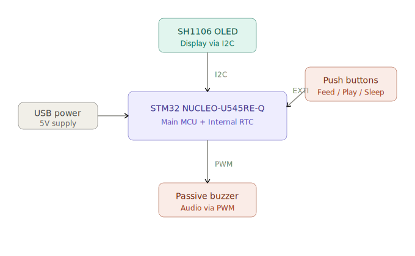
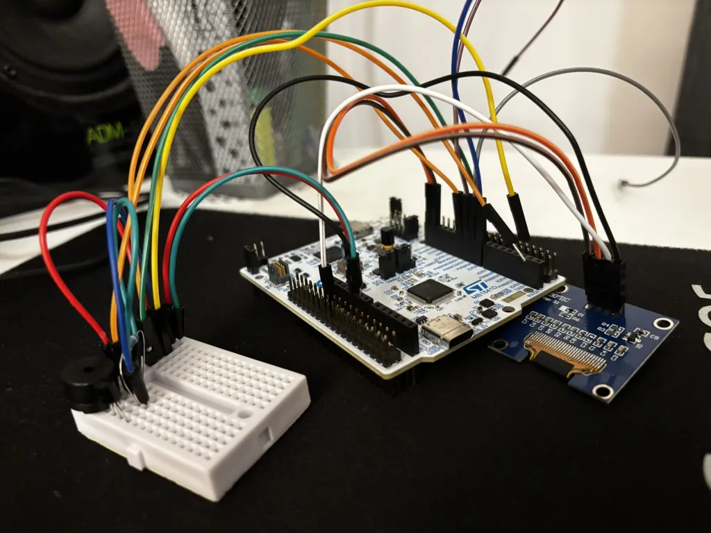
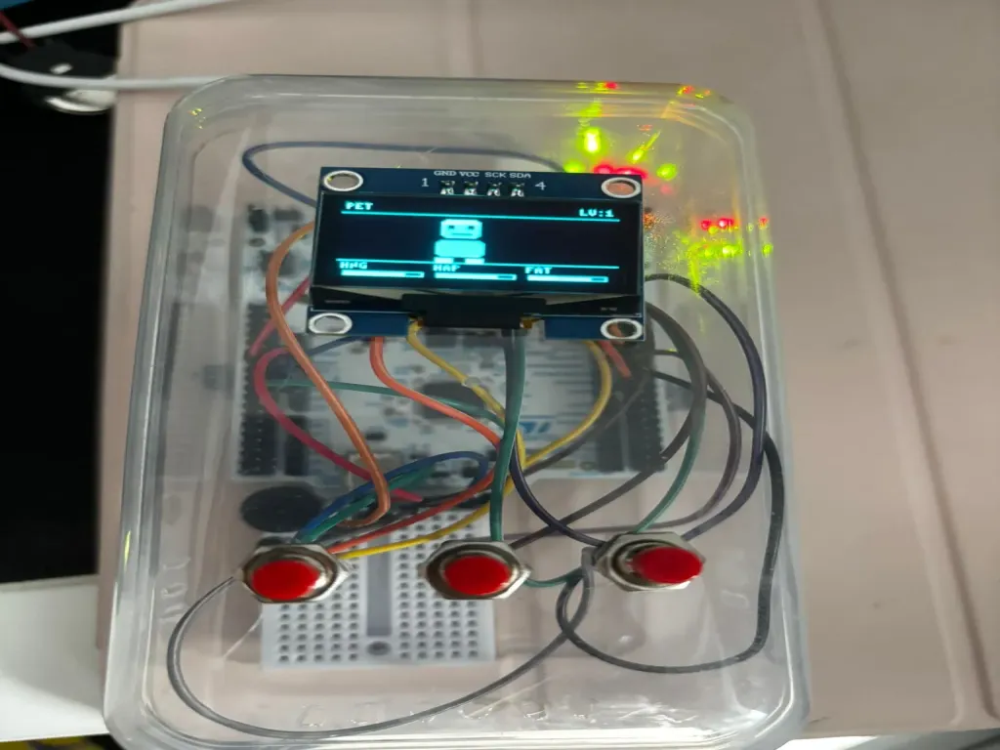
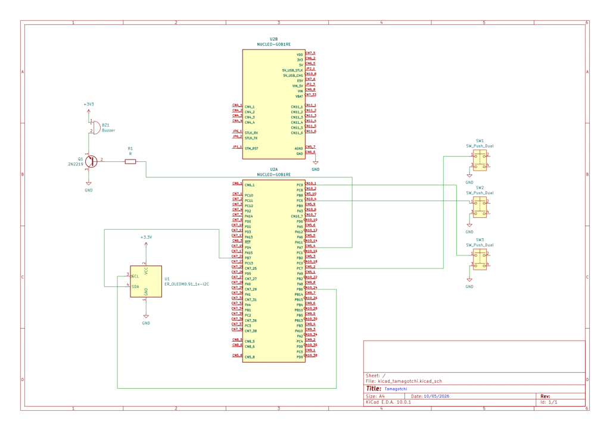

# Tamagotchi
A virtual pet that lives, grows, and misses you when you're away

:::info

**Author:** Vasile Delia  
**GitHub Project Link:** https://github.com/UPB-PMRust-Students/fils-project-2026-deliavasile

:::

## Description

A Tamagotchi (digital pet) built on the STM32 NUCLEO-U545RE-Q microcontroller, programmed entirely in Rust. The system uses a finite state machine with 11 distinct pet states and 5 concurrent async tasks running on the Embassy framework. It provides visual feedback via an SH1106 OLED screen with custom pixel-art animations, audio feedback via a PWM-driven passive buzzer with unique melodies per state, and accepts input via three physical buttons (Feed, Play, Sleep). The pet's stats (hunger, happiness, fatigue) decay over time, driving state transitions and triggering warning sounds.

## Motivation

I chose this project because it combines several embedded systems concepts (async Rust, I2C, PWM, state machines) in a fun and interactive way. It also presents a real challenge: managing time-based state changes using the internal RTC of the microcontroller.

## Architecture

The main components of the system are:
- **STM32 NUCLEO-U545RE-Q** — main microcontroller with internal RTC running Embassy/Rust
- **SH1106 OLED screen** — displays the pet's current state via I2C
- **3 push buttons** — user input (Feed, Play, Sleep) via EXTI interrupts
- **Passive buzzer + transistor** — audio feedback via hardware PWM

## Log

### Week 5 - 6
Brainstormed project ideas and consulted with the lab professor to decide on the final concept.

### Week 7
Project got approved. Ordered the necessary hardware components.

### Week 8 - 9
Set up the development environment and started experimenting with Embassy on the NUCLEO board.

### Week 10 - 11
Developed the KiCad schematic and assembled the prototype for the project.

### Week 12
Implemented the pet FSM, display rendering, button input, and PWM audio.

### Week 13
Debugged async task interactions. Tuned gameplay parameters and finalized the hardware assembly.

## Hardware

The project uses the STM32 NUCLEO-U545RE-Q as the main microcontroller. An SH1106 OLED screen is connected via I2C. Three push buttons handle user input and a passive buzzer driven by a transistor provides audio feedback.

## Schematics

## Bill of Materials

| Device | Usage | Price |
|--------|-------|-------|
| STM32 NUCLEO-U545RE-Q | Main microcontroller | — |
| SH1106 OLED screen | Graphical interface | 20 RON |
| 3x Push buttons | User input (Feed/Play/Sleep) | 5 RON |
| Passive buzzer + transistor | Audio feedback | 6 RON |
| Jumper wires + breadboard | Assembly | 15 RON |

## Software

| Library | Description | Usage |
|---------|-------------|-------|
| `embassy-stm32` | Async HAL for STM32 | I2C, EXTI, TIM3 PWM, RCC |
| `embassy-executor` | Async task executor | 5 concurrent tasks, cooperative scheduling |
| `embassy-time` | Async time management | Timers, tick scheduling, debounce |
| `embassy-sync` | Sync primitives | Mutex, Channel for shared state |
| `embedded-graphics` | 2D graphics library | Drawing to the OLED display |
| `sh1106` | Display driver for SH1106 | Used for the OLED screen |
| `embedded-hal 0.2` | Hardware | PWM trait for buzzer control |
| `defmt` | Logging framework | Debugging |

## Links

1. [GitHub Project](https://github.com/UPB-PMRust-Students/fils-project-2026-deliavasile)
2. [Embassy Documentation](https://embassy.dev/book/)
3. [STM32 NUCLEO-U545RE-Q Documentation](https://www.st.com/en/evaluation-tools/nucleo-u545re.html#documentation)
