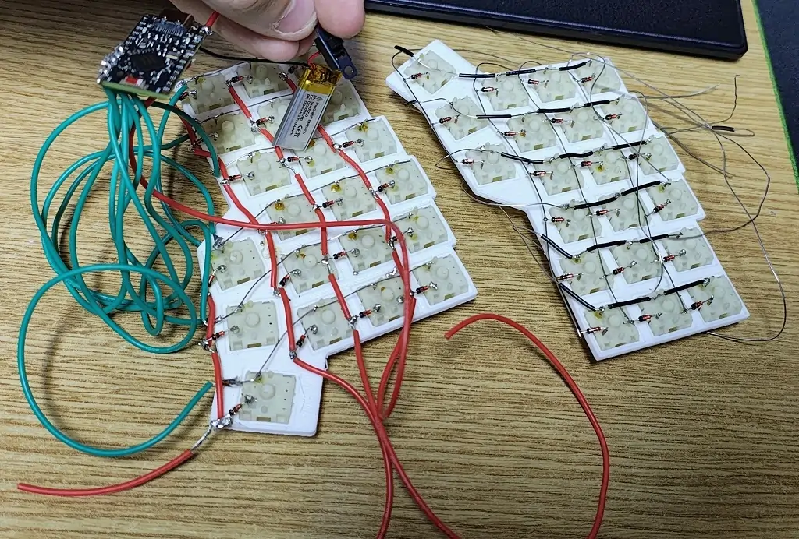
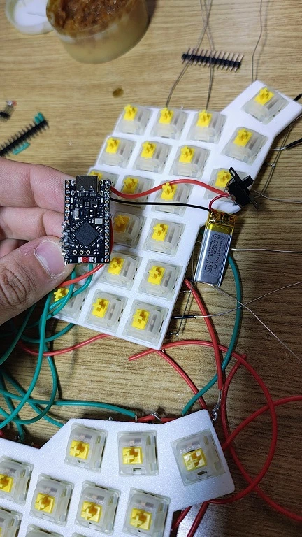
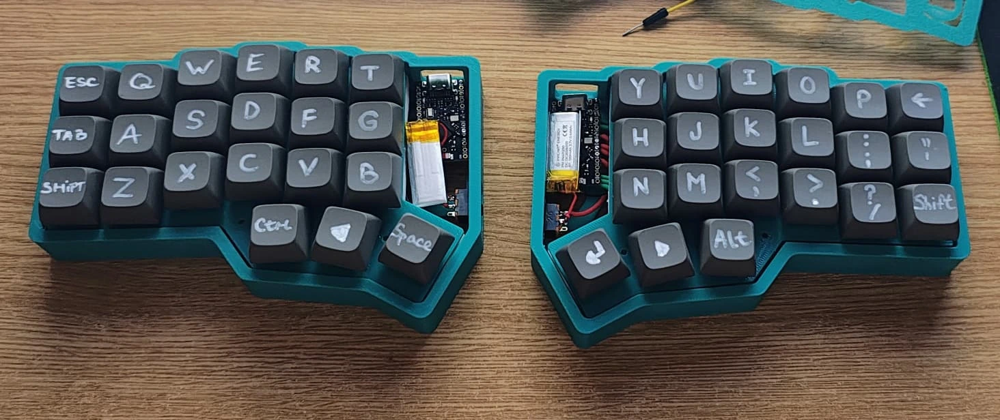
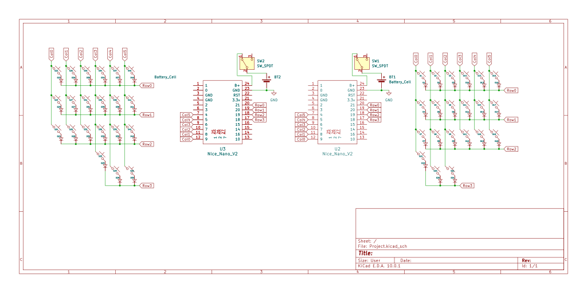

# Custom Handwired Rust-BLE Keyboard

A fully custom, 3D-printed, Bluetooth split mechanical keyboard built without a PCB, running Rust firmware on nRF52840 microcontrollers.

:::info 

**Author**: Constantin Eduard-Andrei \
**GitHub Project Link**: https://github.com/UPB-PMRust-Students/fils-project-2026-Edward-game-scr

:::

<!-- do not delete the \ after your name -->

## Description

This project is a custom-built, wireless split mechanical keyboard based on the ergonomic **Corne** layout (4 rows × 6 columns per half, plus a 3-key thumb row on each side). There is no PCB: every switch is handwired into a diode matrix and mounted in a 3D-printed plate!

Each half uses a **SuperMini nRF52840** (Adafruit nRF52 Bootloader, UF2 drag-and-drop flashing). The firmware is written in **Rust** and built on the **RMK 0.8** framework with a **dual-binary BLE split** architecture: the left half acts as the **central** (USB/BLE to the PC, full keymap), and the right half acts as the **peripheral** (scans its matrix and sends coordinates over Bluetooth). Configuration lives in `keyboard.toml` (pins, matrix map, three layers).

The original plan was to implement matrix scanning, debouncing, and a BLE HID keyboard stack manually with **embassy-rs** and Nordic’s softdevice bindings. After roughly a week of attempts where the nRF52840 radio/HID path never came together reliably, the project moved to **RMK**, which still uses Embassy and modern Rust async patterns under the hood but provides a proven split-BLE and keymap pipeline.

## Motivation

I chose this project to get real experience on both sides of a custom keyboard: bare-metal wiring and modern embedded Rust.

On the **hardware** side, handwiring forces you to understand rows, columns, diodes, ghosting, and how few GPIO pins can serve many keys. On the **software** side, I wanted to learn how a keyboard actually becomes a BLE HID device not just flash someone else’s binary.

A practical goal too: a compact wireless keyboard for the TV/PC so searching and typing away from the desk is faster than a remote.

## Architecture

### Hardware

- **Layout**: Split Corne — 21 keys per half (18 in the main 3×6 grid + 3 thumb keys).
- **Matrix**: 4×6 per half; **1N4148 diodes** (column → row) to prevent ghosting.
- **Controllers**: Two **SuperMini nRF52840** boards (nice!nano v2–class clones).
- **Power**: **3.7 V LiPo** per half with a slide power switch.
- **Structure**: 3D-printed switch plate and case; **24 AWG** solid wire for row/column buses.

### Firmware (final)

| Role | Binary | UF2 output | Responsibility |
|------|--------|------------|----------------|
| Left half | `central` | `NEW_LEFT.uf2` | BLE central, matrix scan (cols 0–5), USB/BLE HID to host, full keymap |
| Right half | `peripheral` | `peripheral.uf2` | BLE peripheral, matrix scan (cols 6–11 via `col_offset = 6`), sends `(row, col)` to central |

**Pin map (both halves, local wiring)** — inner column toward the split, outer toward the pinky:

| Row | MCU pin |
|-----|---------|
| Row 1 (top) | P0_31 |
| Row 2 | P0_29 |
| Row 3 | P0_02 |
| Row 4 (thumb) | P1_15 |

| Col | MCU pin |
|-----|---------|
| Col 1 (inner) | P1_06 |
| Col 2 | P1_04 |
| Col 3 | P0_11 |
| Col 4 | P1_00 |
| Col 5 | P0_24 |
| Col 6 (outer) | P0_22 |

**Keymap (3 layers)** — defined in `keyboard.toml`:

- **Layer 0**: QWERTY Corne base; left thumb `MO(1)` (symbols), right thumb `MO(2)` (nav/F-keys/BT).
- **Layer 1**: Numbers and symbols (`\` `~` `!` … `[]` `{}`, etc.).
- **Layer 2**: F-keys, arrows, paging, BLE profile/clear (`User1` / `User2` / `User5`), and modifier combos (`WM(...)`) for shortcuts.

**Build & flash**

```text
cargo build --release --bin central    →  NEW_LEFT.uf2   (left only)
cargo build --release --bin peripheral →  peripheral.uf2 (right only)
cargo make uf2                         →  both UF2 files
```

Family ID for UF2: `0xada52840` (Adafruit nRF52). Flash memory layout reserves the bootloader region (`FLASH` from `0x1000`).

### Software path (what actually happened)

1. **Week ~1 (failed path)**: Custom `embassy-nrf` + softdevice/BLE HID experiments—matrix ideas worked in isolation, but getting a stable BLE keyboard device on the nRF52840 did not, despite many rebuild/flash cycles.
2. **Final path**: **RMK 0.8.2** with `rmk_central` / `rmk_peripheral` macros, `keyboard.toml`, and **Vial-compatible** storage. Minimal application code (`central.rs`, `peripheral.rs`); complexity moved into configuration and build tooling.

## Log

<!-- Progress log (~3-day intervals). Hardware and bring-up took the majority of the project time. -->

### 5–8 May

Finalized the Corne layout choice and BOM. Ordered SuperMini nRF52840 boards, Gateron Milky Yellow switches, 1N4148 diodes, LiPo cells, wire, keycaps, and power switches. Started the 3D model/plate while waiting on shipping.

### 9–11 May

Parts still in transit. Read nRF52840 docs, Embassy book chapters, and split-keyboard matrix guides. Sketched row/column routing on paper so the handwire would not be guesswork later.

### 12–15 May

Printed the switch plate and case pieces. Began the **left half** handwire: diode orientation (column → row), column buses along the inner edge, first row soldered. Multimeter continuity checks after every few keys—caught one reversed diode early.

### 16–18 May

Finished the left matrix and installed the LiPo + slide switch. Smoke test: power only, then tweezers on row/column pins. Connected one row and one column to the SuperMini to confirm a single intersection could be detected. **Right half not started yet**—wanted one working grid first.

### 19–21 May

Completed **right half** wiring using the same pinout as the left (per-half local row/col numbering). Set up the Rust toolchain (Windows + WSL), `thumbv7em-none-eabihf` target, `flip-link`, and `cargo-binutils`. First flashes used a single-binary approach; behavior was inconsistent on the split.

### 22–24 May

**Hardest software stretch:** tried to implement the keyboard **without RMK**—Embassy executor, GPIO matrix scan, debouncing, and BLE HID using Nordic stack crates (`nrf-softdevice` / related paths). Spent about **a week** here: device would compile and flash, but BLE advertising/HID reports never behaved like a real keyboard on the host. nRF52840 + softdevice + HID from scratch was a wall; pivoted to **RMK** as a maintained framework that already solves split BLE and keymaps.

### 25–27 May

Regenerated the project around **RMK 0.8** dual binaries (`central` / `peripheral`). Configured `keyboard.toml` (matrix pins, `matrix_map`, BLE addresses). **Left controller** refused to take new firmware for a while (old image kept running); later fixed with proper UF2 flash and `clear_storage`. Right half flashed as `peripheral.uf2` and paired over BLE. Hit Windows path length limits during builds moved/cloned the repo to a shorter path.

### 28 May

Left matrix still typed garbage: all keys repeating one character, then a scrambled QWERTY-like grid. Root causes: (1) **stale keymap in flash** (RMK Vial storage overriding `keyboard.toml`), (2) **wiring** not matching the assumed column order. Rewired to the documented pin table; `clear_storage = true` once to prove `keyboard.toml` was live (`Esc` / `Q` test grid). Confirmed **Corne Split** BLE name and stable per-key output.

### 29 May

Removed `clear_storage` (kept `clear_layout` while iterating). Implemented full **3-layer Corne keymap** (base, symbols `MO(1)`, nav/F-keys/BT `MO(2)`). Rebuilt `NEW_LEFT.uf2`; left + right halves work together over BLE. **Project functionally complete.**

## Hardware

The hardware relies on a 3D-printed chassis to hold the switches, eliminating the need for a PCB. Logic is handled by nRF52840 SuperMini boards for low power and BLE.







### Schematics



### Bill of Materials

| Device | Usage | Price |
|--------|--------|-------|
| [SuperMini NRF52840](https://shorturl.at/LceaZ) | Microcontroller (one per half) | [45 RON](https://shorturl.at/Ukoo9) |
| [Liter Energy 120mAh 3.7V LiPo (401230)](https://shorturl.at/YeYWx) | Power supply (per half) | [100 RON](https://shorturl.at/ZWF5S) |
| [Gateron Milky Yellow Pro](https://shorturl.at/b2qIj) | Linear switches | [125 RON](https://www.gateron.co/products/gateron-ks-3-milky-pro-switch-set) |
| [1N4148 diodes](https://www.vishay.com/docs/81857/1n4148.pdf) | Anti-ghosting in the matrix | [16 RON](https://rb.gy/56u5x7) |
| [24AWG solid core wire](https://www.optimusdigital.ro/en/kits/11950-plusivo-silicone-wire-kit-24awg-6-colors-9m-each-0721248989734.html) | Row/column harness | [24 RON](https://www.aliexpress.com/item/1005010758626132.html) |
| [PBT XDA 1U keycaps](https://ymdkey.com/products/ymdk-black-white-orange-red-gray-blue-beige-xda-1u-keycaps) | Keycaps | [58 RON](https://www.aliexpress.com/item/1005010588479682.html) |
| [SS12F15 slide switches](https://leeselectronic.com/qc/product/31191-slide-switch-chassis-mount-on-on-spdt-1a-125vac.html) | Battery power switch | [36 RON](https://www.aliexpress.com/item/1005010262474497.html) |

## Software

### Libraries used (final firmware)

| Library | Description | Usage |
|---------|-------------|-------|
| [RMK](https://github.com/haobogu/rmk) 0.8 | Rust keyboard firmware framework | Split BLE, keymap, debounce, HID to host; `rmk_central` / `rmk_peripheral` |
| [embassy-rs](https://github.com/embassy-rs/embassy) | Async embedded runtime | Used internally by RMK (GPIO, timers, USB) |
| [embassy-nrf](https://crates.io/crates/embassy-nrf) | nRF52840 HAL | Pin/matrix drivers for SuperMini |
| [nrf-sdc](https://github.com/alexmoon/nrf-sdc) | SoftDevice Controller (Rust) | BLE stack integration for nRF52840 |
| [defmt](https://github.com/knurling-rs/defmt) | Embedded logging | Debug over RTT during development |

### Attempted stack (not used in final build)

| Library | Why it was tried |
|---------|------------------|
| nrf-softdevice (Embassy) | Direct BLE peripheral + HID from scratch |
| Custom HID report code | Pair with hand-rolled matrix scanner |

After ~one week without a reliable BLE keyboard on hardware, these were abandoned in favor of RMK’s proven split and Vial/storage support.

### Repository layout (firmware)

| File | Purpose |
|------|---------|
| `keyboard.toml` | Pins, split BLE addresses, matrix map, layers |
| `src/central.rs` | Left half — BLE central entry point |
| `src/peripheral.rs` | Right half — BLE peripheral entry point |
| `Makefile.toml` | `cargo make uf2` — builds both `.uf2` images |
| `memory.x` | Linker layout for Adafruit bootloader |
| `vial.json` | Vial GUI matrix definition (optional tuning) |

## Links

1. [RMK documentation](https://rmk.rs/docs/)
2. [Embassy book](https://book.embassy.dev/)
3. [Rust Embedded Book](https://docs.rust-embedded.org/book/)
4. [nRF52840 product specification](https://docs.nordicsemi.com/bundle/ps_nrf52840/page/keyfeatures_html5.html)
5. [Corne layout reference](https://github.com/foostan/crkbd) — physical key arrangement inspiration
6. [Adafruit nRF52 Bootloader](https://github.com/adafruit/Adafruit_nRF52_Bootloader) — UF2 flashing on SuperMini

## Status

**Complete.** Both halves type over BLE with a three-layer Corne keymap. Future tweaks are `keyboard.toml` edits + reflash `NEW_LEFT.uf2` on the central only; the peripheral only needs a reflash if matrix pins or BLE pairing metadata change.
