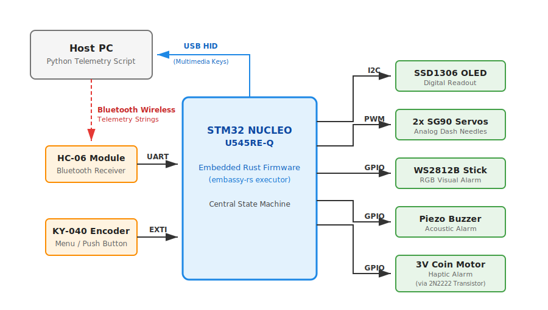
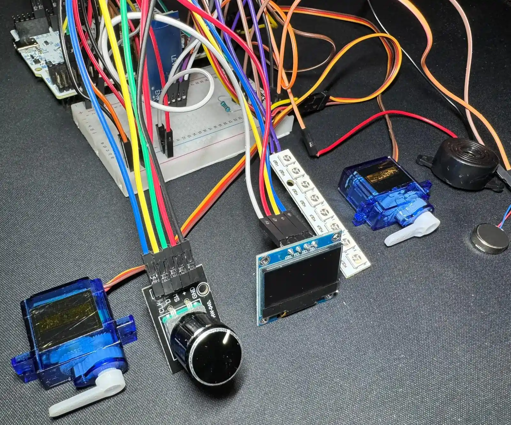
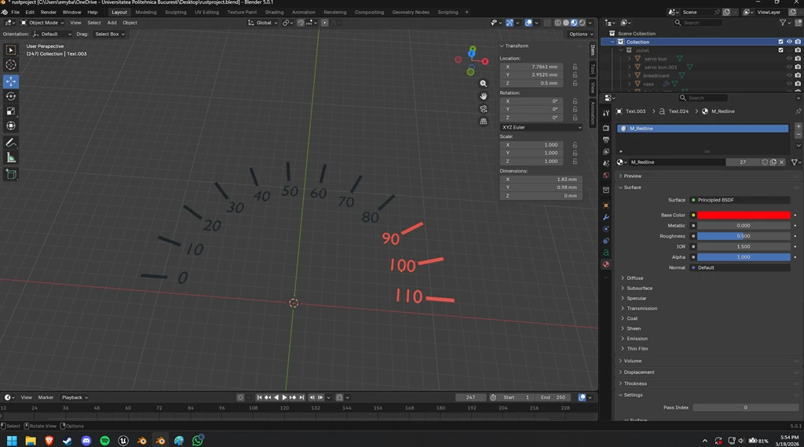
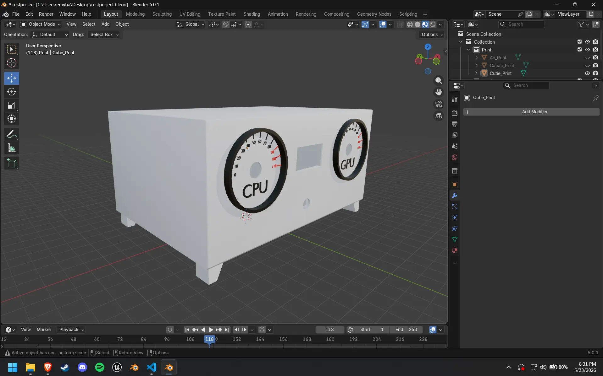
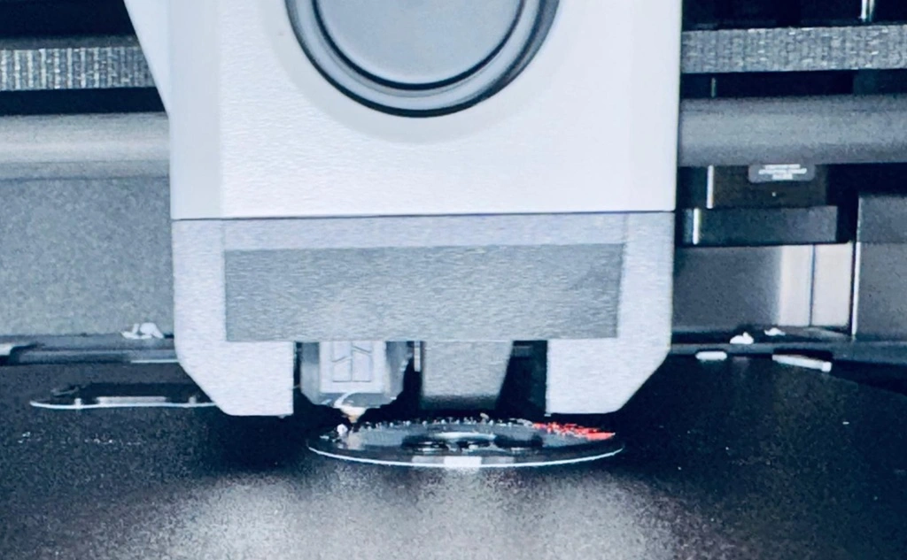
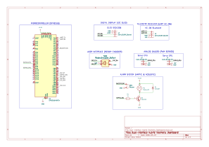
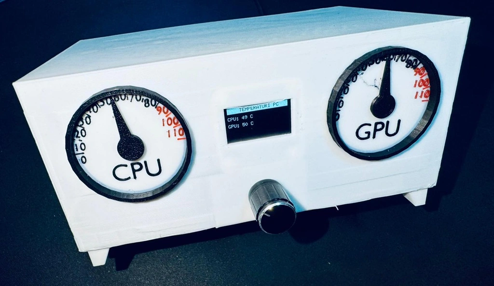
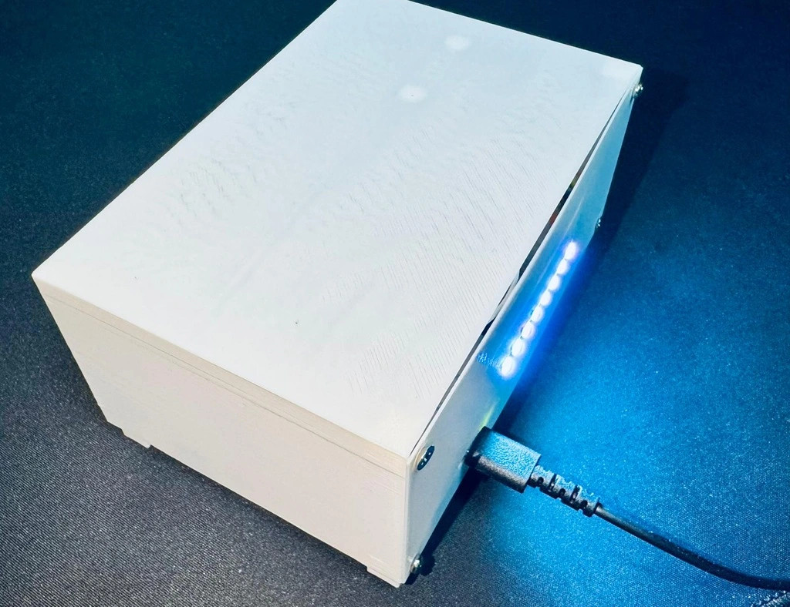

# Dual-Interface Hybrid Telemetry Dashboard

An interactive, physical desktop dashboard that monitors PC hardware telemetry in real-time.

:::info

**Author**: Balasa Emilian-Valentin \
**GitHub Project Link**: https://github.com/UPB-PMRust-Students/fils-project-2026-EmilianBalasa

:::

## Description

The goal of this project is to build an interactive, physical desktop dashboard that monitors PC hardware telemetry in real-time. Instead of relying on traditional on-screen software overlays, this device brings the data to the physical world using a custom 3D-printed enclosure, analog gauges, and a digital display.

The system communicates with the host PC via a wireless Bluetooth connection (HC-05 via UART), while a standard USB cable is used solely to provide a stable 5V power supply to the internal components. A dedicated Python host script runs continuously in the background on the PC, extracting system metrics and transmitting them to the dashboard.

On the front panel, two SG90 servo motors act as analog needles constantly displaying the hardware temperatures—the left gauge is dedicated to the CPU, while the right gauge monitors the GPU. Between them, an SSD1306 OLED screen provides detailed digital readouts. By rotating the KY-040 encoder, the user can switch the OLED menu from the temperature readouts to view the real-time internet Network speeds (download and upload rates).

The dashboard also features an active hardware alarm with multi-sensory feedback. For demonstration and safety purposes, if the temperatures exceed the hardcoded thresholds (>80°C for the CPU or >70°C for the GPU), the STM32 triggers a piezo buzzer, activates a coin vibration motor, and shifts the WS2812B RGB LED lighting to a flashing red state. Additionally, pressing the encoder button sends a wireless command back to the PC, where the Python script automatically intercepts it and toggles the host's audio state (Mute/Unmute).

## Motivation

I chose this project because I wanted to build something I would actually use every day on my desk, rather than just a laboratory prototype. Monitoring thermals is important for PC performance, but software overlays can be annoying and take up valuable screen space while working or gaming. A dedicated physical dashboard solves this problem elegantly.

From a technical perspective, I wanted a project that forces me to dive deep into Embedded Rust and the `embassy-rs` framework. Managing two separate communication interfaces (UART and USB), driving PWM servos, reading an I2C display, controlling Neopixel LEDs, and handling external interrupts for the encoder at the same time is the perfect scenario to learn and apply asynchronous programming and safe task synchronization in Rust.

## Architecture

The project revolves around the **STM32 NUCLEO-U545RE-Q** microcontroller acting as the central state machine.

* **Inputs:** The HC-05 module receives serial data strings from a Python script on the PC. The Rotary Encoder sends EXTI signals to navigate the menu.
* **Processing:** Using *embassy-executor*, independent tasks run concurrently. Data is passed safely between these tasks using *embassy-sync* Channels.
* **Outputs:** The STM32 calculates PWM duty cycles to move the servo needles, formats text to the OLED via I2C, triggers GPIO pins for the buzzer and vibration motor, updates the RGB LEDs, and sends standard USB HID keyboard reports.

## Log

### Week 5

Defined the project's core idea and established the general system direction: a physical telemetry dashboard. Researched communication protocols between the PC and STM32 (UART via Bluetooth and USB HID) and drafted the initial architecture documentation. Placed the order for the STM32 development board.

### Week 6-7

Finalized the list of remaining hardware components (OLED, servo motors, encoder, HC-06 module) and ordered them. While waiting for delivery, I studied the Embassy framework documentation for Rust and created the first theoretical pinout and connection diagrams.

### Week 8-9

Since the hardware components are still in transit, I focused on planning and documentation. I configured the GitHub repository, finalized the documentation for Milestone 1, and began working on the 3D enclosure design to ensure it is ready for printing once the physical parts arrive for final measurements.

### Week 10-11
Received the physical components and successfully assembled the complete hardware circuit on the breadboard, including the custom driving circuit for the haptic motor. Validated the electrical connections and successfully tested the I2C communication with the OLED and the PWM signal generation for the servo motors. On the software side, completed approximately 80% of the embedded Rust firmware using the `embassy-rs` framework, establishing the core asynchronous task structure and peripheral initialization. The final 3D-printed enclosure and the final software refinements are the remaining steps.

*The functional hardware prototype assembled on the breadboard, displaying the initial component layout and the custom haptic motor driving circuit.*

### Week 12-13
Focused heavily on the software implementation and the mechanical design of the enclosure. On the software side, the embedded Rust firmware is now approximately 85% complete. The core asynchronous tasks utilizing the `embassy-rs` framework are fully functional: the UART Bluetooth task successfully receives and parses PC telemetry, the hardware PWM channels accurately drive the servo gauges, and the I2C OLED display updates dynamically based on the rotary encoder's menu state. The logic for the visual (WS2812B) and haptic alarms is also fully integrated. Only a few minor software tweaks and fine-tuning remain.

On the mechanical side, I successfully finished designing the custom 3D enclosure in Blender. Utilizing the precise caliper measurements taken previously, I employed non-destructive Boolean modifiers to ensure a perfect fit for the STM32 Nucleo board, the breadboard, the OLED screen, and the front-panel analog gauges.

*Detail of the custom gauge dial design, featuring the tachometer-style graduations, numbers, and the temperature redline.*

*The 3D enclosure model prior to the final assembly, showing the main body without the gauge needles and back cover.*

### Week 14
Successfully transitioned the project from the breadboard prototype to its final physical form. The custom enclosure was fully 3D printed, and all electronic components were carefully assembled, fitted, and wired within the chassis. Furthermore, final minor software refinements were implemented, including the addition of a hardware cold-boot delay to guarantee that the OLED screen initializes reliably when powered directly via the standalone USB port.

*The 3D printer actively fabricating the custom analog gauge dial, detailing the numerical graduations and the temperature redline.*

## Hardware

The system architecture relies on the **STM32 NUCLEO-U545RE-Q** as the central processing unit, interfacing with multiple peripherals across distinct communication protocols. The setup utilizes I2C for the SSD1306 OLED, asynchronous UART for the HC-06 Bluetooth module, hardware PWM channels for the SG90 analog gauges, and EXTI interrupts for the rotary encoder.

Power management is strictly divided into two rails. A **5V power rail** supplies the high-current components (HC-06 module, WS2812B LED stick, and the servo motors) directly from the USB source to prevent brownouts. A secondary **3.3V logic rail** safely powers the display, the encoder, and the STM32 logic core.

While most digital modules interface directly with the STM32 GPIO pins, the 3V coin vibration motor draws significantly more current than a standard microcontroller pin can safely source. To solve this, I designed a low-side switching circuit: the MCU outputs a control signal to the base of a **2N2222 NPN transistor** via a 1kΩ resistor. Furthermore, a **1N4007 flyback diode** is placed in parallel with the motor's inductive load to suppress high-voltage spikes (back-EMF) and protect the microcontroller.

## Schematics
The complete electrical circuit was designed using KiCad EDA, detailing all net labels, power rails, and the custom haptic driving circuit.

## Device Photos

Below are the photographs of the fully assembled Dual-Interface Hybrid Telemetry Dashboard. All hardware components have been successfully migrated from the breadboard and permanently integrated into the custom-designed, 3D-printed desktop enclosure.

*Front view showcasing the custom enclosure, the SSD1306 OLED screen, the two SG90 servo motors acting as analog needles, and the KY-040 rotary encoder used for menu navigation.*

*Back view highlighting the integrated WS2812B RGB LED stick utilized for the visual alarm system and the dedicated USB cable routing.*

## Bill of Materials

|Device|Usage|Price|
|-|-|-|
|[STM32 NUCLEO-U545RE-Q](https://www.st.com/en/evaluation-tools/nucleo-u545re-q.html)|Main controller|125 RON|
|[HC-06 Bluetooth Module](https://components101.com/wireless/hc-06-bluetooth-module-pinout-datasheet)|Wireless telemetry reception via UART|20.85 RON|
|[SSD1306 OLED Display (0.96")](https://www.adafruit.com/product/3296)|Digital data readout via I2C|16.30 RON|
|[2x SG90 Micro Servo Motors](https://components101.com/motors/servo-motor-basics-pinout-datasheet)|Analog temperature gauges via PWM|23.61 RON|
|[KY-040 Rotary Encoder](https://components101.com/sensors/ky-040-rotary-encoder-module)|Menu navigation and HID button|14.68 RON|
|[Active Piezo Buzzer](https://components101.com/misc/buzzer-pinout-working-datasheet)|Acoustic alarm system|10.49 RON|
|[3V Coin Vibration Motor](https://www.adafruit.com/product/1201)|Haptic alarm system|18.51 RON|
|[WS2812B RGB LED Stick](https://www.adafruit.com/product/1426)|Visual alarm system|14.18 RON|
|[Breadboard (Large)](https://www.optimusdigital.ro/)|Prototyping base|19.52 RON|
|[Dupont Cables (M-M & M-F)](https://www.optimusdigital.ro/)|Interconnections|38.33 RON|
|[2N2222, 1k Resistor, 1N4007](https://www.optimusdigital.ro/)|Motor driving circuit components|36.55 RON|

## Software

The software stack is divided into two parts: the embedded firmware running on the STM32, and the host telemetry script running on the PC.

**Embedded Rust Firmware (STM32)**
| Library | Description | Usage |
| :--- | :--- | :--- |
| [embassy-stm32](https://github.com/embassy-rs/embassy) | Hardware Abstraction Layer | Configuring UART, PWM, I2C, and GPIO pins |
| [embassy-executor](https://github.com/embassy-rs/embassy) | Async task executor | Scheduling concurrent tasks without an RTOS |
| [ssd1306](https://crates.io/crates/ssd1306) | Display driver | Formatting and pushing pixels to the OLED |
| [embedded-graphics](https://github.com/embedded-graphics/embedded-graphics) | 2D drawing library | Rendering text, formatting, and UI overlays |
| [ws2812-spi](https://crates.io/crates/ws2812-spi) & [smart-leds](https://crates.io/crates/smart-leds) | LED drivers | Controlling the RGB LED stick via SPI |
| [heapless](https://crates.io/crates/heapless) | Data structures | Buffering and parsing Bluetooth strings safely |

**Python Host Script (PC)**
| Library | Description | Usage |
| :--- | :--- | :--- |
| [pyserial](https://pypi.org/project/pyserial/) | Serial interface | Sending telemetry strings and receiving button states |
| [psutil](https://pypi.org/project/psutil/) & [wmi](https://pypi.org/project/WMI/) | System monitoring | Extracting CPU load, CPU temps, and network I/O |
| [pynvml](https://pypi.org/project/pynvml/) | Nvidia driver wrapper | Extracting accurate GPU temperature metrics |
| [pynput](https://pypi.org/project/pynput/) | Keyboard controller | Simulating the Mute/Unmute media key press |

## Links

1. [Embassy-rs Documentation](https://embassy.dev/)
2. [Rust on Embedded Devices](https://docs.rust-embedded.org/)

