# Overture | Automatic Perfusor
A precision medical-grade perfusor.

:::info

**Author**: Gabriel Stanciu \
**GitHub Project Link**: https://github.com/UPB-PMRust-Students/fils-project-2026-stanciugabriel

::::

## Description

At its core, Overture is a medical device built to push a syringe plunger at a strictly controlled flow rate. Sure, that sounds simple. But it achieves ~0.01mL accuracy, which is exactly the level of precision you want when dealing with high-stakes medications like noradrenaline or propofol.

Overture comes loaded with features designed for the real world:
* **NFC Integration:** Automatic syringe and medication detection via NFC stickers.
* **Bolus Mode:** The ability to push medication as fast as physically possible when every second counts.
* **Drug Library:** A built-in database for rapid dosing reference.
* **KVO (Keep Vein Open):** When the primary dose finishes, the pump continues to push just enough fluid to keep the patient's vein from closing.

When you set out to build a better machine, you need a "gold standard" to dethrone. My target is the [B.Braun Space Plus Perfusor](https://catalogs.bbraun.com/en-01/p/PRID00011858/spaceplus-perfusor?bomUsage=marketingDocuments). It is the shiny newer generation of the exact device we used on the ambulance. In reality, they mostly just slapped a touchscreen on the old hardware, but it remains the industry standard we are going up against.

### Core Medical Features Explained

When translating medical requirements into engineering specifications, certain industry-standard terms dictate the device's functionality. For readers without a clinical background, here is how the core features of Overture operate in the real world:

* **Continuous Infusion (Flow Rate & VTBI):** The baseline function of the device. The operator sets a *Flow Rate* (e.g., 5 mL/h) and a *Volume To Be Infused* (VTBI). The device calculates the physics required to deliver this exact volume over time. This continuous precision is mandatory for life support medications (like noradrenaline) that have very short half-lives and require a perfectly stable concentration in the patient's bloodstream.
* **Direct Bolus:** In an emergency, a patient's condition can crash instantly. A "bolus" is a rapid, manual override that pushes a concentrated dose of medication as fast as the hardware safely allows to achieve an immediate physiological effect. To prevent accidental and potentially lethal overdoses, Overture hardware-locks the bolus function to a strict 1 mL maximum window per button press. 
* **KVO (Keep Vein Open):** When a primary infusion finishes, the IV line doesn't magically seal itself. Without forward pressure, a patient's blood can back up into the catheter and clot, ruining the venous access. The KVO feature automatically drops the motor's output to a bare minimum (typically 1–3 mL/h)—providing just enough positive pressure to keep the vein clear until medical staff can intervene.
* **The Drug Library:** In a chaotic, high-stress environment, cognitive load is a massive risk factor. The drug library is a built-in database of standard medications, their concentrations, and safe dosage limits. It eliminates the need for operators to do complex mental math while a patient is crashing.
* **Color-Coded UI:** Medical errors are often visual. Overture utilizes a strict color-coding system that mirrors international medical syringe labels (e.g., specific accent colors for vasopressors versus sedatives). This ensures that a split-second glance at the screen instantly confirms what class of drug is actively infusing.
* **NFC Syringe Detection:** Manually inputting syringe dimension and drug concentrations takes time and introduces the risk of human error. By scanning an NFC sticker attached to the syringe, Overture instantly auto-populates the UI with the exact parameters, bridging the gap between physical drug preparation and digital execution.

## Motivation
While I was working as a paramedic on the SMURD ambulances, I was constantly working with automatic perfusors. While they are workhorses in the EMT field, and are reliable machines, their user interfaces often feel like relics. During critical interventions where administering vasopressors like noradrenaline must be instant, navigating through clunky menus and non intuitive interfaces felt literally dangerous. The inspiration for Overture came from the realization that we shouldn't have to choose between extreme precision and intuitive design.

## Development Log

## Week 5
I knew exactly what I wanted to build, so the natural first step was scouring the internet for open-source projects that had tackled similar challenges. I struck gold with an open-source syringe pump designed for mass spectroscopy laboratories, developed at [Moscow State University by Andrey Samokhin](https://www.mass-spec.ru/projects/diy/syringe_pump/eng/). With a solid foundation in place, I started ordering components and firing up the 3D printer.

### Mechanical Design
Finding this project was an absolute blessing. It reduced my mechanical workload so I could focus on the electronics and software. The open-source repository provided everything I needed: the 3D print files, a complete Bill of Materials, and detailed assembly instructions. 

If you want to see the underlying mechanics, you can view the CAD file [on OnShape](https://cad.onshape.com/documents/20c077b452e92115525d4fed/w/b20de6d900747df77e3b2ce3/e/61a76a1d73302d0f4b529316).

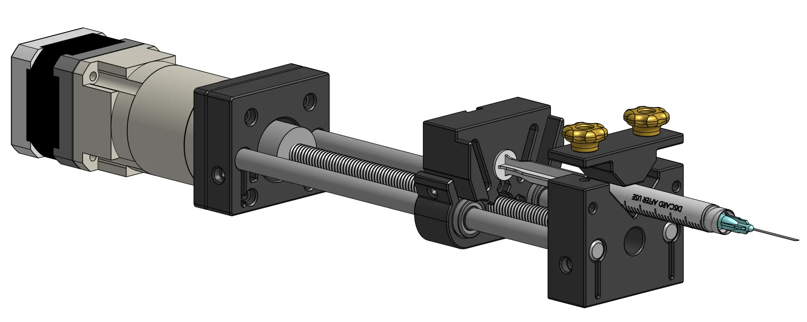
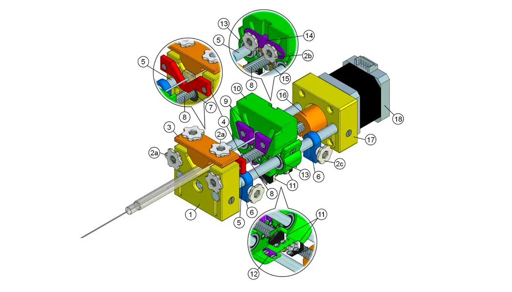

## Week 6
I started testing the NEMA17 stepper motor, which immediately humbled me. It turns out motor drivers actually require a significant voltage delta between the input and the motor output. Because my configuration had them sitting at nearly the same voltage, the motor responded with zero torque and aggressive jittering. Lesson learned. On the bright side, the 3D printed parts arrived. I can *almost* assemble the chassis, but I am currently waiting on some bearings and screws to show up in the mail. To keep the momentum going, I fired up Figma to start mocking out the user interface.

### User Interface

Welcome to the first major hurdle of the software side. Building a rock solid user interface is absolutely mandatory because it is the only bridge between the operator and the hardware. I knew this would be a challenge because the screen I had on hand was a tight 170x320 pixels. That meant one thing: ruthless prioritization. 

I had to make crucial data pop, establish a clear visual hierarchy, and ensure the entire experience was completely intuitive. I started with the screen where users will spend the vast majority of their time, which is the active perfusion display. 

The interface needed to be instantly readable. Medical staff need to see the medication, concentration, flow rate, Volume To Be Infused (VTBI), time remaining, and current device state (paused or perfusing) at a single glance. You absolutely need a clear visual indicator for the device state, because at flow rates like 0.1 mL/h, you cannot physically see the plunger moving.

I ultimately went with a high contrast dark mode using a black background and bright accent colors. The active medication and its concentration sit on a bright backdrop so the eye is naturally drawn there first, and that same accent color is applied to the data labels. A grid design ensures that users can rely on spatial memory to find the numbers they need exactly where they expect them to be. I loaded the mockup onto the actual display hardware to verify readability in the real world.

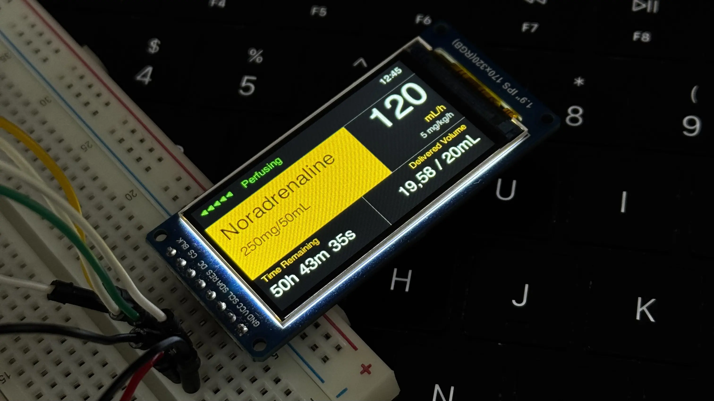

Seeing it on the physical screen confirmed the layout worked perfectly. When designing the menu flow and the UI state machine, I had to account for the physical controls. Navigation relies entirely on a rotary encoder and physical buttons. The design also had to remain structurally simple enough to actually implement in Rust using the `embedded-graphics` crate. 

To cut to the chase, here is the complete map of every screen I designed.

## Weeks 7-9
With the interface and interaction models locked in, it was time to move on to the actual circuit. The hardware requirements for this project were pretty straightforward. I needed an MCU, a stepper motor, a dedicated motor driver, a display, some physical buttons, and an NFC module.

This project gave me the perfect excuse to finally design my own PCB. Since this was my very first time making a custom board, I fully accepted the possibility that it might just instantly let out some magic smoke. To mitigate disaster, I packed the design with fail-safes. I added test points everywhere so I could easily solder on external fixes later, and I included intentional trace cutpoints just in case I needed to cut a connection. Because I apparently like to make things difficult for myself, I decided to go all-in. I added a USB-C Power Delivery port capable of negotiating the required stepper motor voltage directly from the power brick, alongside a custom buck converter. Since I do not own a reflow station, I decided to use a JLCPCB's PCB Assembly service. This added a massive amount of pressure. I had to keep the Bill of Materials light, triple-check every single footprint, and ensure I didn't have to sell a kidney to afford the manufacturing, which gets expensive really fast.

### PCB
I wanted a dedicated chapter for the PCB to really go in-depth on the design process. I have to admit that KiCad had an unexpectedly moderate learning curve. As it turns out, a lot of the logic from AutoCAD and my past experience with general electronics transferred quite well to this software. 

:::info PCB Design Repository
To follow updates to the PCB design check out the dedicated [GitHub Repo.](https://github.com/stanciugabriel/overture-pcb)
:::

I started by mapping out the schematics for the USB-C Power Delivery Module. I chose the [STUSB4500](https://www.st.com/resource/en/datasheet/stusb4500.pdf) from STMicroelectronics. I picked it because it seemed relatively easy to work with, was incredibly robust, and could negotiate power contracts up to 100W, which is absolute overkill for this project but great for headroom. 

That PD module feeds into a buck converter that steps the 20V line down to 3.3V to power the MCU, the display, and the other peripherals. I went with Texas Instruments for this section specifically so I could use [TI Power Designer](https://webench.ti.com/power-designer/). It is an amazing tool that helps you design a power supply circuit based on your exact specs, assists with component selection, and even runs simulations. I settled on the [TPS54308DDCT](https://www.ti.com/lit/ds/symlink/tps54308.pdf), which handles up to 28V and 3A. To guarantee the buck converter worked properly, I paid special attention to properly derating the capacitors and resistors for the power supply segment of the board.

After multiple iterations, I managed to build a highly readable schematic and drafted custom symbols for the components that weren't available in the standard libraries. Here are the two main sections: the power supply and the core components.

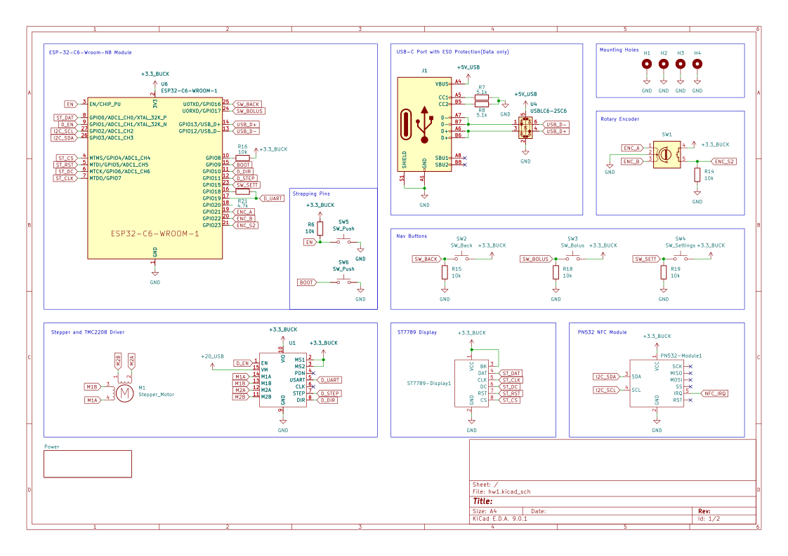
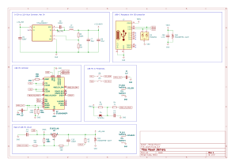

For a first attempt in KiCad, I think they turned out perfectly fine. I knew I was going to use [JLCPCB](https://jlcpcb.com) for manufacturing and assembly, pulling parts from [LCSC](https://lcsc.com). That meant every single component in my schematic had to be manually cross-referenced on LCSC's website. I had to verify they were up to spec, properly derated, actually in stock, cheap enough to justify, and ideally part of their basic parts library to avoid extended component fees. For the footprints and 3D models, I either downloaded them from [SnapEDA](https://snapeda.com) or built them myself. This phase took a notoriously long time because I kept swapping out components to keep the final cost as low as possible. 

Once the schematic is done, you reach the moment of truth: pressing F8 in the PCB editor and praying to whatever higher power will listen that your ratsnest doesn't look like a plate of spaghetti. Ultimately, it doesn't matter how the traces look as long as the board works, but getting it to work is the hard part. The vast majority of my routing time was dedicated to the power supply, while routing the rest of the logic signals was pretty trivial. 

It was exactly during this layout phase that I realized trying to fit a bulky Raspberry Pi Pico 2W, the custom power supply, a TMC2208 stepper driver, and all the peripheral headers onto a tiny PCB was going to be a nightmare. I needed a serious footprint reduction, so I pivoted the entire design to use the [ESP32-C6-WROOM-N8](https://www.lcsc.com/product-detail/C5366877.html?s_z=n_q_ESP-32-C6&spm=wm.ssy.bg.6.xh&lcsc_vid=RVNeBAAERVBaU1ZTT1cNUlRXQ1dYUQIFQFRWUl1WQ1kxVlNRQFFYVlBXQFRdUDsOAxUeFF5JWBYZEEoKFBINSQcJGk4%3D). Moving away from a pre-built dev board to a raw, highly capable module freed up massive amounts of board real estate, gave me all the wireless connectivity I could ever need, and kept the final layout incredibly tight.

With all of that settled, here is the final completed PCB design.

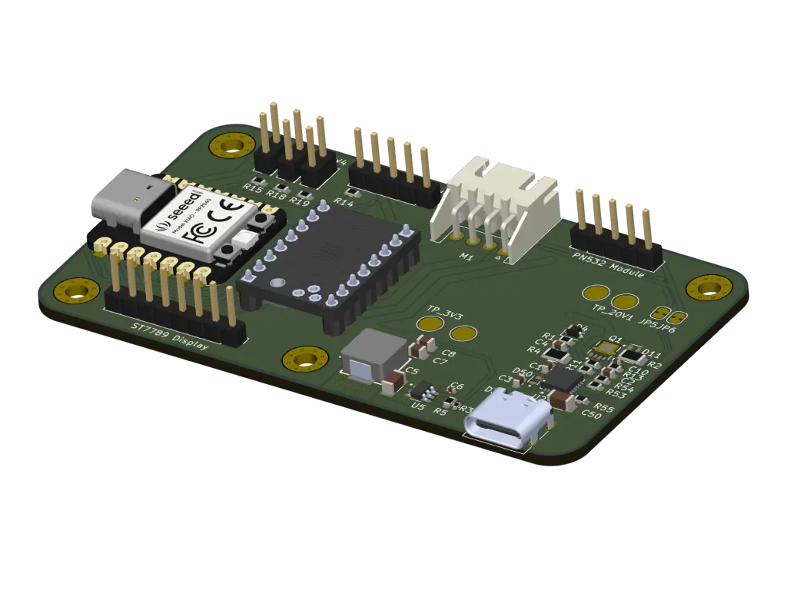
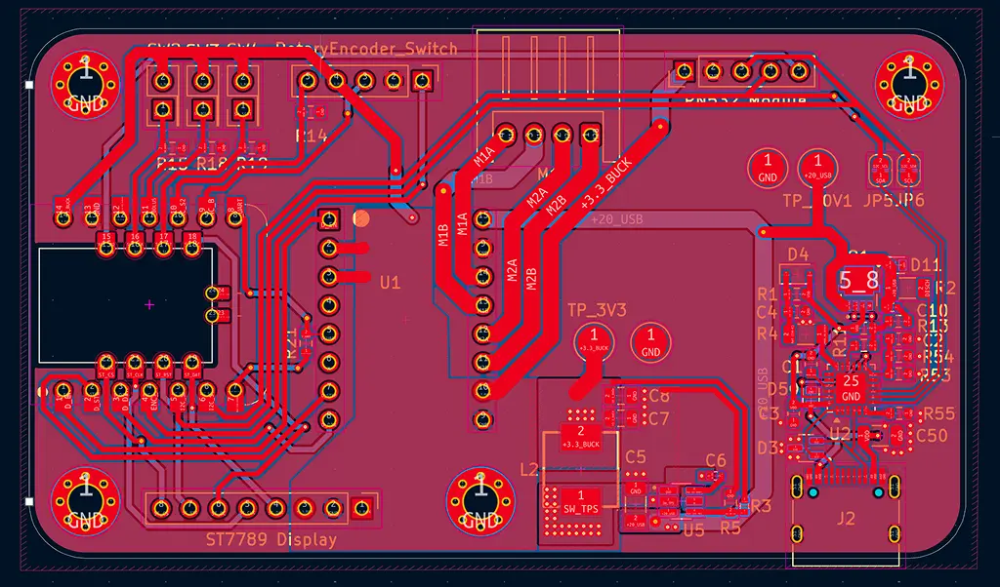
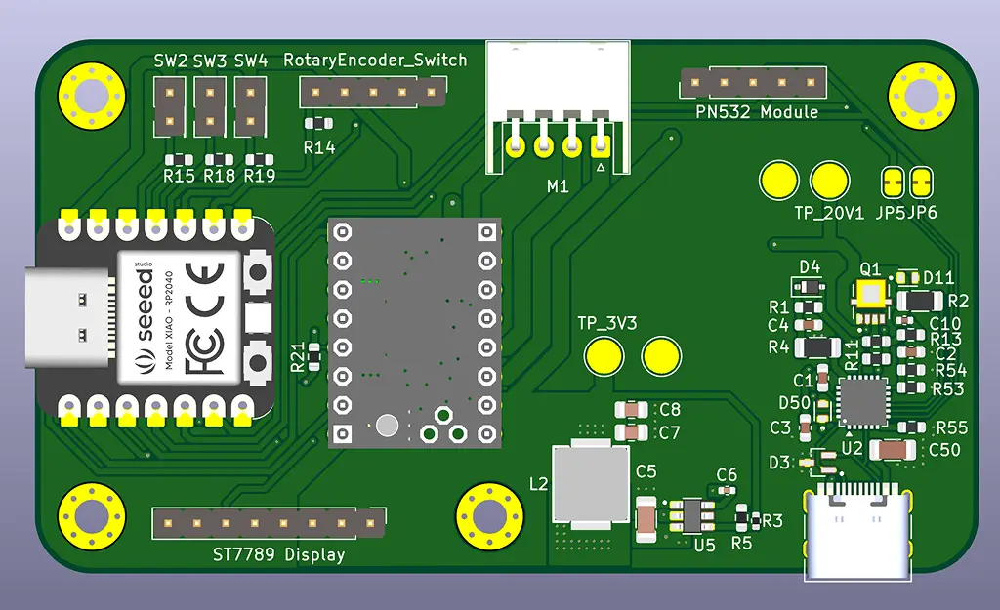
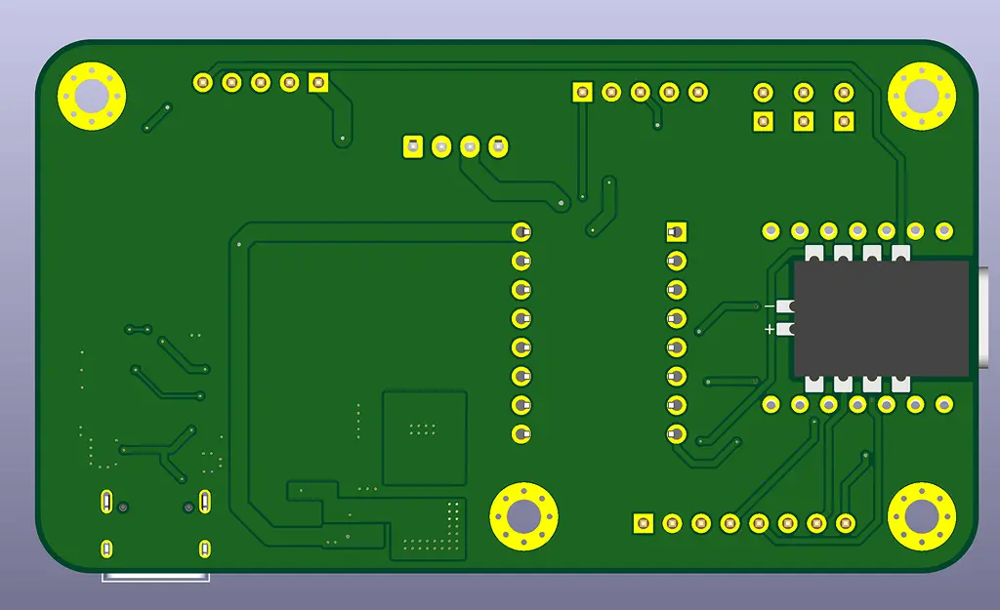

## Weeks 9-14
After testing the initial 170x320 display, it became clear that a larger screen was necessary to guarantee instant readability in high-stress environments. Upgrading the display hardware required a complete UI overhaul. I restructured the embedded-graphics layouts to take advantage of the new real estate, resulting in a much cleaner visual hierarchy.
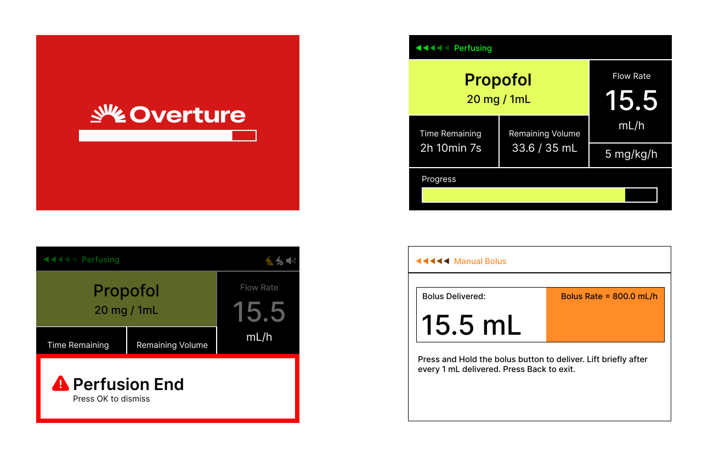
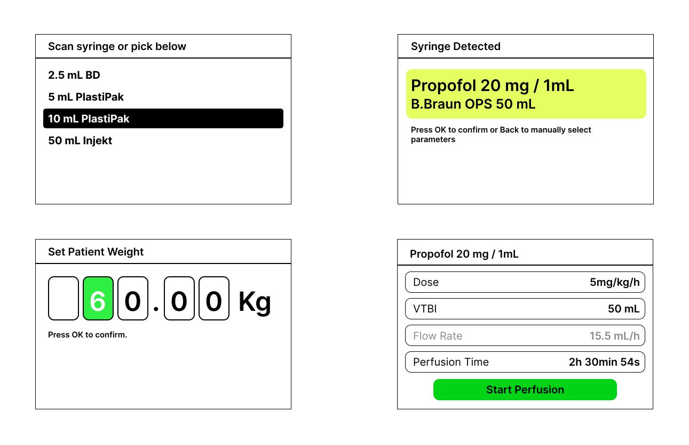
To prevent critical errors, the UI integrates a strict color-coding system that mirrors standard medical syringe labels. Mapping specific drug classes to dedicated accent colors provides immediate visual confirmation, ensuring that even in a chaotic emergency, a split-second glance intuitively tells the operator exactly what medication is infusing.
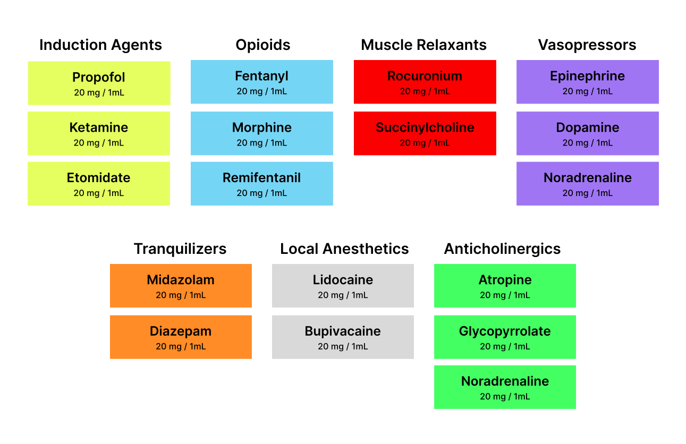
When the assembled PCB arrived from JLCPCB, I began a cautious testing process. Utilizing the test points I had integrated into the design, I first verified the STUSB4500 power delivery negotiation. Once the 20V line was confirmed stable, I tested the buck converter output, which successfully delivered a clean 3.3V to the logic rails. Only then did I initialize the ESP32-C6 and the TMC2209 stepper driver.

I designed a custom enclosure to securely house the PCB, display, and physical controls. The mechanical design required careful attention to spatial tolerances, ensuring everything fit compactly while keeping the NFC reader perfectly flush against the chassis for reliable scanning.
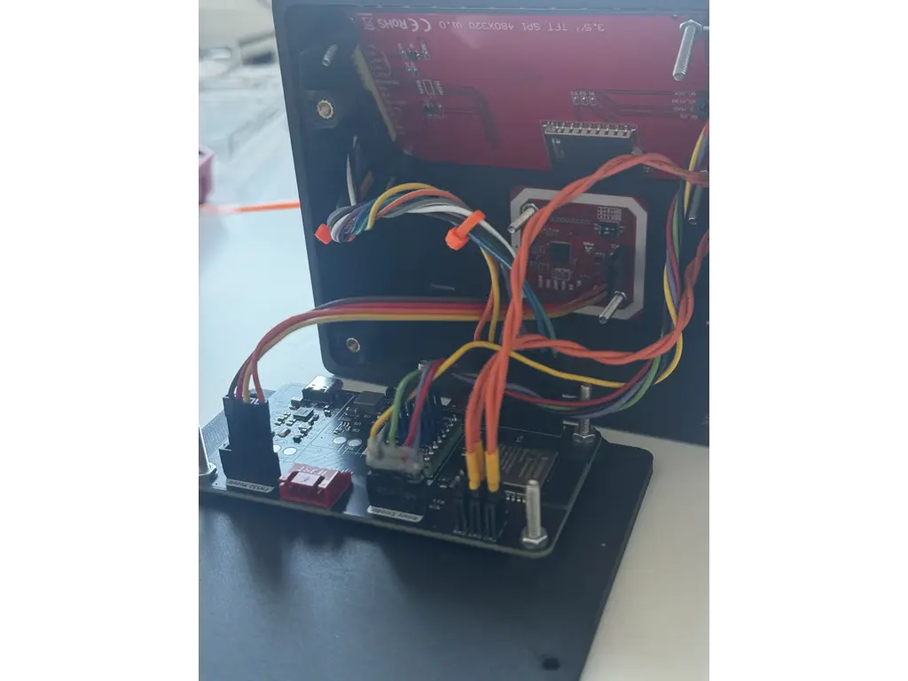
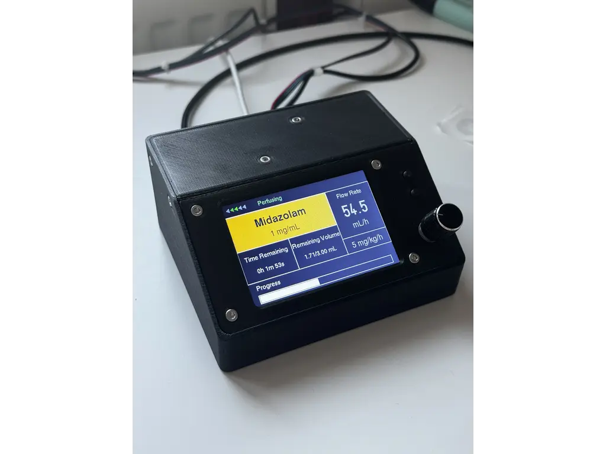
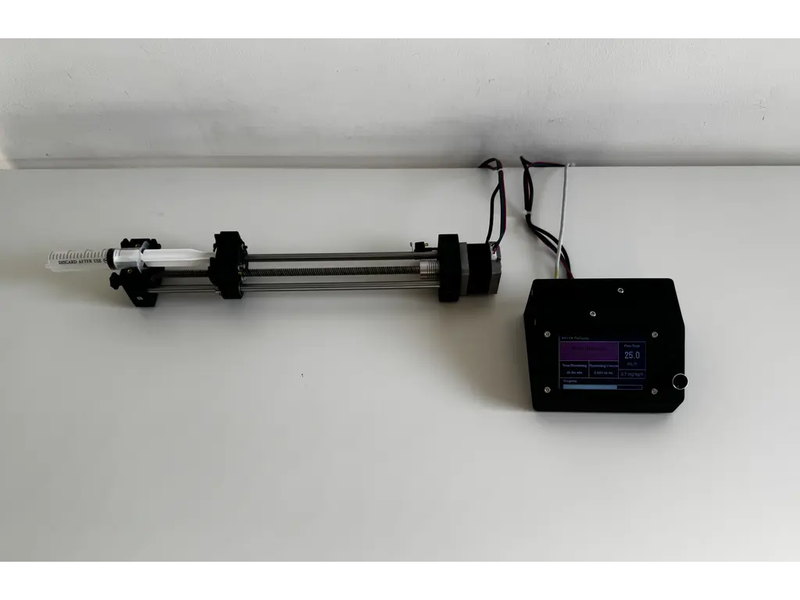

## Software

### Crates

| Crate / Framework | Architectural Role |
| :--- | :--- |
| `esp-hal` | Hardware Abstraction Layer. The critical bridge between Rust and the raw ESP32-C6 silicon, managing GPIO, I2C, SPI, and the RMT peripheral. |
| `esp-rtos` & Bootloader | Provides the underlying Real-Time Operating System integration to bridge the ESP32-C6 hardware with the async executor. |
| `embassy` Ecosystem | The core async runtime (`executor`, `time`, `sync`, `embedded-hal`). Handles cooperative task scheduling, keeping the UI fully responsive while managing precise motor timing and inter-task communication. |
| `tmc2209` | Handles UART register framing and CRC validation, allowing dynamic profile switching (e.g., StealthChop to SpreadCycle) for the stepper motor. |
| `lcd-async` | Asynchronous driver for the ILI9488 display. Ensures that flushing the framebuffer over the SPI bus does not block the executor. |
| `embedded-graphics` & `u8g2-fonts` | Core graphics libraries and bitmap assets used to render the UI grid, text, and alert overlays efficiently without requiring a heap. |
| `esp-storage` & `embedded-storage` | Manages raw flash memory access to safely persist critical state—like carriage position and infused volume—across unexpected power losses. |
| `heapless` | Provides fixed-capacity data structures (like strings and queues) strictly required in a `#![no_std]` environment where dynamic memory allocation is unavailable. |
| `static_cell` & `critical-section` | Safe concurrency utilities. Used to statically allocate buffers and safely share hardware peripherals across different async tasks and interrupt contexts. |

### Architecture
The firmware is built as a lightweight, asynchronous embedded system running on the ESP32-C6. The architecture relies on the Embassy async framework operating on top of `esp_rtos`. This means the system uses cooperative multitasking rather than a classic RTOS with preemptive threads; tasks run until they hit an `.await` point, yielding control back to the executor. 

To ensure rock-solid physical motion timing without UI-induced jitter, the software is strictly decoupled into distinct modules:
* **`startup`**: Handles hardware bring-up, safety checks, and initialization.
* **`app.rs`**: Manages the main UI loop, state machine, and high-level logic.
* **`motor.rs`**: Owns the physical motion timing, stepping hardware, and motor tasks.
* **Shared Modules**: Provide services for display rendering, dosing math, TMC UART, NFC, input polling, and flash persistence.

**Boot and Startup Sequence** \
Boot begins in `src/bin/main.rs`, the top-level async entry point created by `#[esp_rtos::main]`. Startup performs all critical safety checks before handing control to the interactive UI loop, executing in the following order:

1.  Initializes the ESP HAL and starts the RTOS timer/executor support.
2.  Loads persistent flash state via `PersistentStore`.
3.  Initializes the display SPI and draws the startup/progress screen.
4.  Creates the RMT (Remote Control) channel for STEP output on GPIO11.
5.  Creates `MotorPins`, builds a `MotorClient`, and spawns the `motor_task`.
6.  Configures physical inputs: Bolus, Back, homing switch, and rotary encoder (A, B, OK).
7.  Initializes I2C devices and probes the STUSB4500 (USB-PD) and PN532 (NFC).
8.  Initializes the TMC2209 stepper driver over UART and applies the custom driver profile.
9.  Evaluates resume/homing decisions based on persistent memory.
10. Enters the main `ui_task` loop.

**Task Model & Async Scheduler** \
There are two primary async execution contexts: `main` (which transitions into `ui_task`) and `motor_task`. 

Because the scheduler is cooperative, code must reach yield points (e.g., `Timer::after_millis().await`, SPI/I2C operations, channel receives) to let other work run. Display updates over SPI or NFC polling over I2C take time. If motor pulses were generated by a busy loop in the UI code, these operations would create dangerous timing jitter. The architecture completely avoids this by moving motor pacing into a dedicated `motor_task` and offloading the actual STEP waveform generation to the ESP32's hardware RMT.

**Motor Control & Hardware RMT Stepping** \
The `motor_task` acts as the master motion scheduler. It directly owns the DIR and ENN pins, the RMT STEP channel, the current signed carriage position, and the active command state. 

The UI **does not** step the motor directly. Instead, it sends logical commands (e.g., "run this many steps at this period") via a `MotorClient` channel. The motor task accepts the following commands: `Stop`, `SetPosition`, `Run` (Positioning, Delivery, DirectBolus, Tone).

**RMT Hardware Acceleration** \
The critical fix for high-rate, precision motion was moving the `MotorPins.step` from a standard GPIO output to an RMT TX channel. [RMT(Remote Control Transciever)](https://docs.espressif.com/projects/esp-idf/en/stable/esp32/api-reference/peripherals/rmt.html) peripheral is a hardware module originally designed to generate the highly precise IR pulse trains used in television remotes. By cleverly repurposing this subsystem to drive our stepper motor, we offload the generation of step signals directly to the hardware, ensuring perfectly timed physical motion without ever lagging the software interface.
* The `motor_task` generates `PulseCodes` (e.g., STEP high for `STEP_HIGH_US`, then STEP low for `period_us - STEP_HIGH_US`).
* The RMT peripheral produces the physical pulse train entirely independently of the CPU.
* This ensures that even if the CPU yields to process UI or I2C tasks, the pulse edges inside the RMT transaction remain perfectly hardware-timed.

**UI Task and State Machine** \
The main application state machine (`src/app.rs`) is a continuous async loop that polls inputs, updates state, sends motor commands, queries motor status, triggers flash saves, and draws screens. 

The `AppScreen` enum manages the diverse interface views, including: `Syringe`, `Drug`, `PatientWeight`, `LoadAdjust`, `Prime`, `Setup`, `Pump`, and various alert overlays. The loop operates cooperatively, deliberately using short idle waits (e.g., `Timer::after_millis(5).await`) to prevent monopolizing the executor.

**Delivery Scheduling and Dosing Math** \
Delivery pacing is abstracted away from the UI loop. The UI prepares a dose, computes the required steps and period, and sends a command to the motor_task. While running, the UI periodically polls `apply_delivery_motor_status()` to track delivered steps and trigger state transitions. For instance, once the target Volume To Be Infused (VTBI) is reached, the state machine triggers the `KVO` (Keep Vein Open) state, automatically throttling the stepper motor down to a minimal continuous flow rate (typically 1-3 mL/h) to prevent the patient's IV line from clotting. Other critical transitions like `EndOfInfusion` or `SyringeEmpty` are handled with similar strict priority to guarantee patient safety.

**Dosing Math (`src/dosing.rs`)** \
Converts user-facing medical metrics into physical stepper commands:
* Syringe inner diameter → Cross-sectional area.
* Lead screw pitch (8 mm/rev) & microstepping (8x, 200 microsteps/mm) → Volume per step (uL/step).
* Target volume → Total steps.
* Flow rate → Step period interval.

**Direct Bolus Safety** \
Direct Bolus operates via a held-button delivery path. Once triggered, the motor commands a continuous `DirectBolus` run up to a strict 1 mL safety window. It runs continuously until 1 mL is delivered, the hard limit is reached, the button is released, or an alarm state occurs.

**Display Rendering** \
All graphics are handled in `src/display.rs` utilizing immediate-mode drawing into a frame buffer via the `embedded-graphics` crate. Because there is no retained UI tree, the code explicitly redraws changed areas, layering alerts and overlays directly over the dashboard values before flushing the frame over the SPI bus.

**Persistence and Recovery** \
Flash endurance is limited, so the system utilizes a smart persistence strategy (`src/persistent.rs`). The store saves a checksummed record containing syringe parameters, flow settings, carriage position, and delivery progress into a designated flash sector. It checks the `last_saved` state and only commits a flash erase/write cycle when the configuration actually changes. At the moment I am not doing any sort of wear leveling but there is logic in place to reduce the number of read/writes and I actually track the number of writes to the flash.

**Recovery & Homing:**
If the device resets with a syringe mounted, the startup sequence intercepts the standard boot to ask the user if they wish to resume. If confirmed, it uses the persistent carriage position and skips physical homing. This critical fail-safe prevents the system from blindly homing and potentially crushing a loaded syringe upon reboot.

---

**TMC2209 and Safety-Critical Boundaries** \
The stepper driver is configured over single-wire UART. The system dynamically toggles between `StealthChop` (for silent, smooth homing and low-flow) and `SpreadCycle` (for maximum torque during fast delivery or bolus paths).

**System Safety Boundaries:**
* The UI never generates STEP edges; it only commands motion.
* Carriage position is mathematically clamped to hard limits.
* The physical homing switch interrupts and recalibrates the origin.
* Direct manual bolus is hardware-locked to a maximum 1 mL window per press.
* NFC and automated setups require explicit human confirmation.
* Alarms strictly preempt and interrupt all normal delivery workflows.

## Hardware List

| Device | Comment | Price |
|--------|--------|-------|
|ESP-32-C6-N8| Microcontroller | 35 RON|
|ILI9488 Display|Visual interface|0 RON (had it on hand)|
|NEMA 17 Stepper|Drives the syringe mechanism|	60 RON|
|TMC2209 Driver	|used to drive the stepper|30 RON|
|NFC Module|Scans medication data from syringe stickers|10 RON|
|Bearings|LM8UU, 688ZZ|25RON|
|Guide Rail|8mm x 315mm|30RON|
|Lead Screw|8mm x 315mm, 2mm pitch |20RON |
|Misc Hardware| Screws, bolts, nuts|10 RON|
|PCB|with assembly|Living on the breadline for the next 2 months|

## Links
[B.Braun Space Plus Technical Data Sheet](https://ws.hybris.bbraun.com/bbraunocc/v2/bbraun/eDoc/QlRTMDAwMDAwMDAwMDAwMDAwMTAwMDIyMTc4OTAwMDAw?applicationKey=SAPPO) \
[TMC2209 Datasheet](https://www.analog.com/media/en/technical-documentation/data-sheets/tmc2209_datasheet_rev1.09.pdf) \
[RMT](https://docs.espressif.com/projects/esp-idf/en/stable/esp32/api-reference/peripherals/rmt.html) \
[Reference Video 1 - used to reverse engineer the interface](https://www.youtube.com/watch?v=5FsmhtknTp0&t=696s) \
[B.Braun Training Videos Playlist](https://www.youtube.com/playlist?list=PLA4OWG_-fY-JLoj-bHIPiUU1SJquB9X8J)
