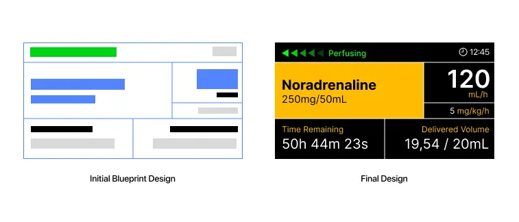
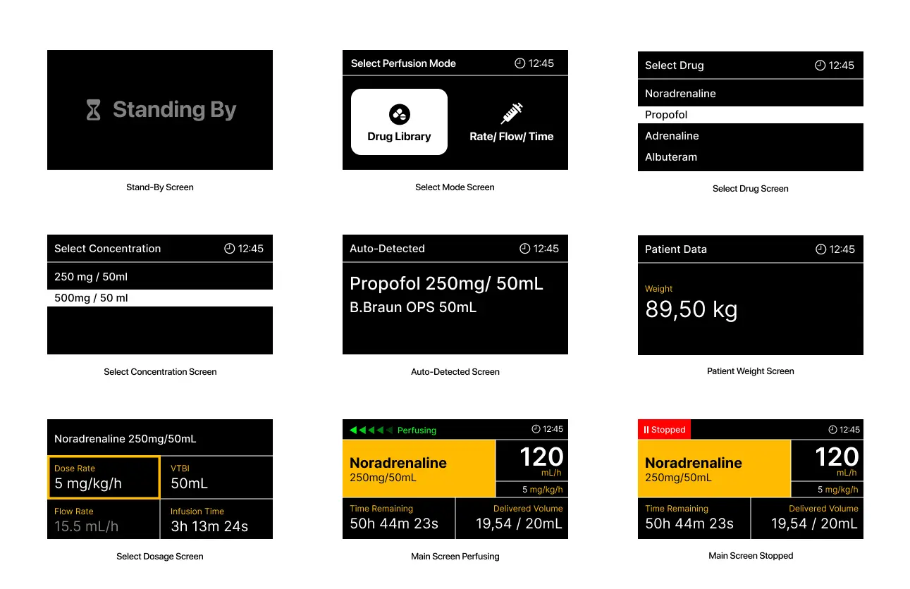
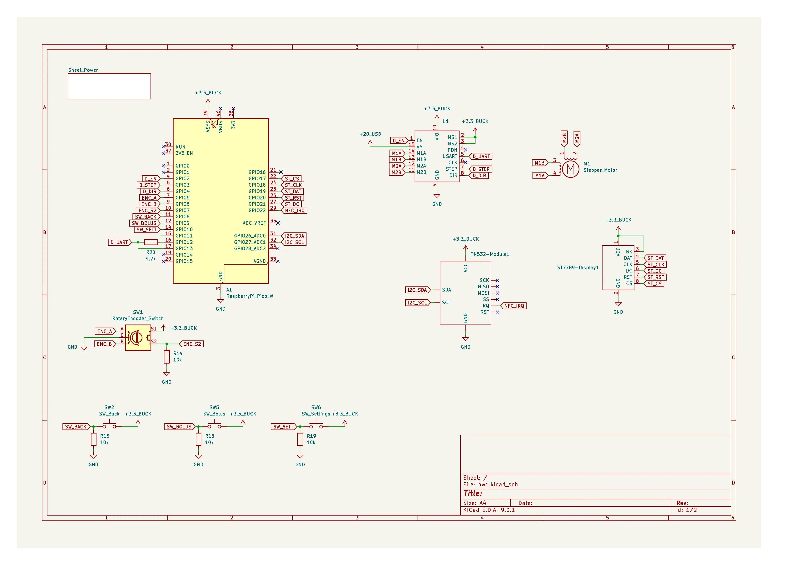
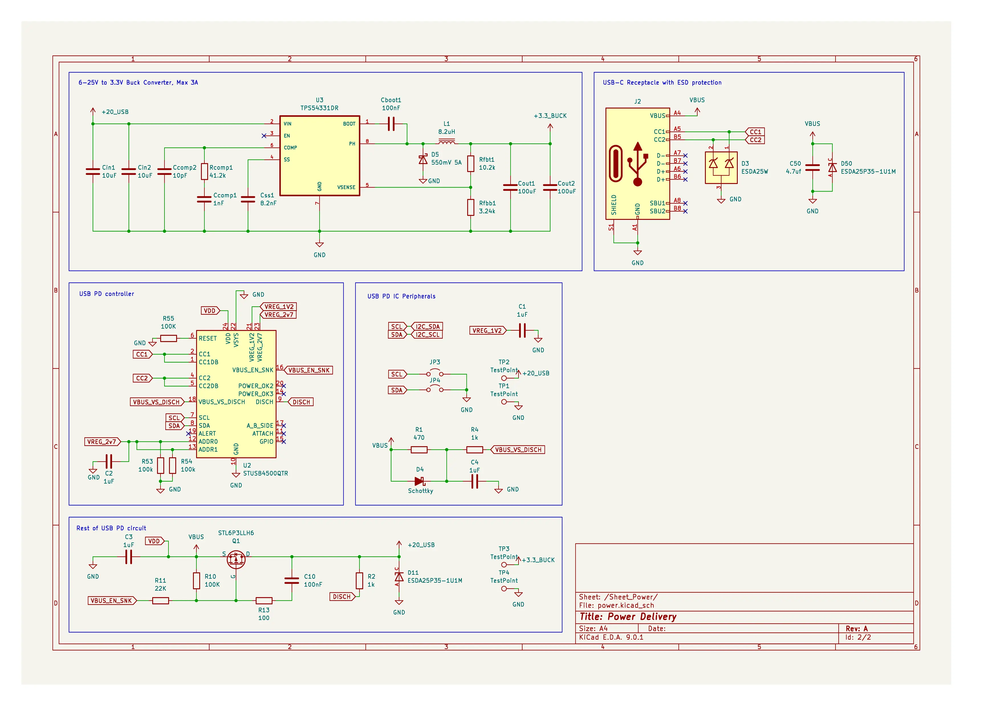
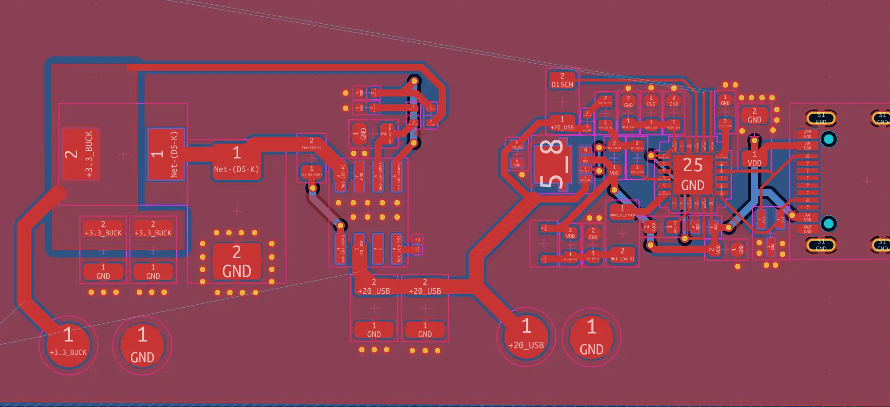
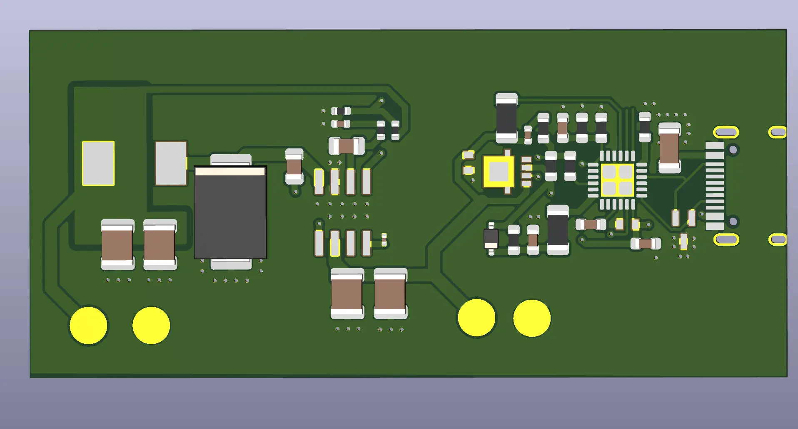
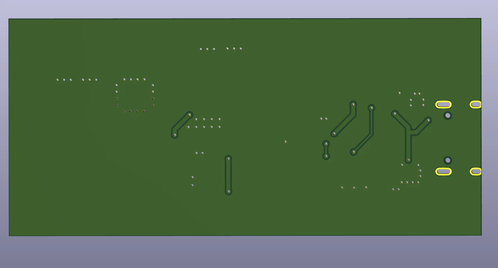

# Overture
A medical-grade perfusor

:::info

**Author**: Gabriel Stanciu\
**GitHub Project Link**: https://github.com/stanciugabriel

::::

## Description
This is a medical device intended to push on the syringe's plunger at a specified flow rate. While that seems simple, it achives ~0.01mL accuracy which is crucial when administering medication like noradrenaline, propofol etc. Overture is feature-packed with useful features: Automatic syringe and medication detection via NFC stickers, bolus mode(ability to push medication as fast as possible), drug library, kvo(keep vein open) - at the end of the dosage, it pushes medication just so little so that the veins dont close. Usually, when trying to improve on an existing product, you should first pick one existing solution from the market as "the gold standard" you want to dethrone. For me it is the [B.Braun Space Plus Perfusor](https://catalogs.bbraun.com/en-01/p/PRID00011858/spaceplus-perfusor?bomUsage=marketingDocuments), which is also the device we used to use on the ambulance(we used the previous generation but things are kinda the same, they just slapped a touchscreen on the old device).

## Motivation
While I was a paramedic on the SMURD ambulances, I was constantly working with perfusors. While they were working as intended, their menus were clunky which meant losing valuable time, especially when someone's life is at stake.

## Log
## Week 5
I already know what I want to build so naturally the first thing i would search is if there are any open-source projects that achieve a similar task. I did find a really cool project - an open-source syringe pump meant for laboratory in mass spectroscopy developed at [Moscow State University by Andrey Samokhin](https://www.mass-spec.ru/projects/diy/syringe_pump/eng/). Naturally I started ordering what i needed for the project and started 3d printing parts.

## Mechanical Design
This was a blessing because that meant my workload is significantly down by a bit. The open-source syringe project contained all the 3D files I needed, the BOM and detailed instructions on how to assemble it. Here is the CAD file [on OnShape](https://cad.onshape.com/documents/20c077b452e92115525d4fed/w/b20de6d900747df77e3b2ce3/e/61a76a1d73302d0f4b529316). 

## Week 6
I started testing the NEMA17 motor, but I cannot drive it very well because I found at a later date that the driver needs a big enough voltage difference across the input and motor output, and in my current config it was almost the same voltage. This resulted in really low torque, low speed and jittering. I got the 3D printed parts, and I can almost assemble it, but I still need to wait on some bearings and screws to arrive. In the meantime I started designing the UI interface in Figma as this is my UI/UX tool of choice. 

## UI
 Welcome to the first major part of this project. Making a really good user interface is mandatory as this is how the user interacts with the device. I knew that this can be some sort of challenge as the screen I had on hand has only 170x320px and that meant only one thing: *prioritizing*. I had to make crucial information pop-up, make sure data has some hierarchy, and over all that is intuitive. I started making the screen where a user would spend most of the time - the perfusion data screen. 
The interface needed to be really fast to read, especially the significant data like the medication and concentration, the flow rate, VTBI, and time remaining as well as the state of the device(paused, perfusing) because at flow rates like 0.1 mL/h you can hardly see its movement. I decided to go with a grid design and decided on this layout. 

Later on, I used a black background and accent colors. The contrast is really high, the medication being delivered and its concentration has a bright backdrop to make the eye naturally go there, and the same color is applied to the labels. Having a grid-like design means users know where they can find certain information based on position. Postion that is predictable. I also wanted to get a feel for how this would look like on the actual screen, and check if it is readable.

I really liked how it ended up on the screen. Now, when designing the flow(or state machine) of this device I had to keep in mind that I would navigate it using a rotary encoder and buttons. Also, I wanted to make it simple enough that I could easily implement it using embedded-graphics crate. To cut to the chase, you can find below all the screens that I designed.

## Week 7-9
Now that we know how the interface will look and how we will be interacting with the device let's start working on the circuit. We know that for this project we will need an MCU, a stepper motor, a driver for the said motor, a display and some buttons and the NFC module. Here is how the circuit looks form a high level perspective:

<!--  -->

Because of this project I have the perfect excuse to start making my own PCB. This is my first time designing a PCB so it might not really work. That is why I want to add a lot of fail-safes such as adding test points so I can later solder some external help, make trace cutpoints etc. And because I want to go all-in, I will add a USB-C PD port that can negociate the voltage needed for the stepper with the power brick, and I will also add a buck converter, both of these will be manually added to the PCB. And because I don't have a reflow station, I will also use PCB-Assembly. This adds significantly more pressure, because I have to keep the BOM light, triple check everything and make sure I don't sell my kidney in the process (as I will later figure out, it's quite expensive).

## PCB
I wanted a special chapter for the PCB to really go in depth with the design process. I really want to say that KiCad had an unexpectidly moderate learning curve. As it turns out, a lot of stuff from AutoCAD, and my past experience with electronics transfer quite well to this software. 

I started by making the schematics for the USB-C Power Delivery Module which is an [STUSB4500](https://www.st.com/resource/en/datasheet/stusb4500.pdf) made by STMicroelectronics. I picked it because it seemed pretty easy to work with, was able to negociate contracts for power up to 100W (way overkill), and is robust. 

The PD module will be connected to a buck converter that steps down the 20V to 3.3V in order to power the MCU, the display and the other peripherals. I have chosen to go with something from Texas Instruments for this because of their tool called [TI Power Designer](https://webench.ti.com/power-designer/), which is an amazing tool that helps you design a power supply circuit using their ICs based on some given specs. It also helps you pick components and run simulations. I have chosen for this task the [TPS54331DR](https://www.ti.com/lit/ds/symlink/tps54331.pdf) which handles up to 28V and 3A which is plenty for what we are using. To make sure the buck converter works as expected I used the PCB layout provided in their [Evaluation Module's Datasheet](https://www.ti.com/lit/ug/slvu247a/slvu247a.pdf?ts=1776274751129). Special attention was given to derating capacitors and resistors for the power supply part of my PCB.

Now that I know what I want to build and what main components I want to use, let's get to work. After many iterations I managed to make a readable enough schematic, and built custom symbols for components that weren't available. Here are the two main parts: The Power Supply and the Components.

I'd say that for the first time using KiCad they turned out alright! Now let's go to the bane of my existance - the PCB design. I knew I wanted to use [JLCPCB](https://jlcpcb.com) for manufacturing and assembly and [LCSC](https://lcsc.com) for the components. That meant that for each component in the schematic above I had to start searching for components on LCSC's website and make sure they were up to spec and properly derated, also make sure they were available, cheap enough, and try not to use extended offer components. Then, either find, download from [SnapEda](https://snapeda.com)(which is a fantastic website for finding symbols, footprints and 3D models) or make custom footprints for the components. This took a long time because I tried to keep the BOM as cheap as possible, so I replaced components a lot of times. 

After all that, comes the time to press F8 in the PCB editor and pray to GOD that you can come up with something that doesn't resemble spaghetti. After all it doesn't matter how it looks as long as it works. That last part though can be difficult to achieve. Most of the time was dedicated making the power supply segment of the PCB, while the rest is pretty trivial. 

As much as I would like to make a 4 layer PCB to hide my poor trace routing skills, that drives the price way up, so we will stick to a 2 layer one. It was at this point that I figured it is quite hard to fit a standard size Raspberry Pico 2W + the custom power supply + the TMC2208 + headers for the the rest of components on a really small PCB. That is why I started converting my design to use Seeed Studio's XIAO RP2325 MCU mostly because of it small footprint. Anyways, here is the full completed PCB design.

## Hardware

| Device | Usage | Price |
|--------|--------|-------|
|Raspberry Pico 2W | Microcontroller | 35 RON|
|ST7789 Display|	display	|0 RON (had it on hand)|
|NEMA 17 Stepper	|used to move the syringe|	60 RON|
|TMC2208 Driver	|used to drive the stepper|	30 RON|
|NFC Module	|to scan the nfc stickers on the syringe |10 RON|
|Bearings|LM8UU, 688ZZ|25RON|
|Guide Rail|8mm x 315mm|30RON|
|Lead Screw| 8mm x 315mm, 2mm pitch |20RON |
|Misc Hardware| screws, bolts, nuts|10 RON|
