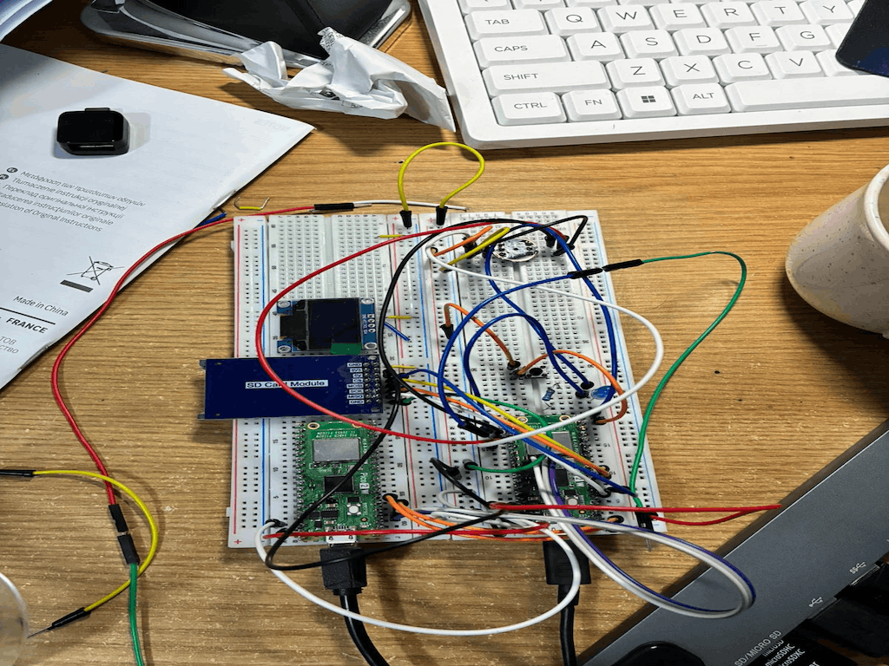

# PicoVoice Recorder
Portable voice recording and playback device using Raspberry Pi Pico.

:::info

**Author:** George Dobrescu \ 
**GitHub Project Link:** https://github.com/UPB-PMRust-Students/fils-project-2026-George6017

:::

## Description

This project implements a portable voice recording and playback system using a Raspberry Pi Pico microcontroller. The device captures audio through a MAX9814 microphone module, converts it into digital data using the Pico’s ADC, and stores it as a WAV file on a microSD card. The recorded audio can then be played back through a speaker using a PAM8403 amplifier.

The system is controlled using three push buttons for recording, playback, and stopping. An SSD1306 OLED display shows the current system state, such as recording, playback, or idle mode.

The entire system is designed as a compact embedded device capable of functioning independently as a simple voice recorder.

## Motivation

The purpose of this project is to explore embedded systems beyond simple sensor-based applications by implementing real-time audio processing. Audio recording introduces challenges such as sampling, buffering, and data storage, making it a more complex and realistic system.

This project also results in a practical and usable device, similar to commercial voice recorders, while being fully implemented from scratch using low-cost components.

## Architecture

The system is organized into three major functional layers: input, control/processing, and output. The overall architecture is centered around the Raspberry Pi Pico 2 (RP2350), which coordinates audio capture, storage, playback, and user interaction.

### Input Layer

Audio input is handled by an INMP441 digital MEMS microphone module connected through the I2S protocol. Unlike analog microphones that require ADC sampling, the INMP441 outputs digital audio data directly, reducing analog noise and simplifying the signal chain.

The microphone is connected to the Pico using the following signals:

- `SCK / BCLK` -> GP18
- `WS / LRCLK` -> GP19
- `SD` -> GP20

The RP2350 does not include dedicated hardware I2S peripherals, so the project implements a custom I2S receiver using the Programmable I/O (PIO) subsystem. A PIO state machine generates the required timing signals and samples incoming serial audio data from the microphone.

DMA (Direct Memory Access) is used together with the PIO state machine to continuously transfer audio samples into memory buffers without heavy CPU usage. Double-buffering is implemented using two alternating I2S buffers (`i2s_buf_a` and `i2s_buf_b`) to allow recording and SD card writing to happen concurrently.

A tactile push button connected to GP14 is used for user control. The button is configured with an internal pull-up resistor and is used to:
- start recording,
- stop recording,
- trigger playback.

Debouncing delays are implemented in software to prevent false button triggers caused by mechanical contact bounce.

### Control and Processing Layer

The Raspberry Pi Pico 2 (RP2350) acts as the central processing unit of the system. The software is written entirely in Rust using the Embassy asynchronous embedded framework.

The control system is implemented as an asynchronous event-driven loop running under `embassy-executor`. The firmware continuously waits for button input events and transitions between the following states:

- Idle
- Recording
- Saving
- Playback

During recording:
1. The PIO state machine receives I2S microphone data.
2. DMA transfers fill alternating memory buffers.
3. Audio samples are converted into signed 16-bit PCM format.
4. WAV data is streamed directly to the microSD card.

The audio conversion stage extracts the left audio channel from the 32-bit I2S frames generated by the INMP441 microphone. The firmware converts the raw data into 16-bit PCM samples suitable for standard WAV playback.

The WAV file generation logic dynamically creates a valid 44-byte WAV header containing:
- sample rate,
- bit depth,
- channel count,
- byte rate,
- total data size.

The project uses SPI communication for the microSD card interface. The SD card module is connected as follows:

- `MISO` -> GP4
- `CS` -> GP5
- `SCK` -> GP6
- `MOSI` -> GP7

The `embedded-sdmmc` crate provides FAT filesystem support, allowing WAV files to be created, written, closed, reopened, and played back directly from the SD card.

File naming is automatically generated using incrementing filenames such as:
- `RECORD00.WAV`
- `RECORD01.WAV`
- `RECORD02.WAV`

This prevents overwriting previous recordings.

An SSD1306 OLED display connected through I2C is used for runtime feedback and debugging. The display is connected using:

- `SCL` -> GP17
- `SDA` -> GP16

The display subsystem uses the `ssd1306` and `embedded-graphics` crates to render text-based status messages such as:
- “Recording…”
- “Saving…”
- “Playback…”
- current filename,
- elapsed recording time,
- error messages.

This allows the system to operate independently without requiring a serial debugger connection.

### Output Layer

Audio playback is performed using a GPIO/PWM-style output generated on GP13. The playback system reads stored WAV files from the microSD card and outputs the audio data through the GPIO pin using timed sample playback.

The playback signal is fed into a PAM8302A mono audio amplifier module. The amplifier increases the signal power sufficiently to drive an external 8Ω speaker.

Amplifier connections:
- `A+` -> GP13
- `A-` -> GND
- `VIN` -> Pico VBUS / 5V
- `GND` -> Pico GND

Speaker connections:
- `SPK+` -> speaker terminal
- `SPK-` -> speaker terminal

The playback implementation prioritizes simplicity and compatibility rather than high-fidelity audio quality. Due to the limited nature of direct GPIO/PWM audio generation without a dedicated DAC or I2S amplifier, playback quality is intentionally low fidelity but still sufficient for understandable voice reproduction and system demonstration purposes.

The complete system therefore integrates:
- digital I2S audio capture,
- DMA-assisted buffering,
- SPI SD card storage,
- WAV file generation,
- asynchronous task execution,
- OLED status display,
- and amplified speaker playback

into a fully self-contained portable voice recorder implemented entirely in Rust on embedded hardware.
## Diagram

## Log

### Week 5 - 11 May
- Defined project idea and selected components

### Week 12 - 18 May
- Implemented microphone input and \microphone. Lost almost the entire week trouble shooting code only to discover that the issue was a cold solder joint on the microphone. 

### Week 19 - 25 May
- Implemented SD card storage and audio playback

## Hardware
The system is built around the Raspberry Pi Pico 2 (RP2350), which uses PIO + DMA for I2S microphone input, SPI for microSD storage, and GPIO/PWM-based audio playback.

Audio input is handled by the INMP441 digital I2S microphone. The Pico captures audio data using a custom PIO I2S receiver and DMA transfers, then stores the recorded WAV files on a microSD card over SPI.

Playback is performed through a PAM8302A audio amplifier connected to a small 8Ω speaker. The Pico outputs audio using simple GPIO/PWM-style playback on GP13.
## Pin Connections

### INMP441 I2S Microphone

| INMP441 Pin | Raspberry Pi Pico 2 Pin | Purpose |
|---|---|---|
| `VCC` | `3.3V` | Power |
| `GND` | `GND` | Ground |
| `SCK / BCLK` | `GP18` | I2S bit clock |
| `WS / LRCLK` | `GP19` | I2S word select |
| `SD` | `GP20` | I2S serial audio data |
| `L/R` | `GND` | Selects left audio channel |

### MicroSD Card Module (SPI)

| SD Module Pin | Raspberry Pi Pico 2 Pin | Purpose |
|---|---|---|
| `VCC` | `3.3V` | Power |
| `GND` | `GND` | Ground |
| `MISO` | `GP4` | SPI data from SD card |
| `CS` | `GP5` | SPI chip select |
| `SCK` | `GP6` | SPI clock |
| `MOSI` | `GP7` | SPI data to SD card |

### Push Button

| Button Pin | Raspberry Pi Pico 2 Pin | Purpose |
|---|---|---|
| One side | `GP14` | Button input |
| Other side | `GND` | Ground trigger |

### Status LED

| LED Pin | Raspberry Pi Pico 2 Pin | Purpose |
|---|---|---|
| LED anode | `GP15` | Status output |
| LED cathode | `GND` (through resistor) | Ground |

### Schematics

| Device | Usage | Price |
|---|---|---|
| Raspberry Pi Pico 2 | Main microcontroller | 35 RON |
| INMP441 I2S microphone | Digital audio input | 15 RON |
| MicroSD card module | Storage interface | 15 RON |
| MicroSD card (16GB) | Audio storage | 40 RON |
| PAM8302A amplifier | Audio output amplifier | 15 RON |
| Tactile push button | User control | 5 RON |
| Breadboard 830 points | Prototyping | 10 RON |
| Dupont jumper wires | Connections | 10 RON |
| **TOTAL** | | **145 RON** |

## Software

| Library | Description | Usage |
|---|---|---|
| `embassy-rp` | Hardware abstraction for RP2350/RP2040 | GPIO, PIO, DMA, SPI, I2C |
| `embassy-executor` | Async task executor | Runs concurrent async tasks |
| `embassy-time` | Timing utilities | Recording/playback timing |
| `embedded-hal` | Hardware abstraction traits | Standard embedded interfaces |
| `embedded-hal-async` | Async hardware traits | Non-blocking peripheral support |
| `embedded-hal-bus` | Shared bus helpers | SPI device management |
| `embedded-sdmmc` | FAT filesystem + SD card support | Reading/writing WAV files |
| `pio` | RP2040/RP2350 PIO assembler support | Custom I2S microphone receiver |
| `fixed` | Fixed-point arithmetic | PIO clock divider calculations |
| `heapless` | Heap-free containers | Filename/string buffers |
| `defmt` | Embedded logging framework | Debugging output |
| `panic-probe` | Panic handler for embedded debugging | Runtime error reporting |