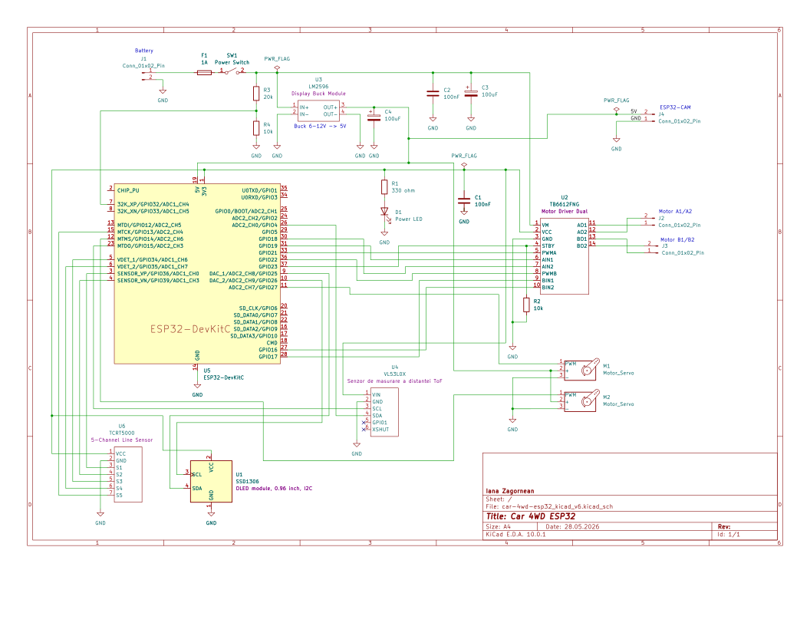

# CarBot-C3 – WiFi Controlled Smart Robot Car
A WiFi-controlled 4WD robot car built with ESP32-C3 in Rust, featuring motor control, obstacle detection, and a web interface

:::info 

**Author**: Zagornean Iana \
**GitHub Project Link**: https://github.com/UPB-PMRust-Students/fils-project-2026-ianazag

:::


## Description

A self-contained WiFi-enabled robotic car built around an ESP32-WROOM development board. The
system creates its own wireless network, allowing a phone, laptop, or controller device to
connect directly and control the vehicle through a browser-based web interface. The car uses 
TB6612FNG dual-channel motor driver to control the left and right motor groups independently,
enabling forward movement, reverse movement, and turning in place.

The project includes multiple operating modes. In manual mode, the user controls the car from
the web page or through a connected gamepad. In autonomous mode, a VL53L0X
time-of-flight distance sensor is used to detect obstacles, while a servo motor rotates the
sensor to scan left, center, and right before choosing a safer direction. In line-following
mode, a 5-channel TCRT5000 infrared sensor module detects a black line on the ground and
allows the robot to follow it automatically.

An OLED SSD1306 display is mounted on the robot to show important live information such as
current mode, command, distance value, WiFi status, and battery level. An ESP32-CAM module
with an OV2640 camera is used as a separate WiFi camera unit. It connects to the robot’s WiFi
network and provides a live video stream that is displayed inside the main web control
interface.

## Motivation

This project was chosen to explore how embedded systems, robotics, and Rust can be combined
into a complete, real-world application. It provides hands-on experience with controlling
hardware components like motors and sensors while also implementing higher-level features such
as WiFi communication and a browser-based interface. Building a fully standalone system that
can be controlled remotely helps in understanding how modern IoT devices operate without
external dependencies. Additionally, it offers valuable insight into debugging
hardware-software interactions and lays the groundwork for extending the project with more
advanced capabilities like autonomous navigation and obstacle avoidance.

## Architecture 

Main components
* Web Interface (HTTP UI) – user control (Forward, Left, Right, Back)
* Control Layer – translates commands into motor actions
* Motor Driver Layer – controls TB6612FNG signals
* Sensor Layer – reads distance (VL53L0X)
* Line Sensor Layer – reads the 5-channel TCRT5000 module and determines the line position.
* OLED Display Layer – shows mode, command, distance, WiFi status, and battery level.
* Battery Monitoring Layer – reads the 2S battery voltage through an ADC voltage divider.
* Camera Module – ESP32-CAM provides a live video stream over WiFi.
* Telemetry Module – sends live status information to the web page.
* Safety Layer – prevents collisions
* Telemetry Module – reports system state

```
Phone / Laptop / Gamepad
        |
        | WiFi + HTTP Requests
        v
Web Control Interface
        |
        v
Control Logic on ESP32-WROOM
        |
        +--[ GPIO + PWM ]-------> TB6612FNG Motor Driver
        |                              |
        |                              +--> Right Motors
        |                              |
        |                              +--> Left Motors
        |
        +--[ PWM ]--------------> Servo Motor 1
        |
        +--[ PWM ]--------------> Servo Motor 2
        |
        +--[ I2C ]--------------> VL53L0X Distance Sensor
        |                              |
        |                              v
        |                         Distance Data
        |
        +--[ GPIO Inputs ]-------> TCRT5000 5-Channel Line Sensor
        |                              |
        |                              v
        |                         Line Position Data
        |
        +--[ I2C ]--------------> OLED SSD1306 Display
        |
        +--[ ADC ]--------------> Battery Voltage Divider
        |
        v
Telemetry and Mode Logic
        |
        v
Web Response with Live Status


Separate Camera Unit:

ESP32-CAM + OV2640
        |
        | Connects to ESP32-CAR WiFi
        v
Camera Stream URL
        |
        v
Displayed inside Web Interface
```


## Log


### Week 1 - 4

Defined the project idea: a WiFi-controlled robotic car using ESP32-C3.
Researched motor drivers (TB6612FNG), sensors (VL53L0X), and Rust support for embedded systems.
Planned overall architecture (control via web interface + real-time telemetry).

### Week 5 - 6

Ordered components and started assembling the hardware.
Mounted motors on the chassis and prepared wiring for power distribution.
Studied ESP32 pinout and how to interface with the TB6612FNG driver.

### Week 7 - 8

Connected ESP32-C3 to the motor driver and powered the system.
Tested GPIO signals and verified connections using a multimeter.
Started debugging motor behavior (direction issues, inactive channels).

### Week 9 - 10

Connected the VL53L0X distance sensor through I2C and added distance readings to the web
interface. Added servo control so the sensor could scan different directions. Implemented an
autonomous obstacle-avoidance mode where the robot checks the front distance, stops near
obstacles, scans left and right, and chooses a safer direction.

### Week 11 - 12

Added the 5-channel TCRT5000 line sensor module. Implemented line sensor reading, pattern detection, and a line-following mode. Added calibration and debugging for the sensor values. Updated the web interface to show the detected line pattern and the estimated line position.

### Week 13 - 14

Added an OLED SSD1306 display over I2C. The display shows the current operating mode, active command, distance reading, WiFi status, and battery percentage. Added battery voltage monitoring using a voltage divider connected to an ADC pin. Improved code organization by splitting the project into multiple Rust files such as configuration, motors, servos, sensors, OLED, web page, web server, and application state.

## Hardware

The hardware is built around an ESP32-WROOM development board, which acts as the main controller, creates the WiFi network, runs the web server, and controls the robot. A TB6612FNG motor driver controls the left and right DC motors using GPIO and PWM signals. The robot uses a VL53L0X distance sensor for obstacle detection, a 5-channel TCRT5000 sensor module for line following, two servo motors for positioning, and an SSD1306 OLED display for showing live status such as mode, command, distance, WiFi state, and battery level. The battery level is measured through a voltage divider connected to an ADC pin, while an ESP32-CAM with an OV2640 camera connects through WiFi and provides the live video stream. The system is powered by a 2S battery pack with voltage regulation, and all modules share a common ground.

### Schematics



### Bill of Materials


| Device | Usage | Price |
|--------|--------|-------|
| [ESP32-C3 Dev Board](https://www.espressif.com/en/products/socs/esp32-c3) | Main microcontroller with WiFi | [35 RON](https://www.emag.ro/placa-de-dezvoltare-esp32-c3-rqiurpn-cu-modul-esp32-c3-mini-1-wi-fi-si-bluetooth5-0-4mb-flash-dimensiuni-compacte-11-kaifaban-esp32-c3/pd/D6NX9S3BM/?ref=history-shopping_479433225_242875_1) |
| [TB6612FNG Motor Driver](https://www.sparkfun.com/products/14450) | Controls DC motors (left/right) | [20 RON](hhttps://www.emag.ro/driver-motor-tip-tb6612fng-ai0383-s299/pd/D6QW8GMBM/?ref=history-shopping_481656189_236249_1) |
| [TCRT5000 5-Channel Line Sensor](https://components101.com/sensors/tcrt5000-ir-sensor-pinout-datasheet)| Detects black line for line-following mode | [15 RON](https://sigmanortec.ro/Modul-Urmarire-Linie-5-Canale-cu-bumper-TRCR5000-p172447718) |
| [ESP32-CAM with OV2640](https://www.espressif.com/en/products/devkits/esp32-cam) | Provides live video stream over WiFi | [60 RON](https://www.emag.ro/placa-esp32-cu-camera-wifi-esp32-cam-ble-4-2-programator-dedicat-negru-esp32-cam-mb/pd/DW8798MBM/?ref=history-shopping_488190962_119667_1) |
| [SSD1306 OLED Display 0.96 inch 128x64](https://cdn-shop.adafruit.com/datasheets/SSD1306.pdf) | Displays mode, command, distance, WiFi status and battery level | [20 RON](https://sigmanortec.ro/Display-OLED-0-96-I2C-IIC-Albastru-p135055705) |
| [Wheels with DC Gear Motors (x4)](https://electronicmarket.ro/6v-250-rpm-motor-si-roti?search=roti) | Movement (wheels) | Already owned |
| [VL53L0X ToF Sensor](https://www.st.com/en/imaging-and-photonics-solutions/vl53l0x.html) | Distance measurement | [25 RON](https://www.emag.ro/senzor-de-masurare-a-distantei-tof-vl53l0x-ai280-s366/pd/DS9D93MBM/?ref=history-shopping_482448154_38837_1) |
| [SG90 Servo Motor](https://www.towerpro.com.tw/product/sg90-7/) | Rotates sensor (scan) | Already owned |
| [Active Buzzer](https://components101.com/buzzer) | Sound alerts | Already owned |
| [18650 Li-ion Battery(x2)](https://www.panasonic.com/global/energy/products/lithium-ion/models/18650.html) | Power source | [44 RON](https://www.emag.ro/acumulator-samsung-18650-li-ion-3-7v-25r-curent-maxim-de-descarcare-20a-pentru-dispozitive-electronice-boxe-portabile-tigari-electronice-si-alte-dispozitive-liinr18650-25tp/pd/D1WR13BBM/?ref=history-shopping_481657189_4088_1) |
| [Step-down Voltage Regulator](https://www.pololu.com/category/131/step-down-voltage-regulators) | Regulates voltage to 5V/3.3V | [32 RON](https://www.emag.ro/modul-dc-dc-step-down-lm2596-display-pentru-v-lm2596s-v-lcd/pd/DFFDSBMBM/?ref=history-shopping_482448154_42976_1) |
| [Jumper Wires + Breadboard](https://www.arduino.cc/en/Guide/HomePage) | Connections and prototyping | [7 RON](https://www.emag.ro/breadboard-400-puncte-ai059-s69/pd/DRJ66JBBM/?ref=history-shopping_482012617_38837_1) |

## Software

| Library | Description | Usage |
|---------|-------------|-------|
| [esp-idf-hal](https://github.com/esp-rs/esp-idf-hal) | Hardware abstraction layer for ESP-IDF | Used for GPIO, PWM, and peripheral control |
| [esp-idf-svc](https://github.com/esp-rs/esp-idf-svc) | High-level services for ESP-IDF | Used for WiFi, HTTP server, and system services |
| [embedded-svc](https://github.com/esp-rs/embedded-svc) | Common embedded service traits | Used as abstraction for networking and IO |
| [anyhow](https://github.com/dtolnay/anyhow) | Error handling library | Used for simplified error management |
| [log](https://github.com/rust-lang/log) | Logging facade | Used for runtime logs and debugging |
| [esp-idf-sys](https://github.com/esp-rs/esp-idf-sys) | Raw bindings to ESP-IDF | Low-level integration with ESP-IDF framework |
## Links


1. [ESP32-C3 Documentation](https://docs.espressif.com/projects/esp-idf/en/latest/esp32c3/)
2. [esp-idf-hal (Rust HAL for ESP32)](https://github.com/esp-rs/esp-idf-hal)
3. [esp-idf-svc (WiFi & HTTP services)](https://github.com/esp-rs/esp-idf-svc)
4. [TB6612FNG Motor Driver Datasheet](https://cdn.sparkfun.com/datasheets/Robotics/TB6612FNG.pdf)
5. [VL53L0X Distance Sensor Guide](https://learn.adafruit.com/adafruit-vl53l0x-micro-lidar-distance-sensor-breakout)
6. [ESP32 Web Server Tutorial](https://randomnerdtutorials.com/esp32-web-server-arduino-ide/)

