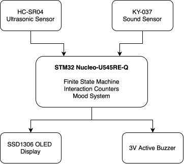
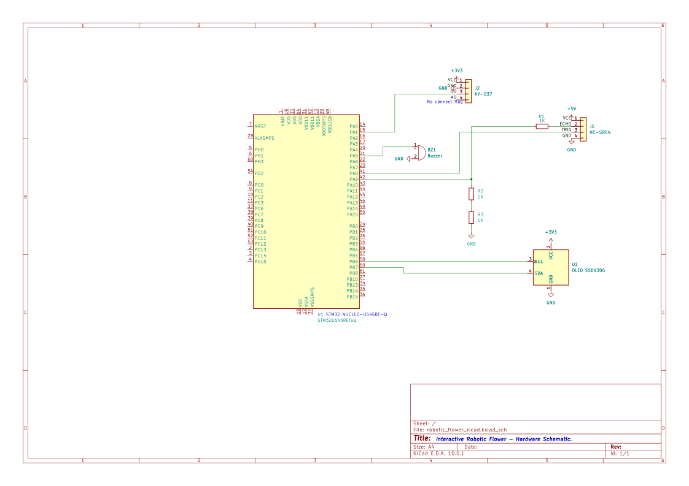
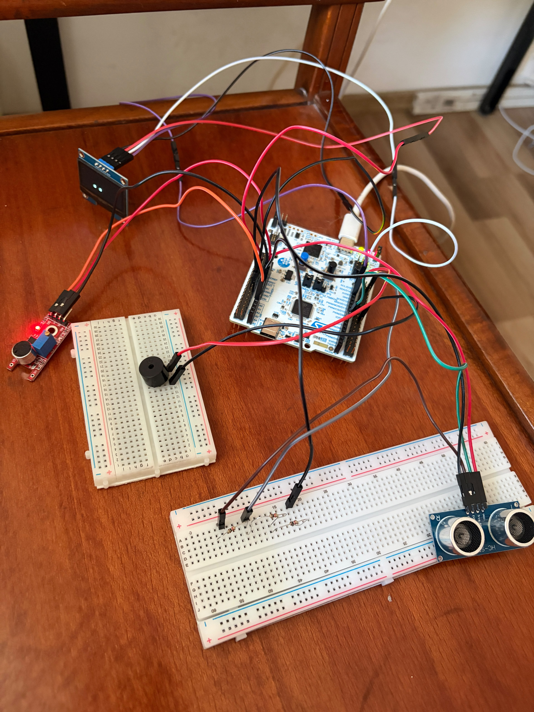

# Interactive Robotic Flower with Audio-Reactive Behavior

An interactive robotic flower that reacts to nearby users and sound events using sensors, an OLED display, audio feedback, interaction counters and mood-based behavior.

:::info

**Author**: Ilie Irina-Elena \
**GitHub Project Link**: https://github.com/UPB-PMRust-Students/fils-project-2026-ilieirina9990-creator

:::

## Description

This project consists of an interactive robotic flower built around an STM32 Nucleo-U545RE-Q development board and programmed in Rust.

The flower reacts to its environment using two input sensors. An HC-SR04 ultrasonic sensor detects when a person or object approaches the flower, while a KY-037 sound sensor detects sound events.

The system provides visual feedback through an SSD1306 OLED display and audio feedback through a 3V active buzzer.

The behavior of the flower is controlled using a finite state machine. Depending on the sensor input, the flower can remain in a sleeping state, react to a nearby user, or react to loud sounds.

In addition to the main interaction states, the project also includes interaction counters and a mood system. Repeated interactions gradually change the flower's mood from `Calm` to `Annoyed` and finally to `Grumpy`. If the flower remains undisturbed, its mood gradually returns toward `Calm`.

The electronic components are integrated into a decorative flower structure, creating an interactive embedded system with both functional and expressive behavior.

## Motivation

The main motivation behind this project is to explore how embedded systems can be combined with creative physical design in order to create an interactive object with recognizable behavior.

Instead of building a conventional sensor demonstration, the goal was to integrate multiple embedded-system concepts into a device that reacts to users and provides visual and audio feedback.

The project provides practical experience with:

- Embedded Rust programming
- GPIO configuration
- Digital sensor input
- Distance measurement
- I2C communication
- OLED display control
- Audio feedback
- Hardware integration
- Finite state machine design
- Event detection
- Interaction counters
- Mood-based behavior
- Modular software architecture

## Architecture

The system follows a modular architecture centered around the STM32 Nucleo-U545RE-Q development board.

The sensors provide information to the STM32 microcontroller. The microcontroller processes the input and determines the current system state. Based on this state and the current mood, the OLED display and buzzer provide feedback to the user.

### Input Module

The input module contains:

- **HC-SR04 ultrasonic sensor** - detects nearby users or objects
- **KY-037 sound sensor** - detects sound events

### Processing Module

The processing module consists of:

- **STM32 Nucleo-U545RE-Q**
- STM32U545 microcontroller
- ARM Cortex-M33 core
- Rust firmware responsible for processing sensor input and controlling the outputs
- Interaction counters
- Finite state machine logic
- Mood score and mood recovery logic

### Output Module

The output module contains:

- **SSD1306 OLED display** - displays messages, expressions, counters and mood information
- **3V active buzzer** - provides audio feedback with mood-dependent beep duration

### System Flow

The general system flow is:

1. The HC-SR04 ultrasonic sensor monitors the area in front of the flower.
2. The KY-037 sound sensor monitors the environment for sound events.
3. The STM32 processes the sensor information.
4. The firmware determines the current interaction state.
5. The interaction counter and mood score are updated if necessary.
6. The OLED displays the corresponding reaction.
7. The buzzer produces an audio pattern.
8. The OLED displays the interaction counters.
9. The OLED displays the current mood.
10. The system returns to idle mode.

The interaction sequence is therefore:

`Interaction -> Reaction -> Counters -> Mood -> Idle`



## System Behavior

The main system behavior is implemented using a finite state machine.

The main states are:

- `Sleeping`
- `TooClose`
- `TooLoud`

A second internal state is used for the mood system:

- `Calm`
- `Annoyed`
- `Grumpy`

### Sleeping State

When no nearby user or relevant sound event is detected, the flower remains in its default state.

The OLED periodically displays different idle messages such as:

`SLEEPING`

`HAVE A NICE DAY`

`ERROR 404 - MOOD NOT FOUND`

`GOOD VIBES ONLY`

This makes the flower appear active even when it is not currently interacting with a user.

### User Detection State

When the HC-SR04 detects a nearby user or object, the system enters the `TooClose` state.

Depending on the current mood, the OLED can display different reactions.

For example, while calm:

`HELLO HUMAN`

`TOO CLOSE`

When the flower becomes annoyed:

`TOO CLOSE`

`AGAIN`

When the flower becomes grumpy:

`PERSONAL`

`SPACE PLEASE`

A proximity interaction generates three buzzer beeps.

After the reaction, the visitor and noise counters are displayed, followed by the current mood.

The system then returns to idle mode.

### Audio-Reactive State

When the KY-037 detects a relevant sound event, the system enters the `TooLoud` state.

Depending on the current mood, the OLED can display messages such as:

`TOO LOUD!`

`I HEARD YOU`

or, at higher mood levels:

`AGAIN`

`TOO MUCH NOISE`

and:

`PLEASE STOP`

`TOO MUCH NOISE`

A sound interaction generates two buzzer beeps.

After the reaction, the interaction counters and current mood are displayed before the system returns to idle mode.

## Mood System

The flower uses an internal numerical score in order to represent its mood.

Each valid interaction adds one point to the mood score.

The mood thresholds are:

- Score 0-4: `CALM`
- Score 5-8: `ANNOYED`
- Score 9 or higher: `GRUMPY`

Both proximity events and sound events increase the score by one point.

If the flower remains in the `Sleeping` state without new interactions, the mood score gradually decreases.

This allows the flower to recover automatically:

`GRUMPY -> ANNOYED -> CALM`

without requiring a reset.

The current mood affects both the OLED messages and the buzzer behavior.

### Mood-Based Buzzer Behavior

The number of beeps represents the type of interaction:

- `TooClose` -> 3 beeps
- `TooLoud` -> 2 beeps

The duration of each beep depends on the current mood:

- `CALM` -> short beeps
- `ANNOYED` -> medium-length beeps
- `GRUMPY` -> long beeps

This makes the flower's mood visible through the OLED and audible through the buzzer.

## Interaction Counters

The system maintains two runtime counters.

### Visitor Counter

The visitor counter increases whenever a new `TooClose` interaction is detected.

A person remaining continuously in front of the sensor is not counted repeatedly as a new visitor.

### Noise Counter

The noise counter increases whenever a new sound event is detected.

The sound sensor logic detects new rising events in order to avoid continuously incrementing the counter while the digital output remains active.

After every interaction, the OLED displays both counters.

For example:

`VISITORS 4`

`NOISE 2`

The counters are stored in RAM and are reset when the microcontroller restarts.

## Hardware

The project uses the following hardware components:

- STM32 Nucleo-U545RE-Q development board
- HC-SR04 ultrasonic distance sensor
- KY-037 sound sensor
- SSD1306 OLED display
- 3V active buzzer
- 3 × 1 kΩ resistors
- Breadboard
- Jumper wires
- USB cable
- Flower pot
- Crepe paper
- Cardboard / foam board
- Glue and mounting materials

## Physical Design

The project is built in the shape of a flower placed inside a flower pot.

The **SSD1306 OLED display** is positioned in the center of the flower and acts as the main visual interface.

The **HC-SR04 ultrasonic sensor** and **KY-037 sound sensor** are positioned near the stem, on opposite sides of the flower.

The ultrasonic sensor is oriented toward the user so that it can detect approaching objects.

The sound sensor is positioned so that its microphone remains exposed to environmental sound.

The **3V active buzzer** is positioned toward the rear side of the flower pot so that its sound output remains unobstructed.

The **STM32 development board** is positioned behind the flower pot in order to keep the electronic connections accessible during testing and debugging.

The wires from the OLED display are routed from the rear side of the flower head toward the STM32 board.

## Electrical Connections

### SSD1306 OLED Display

| OLED Pin | STM32 Connection |
|----------|------------------|
| VCC | 3.3V |
| GND | GND |
| SCL | PB6 |
| SDA | PB7 |

The OLED communicates with the STM32 using the I2C1 peripheral.

The OLED uses the I2C address:

`0x3C`

### HC-SR04 Ultrasonic Sensor

| HC-SR04 Pin | STM32 Connection |
|-------------|------------------|
| VCC | 5V |
| GND | GND |
| TRIG | PA8 |
| ECHO | PA9 through voltage divider |

The ECHO output of the HC-SR04 operates at approximately 5V.

A resistor voltage divider is therefore used before connecting the signal to the STM32 input.

The divider consists of:

- R1 = 1 kΩ
- R2 = 1 kΩ
- R3 = 1 kΩ

The connection is:

`ECHO -> R1 -> node -> PA9`

and:

`node -> R2 -> R3 -> GND`

This reduces the ECHO voltage to approximately 3.3V.

### KY-037 Sound Sensor

| KY-037 Pin | STM32 Connection |
|------------|------------------|
| VCC | 3.3V |
| GND | GND |
| DO | PA1 |
| AO | Not used |

Only the digital output of the sound sensor is used in the current implementation.

### 3V Active Buzzer

| Buzzer Pin | STM32 Connection |
|------------|------------------|
| + | PA5 |
| - | GND |

The buzzer is controlled using a digital GPIO output.

## Schematics

The electrical schematic of the project was created in KiCad.



The schematic contains the STM32U545 microcontroller and the electrical connections to:

- HC-SR04 ultrasonic sensor
- KY-037 sound sensor
- SSD1306 OLED display
- 3V active buzzer
- HC-SR04 ECHO voltage divider

## Bill of Materials

| Device | Usage | **Price** |
|--------|--------|--------|
| STM32 Nucleo-U545RE-Q | Main microcontroller and processing unit | Borrowed |
| HC-SR04 Ultrasonic Sensor | Distance and user detection | ~10 RON |
| KY-037 Sound Sensor | Sound event detection | ~10 RON | 
| SSD1306 OLED Display | Visual messages, counters and expressions | ~50 RON |
| 3V Active Buzzer | Audio feedback | ~2 RON |
| 3 x 1 kΩ Resistors | HC-SR04 ECHO voltage divider | ~3 RON| 
| 2 x Breadboard | Circuit prototyping | ~15 RON |
| Jumper Wires | Electrical connections | ~30 RON |
| USB Cable | Programming and power | ~15 RON |
| Flower Pot | Physical structure | ~10 RON |
| Floral Crepe Paper | Flower construction and decoration | ~60 RON |
| Cardboard / Foam Board | Flower head support | ~10 RON |
| Glue and mounting materials | Mechanical assembly | ~50 RON |

## Software

The firmware is written in **Rust** and runs directly on the STM32U545 microcontroller.

The project uses a bare-metal embedded approach and directly configures the required STM32 peripherals.

The final firmware is divided into multiple Rust modules in order to keep the software easier to understand, test and maintain.

The final source structure is:

```text
src/
├── main.rs
├── state.rs
├── buzzer.rs
├── ultrasonic.rs
├── sound.rs
└── oled.rs
```

### Main Software Components

| Component | Usage |
|-----------|-------|
| Rust | Main programming language |
| stm32u5 crate | STM32 peripheral access |
| cortex-m | ARM Cortex-M functionality and delays |
| cortex-m-rt | Runtime and program entry point |
| embedded-hal | Common embedded hardware traits |
| panic-halt | Panic handler |
| GPIO | Sensor input and digital output |
| I2C1 | OLED communication |

## Software Modules

### main.rs

The `main.rs` file coordinates the complete application.

It is responsible for:

- Hardware initialization
- Reading sensor events
- Selecting the current state
- Updating interaction counters
- Updating the mood score
- Mood recovery
- Coordinating the display and buzzer responses

### state.rs

The `state.rs` module contains the main behavioral states:

- `Sleeping`
- `TooClose`
- `TooLoud`

It also contains the mood states:

- `Calm`
- `Annoyed`
- `Grumpy`

The module contains the logic that converts the numerical mood score into the current mood.

### ultrasonic.rs

The `ultrasonic.rs` module contains the HC-SR04 measurement logic.

It is responsible for:

- Generating the TRIG pulse
- Waiting for the ECHO signal
- Measuring the ECHO duration
- Handling measurement timeouts

### sound.rs

The `sound.rs` module contains the KY-037 sound event logic.

A `SoundSensor` structure stores the previous digital state of the sensor.

This allows the firmware to detect new LOW-to-HIGH sound events and avoids repeatedly counting the same active signal.

### buzzer.rs

The `buzzer.rs` module contains the buzzer control logic.

It provides:

- Buzzer ON and OFF control
- Individual beep generation
- Multi-beep patterns
- Mood-dependent beep duration

### oled.rs

The `oled.rs` module contains the OLED communication and rendering logic.

It provides:

- I2C communication
- SSD1306 initialization
- Screen clearing
- Cursor positioning
- Custom bitmap font
- Character rendering
- Text rendering
- Number rendering
- Idle messages
- Interaction messages
- Counter display
- Mood display
- Post-interaction display sequence

## OLED Communication

The SSD1306 OLED display communicates with the STM32 through the I2C1 peripheral.

The firmware configures:

- PB6 as I2C1 SCL
- PB7 as I2C1 SDA
- Alternate Function 4
- Open-drain output
- Pull-up configuration

The OLED uses the I2C address:

`0x3C`

The firmware contains custom functions for:

- Sending commands
- Sending display data
- Clearing the screen
- Positioning the cursor
- Drawing characters
- Displaying text
- Displaying numbers

A small custom bitmap font is used to display messages and expressions.

## Ultrasonic Distance Measurement

The HC-SR04 uses two digital signals:

- `TRIG`
- `ECHO`

PA8 is configured as an output and generates a short trigger pulse.

PA9 is configured as an input and reads the returned ECHO signal.

The firmware waits for the beginning and end of the ECHO pulse and counts its duration.

Two consecutive measurements are performed before the system enters the `TooClose` state in order to reduce false detections.

## Sound Detection

The KY-037 digital output is connected to PA1.

The firmware detects new rising sound events and activates a short internal timer.

A `SoundSensor` software structure stores the previous state of the digital signal.

A new interaction is generated only when the signal changes from LOW to HIGH.

This prevents a continuously active sound signal from being counted during every iteration of the main loop.

The sensitivity of the sensor can also be adjusted using the onboard potentiometer.

## Finite State Machine

The main interaction logic is implemented using a Rust enum containing the following states:

`Sleeping`

`TooClose`

`TooLoud`

The current state is selected according to the sensor input.

The distance sensor has priority.

If a nearby object is detected, the system enters the `TooClose` state.

If no nearby object is detected but a recent sound event exists, the system enters the `TooLoud` state.

Otherwise, the system remains in the `Sleeping` state.

In addition to the primary state machine, the system uses a second behavioral state based on the internal mood score.

This determines whether the flower is:

`Calm`

`Annoyed`

or:

`Grumpy`

## Buzzer Control

The 3V active buzzer is connected to PA5.

PA5 is configured as a digital output.

Because the buzzer is active, it can generate sound using a simple HIGH/LOW GPIO signal without requiring an audio-frequency PWM signal.

The number of beep signals identifies the type of interaction:

- Three beeps for `TooClose`
- Two beeps for `TooLoud`

The beep duration depends on the current mood.

When the flower is calm, the beeps are short.

When the flower becomes annoyed, the beeps become longer.

When the flower becomes grumpy, the beeps become significantly longer.

## Development Process

The project was developed incrementally by testing each hardware component independently before integrating the complete system.

The OLED display was first tested in order to verify I2C communication and custom text rendering.

The HC-SR04 ultrasonic sensor was then tested and its detection thresholds were adjusted experimentally. A resistor divider was added to the ECHO signal in order to reduce the voltage before connecting it to the STM32 input.

The KY-037 sound sensor was tested independently and its sensitivity was adjusted to reduce false detections.

After the individual components were verified, the OLED display, ultrasonic sensor and sound sensor were integrated into the same firmware using a finite state machine.

A 3V active buzzer was then tested independently and integrated into the main application.

Interaction counters were added in order to record visitor and noise events.

A mood system was then implemented so that repeated interactions change the flower's behavior.

Automatic mood recovery was also added so that the flower gradually returns toward `Calm` when it is left undisturbed.

The display flow was updated so that every interaction follows this sequence:

`Reaction -> Counters -> Mood -> Idle`

Finally, the original single-file implementation was refactored into multiple Rust modules in order to improve readability and maintainability.

The original project concept also included servo-based mechanical movement. This feature was removed from the final implementation in order to improve reliability and focus on sensor-based interaction, visual feedback and audio feedback.

## Testing

### OLED Test

The OLED display was tested by displaying different messages, numerical counters and expressions.

I2C communication operates correctly and the display can be updated according to the current system state.

### Ultrasonic Sensor Test

Different objects and hand positions were placed in front of the HC-SR04.

The system successfully detects nearby objects and enters the corresponding interaction state.

### Sound Sensor Test

Claps and other nearby sound events were used to test the KY-037.

The system successfully detects relevant sound events and activates the audio-reactive state.

The rising-event detection prevents a single continuously active signal from being counted repeatedly.

### Integrated Sensor Test

The SSD1306 OLED, HC-SR04 ultrasonic sensor, KY-037 sound sensor and buzzer were tested together.

All components operate correctly in the current system.

The state machine correctly switches between the sleeping, proximity and sound-reactive states.

### Buzzer Test

The 3V active buzzer was initially tested independently on PA5.

After successful testing, the buzzer was integrated into the main firmware.

The final implementation produces:

- Three beeps for a proximity event
- Two beeps for a sound event

The beep duration increases according to the current mood.

### Counter Test

Multiple proximity and sound interactions were generated.

The visitor counter increases when a new proximity event occurs.

The noise counter increases when a new sound event occurs.

After every interaction, the counters are displayed on the OLED.

### Mood Test

Repeated interactions were generated in order to increase the mood score.

The system successfully transitions through:

`CALM -> ANNOYED -> GRUMPY`

The OLED messages and buzzer duration change according to the current mood.

### Mood Recovery Test

The flower was left without interaction.

The internal score gradually decreased while the system remained in the `Sleeping` state.

The flower successfully transitions back toward:

`GRUMPY -> ANNOYED -> CALM`

## Final Implementation

The final system consists of an interactive decorative flower controlled by an STM32 Nucleo-U545RE-Q development board.

The implemented system can:

- Detect nearby users and objects
- Detect sound events
- Display different messages
- Display simple visual expressions
- Count visitor interactions
- Count sound interactions
- Maintain an internal mood score
- Change between Calm, Annoyed and Grumpy behavior
- Automatically recover toward Calm
- Change buzzer duration according to mood
- Provide different buzzer patterns for proximity and sound events
- Display counters after every interaction
- Display the current mood after every interaction
- Return automatically to idle mode
- Coordinate all components using a finite state machine
- Organize hardware-specific functionality into independent Rust modules

### Hardware and Sensors



## Challenges

Several challenges were encountered during development.

One challenge was obtaining reliable measurements from the HC-SR04 ultrasonic sensor.

The detection thresholds and timing had to be adjusted experimentally in order to provide consistent proximity detection.

The HC-SR04 ECHO output also required voltage reduction before being connected to the STM32 input.

The KY-037 required sensitivity adjustment because environmental noise could otherwise trigger the system continuously.

Sound event counting also required rising-event detection so that a continuously active signal would not be counted during every loop iteration.

Another challenge was integrating the electronic components into the physical flower while keeping the wiring accessible for debugging.

The physical design therefore keeps the STM32 development board accessible behind the flower pot while the sensors and display are integrated into the flower structure.

As more behavior was added, the original `main.rs` file also became increasingly difficult to navigate.

The software was therefore refactored into dedicated modules for the state logic, buzzer, ultrasonic sensor, sound sensor and OLED display.

The project architecture was also simplified during development in order to improve overall reliability.

## Results

The project demonstrates an interactive embedded system combining multiple input and output devices.

The robotic flower successfully demonstrates:

- GPIO input and output
- Digital sensor processing
- Ultrasonic distance detection
- Sound event detection
- I2C communication
- OLED display control
- Audio feedback
- Finite state machine behavior
- Interaction counters
- Mood-based behavior
- Runtime behavioral memory
- Mood recovery
- Modular Embedded Rust software
- STM32 peripheral configuration
- Physical hardware integration

The final system reacts differently depending on both the current environment and previous interactions.

The combination of sensor input, interaction history, visual feedback and audio feedback allows the flower to behave as an interactive embedded object rather than as a simple collection of independent sensors.

## Future Improvements

Possible future improvements include:

- Addressable RGB LEDs for visual mood indication
- More complex OLED animations
- Additional facial expressions
- Saving interaction counters in non-volatile memory
- Hardware timers instead of software delays
- Interrupt-driven sensor processing
- Additional environmental sensors
- Configurable proximity and sound thresholds
- Wireless communication
- Improved enclosure and cable management
- Low-power operating modes

## Links

1. https://github.com/UPB-PMRust-Students/fils-project-2026-ilieirina9990-creator
2. https://www.st.com/en/microcontrollers-microprocessors/stm32u5-series.html
3. https://www.rust-lang.org/
4. https://docs.rust-embedded.org/
