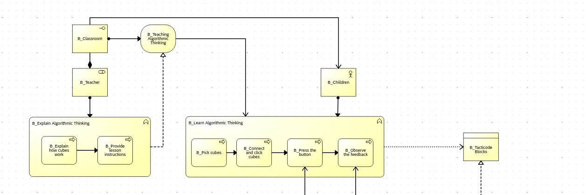
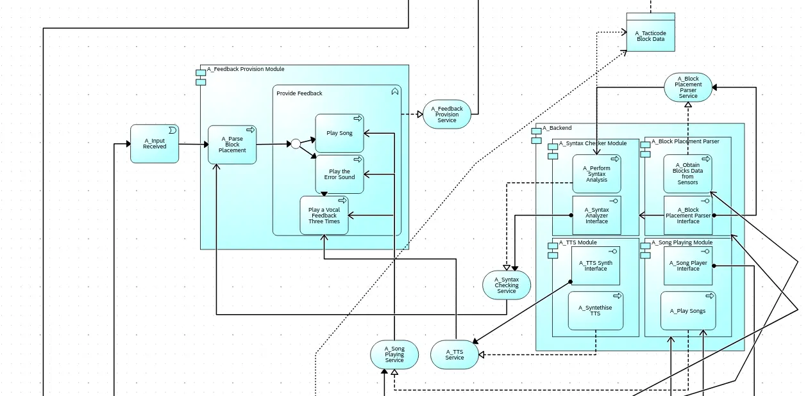
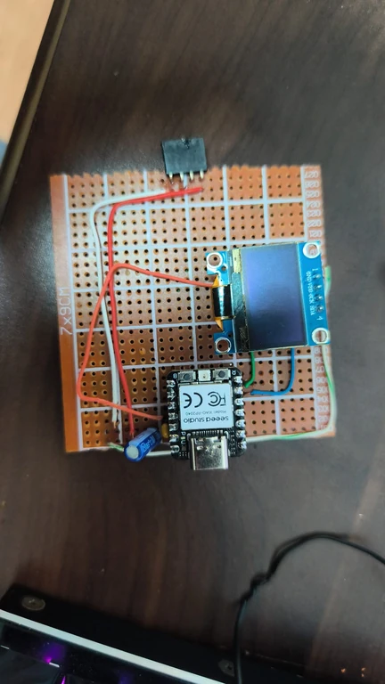
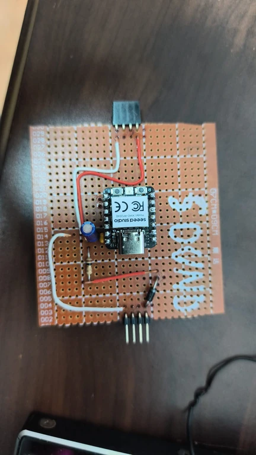
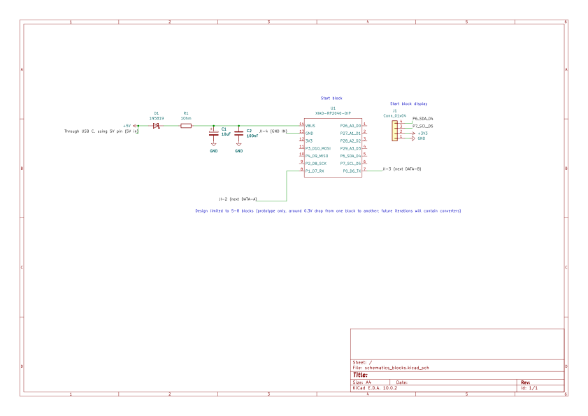
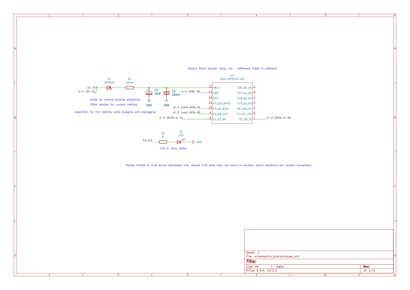
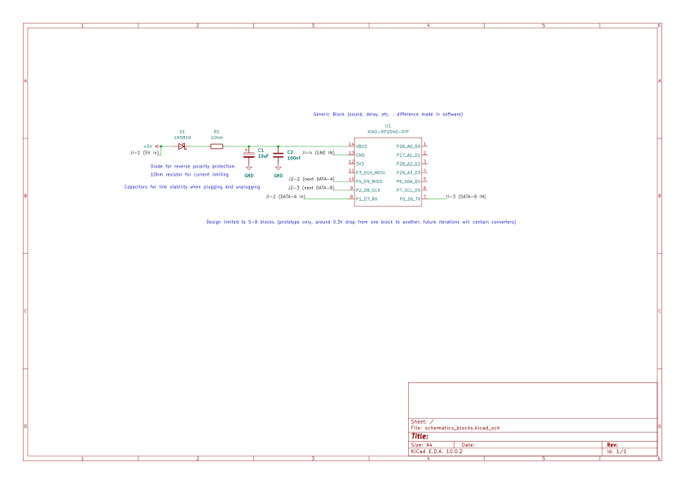

# Physical Music Blocks for Teaching Algorithmic Thinking PoC
A physical programming interface allowing visually impaired children to learn algorithmic thinking by composing music using magnetic blocks.

:::info 

**Author**: Iris-Alexandra Vavilov \
**GitHub Project Link**: [link_to_github](https://github.com/UPB-PMRust-Students/fils-project-2026-unirisel)

:::

## Description

This project aims to create an accessible, physical programming interface. The first design trial was using custom 3D-printed blocks that snap together magnetically for a better UX, but because of the time and budget constrainsts I eventually changed the architecture of the project. Right now, unlike a centralized design where a single board reads passive RFID tags (that had issues when nesting them on top of a reader), each block is now an active device built around a Seeed XIAO RP2040. Blocks are chained together physically, and the chain describes itself as a single nested JSON tree using a minimal recursive UART protocol. A dedicated Start block polls the chain and exposes the parsed program to a host over USB CDC, while a small OLED screen shows a live summary. The system gives this JSON to the computer (where it can be parsed in any program like Scratch, Python etc) and it should give immediate auditory feedback (musical notes or instructions). The program can be heard and used in teaching the algorithmic thinking afterwards.

## Motivation

As a part-time teacher, I faced the challenge of making classroom lessons interactive and inclusive for all students. It is especially difficult to include visually impaired kids alongside other children when working on algorithmic thinking challenges that are traditionally computer-based. This project was chosen to bridge that gap by providing a tactile, screen-free learning environment, making the learning environment for algorithmic thinking more inclusive even without direct access to a computer.

## Iniatial architecture 


 
The Archimate Business Layer describes the main interaction of the actors: the Children and the Teachers.
The main business function that the B Children will perform is described through "B Learn Algorithmic Thinking" business function. The only service we care about in this layer is the B Teaching Algorithmic Thinking that is Realized by the Teacher's function. Back to B Learn Algorithmic Thinking" function: the core process we will try to support is: "B Observe Feedback" through the Application Layer.


The application Layer is split into two components: the Frontend :  "A Feedback Provision Module". This module role is to trigger the "Backend" processing of the sensor data, syntax analysis, and sound playing and TTS synthesis. All the modules in the backend component are decoupled and provide their interfaces as well as realise their services. This ensures hardware and conversely software agnosticism. Further, the software will interface with hardware through APIs and the Embedded HAL APIs


For the Technology Layer, we will have a single node, represented through the "T Tacticode" Node which hosts the single dev board - an ESP32S3. Further details in the picture.

## What Changed (Architecture Revision)
 
The project changed from a single central pad that scans passive RFID tags, towards a distributed network of smart blocks that each carry their own microcontroller and describe themselves on request. I made this design choice because it was more cost effective and because the rfid tags have some issues when "nesting them" on top of each other.
 
| | Previous design | Current design |
|---|---|---|
| Brain | Single ESP32-S3 on a reading track | One Seeed XIAO RP2040 per block |
| Block identity | Passive NTAG213 RFID stickers read by track coils | Each block reports its own identity over UART |
| Reading | PN532 readers on a shared SPI bus, hardware anti-collision | Recursive `DESCRIBE` protocol over per-link UART |
| Audio | DFPlayer Mini + speaker, UART-triggered MP3 | Auditory feedback driven directly from the parsed chain in the connected computer/machine |
| Topology | Star (track polls all tags) | Linear chain (each block polls the one downstream) |
| Hot-plugging | Track re-scans tag positions | Chain extends naturally with no firmware reconfiguration |
| Host link | Wi-Fi dashboard (embassy-net / TCP) | USB CDC stream from the Start block |


## Log

### Week 5 - 11 May
Reworked the architecture, moving away from the centralized RFID-tag design to the new distributed chain of self-describing XIAO RP2040 blocks. Ordered the required components from TME (XIAO RP2040 boards, 4-pin sockets and headers, etc.).

### Week 12 - 18 May
Prototyped the blocks on perfboard and soldered the Start block, generic blocks, power/protection passives, OLED, and the block-to-block links together.



### Week 19 - 25 May
Finished the software, implementing the recursive `DESCRIBE` UART protocol and the USB CDC stream, and completed the Loop block.

## Hardware

The physical components are now built on perfboard prototypes instead of a printed circuit board, one for each block. Each one carries a Seeed XIAO RP2040, a 4-pin interface (5V, GND, DATA-A, DATA-B), reverse-polarity protection, current limiting, and line-stability capacitors. The Start block additionally drives an OLED.

* **Smart Blocks (XIAO RP2040):** Every block is an active device. A generic block (sound, loop, etc.) is differentiated purely in software, so the same hardware serves all block types.
* **4-Pin Snap Interface:** Blocks connect through a 4-pin link carrying **5V in, GND, DATA-A, DATA-B**. Female sockets on one side mate with male pin headers on the next block, passing power and the two UART data lines down the chain. DATA-A/DATA-B are crossed over between blocks so each block's "next" port talks to the downstream block's input port.
* **Start Block with an OLED and a status LED:** The chain head powers the system through USB-C (using the 5V pin), runs the polling loop, exposes the chain over USB CDC, and shows a live summary (e.g. `Chained: 2`) on a small OLED over I²C (P6_SDA_D4 / P7_SCL_D5).
* **Generic Blocks:** Downstream blocks include an internal status LED for debugging (on P3_D10 via a current-limiting resistor). These are the blocks used to generate certain musical sounds.
* **Loop Block:** The Loop block has a slightly different design than the generic blocks. It carries an extra buzzer and a button to let children know how many times the sound structure will repeat when getting into the "loop". 
* **Power & Protection (per block):** A 1N5819 Schottky diode provides reverse-polarity protection, a 1 Ω resistor limits inrush current, and 10 µF + 100 nF capacitors stabilize the line during plug/unplug events. The prototype is intentionally limited to 5 blocks because of the ~0.3 V drop per block. Future iterations will add per-block converters.

### Schematics

There are three board variants, all built on the same `XIAO-RP2040-DIP` in KiCad:

* **Start block**: 

`+3V3`/`+5V` rail fed through USB-C, OLED on SDA/SCL (P6/P7), and a single downstream link (next DATA-A / next DATA-B / GND).

* **Generic block**: 

full chain pass-through with both an upstream input link (DATA-A in / DATA-B in / 5V in / GND in) and a downstream link (next DATA-A / next DATA-B), reverse-polarity diode and stability caps.

* **Generic block with status LED**: 

same as the generic block, plus an LED on P3_D10 to show status.


### Bill of Materials


The BOM reflects the move to discrete smart blocks and removes the centralized RFID/DFPlayer parts.

| Device | Usage | Notes | Price |
|--------|--------|-------|-------|
| Seeed XIAO RP2040 (x10) | One microcontroller per block; RP2040, 2×7 castellated/DIP pins, native USB | SEEED-102010428, ordered 10 PCS, but didn't use all of them | ~216 RON |
| 4-pin female socket strips (1.27 mm, THT) | Block-to-block input sockets | CONNFLY DS1065-01-1×4S8BV, 40 PCS | ~37 RON |
| 4-pin male pin headers (2 mm, THT) | Block-to-block downstream connectors | CONNFLY ZL303-04P / DS1025-01-1×4P8BV1-B, 40 PCS | ~8 RON |
| Perfboard (7×9 cm) | One prototype board per block | Hand-soldered protoboards | ~40 RON |
| OLED display (I²C) | Live chain summary on the Start block | Driven over P6_SDA_D4 / P7_SCL_D5 | ~23 RON |
| 1N5819 Schottky diode (per block) | Reverse-polarity protection | D1 | ~10 RON |
| 1 Ω resistor (per block) | Current limiting | R1 | ~5 RON |
| 10 µF + 100 nF capacitors (per block) | Line stability on plug/unplug | C1 / C2 | ~15 RON |
| Status LED + resistor (generic blocks) | Visual link/parse status | D2 on P3_D10 | ~9 RON |
| USB-C cable | Power + host link to the Start block | 5V in | ~17 RON |
| **Total** | | | **~380 RON** |

## Software

Each block runs the same firmware and knows how to do one thing: when it gets the text `DESCRIBE\n` over UART, it replies with a little JSON object saying what it is. So all the blocks "speak" the same language.

The trick is the `next` field. A block at the end of the chain just says `next: null`:

```json
{"type":"loop","id":"loop-001","iterations":3,"children":[],"next":null}
```

A block that has another block after it does this when it gets `DESCRIBE`: it first sends `DESCRIBE` to the block downstream of it, waits a moment for the reply, and then pastes that whole reply into its own `next` field. If nothing answers in time, it just puts `null`. Because the downstream reply is already valid JSON, the block doesn't need to understand it and it just glues it in as text. This means the chain describes itself automatically. For `Start->Sound->Loop`, Loop answers first, Sound wraps Loop's answer, and Start wraps Sound's answer. You end up with one big nested JSON object that mirrors the physical order of the blocks, without any block ever knowing how long the chain is and without nesting issues (like in the rfid architecture).

The nice side effect is hot-plugging: if I snap a new block onto the end, I don't have to tell the firmware anything. Next time the block in front of it asks `DESCRIBE`, it gets an answer where there used to be no answer, and the new block just shows up in the JSON.

The "Start block" drives everything. Every 500 ms it sends `DESCRIBE` down the chain, reads back the full tree, sends it to my computer over USB, and prints a short summary to the OLED. Each poll is independent meaning that if I add or remove a block, the next reading already reflects it on the screen.

For the OLED count (`Chained: 2`), I used a workaround and just counted how many times `"type":` shows up in the JSON instead of properly parsing it:

```rust
json.matches("\"type\":").count()
```

It's not a real parser, but it works because the JSON is always well-formed and no block ID ever contains the word `type`.

### Libraries

| Library | Description | Usage |
|---------|-------------|-------|
| rp2040-hal / embassy-rp | Rust HAL and async runtime for the RP2040 in a `no_std` environment. | Base hardware control, UART, USB CDC, I²C, GPIO. |
| embassy-executor | Async task framework. | Running the polling loop and per-link UART handling concurrently. |
| embassy-usb | USB device stack. | USB CDC serial link from the Start block to the host. |
| heapless | Statically allocated, memory-safe data structures. | Building and storing JSON strings without dynamic allocation. |
| OLED driver (e.g. ssd1306) | I²C display driver. | Rendering the live chain summary on the Start block. |

## Extras

**A note on intellectual property:** Although this is a faculty project, I retain all intellectual property rights to it since it was built on my own, without any university funding or resources. The code and designs are public here on GitHub, but I made this because I think it's genuinely cool, and I'd love to develop it into a real product one day.

**Acknowledgements:** Thanks to Alacrity Education, the organization I founded with other students, for supporting me in all steps of this journey and helping me stay (almost) sane this semester <3.

## Links

1. [Scratch Foundation Inspo](https://www.scratchfoundation.org/learn/learning-library/physical-computing-with-scratch-makey-makey)
2. [Google Research for making code physical](https://research.google/blog/project-bloks-making-code-physical-for-kids/)
3. [Ghana introduces physical coding lego blocks](https://www.physical3dscratchblocks.org/)
4. [Engineering for Industrial Designers and Inventors: Fundamentals for Designers of Wonderful Things](https://books.google.ro/books/about/Engineering_for_Industrial_Designers_and.html?id=Akn7sgEACAAJ&redir_esc=y)
