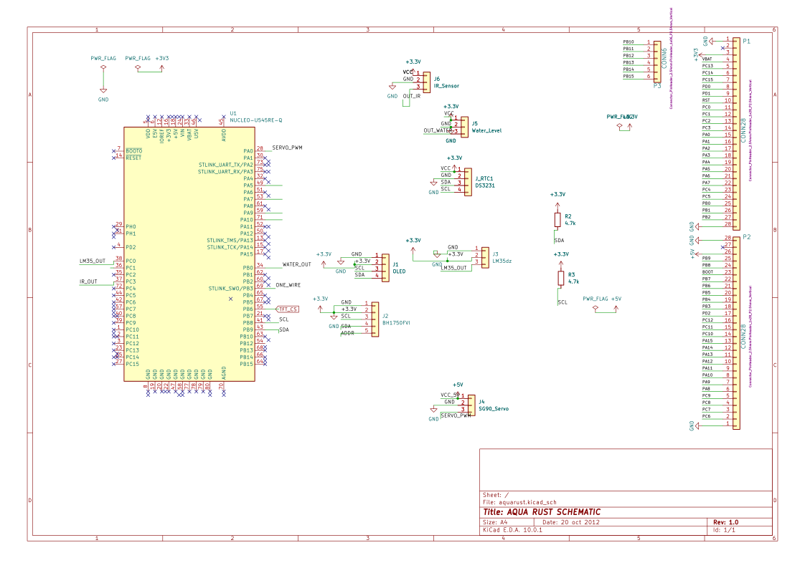
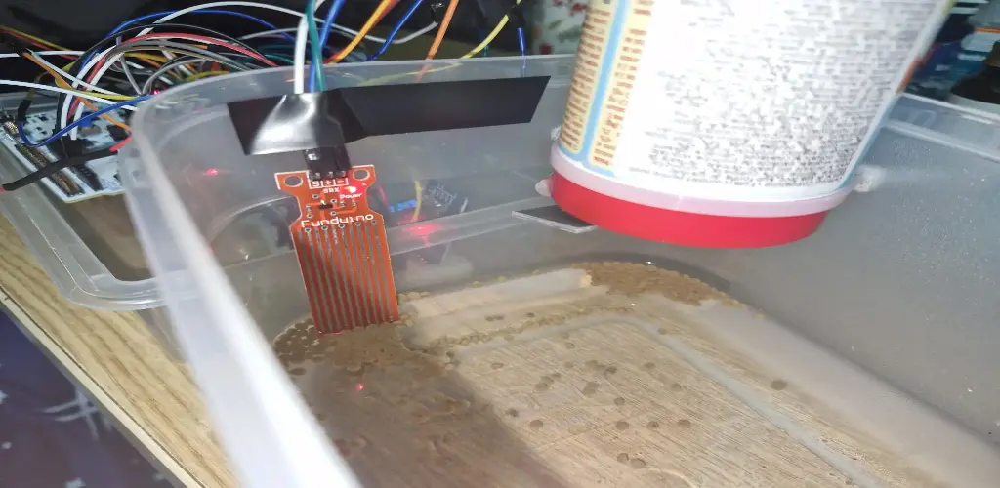
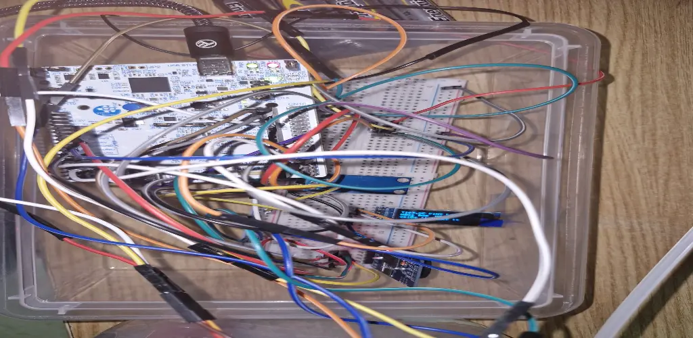
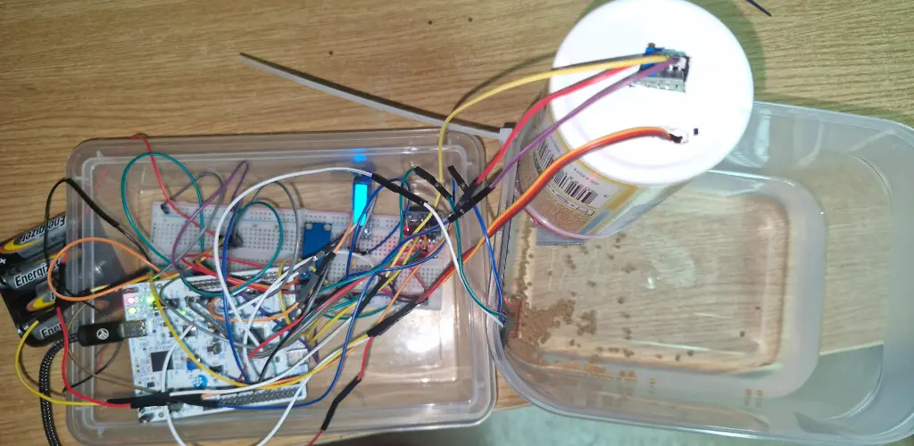
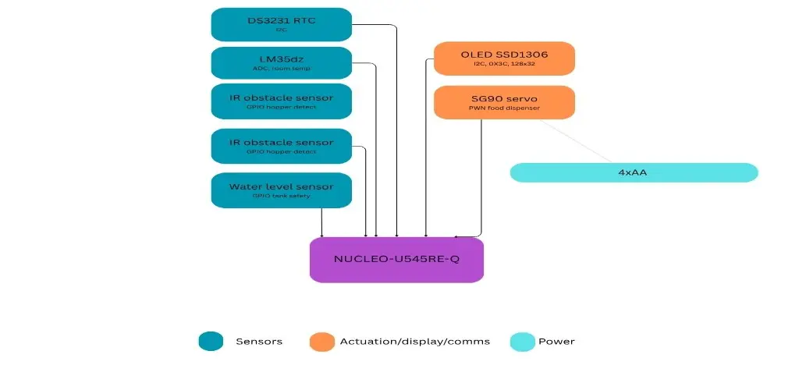

#   AquaRust
An autonomous fish feeder that dispenses food on a programmed schedule, monitors aquarium water conditions in real time and has alerts when needed.

:::info 

**Author**: Niță Iulia-Ștefania \
**GitHub Project Link**: https://github.com/UPB-PMRust-Students/fils-project-2026-nitaiulia1905-png
:::

<!-- do not delete the \ after your name -->

## Description

This project focuses on building an automated fish feeding and environmental monitoring system using the Rust programming language for high reliability. The system uses an STM32 microcontroller for precise hardware controly. It is designed to dispense food at scheduled intervals using a servo motor while simultaneously monitoring water temperature and water level to ensure a safe environment for the fish. The device displays live sensor data on a small OLED screen and allows the user to trigger an instant feeding remotely from their phone, offering a simple and hands-free way to care for aquatic life.

## Motivation
The motivation is my desire to create a more sustainable way to manage home ecosystems. Traditional fish care often involves low-quality electronics that eventually end up in a landfill, and inconsistent feeding habits that negatively affect water quality. By using a regulated battery power supply and high-durability components, I am building a device designed for longevity. Furthermore, by using a real-time clock to enforce precise feeding schedules and sensors to continuously monitor water temperature and level, I am reducing the risk of overfeeding and organic waste buildup in the water. This helps maintain a cleaner tank environment and reduces the frequency of water changes, ultimately saving water and resources. Beyond the environmental aspect, this project also represents a personal challenge to work with embedded systems and the Rust programming language.

## Architecture 

The microcontroller unit, built around the STM32 NUCLEO-U545RE-Q, serves as the central brain of the device. It runs all firmware logic using asynchronous embedded Rust via the Embassy framework, coordinating every peripheral and task concurrently without a traditional operating system. It processes sensor readings, updates the display, enforces feeding schedules, and handles incoming remote commands.

The sensing subsystem consists of the DS18B20 waterproof temperature sensor, the water level sensor, and the infrared obstacle sensor. These components continuously provide the microcontroller with real-time data about the aquarium environment and the state of the food hopper. The DS3231 RTC module complements this subsystem by maintaining precise time tracking, ensuring that scheduled feedings remain accurate even after a power cut or battery swap.

The actuation system is centered on the SG90 micro servo motor, which physically controls the food hopper gate to dispense portions of fish food. The STM32 drives the servo using a PWM signal.

The power management system supplies the entire device from a 4×AA battery pack, a CR2032 coin cell on the DS3231 module keeps the real-time clock running independently whenever the main power supply is disconnected.




## Log

<!-- write your progress here every week -->

### Week 8 - 13 April
Most of the components started to arrive, among the STM32 NUCLEO-U545RE-Q. Still waiting on other components.

### Week 9 - 20 April
Waiting on the left components to arrive.

## Week 10 - 27 April
All components arrived, started working on Kicad.

## Week 11 - 4 May
Finished the Kicad schematic and started working on hardware.

## Week 12 - 11 May
Tested sensors and started connecting them to my breadboard and STM32 NUCLEO-U545RE-Q.

## Week 13 - 18 May 
After trying to configure the waterproof sensor of water temperature, I changed my idea to a room temperature sensor and a light sensor (8 to 12-hour day-night cycle).

## Week 14 - 28
Ready to test the project for the first time, all components connected. 
 




## Week 11 - 4 May
Finished the Kicad schematic and started working on hardware.
 

## Hardware

The primary processing unit is built around the STM32 NUCLEO-U545RE-Q, interfacing with all peripherals through its GPIO, I2C, ADC, and PWM pins. The sensing subsystem includes the LM35dz analog temperature sensor on ADC for room temperature monitoring, the BH1750FVI light sensor over I2C for ambient light detection, the DS3231 RTC module over I2C backed by a CR2032 coin cell to maintain accurate time during power cuts, the infrared digital obstacle sensor on GPIO to detect whether food is still present in the hopper, and the water level sensor to monitor if the water drops below a safe level. The SG90 9G micro servo physically dispenses food from the hopper, controlled via PWM. System status and live sensor data are displayed on the 0.91" 128×32 OLED over I2C. The entire system is prototyped on a breadboard and supplied by a 4×AA battery pack.

### Schematics



### Bill of Materials

<!-- Fill out this table with all the hardware components that you might need.

The format is 
```
| [Device](link://to/device) | This is used ... | [price](link://to/store) |

```

-->

| Device | Usage | Price |
|--------|--------|-------|
| [STM32 NUCLEO-U545RE-Q](https://stm32world.com/wiki/STM32_Official_Documentation) | The microcontroller | [~107 RON](https://ro.mouser.com/ProductDetail/STMicroelectronics/NUCLEO-U545RE-Q?qs=mELouGlnn3cp3Tn45zRmFA%3D%3D) |
| [DS3231 RTC Module ](https://blog.embeddedexpert.io/?p=1326) | keeps accurate time for scheduled feedings | [~24 RON](https://www.aliexpress.com/item/1005010574150546.html?spm=a2g0o.order_list.order_list_main.29.6fc01802D7aUUr) |
| [Infrared Digital Obstacle Sensor](https://docs.sunfounder.com/projects/ultimate-sensor-kit/en/latest/components_basic/09-component_ir_obstacle.html) | detects if food is still present in the hopper| [20 RON](https://www.optimusdigital.ro/ro/senzori-senzori-optici/4347-modul-senzor-de-obstacole-digital-cu-infrarosu-reglabil-3-100-cm.html?search_query=0104110000034649&results=1) |
| [Water Level Sensor](https://www.bitmi.ro/domains/bitmi.ro/files/files/bitmi-datasheet-senzor-nivel-masurare-apa-1794.pdf) | monitors if the water drops below a safe level| [2 RON](https://www.optimusdigital.ro/ro/senzori-altele/272-senzor-de-nivel-al-apei.html?search_query=0104110000002655&results=1) |
| [Modul OLED Albastru de 0.91'' (128x32 px) ](https://www.electronicaembajadores.com/datos/pdf1/lc/lcgr/lcgrol3.pdf) | shows live sensor data and system status | [21 RON](https://www.optimusdigital.ro/en/lcds/1310-modul-oled-albastru-de-091-128x32-px.html) |
| [Lm35dz Temperature Sensor ](https://www.electronicwings.com/sensors-modules/lm35-temperature-sensor) | monitors the temperature of the room | [5 RON](https://www.optimusdigital.ro/ro/senzori/1469-senzor-de-temperatura-analogic-lm35d-to-92.html) |
| [Light Sensor BH1750FVI](https://www.mouser.com/datasheet/2/348/bh1750fvi-e-186247.pdf) | monitors the light in the room | [14.50 RON](https://www.optimusdigital.ro/ro/senzori/1451-senzor-digital-de-intensitate-a-luminii-bh1750fvi.html) |
| [SG90 9G Micro Servo ](https://www.friendlywire.com/projects/ne555-servo-safe/SG90-datasheet.pdf) | physically dispenses food from the hopper | [22 RON](https://www.aliexpress.com/item/1005008321715111.html?spm=a2g0o.order_list.order_list_main.35.6fc01802D7aUUr) |
| 4×AA Batteries & Battery Holder | main power supply for the entire system |26 RON |
| CR2032 Coin Cell Battery  | m keeps the DS3231 clock running during power cuts| 10 RON|
| [Breadboard](https://os.mbed.com/handbook/Breadboard) | main prototyping surface for connecting all components | [13 RON](https://www.niden.ro/cablaje/3164-placa-test-tip-breadboard-83x55x10mm.html) |
| Male-to-Male Jumper Wires  | wires for connecting components | [6 RON](https://www.optimusdigital.ro/ro/fire-fire-mufate/93-fire-colorate-tata-tata-20cm.html?search_query=0104210000001754&results=1) |
| USB Data Cable  | connects the STM32 to a PC for flashing firmware | 0 RON (BORROWED) |

## Software

## Software

| Library | Description | Usage |
|---------|-------------|-------|
| [embassy-executor](https://github.com/embassy-rs/embassy/tree/main/embassy-executor) | async task executor | Used to run all concurrent firmware tasks |
| [embassy-time](https://github.com/embassy-rs/embassy/tree/main/embassy-time) | async timers and delays | Used for polling intervals and servo timing |
| [embassy-stm32](https://github.com/embassy-rs/embassy/tree/main/embassy-stm32) | drivers for STM32 peripherals | Used to control GPIO, ADC, I2C, UART, PWM |
| [embedded-hal](https://crates.io/crates/embedded-hal) | standard hardware interface traits | Used by all peripheral drivers |
| [embedded-hal-02](https://crates.io/crates/embedded-hal) | 0.2.x hardware interface traits | Used for PWM and serial compatibility traits |
| [ssd1306](https://github.com/rust-embedded-community/ssd1306) | SSD1306 OLED display driver | Used to initialize and render to the 128×32 OLED |
| [embedded-graphics](https://github.com/embedded-graphics/embedded-graphics) | 2D embedded graphics library | Used for drawing text and shapes on the OLED |
| [heapless](https://github.com/rust-embedded/heapless) | fixed-size collections without heap | Used for string buffers in display and serial output |
| [defmt](https://github.com/knurling-rs/defmt) | lightweight embedded logging | Used to print debug messages over RTT |
| [defmt-rtt](https://crates.io/crates/defmt-rtt) | RTT log transport | Used to view logs on PC |
| [panic-probe](https://github.com/knurling-rs/defmt/tree/main/firmware/panic-probe) | embedded panic handler | Used to report firmware crashes |

## Links

<!-- Add a few links that inspired you and that you think you will use for your project -->

1. [Reference Manual STSTM32U5](https://www.st.com/resource/en/reference_manual/rm0456-stm32u5-series-32bit-arm-based-mcus-stmicroelectronics.pdf)
2. [Fish Feeder Machine Architecture Idea](https://www.youtube.com/watch?v=1Kkkap2-C5E&t=57s)
3. [Embassy framework](https://embassy.dev/)
...
