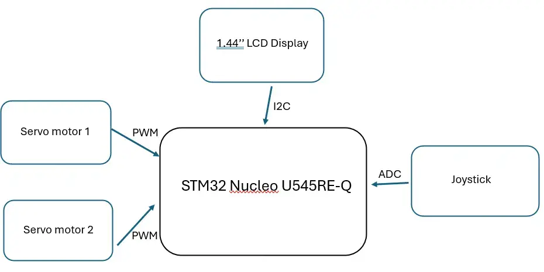
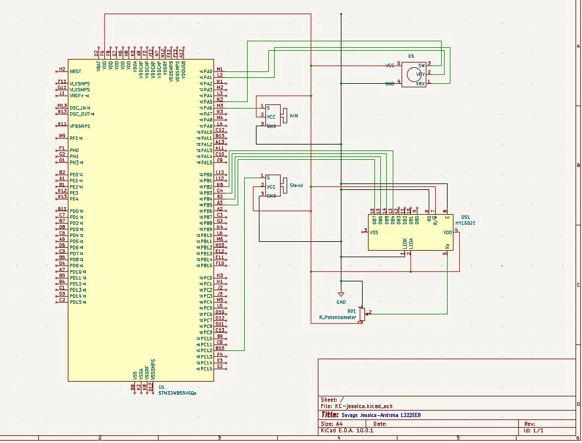
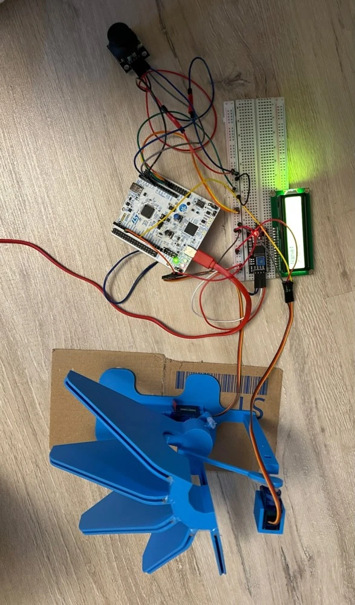

# CD Storage System
An STM32 system-based CD storage that selects and ejects CDs using servo mechanisms.

:::info

**Student:** Savage Jessica-Andreea \
**GitHub Repository**: https://github.com/UPB-PMRust-Students/fils-project-2026-jessicasavage24

:::

## Description

This project consists of a rotating stand designed to store multiple CDs. The CDs are arranged around the stand, and the system allows the user to select a specific CD using a menu displayed on a LCD. 
When a CD is selected, a servo motor rotates the stand until the chosen CD reaches the front position. Once the CD is in the correct position, a second servo motor activates a mechanical arm that pushes it outward, making it easier for the user to remove it from the stand. The system provides a simple and organized way to store, select and retrive CDs. 

## Motivation

I chose this project idea because i wanted to make something that accesses a CD collection easier and faster. Instead of manually searching through a stack of CDs, you can simply browse for a desired album and the system will locate and present it.

## Architecture

The main controller is the STM32U545RE, which coordinates the LCD display, joystick and servo motors. The process starts with the selection menu displayed on the 1602 LCD, where the user can navigate through the available CDs using the HW-504 joystick. Once it's selected and confirmed, the microcontroller determines the corresponding position of the CD and sends a PWM control signal to the first SG90 servo motor. Once the correct position is reached, the microcontroller activates the second SG90 servo motor, which controls the mehanical arm.

## Schematics

## Log

### Week 6

I came with the project idea and received a feedback.

### Weeks 7-8

 According to the feedback i tried to improve my project and I ordered the components.

### Week 9

I received the components and started testing them to see if everything works.

## Hardware

| Device | Usage | Price |
|--------|-------|-------|
| STM32 Nucleo-U545RE-Q | main controller | borrowed |
|  1.44'' LCD | Displays CD slection menu | 34.99 RON |
| Joystick Breakout Board | Navigates and selects options | 5.35 RON |
| Breadboard 830 points MB-102 | Connects the components to the microcontroller | 24.83 RON |
| Servo motor | Rotates the stand | 13.99 RON |
| Wires (M-F and M-F) | Component Interconnections | 15 RON |
| Resistors | Protects the components | 3.57 RON |
| RGB LED | Status indicator | 0.99 RON |

## Software

| Library | Description | Usage |
| ------- | ----------- | ----- |
| embassy-stm32 | STM32 hardware control | Used for handling the motors, LEDs and joystick |
| st7735-lcd | Display driver | Used to control the screen |
| embedded-graphics | Graphics library | Used to display the menu |
| embedded-hal | Hardware interface | Used for communication with the peripherals |

## Links
1. [Embedded Rust 101 course labs](https://embedded-rust-101.wyliodrin.com/docs/fils_en/lab/01)
2. [STM32U5 Reference Manual](https://www.st.com/resource/en/reference_manualrm0456-stm32u5-series-32bit-arm-based-mcus-stmicroelectronics.pdf)

