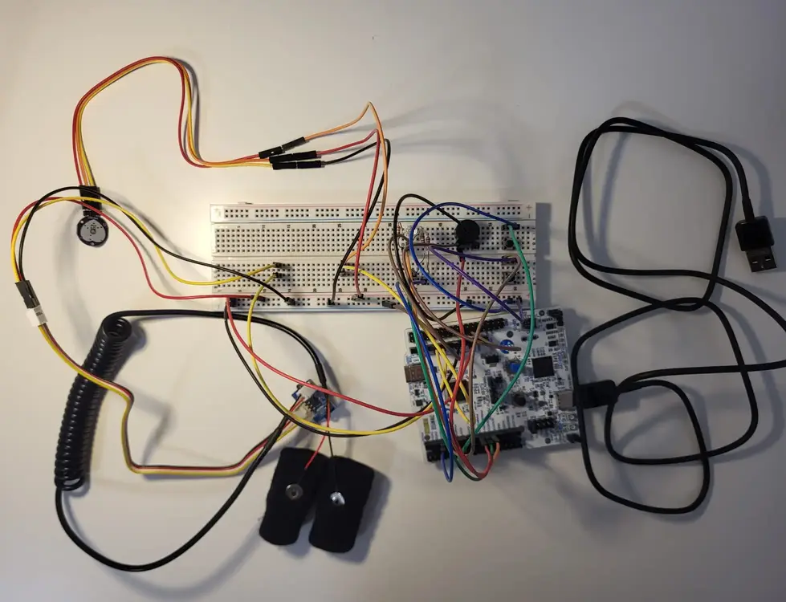
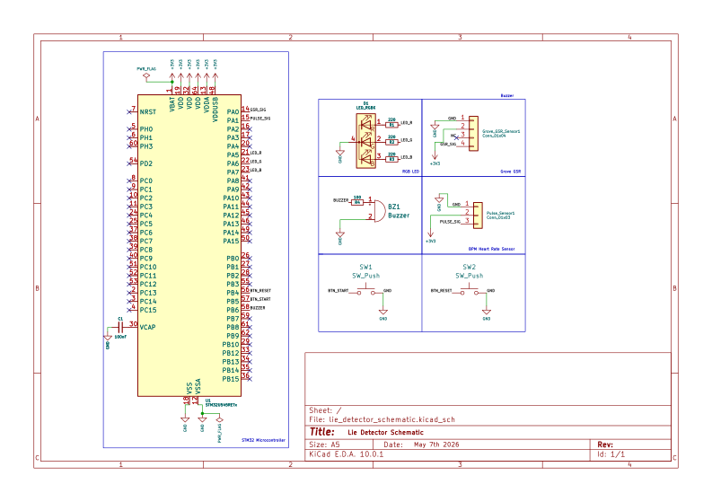

# The Lie Detector

A biometric analyzer powered by an STM32 that correlates real-time heart rate and skin conductivity via ADC to detect deception markers.

:::info
**Author**: Sahin Leyla-Kubra \
**GitHub Project Link**: [https://github.com/UPB-PMRust-Students/fils-project-2026-leylakubrasahin](https://github.com/UPB-PMRust-Students/fils-project-2026-leylakubrasahin)
:::

## Description

The Lie Detector is an asynchronous embedded system designed to monitor physiological stress indicators often associated with deception. Using an STM32 Nucleo-U545RE-Q microcontroller, the device establishes a physiological baseline for a subject's heart rate and skin conductivity (GSR). During active questioning, the system uses its ADC to monitor real-time sensor data, triggering visual PWM-controlled RGB LED transitions and audible buzzer alarms if simultaneous spikes above the baseline thresholds are detected. The system also features a dynamic baseline engine, sensor stabilization logic, and two physical push buttons for start and reset control.

## Motivation

I was inspired by the modern criminal investigation tool, the "Polygraph", as I am a fan of crime documentaries and have always wanted to experiment with one. Therefore, I decided that I could recreate my own version of it by using the STM32 Nucleo-U545RE-Q microcontroller as the main component.

## Architecture

Main software and system components:

* **Physiological Data Acquisition Module**: Reads skin conductance from the Grove GSR sensor and heart rate from the Pulse sensor via ADC channels. Includes sensor attachment detection and a stabilization countdown before calibration begins.
* **Stress Analysis Module**: Processes the physiological baseline and current readings using an asynchronous logic brain to detect deception spikes. Uses a dynamic rolling baseline and a sustained-count mechanism to avoid false positives.
* **Shared State Module**: Manages safe data access between all concurrent tasks using an `embassy-sync` Mutex protecting a central `BaselineData` struct.
* **Visual Feedback Module**: Controls the RGB LED via PWM to smoothly transition colors from green to red based on the current deception score.
* **Audible Alert Module**: Drives the passive buzzer to emit rapid pulses when the deception score exceeds a set threshold.
* **Button Handler Module**: Monitors two physical push buttons — one to start the session (triggering the stabilization phase) and one to fully reset the system back to its idle state.
* **Logging and Debug Module**: Sends real-time sensor data and system status to a PC via UART/USB for graphing and monitoring using the companion Python script.

## Log

### Week 1-7
* Dedicated this period to brainstorming and evaluating potential embedded system concepts.
* Explored various ideas before finalizing the "Lie Detector" based on the STM32 Nucleo-U545RE-Q.
* Researched physiological sensors (GSR and Pulse) and their integration with asynchronous Rust.

### Week 8
* Focused on sourcing the specific hardware required for the project.
* Obtained the necessary components like the GSR sensor, Pulse sensor, RGB LEDs, and an active buzzer.

### Week 9
* Completed the gathering of all secondary hardware, including the USB debugging cables and safety resistors.
* Completed the project documentation milestone.

### Week 10
* Tested the Grove GSR sensor in multiple different ways to make sure it's actually reading properly and gives consistent values.
* Started working on the KiCad schematic for the project.
* Also started writing the project code to get a feel for the structure before flashing anything onto the actual hardware.

### Week 11
* Finished the KiCad schematic and added it to the documentation.
* Soldered the analog pulse sensor and ran some tests to confirm it's fully functional and reading as expected.

### Week 12
* Started properly working on the full codebase and added several new features including sensor stabilization, dynamic rolling baseline, and sustained-count deception scoring.
* Flashed the code onto the hardware and did initial testing but couldn't get the buzzer to behave correctly, so that's still a work in progress.

### Week 13-14
* Finally got everything working, I completed the code and all the bugs that were piling up are now fixed.
* The full project is functional on the hardware.
* Added the two physical push buttons (start and reset) to the breadboard setup and integrated them into the system logic.

## Hardware

The project uses a mix of analog physiological sensors and asynchronous digital processing to achieve real time deception detection. The hardware setup is centered around the STM32 Nucleo-U545RE-Q, which acts as the high-speed data aggregator and main controller.

The Grove GSR sensor is connected to ADC channel PA0 and measures skin conductance by detecting changes in electrical resistance across the fingertips. The Analog Pulse Sensor is connected to ADC channel PA1 and captures heart rate fluctuations. Both sensors feed into the ADC and are sampled every 500ms during the monitoring phase.

An RGB LED is driven via three PWM channels (PA6, PA7, PB0 on TIM3) to visually represent the deception score, transitioning from green at baseline to red as stress indicators rise. A passive buzzer on PB6 emits rapid pulses when the score exceeds 50. Two tactile push buttons (connected to PB5 and PB4 with internal pull-ups) allow the user to start a session or reset the system at any point.

### Schematics

### Bill of Materials

| Device | Usage | Price |
| :--- | :--- | :--- |
| [STM32 NUCLEO-U545RE-Q](https://www.st.com/en/evaluation-tools/nucleo-u545re-q.html) | Central Controller | 128 RON |
| [Grove GSR Sensor](https://wiki.seeedstudio.com/Grove-GSR_Sensor/) | Stress Monitor | 40.18 RON |
| [Analog Pulse Sensor](https://robocraze.com/blogs/post/what-is-pulse-sensor) | Heart Rate Monitor | 15.4 RON |
| [RGB LED](https://www.elprocus.com/what-is-three-rgb-led-and-its-working/) | Visual Indicator | 0.92 RON |
| [Passive Buzzer](https://www.circuitbasics.com/what-is-a-buzzer/) | Audible Alarm | 1 RON |
| [Push Buttons x2](https://www.optimusdigital.ro) | Start & Reset Control | 2 RON |
| Resistors (220Ω) | Safety | 2 RON |
| Breadboard & Wires | Connection | 30 RON |

## Software

| Library | Description | Usage |
| :--- | :--- | :--- |
| [embassy-stm32](https://github.com/embassy-rs/embassy) | STM32 Hardware Abstraction Layer | Controls ADC for sensor sampling, PWM for the RGB LED, GPIO for buttons and buzzer, and USART for serial output. |
| [embassy-executor](https://github.com/embassy-rs/embassy) | Async task manager | Spawns and runs all concurrent tasks (acquisition, analysis, feedback, button handler). |
| [embassy-time](https://github.com/embassy-rs/embassy/tree/main/embassy-time) | Timekeeping library | Manages stabilization countdowns, calibration timing, and polling intervals. |
| [embassy-sync](https://github.com/embassy-rs/embassy) | Synchronization primitives | Provides the `Mutex` used to safely share `BaselineData` between all async tasks. |
| [embedded-hal](https://github.com/rust-embedded/embedded-hal) | Hardware abstraction traits | Used for the `Pwm` trait to set duty cycles on the RGB LED PWM channels. |
| [heapless](https://github.com/japaric/heapless) | `no_std` data structures | Provides a stack-allocated `String` for formatting UART serial output without heap allocation. |
| [defmt](https://github.com/knurling-rs/defmt) | Efficient logging | Sends real-time sensor data and state transitions to the PC via RTT for debugging. |
| [panic-probe](https://github.com/knurling-rs/panic-probe) | Panic handler | Handles panics in the embedded environment and reports them via `defmt`. |

## Links

1. [Embassy-rs Documentation](https://embassy.dev/book/index.html)
2. [Rust Embedded Book](https://docs.rust-embedded.org/book/)
3. [GSR Sensor Guide](https://wiki.seeedstudio.com/Grove-GSR_Sensor/)
4. [STM32 Nucleo-U545RE-Q Reference Manual](https://www.st.com/en/evaluation-tools/nucleo-u545re-q.html)
5. [defmt Logging Framework](https://defmt.ferrous-systems.com/)
