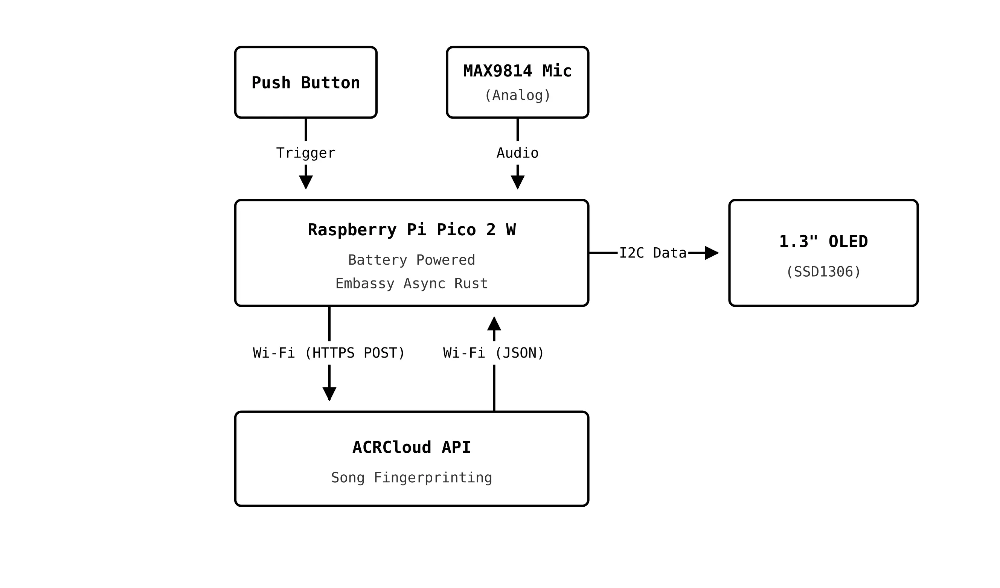
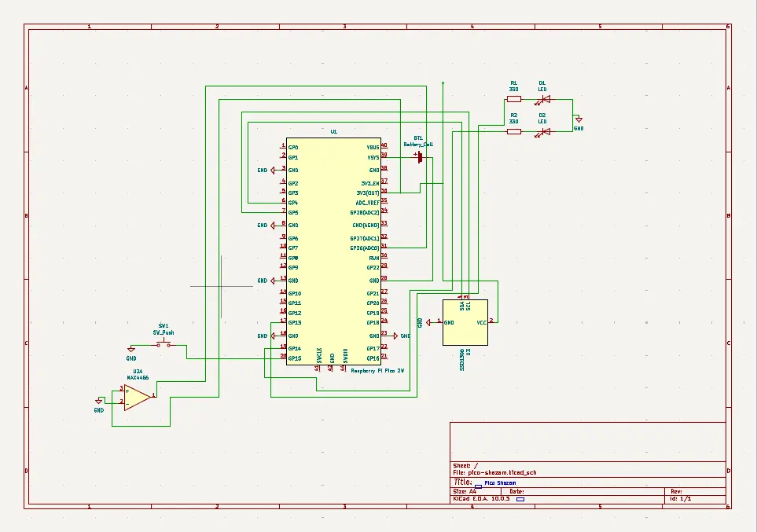

# Pico Shazam
Standalone song identification device

:::info

**Author**: Maria-Melissa Neamțu \
**GitHub Project Link**: https://github.com/UPB-PMRust-Students/fils-project-2026-melissamaria1825
:::

## Description

The Listenus project is a standalone hardware device that recognizes songs playing in the background and displays the song details (artist, track name) on a local OLED screen. The system provides a seamless listening experience, designed as a one-button capture device running entirely on battery power. Unlike a continuous listener, the device remains in a low-power idle state until the user triggers a capture session, at which point it samples ambient audio via an analog microphone and communicates directly with the cloud via Wi-Fi to identify the song.

## Motivation

I chose this project after seeing a video explaining the math behind Shazam's recognition system, specifically how it uses FFT to break down audio frequencies and create unique acoustic fingerprints. I was completely fascinated by how a physical sound wave could be mathematically mapped and matched against a massive database almost instantly. That curiosity made me want to explore the concept myself. It also solves a very real, everyday frustration: hearing an incredible song and missing it because you couldn't pull your phone out and open an app in time. So, I wanted a one-button solution that is always ready to listen. 

On the technical side, this project is my excuse to dive into embedded audio and asynchronous execution. It forced me to step far out of my comfort zone and tackle real challenges like precise ADC analog sampling, Wi-Fi network stacks, and writing asynchronous Rust firmware to connect raw hardware directly to modern cloud APIs.

## Architecture

The logic is designed to be a smooth, "on-demand" process that balances speed with efficiency. The architecture employs a fully independent, battery-powered approach:

1. Hardware Acquisition:* The Raspberry Pi Pico 2 W waits in an idle state powered by a 3xAA battery pack. Upon pressing the trigger button, it opens a recording window. The analog MAX4466** microphone captures ambient audio, and the microcontroller's ADC (Analog-to-Digital Converter) samples the signal precisely using async timers.
2. Wireless Transmission: Utilizing the onboard Wi-Fi chip, the Pico connects directly to a mobile hotspot, opening a secure HTTPS connection to send the audio payload.
3. Cloud Processing: The request reaches the ACRCloud API, which matches the acoustic fingerprint against its song database.
4. Display: The API returns a JSON response containing the track name and artist. The microcontroller parses this data and instantly updates the SSD1306 OLED screen via the I2C connection. 

Everything on the board is managed by the Embassy async executor, keeping the device highly responsive.

### System Data Flow

## Log

### Week 1-3
- Developed the initial concept for Listenus. 
- Researched audio fingerprinting algorithms and public APIs for music recognition. 
- Analyzed hardware requirements for digital audio capture and async execution.

### Week 4-6
- Ordered the Starter Electronics Kit, initial INMP441 microphones, and the SSD1306 OLED screen. 
- Ordered STM32 for the initial plan of the project.

### Week 7
- Talked with the laboratory assistant to discuss project architecture. 
- Based on the requirements for better support for the Embassy (Rust) framework, I decided with the lab assistant to change the architecture from STM32 to Raspberry Pi Pico 2 W. 
- Ordered Raspberry Pi Pico 2 W and soldered components.

### Week 8-9
- Successfully initialized the SSD1306 display using the `ssd1306` crate. 
- Started working on the hardware integration and audio sampling logic.

### Week 10-13 (Hardware Revisions & Adaptation)
- Hardware Failures: Encountered major hardware blocks. Both of the originally ordered digital INMP441 microphones were defective and failed to record audio. Furthermore, the first Raspberry Pi Pico 2 W board burned out due to a hardware fault and had to be replaced.
- Pivot to Analog & Wireless: Acquired a replacement Pico 2 W and switched the audio acquisition strategy to an analog MAX4466 microphone, connecting its analog output directly to the Pico's ADC. Configured the system to operate completely independently on batteries via Wi-Fi.
- Shifted the project focus towards this stable, portable, standalone IoT architecture.

### Schematics

## Bill of Materials

| Device | Usage | Price |
| :--- | :--- | :--- |
| 2x Raspberry Pi Pico 2 W | The main microcontroller (one replacement due to burnout) | ~74 RON |
| MAX4466 Analog Mic | For analog audio capture with adjustable gain | ~15 RON |
| SSD1306 OLED Display | For displaying the track title and artist | ~10 RON |
| Battery Holder (3xAA) | For portable, wireless power supply | ~8 RON |
| Starter Kit Electronics | Breadboard, push button, resistors, jumper wires, etc. | ~70 RON |
| STM32 NUCLEO-U545RE-Q | Initial acquisition (initial architecture) | ~125 RON |

## Hardware

The hardware components are selected to ensure a compact and efficient design:

- Raspberry Pi Pico 2 W: The main processing unit running Embassy Rust. It handles analog sampling, I2C display routing, Wi-Fi connectivity, and battery power management.
- MAX4466 Microphone: An analog electret microphone featuring an integrated op-amp and a gain-adjustment trimmer. This allows manual tuning of the input sensitivity to provide clean analog data to the Pico's ADC without clipping.
- SSD1306 OLED Display: A 1.3" screen used to display the artist and track name to the user via I2C, alongside system status updates.
- Push Button & Resistors: Sourced from the electronics starter kit. The button serves as a simple hardware interface to trigger the audio capture process.

## Software

| Library | Description | Usage |
| :--- | :--- | :--- |
| [cortex-m](https://crates.io/crates/cortex-m) & [cortex-m-rt](https://crates.io/crates/cortex-m-rt) | Low level access & Bootstrap | Core startup and low-level access to Cortex-M processors. |
| [defmt](https://crates.io/crates/defmt) & [defmt-rtt](https://crates.io/crates/defmt-rtt) | Efficient logging framework | Structured debug logging and real-time monitoring. |
| [panic-probe](https://crates.io/crates/panic-probe) | Panic handler | Prints the panic message via defmt. |
| [embassy-executor](https://crates.io/crates/embassy-executor) | Async task executor | Runs concurrent async tasks via thread executor. |
| [embassy-time](https://crates.io/crates/embassy-time) | Timekeeping | Async delays, timeouts, and timestamping. |
| [cyw43](https://crates.io/crates/cyw43) & [cyw43-pio](https://crates.io/crates/cyw43-pio) | Wi-Fi driver | Controls the onboard Wi-Fi chip on the Pico 2 W. |
| [embassy-net](https://crates.io/crates/embassy-net) | Network stack | Asynchronous TCP/IP stack for network communication. |
| [reqwless](https://crates.io/crates/reqwless) | HTTP client | Lightweight async HTTP client for embedded devices. |
| [embedded-graphics](https://crates.io/crates/embedded-graphics) | 2D graphics library | Framebuffer and text drawing for the OLED display. |
| [embedded-hal-async](https://crates.io/crates/embedded-hal-async) | Async HAL traits | Required to call the async I2C methods for the display. |
| [heapless](https://crates.io/crates/heapless) | Fixed-capacity collections | Used for `heapless::Vec` for word-wrapped text on the screen. |
| [static_cell](https://crates.io/crates/static_cell) | Static memory allocation | Lets us put big buffers in `static`s. |

## Links
1. https://www.raspberrypi.com/documentation/microcontrollers/
2. https://github.com/embassy-rs/embassy
3. https://embassy.dev/book/index.html
4. https://docs.rs/ssd1306/latest/ssd1306/