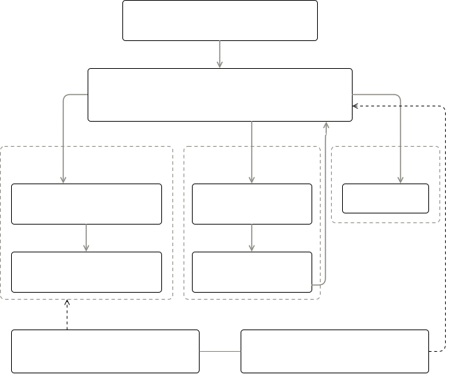
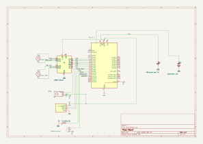

# RustRover — Wi-Fi Rover with Live Radar

A teleoperated rover with a live ultrasonic radar display and automatic collision protection, driven from any phone via a self-hosted web interface.

:::info 

**Author**: Tita Matei Alexandru \
**GitHub Project Link**: https://github.com/UPB-PMRust-Students/fils-project-2026-Matei13x13.git

:::

<!-- do not delete the \ after your name -->

## Description

The rover runs as its own Wi-Fi access point (`RustRover`), so no external network is needed: the phone connects directly, receives an IP from a DHCP server written from scratch, and loads a control page served from the Pico's flash. The page offers a touch drive pad with differential steering and arc turns, a speed slider, headlights and horn buttons, and a live polar radar view drawn on a canvas from 37 distance measurements taken by an HC-SR04 sensor swept 0–180° on a servo.

Safety is layered: a failsafe stops the motors if no command arrives for 500 ms (heartbeat from the page), an auto-brake refuses forward motion when the filtered front-arc distance drops below 15 cm (reverse stays allowed, and the horn beeps), and a hardware watchdog reboots the firmware within 3 seconds if it ever hangs or panics.

## Architecture

The firmware is a set of concurrent Embassy tasks over shared state, in `no_std` Rust:

- **motor_task** — 20 ms control loop; reads the latest drive command from a `Signal`, applies the failsafe and auto-brake filters, and drives the L298N with four PWM channels at 20 kHz.
- **radar_task** — steps the servo in 5° increments, pings the HC-SR04 (with timeouts and a ghost-echo filter), stores distances in a `Mutex<[u16; 37]>` and updates the atomic minimum front distance.
- **web_task ×3** — HTTP server instances on port 80 (parallel sockets so drive commands never wait behind radar polls); routes: `/`, `/cmd`, `/radar`, `/light`, `/horn`.
- **dhcp_server_task** — minimal single-lease DHCP server on UDP 67.
- **body_task** — headlight GPIO and buzzer PWM; **cyw43_task / net_task** — Wi-Fi chip driver and TCP/IP stack runners; **watchdog_task** — feeds the hardware watchdog.

## Log

<!-- write your progress here every week -->

### Week 5 - 11 May

Toolchain bring-up (probe-rs, RP2350 linker setup, defmt), Embassy blink test, project skeleton: `Drive` command enum, `Signal`-based task communication, stub motor task verified over logs.

### Week 12 - 18 May

Wi-Fi phase: cyw43 radio bring-up, open access point, static-IP network stack, hand-written DHCP server, HTTP server with embedded control page, touch drive pad with 200 ms command heartbeat and 500 ms failsafe. Chassis assembled, L298N wired, PWM motor control and differential drive working — full teleoperation from the phone.

### Week 19 - 25 May

Radar phase: servo sweep, HC-SR04 measurement with echo timeouts and neighbor-based ghost filtering, `/radar` endpoint with live canvas radar in the UI, auto-brake on the front arc with horn alarm. Polish: headlights, horn, triple web-server instances to remove command latency, hardware watchdog. Debugged real hardware faults along the way (missing common ground, broken jumper wires, cold solder joints, power-bank auto-sleep).

## Hardware

Raspberry Pi Pico 2 W (a second Pico 2 acts as SWD debug probe), 2WD chassis with two TT motors driven by an L298N (PWM on IN1–IN4, enables jumpered), SG90 servo sweeping an HC-SR04 ultrasonic sensor (ECHO level-shifted through a 10 kΩ/22 kΩ divider), headlight LED and passive buzzer. Motors are powered from an AA battery pack through the L298N; the Pico, servo and sensor run from a 5 V power bank; all grounds share one rail.

### Schematics

### Bill of Materials

| Device | Usage | Price |
|--------|--------|-------|
| [Raspberry Pi Pico 2 W (×2)](https://www.raspberrypi.com/products/raspberry-pi-pico-2/) | Rover brain with Wi-Fi + second board as SWD debug probe | [80 RON](https://www.optimusdigital.ro/) |
| [2WD Robot Chassis Kit](https://www.optimusdigital.ro/) | Acrylic platform, 2× TT motors, wheels, caster | [30 RON](https://www.optimusdigital.ro/) |
| [L298N Dual Motor Driver](https://www.st.com/en/motor-drivers/l298.html) | Dual H-bridge driving both TT motors with PWM speed and direction control | [10 RON](https://www.optimusdigital.ro/ro/punti-h/1061-driver-de-motoare-l298n-dual-h-bridge.html) |
| [HC-SR04 Ultrasonic Sensor](https://www.optimusdigital.ro/ro/senzori-senzori-ultrasonici/9-senzor-ultrasonic-hc-sr04.html) | Distance measurement for the radar sweep and auto-brake | [10 RON](https://www.optimusdigital.ro/ro/senzori-senzori-ultrasonici/9-senzor-ultrasonic-hc-sr04.html) |
| [SG90 Micro Servo](https://www.optimusdigital.ro/ro/motoare-servo-motoare/26-servo-motor-sg90.html) | Sweeps the ultrasonic sensor 0–180° for the radar | [12 RON](https://www.optimusdigital.ro/ro/motoare-servo-motoare/26-servo-motor-sg90.html) |
| [AA Battery Holder](https://www.optimusdigital.ro/) | Motor power supply through the L298N | [10 RON](https://www.optimusdigital.ro/) |
| [USB Power Bank](https://www.optimusdigital.ro/) | Powers the Pico, servo and sensor on the move | owned |
| [White LED + 220Ω resistor](https://www.optimusdigital.ro/) | Headlight, toggled from the web UI | [1 RON](https://www.optimusdigital.ro/) |
| [Passive Buzzer](https://www.optimusdigital.ro/) | Horn from the UI and auto-brake alarm | [2 RON](https://www.optimusdigital.ro/) |
| [Resistors (10 kΩ, 22 kΩ, 220 Ω)](https://www.optimusdigital.ro/) | ECHO 5 V → 3.3 V voltage divider, LED current limiting | [2 RON](https://www.optimusdigital.ro/) |
| [Breadboard + Dupont wires](https://www.optimusdigital.ro/) | Ground rail, divider and all signal wiring | [20 RON](https://www.optimusdigital.ro/) |

**Estimated total: ~180 RON**

## Software

| Library | Description | Usage |
|---------|-------------|-------|
| [embassy-rp](https://github.com/embassy-rs/embassy) | Async HAL for the RP2350 | GPIO, PWM (motors, servo, buzzer), PIO, watchdog, timers |
| [embassy-executor](https://github.com/embassy-rs/embassy) | Async task executor for embedded systems | Runs all rover tasks concurrently without an RTOS |
| [embassy-time](https://github.com/embassy-rs/embassy) | Async timing primitives | Delays, control-loop periods, echo timeouts |
| [embassy-sync](https://github.com/embassy-rs/embassy) | Synchronization primitives for async embedded | `Signal` for drive commands, `Mutex` for radar data |
| [embassy-net](https://github.com/embassy-rs/embassy) | Embedded TCP/IP stack | Static-IP network, TCP sockets for HTTP, UDP for DHCP |
| [cyw43 / cyw43-pio](https://github.com/embassy-rs/embassy) | Driver for the Pico W wireless chip over PIO-SPI | Access point mode, onboard LED |
| [static_cell](https://crates.io/crates/static_cell) | Runtime-initialized statics without an allocator | Driver and network stack state |
| [heapless](https://crates.io/crates/heapless) | Fixed-capacity collections | HTTP response strings without a heap |
| [fixed](https://crates.io/crates/fixed) | Fixed-point arithmetic | PWM clock divider values |
| [defmt](https://github.com/knurling-rs/defmt) | Lightweight logging framework | Debug logging over the debug probe |
| [panic-probe](https://crates.io/crates/panic-probe) | Panic handler that prints over RTT | Diagnoses crashes during development |

## Links

<!-- Add a few links that inspired you and that you think you will use for your project -->

1. [Embassy embedded async framework documentation](https://embassy.dev/book/)
2. [RP2350 datasheet](https://datasheets.raspberrypi.com/rp2350/rp2350-datasheet.pdf)
3. [Raspberry Pi Pico 2 W pinout](https://datasheets.raspberrypi.com/picow/pico-2-w-pinout.pdf)
4. [HC-SR04 datasheet](https://cdn.sparkfun.com/datasheets/Sensors/Proximity/HCSR04.pdf)
5. [Embassy cyw43 access point example](https://github.com/embassy-rs/embassy/blob/main/examples/rp/src/bin/wifi_ap_tcp_server.rs)
