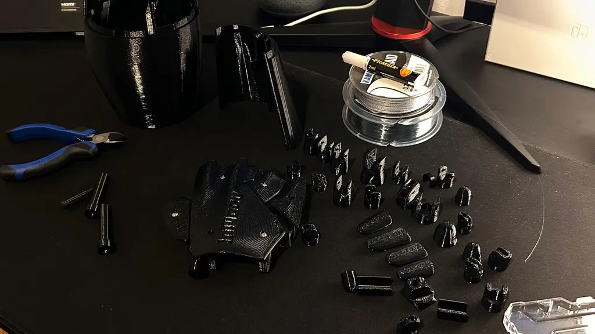
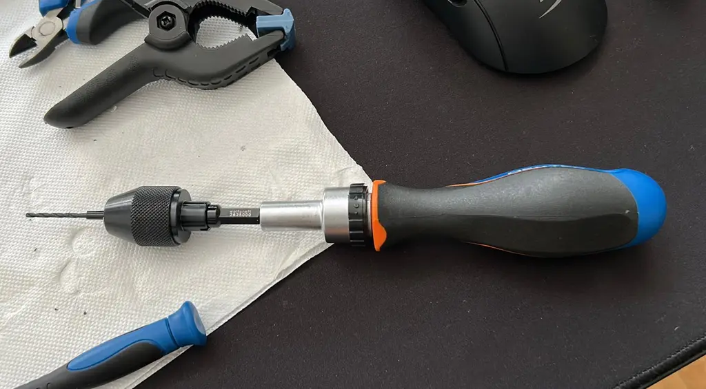
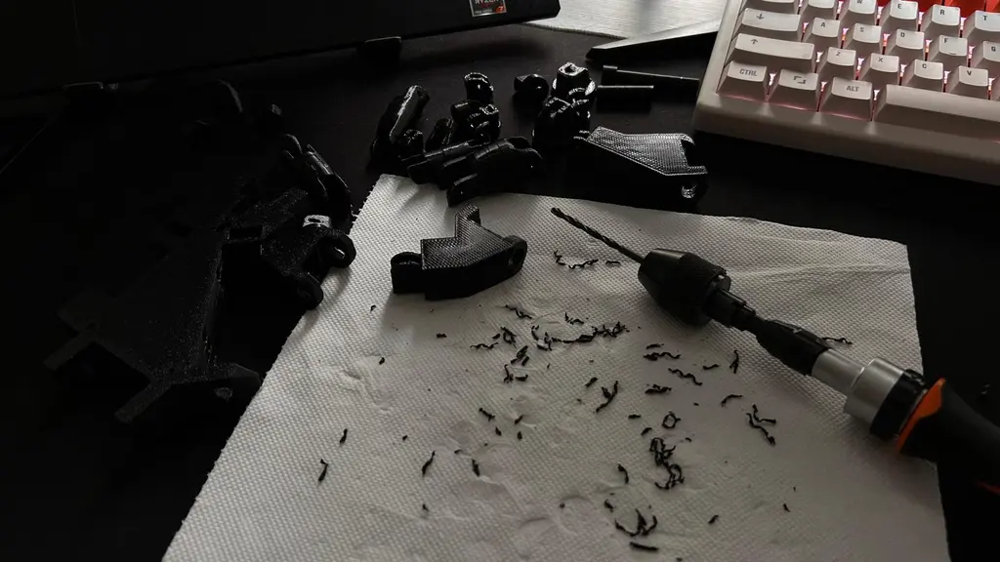
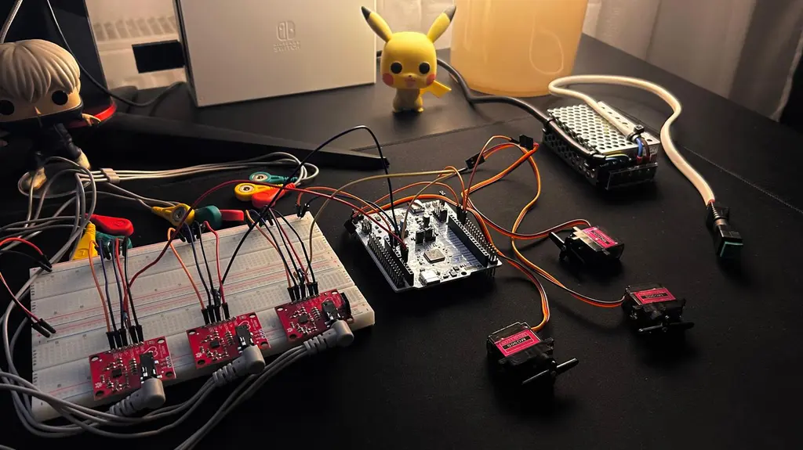
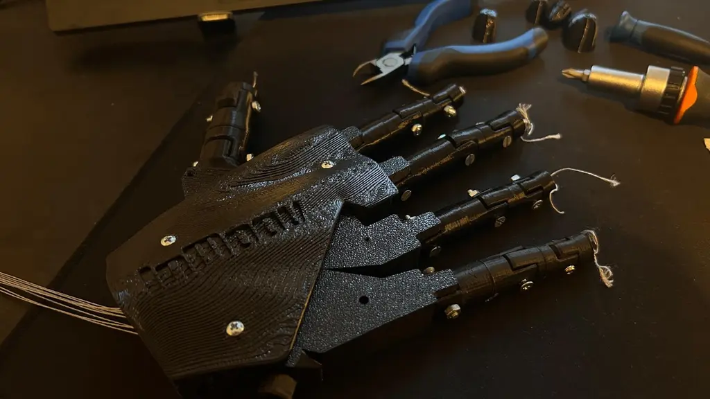
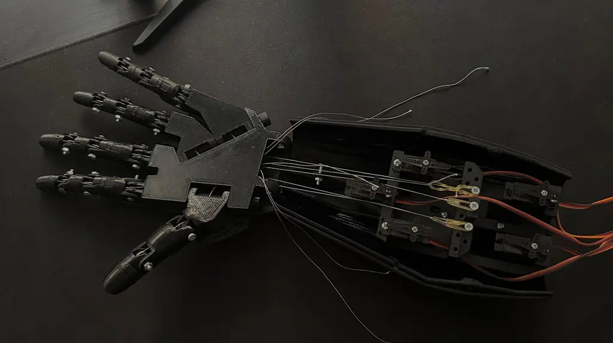
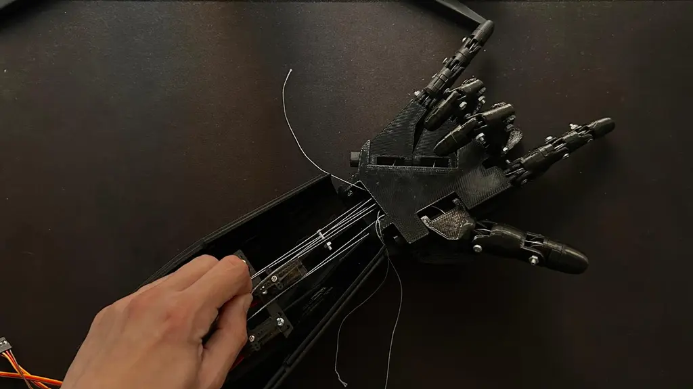
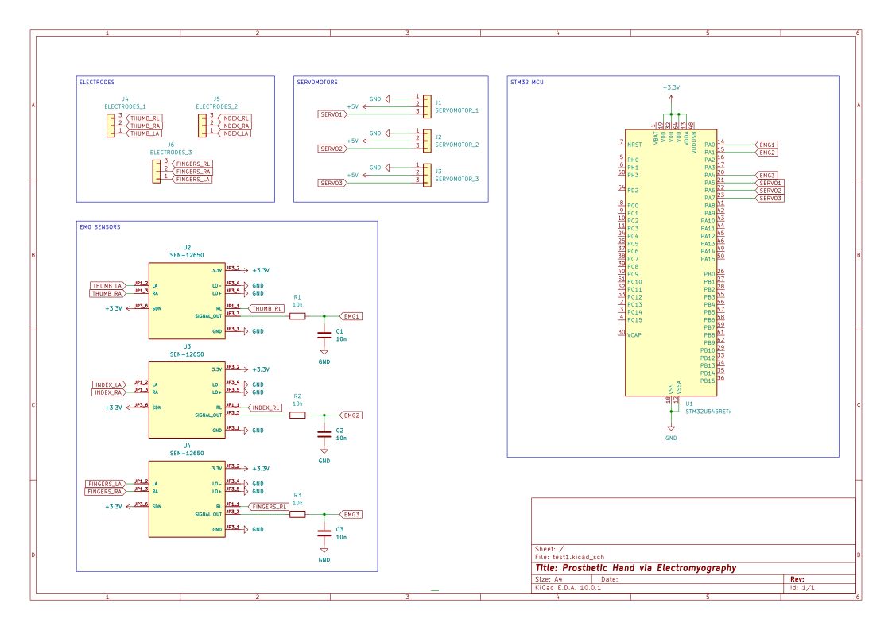

# Prosthetic arm with digit control
3D-printed prosthetic hand with EMG-based digit control and tendon-driven mechanical actuation

:::info 

**Author**: Temiac Mihai-Gabriel \
**GitHub Project Link**: https://github.com/UPB-PMRust-Students/fils-project-2026-mihailinux

:::

<!-- do not delete the \ after your name -->

## Description

The project focuses on building a prosthetic hand with electromyography, the most used technique for driving prosthetics. Muscle signals are preferred due to their higher amplitude and ease of non-invasive surface acquisition.

By sampling multiple areas with electrodes, via specialized EMG sensors or repurposed EKG sensors, a potential difference is linked to muscle activity. Using multiple sensors enables the mapping of groups of digits/individual digits, allowing the prosthetic to become usable in multiple scenarios. 

The prosthetic will be 3D printed, with channels for the hand pulleys, plus string materials for the flexor tendons and elastic materials for the extendor tendons, achieving natural momevent, aiming for a mechanical system as close to reality.

## Motivation

I've always been passionate about the inner workings of life, with physiology being at the top of the list. Building a prosthetic arm would allow me not only to practice my mechanical skills, but also delve into how electrical signals, something which we study so extensively, are produced on such a small scale. 

Processing muscle signals is a difficult task due to their irregular nature, as they do not contract in a completely synchronized manner. EKG signals are periodic, synchronized and have a consistent pattern, but they lack the challenge of analysing such complex signals (not to deny their difficulty, but looking at it in an objective manner). 

As such, I chose this project due to its nature and complexity, as I strongly believe it will help me develop skills which I may otherwise not have the chance to. 

## Architecture 

<center>

</center>

## Log

<!-- write your progress here every week -->

### Week 4-5
- Research on project ideas
- Found many open-source projects, there seems to be an even bigger community for this than I thought

### Week 6-7
- Started looking into tutorial regarding 3D modelling
- Found multiple possible issues with the tendon channel, prototyping is necessary

### Week 8
- First 3D renders, there is plenty of room for improvement, but have been getting more comfortable with Fusion

### Week 9
- Working on the documentation.

### Week 10
- Got the prints, this is tough. Broke a pin already, the tolerances were not a joke. Will use the universal repair tool, superglue. 

### Week 11
- Still working at the build; it feels like a battle, and I am losing.

<center>

</center>

### Week 12
The assembly has been completed, could say that the superglue was *handy*. You would think that a large hardware store would have all the tools you need, but sometimes you have to improvise (this time, I had to improvise a tad too much).

Down below is my fully functional, high precision, low cost, hand drill (could not find a smaller electric drill, and I was not gonna spend the big buck on professional ones, hope I will not be working in construction anytime soon), as the tendon channels needed redrilling. 

<center>

</center>

Learnt what an *elephant foot* means in 3D printing; pairing grit paper with my ultra precision tool meant the job was (supposed to) be easy enough. 4 days later, I was still sanding down finger joints, else the servos would snap at the first tug.

<center>

</center>

Also tested the code without the assembly, everything was looking good. Sample sensor, analyze, classify and respond with the correct motors.

<center>

</center>

### Week 13
Final push: the hand was complete, the assembly looked good, the mechanics ran smooth. 

<center>

</center>

For the future students taking this class, please do **demo videos**. You never know when things might go wrong. Installed an I2C module for the servo control, things ran great until they did not. Functional code, got a video of the servos moving, after which we got smoke coming out of the module. Safe to say, I was toast. Document your progress, stuff happens.


### Week 10
Got the prints, this is tough. Broke a pin already, the tolerances were not a joke. Will use the universal repair tool, superglue. 

### Week 11
Still working at the build; it feels like a battle, and I am losing.

## Hardware

The system uses **AD8232** EKG sensors, repurposed for EMG due to the high cost of specialised sensors. 

**Gel electrodes** are used for stabilising the signal, as the AD8232 is already noisy by default, with muscle signals introducing yet another degree of complexity. 

Everything is processed by an **STM32U545 Nucleo** microcontroller. **MG90S** servos will be used in the finger pulley system, as I need enough torque to counteract the force pulling the finger back in its neutral position.

<center>

</center>

Two tendons per finger, both via braided fishing line (strongest I could find in store was 24kg, no way the servos snap it). The extensor motion was achieved by tying orthodontic elastics (braces elastics) to a pin mounted in the servo bay, which pulled the finger to its neutral position after the tension was released; almost like a saw tooth.

<center>

</center>

<center>

</center>

<center>

</center>

### Schematics

<center>

</center>

The **PCA9685** has been left out, as the project can run with or without it, via the **PWM** pins on the **STM**. If we were to install it, we would wire up the `SDA` and `SCL` pins, with power coming from the external power supply, (logic 3.3V comes from the STM). The servos are plug and play, provided you do not mess up their orientation.

### Bill of Materials

<!-- Fill out this table with all the hardware components that you might need.

The format is 
```
| [Device](link://to/device) | This is used ... | [price](link://to/store) |

```

-->

| Device | Usage | Price |
|--------|------|------|
| [STM32U545 Nucleo](https://www.st.com/en/evaluation-tools/nucleo-u545re-q.html) | Microcontroller | [borrowed] |
| [AD8232 EKG sensor](https://www.analog.com/media/en/technical-documentation/data-sheets/ad8232.pdf) | EMG signal acquisition (repurposed EKG module) | [35 RON x 3](https://www.optimusdigital.ro/ro/senzori-altele/1347-modul-senzor-ecg-ad8232.html?srsltid=AfmBOooAX5b3QDFkBnnuSQi5Ejg6U0BX_VEz3xrKOzaeQP8Z8HV6hnwI)|
| [MG90S Servo Motor](https://www.tinytronics.nl/product_files/000263_Data%20Sheet%20of%20MG90S%20Analog%20Servo%20Motor.pdf) | Finger actuation | [20RON x 3](https://sigmanortec.ro/en/servo-motor-mg90s-metal-gears) |
| Gel electrodes | Skin-signal interface | [30 RON](https://www.aviafarm.ro/cumpara/set-100-electrozi-adezivi-ecg-ovali-f9089-cu-gel-solid-si-senzor-ag-953?utm_source=portal&utm_medium=web&utm_campaign=google_xml&gad_source=1&gad_campaignid=22826372328&gbraid=0AAAAADQMw-p4DXuVPfSpT3SlDTUKEi_cz&gclid=CjwKCAjwqazPBhALEiwAOuXqdCRNGu_i0Rv1CSS49kxbpT8zRxvhcMcm2q3GkeL3nzO_ce6pKp12-xoCPNoQAvD_BwE) |
| Elastic bands | Extensor tendon system | owned |
| Fishing line | Flexor tendon system | owned |

## Software
### Signal Acquisition

Each **AD8232** connects to the **STM's** `ADC1` peripheral. Before reading, the leads-off pins (`LO+` and `LO-`) are checked; if contact is lost, the read is skipped. This is done so we do not process floating inputs, which would trigger unwanted movement.

The signal is centered at around 8000 counts at rest, with 3.3V from Vcc, over the 14bit ADC.
```
midpoint = (1.65V / 3.3V) × 16383 ≈ 8000 counts
```

During contraction, the signal swings above and below that, with 10 samples taken, over 50ms. This deviation is checked against a threshold (trial and error), and the course of action is decided.

### Actuation

Detected contractions are mapped to three groups, reflecting forearm anatomy. The thumb and index have dedicated flexors, so each get their own sensor. The remaining three share the same muscle, as such, they share one sensor. 

Servo commands are only sent on state changes (edge activated), one for flexing, one for closing. A 500ms debounce was also implemented, as to prevent servo chatter from the noisy EMG signal (please avoid these sensors).

The **PCA9685**, the **I2C** peripheral, drives all five servos, generating 50Hz PWM , independently from the MCU. The PWM frequency is set via a prescaler.
```
prescaler = (25 000 000 / (4096 × 50)) − 1 = 121 (0x79)
```

Each servo channel has four registers, `ON_LOW`, `ON_HIGH`, `OFF_LOW`, `OFF_HIGH`, encoding when the pulse starts and ends within the set cycle. The pulse always starts at 0, we only adjust the OFF value. By trial and error, we got to the following:

| Position | Counts | 
|----------|--------|
| Finger open | 100 | 
| Finger closed | 550 | 

### Sensor Placement

The three sensors cover three anatomical regions of the forearm. The initial plan was to assign them based on known physiology, but as the sensors were too noisy, fine tuning was necessary. Anyhow, the muscles we sampled were the **Flexor Pollicis Longus** (for the thumb) and **Flexor Digitorum Profundus** (for the fingers).

I would insert a really nice photo here, but copyright laws forbid me from, and I do not intend on performing anatomy on myself. These can be easily seen via an internet search.

### Known Limitations

The **AD8232** is an ECG sensor, with a bandpass filter optimised for **0.5-40Hz**. Surface EMG, ideally, goes across **20-500Hz**. That means that we only capture the low-frequency, leading to forceful contractions. A dedicated module would improve sensitivity significantly, but the cost difference is substantial.

The threshold, of 3500 counts, was, as previously stated, determined via trial and error. Ideally, we would calibrate it at startup, per individual user.

The **PCA9685** was damaged during the final assembly due to a short on the power servo rail. Servo control was working fine prior to this, so a replacement module should restore full operation.

### Crates

| Library | Description | Usage |
|---------|-------------|-------|
| [embassy-stm32](https://github.com/embassy-rs/embassy) | STM32 async runtime | Hardware control, ADC, PWM |
| [embassy-executor](https://github.com/embassy-rs/embassy) | Task scheduler | Real-time control loop execution |
| [defmt](https://github.com/knurling-rs/defmt) | Embedded logging | Debugging and signal monitoring |
| [embassy-time](https://github.com/embassy-rs/embassy) | Async timers | Debounce, sampling delays |
| [panic-probe](https://github.com/knurling-rs/defmt) | Panic handler | Halt and report on crash |

## Links

<!-- Add a few links that inspired you and that you think you will use for your project -->

1. [Advanced version with high-end EMG sensors](https://www.youtube.com/watch?v=KSP4o_WCqVs)
2. [OpenBionics](https://openbionics.com/en/)
3. [OpenBionics open-source designs](https://github.com/OpenBionics/Prosthetic-Hands)
4. [InMoov](https://inmoov.fr/)
