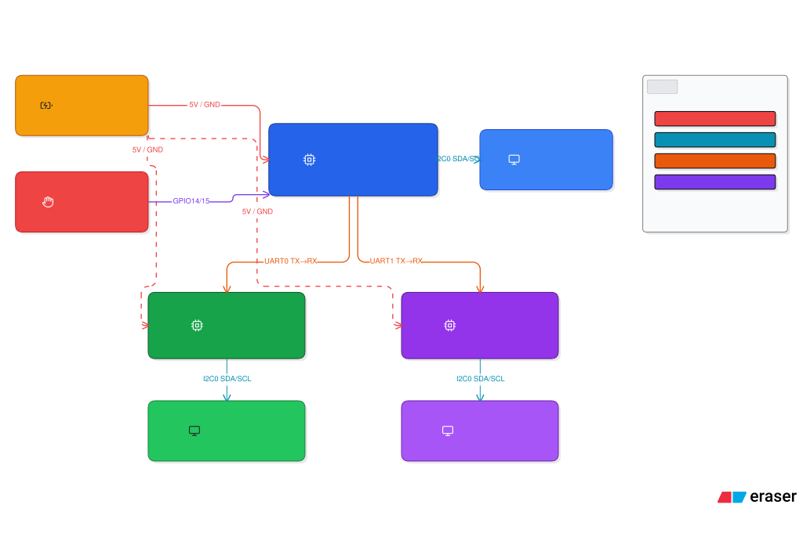

# Slot Machine Project: Gold Inferno Replica

:::info

**Author**: Vashilescu Mihai Catalin

**Group**: 1232EB

**Project Name**: Gold Inferno Replica

**Architecture Basis**: 3 Raspberry Pi Picos

**Github Project link**: ...

:::

## Description

This project replicates the Gold Inferno slot machine game using embedded hardware. It features a 3x3 grid of OLED screens (9 total) powered by three Raspberry Pi Pico 2 boards. This design increases the complexity of software coordination, display synchronization, and resource management. Ultimately, this version of the project showcases the complexity involved in building a distributed embedded system.

## Motivation

The primary goal is to simulate an interactive slot machine experience. Achieving this requires tight coordination between hardware and software components, real-time communication between microcontrollers, and precise control of multiple displays.

## Architecture

The system utilizes a 3 Pico setup to distribute the workload. The architecture is divided as follows:

* One of the Picos acts as both the game controller (master) and a display driver.
* This master Pico runs the main game logic and also drives 3 displays.
* The other two Picos are responsible for driving 3 displays each.
* Communication between the Picos is handled via UART or I2C protocols.
* This system design requires coordination of multiple microcontrollers in real time, increasing the software and hardware complexity significantly.

## Log

### Will be added when I'll have my todo list sorted by date

## Hardware

Building this distributed system relies on a specific set of hardware components to manage the inputs, processing, and display outputs. 

### Schematics

The core system architecture diagram illustrates a hierarchy with a Master + Worker Pico at the top. This primary controller is connected to Worker Pico 1 and Worker Pico 2. Together, these three boards drive 9 independent screens sequentially labeled L1 through L9.

### Bill of Materials

| Device | Usage | Price |
| :--- | :--- | :--- |
| 3x Raspberry Pi Pico 2 | Microcontrollers acting as the master and worker nodes. | 3 x 25.00 RON |
| 9x I2C 0.96" OLED screens | 0.96" displays making up the 3x3 visual grid. | 9 x 16.00 RON |
| 25x Buttons | Used for user input, specifically Spin and Bet actions. | 20.00 RON |
| Power source | Provides power to the system via USB or a battery. | 10.00 RON |
| Wiring and connectors | Required for interconnecting components and establishing I2C wiring. | 30.00 RON |
| Custom enclosure | Houses the hardware components safely. | 0.00 RON |

## Software

The software implementation requires the Master Pico to manage both the game logic and its assigned displays. Because the architecture is distributed, the software must ensure real-time responsiveness and inter-device communication. 

The primary game logic includes:
* Reel animations and timing.
* Symbol randomization.
* Payout and bonus detection.
* User input and feedback.

### Challenges and System Constraints
* Synchronizing animation across multiple microcontrollers is a major challenge.
* The system must operate within the limited memory and processing power on each Pico.
* The software requires careful I2C addressing and display refresh coordination.