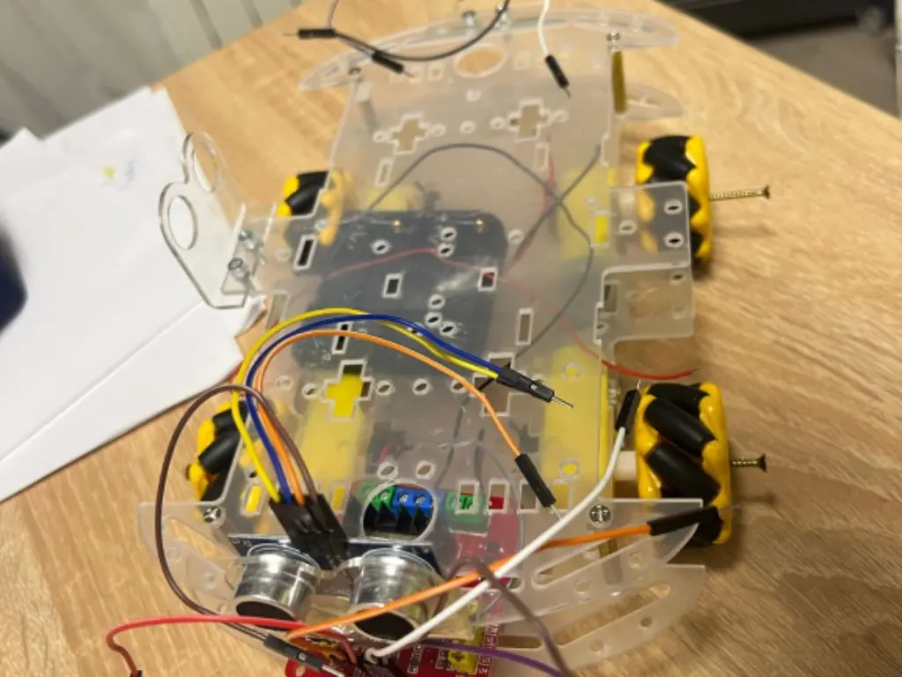
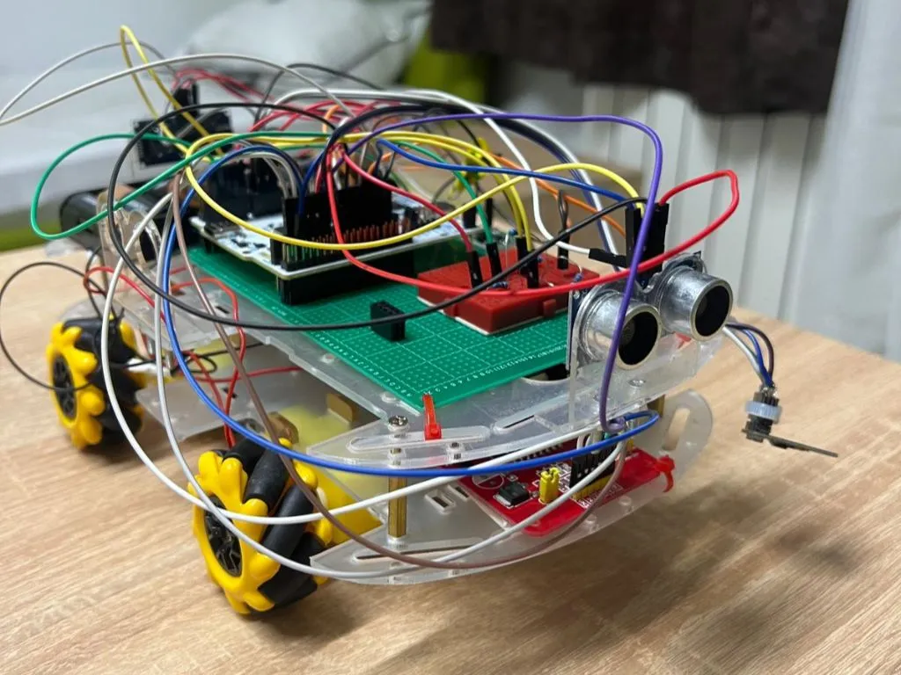
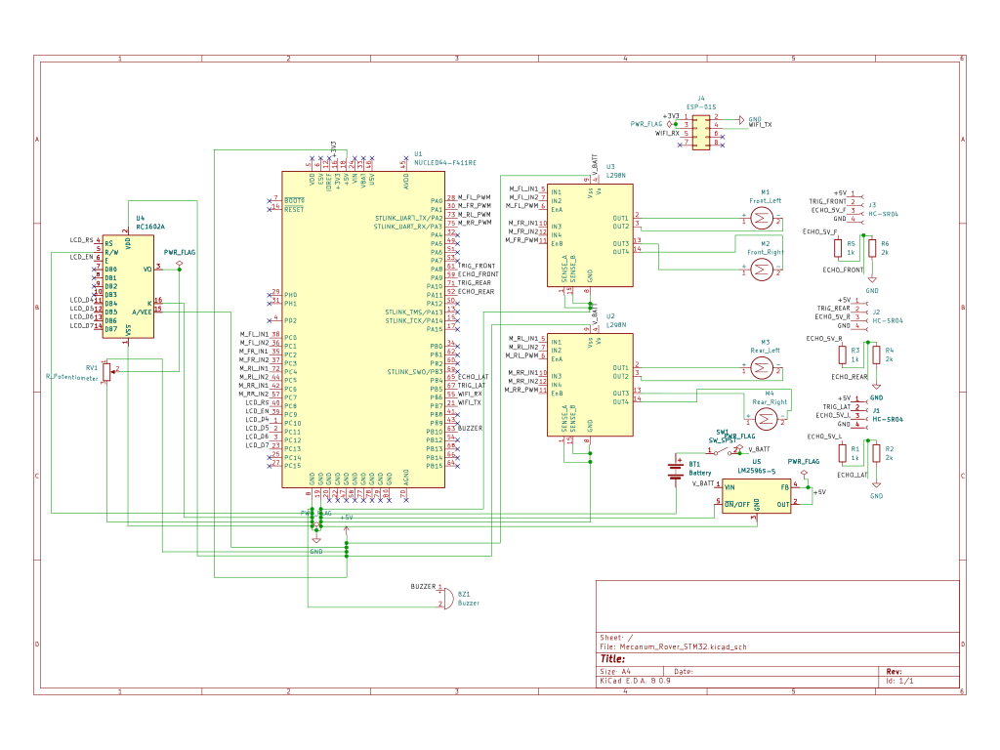

# 4WD Omni-Directional Smart Rover with Wi-Fi Teleoperation

A 4WD smart robotic rover powered by an STM32 Nucleo board, featuring mecanum wheels for lateral parking and Wi-Fi teleoperation.

:::info
**Author:** Dunărinţu Mihnea-Rafael \
**Group:** 1221ED \
**GitHub Project Link:** [https://github.com/UPB-PMRust-Students/fils-project-2026-mihnearafael](https://github.com/UPB-PMRust-Students/fils-project-2026-mihnearafael)
:::

## Description

The goal of this project is to build a 4WD smart robotic rover powered by an STM32 Nucleo board. The core software logic will be organized as a simple state machine, transitioning smoothly between the AUTONOMOUS_FORWARD, AUTONOMOUS_AVOID, MANUAL_CONTROL, SMART_REVERSE, LATERAL_PARKING, and STANDBY states based on sensor inputs, Wi-Fi commands, or physical hardware interrupts.

The car operates in two primary modes: an autonomous mode where it navigates independently using a front-facing ultrasonic sensor to detect and avoid obstacles, and a manual mode where it is piloted remotely. Thanks to the upgraded 4WD mecanum wheels, the rover is capable of omnidirectional movement, allowing for advanced maneuvers such as lateral parking. 

For teleoperation, an ESP8266 module acts as a Wi-Fi bridge, allowing the user to control the rover's movements remotely. Additionally, the rover features an acoustic parking assist. When reversing, a rear-facing ultrasonic sensor continuously monitors the distance to obstacles behind the car, triggering a passive buzzer to beep faster as it approaches a wall. The user can switch between autonomous and manual modes via the Wi-Fi app, or by pressing the physical blue USER button on the Nucleo board as an instant failsafe override.

## Motivation

I chose this project to practically apply embedded systems concepts, particularly concurrent task scheduling and state machine logic. Upgrading from a standard 2WD differential drive to a 4WD mecanum system introduces interesting challenges in motor control and PWM synchronization. The addition of lateral parking makes the system far more interactive and closer to modern automotive assist technologies.

## Architecture

The system is organized into five functional layers, centered around the STM32 Nucleo board:

1. **Power:** Two battery holders containing standard AA batteries provide the main power supply (approx. 6V - 9V). This powers the motor drivers directly, while an MP1584EN buck converter steps it down to a stable 5V for the microcontroller and sensors.
2. **Mobility (4WD):** Four independent DC motors, equipped with mecanum wheels, are driven by two L298N motor controllers receiving PWM signals from the STM32.
3. **Perception:** Two HC-SR04 ultrasonic sensors (front and rear) detect obstacles. Their 5V Echo signals are safely stepped down to the Nucleo's 3.3V logic via a level converter.
4. **Communication:** An ESP-01S module establishes a Wi-Fi bridge, allowing the STM32 to receive remote control vectors from a connected client.
5. **Feedback:** A passive buzzer emits variable-frequency acoustic warnings during reverse maneuvers.

## Log

### Week 1 - 9
- Started with a 2WD Rover idea and eventually moved to 4WD and more complex features like parallel parking after receiving feedback.
- Throughout the weeks I have gathered the materials needed to assemble the hardware of the kit and its adjacent components needed for the behaviour of the rover.

### Week 12 - 18 May
- Finished assembling the hardware of the kit, wiring the components, and organizing the chassis.

### Week 19 - 25 May
- Written the core software logic for the rover using the Rust Embassy framework, implementing the state machine, motor control, and sensor integration.

## Hardware

The project relies on an STM32 Nucleo board as the main controller, communicating with an ESP8266 for remote commands. The chassis has been modified to support 4 independent DC motors and mecanum wheels for complex kinematics. Two ultrasonic sensors handle spatial awareness, while power is regulated via a buck converter to safely power the logic systems from the standard battery packs.

### Schematics

### Bill of Materials

| Device | Usage | Price |
| :--- | :--- | :--- |
| STM32 Nucleo-U545RE-Q | Main microcontroller | 108.34 RON |
| 4WD Smart Car Chassis Kit | Base physical platform | 83.24 RON |
| 4x Omnidirectional (Mecanum) Wheels | Lateral/omnidirectional movement | 108.04 RON |
| 2x L298N Motor Drivers | PWM control for the DC motors | 20.00 RON |
| ESP-01S ESP8266 Wireless Module | Wi-Fi bridge for remote teleoperation | 18.99 RON |
| 2x HC-SR04 Ultrasonic Sensors | Obstacle detection (front & rear) | 26.74 RON |
| 3V / 3.3V Passive Buzzer | Acoustic parking assist feedback | 0.99 RON |
| 2x Battery Holders (4-6 AA) & Batteries | Main power supply | 35.00 RON |
| MP1584EN DC-DC Buck Converter | Voltage regulation (fixed 5V) | 9.99 RON |
| Silicone Wires & Jumpers | Component interconnections | 71.40 RON |
| 3x Resistors | Logic level stepping | 1.50 RON |
| 1x Power Switch | Main power toggling | 2.50 RON |
| **Total** | | **486.73 RON** |

## Software

| Library | Description | Usage |
| :--- | :--- | :--- |
| `embassy-stm32` | Hardware Abstraction Layer | Required to interface directly with the STM32 hardware registers and pins. |
| `embassy-executor` | Async runtime | Responsible for scheduling concurrent, non-blocking tasks (driving motors while listening for Wi-Fi). |
| `embassy-time` | Timer module | Essential for creating precise microsecond timers to calculate obstacle distances via HC-SR04. |
| `embedded-hal` | Standard traits | Provides standard traits needed to communicate with external hardware safely. |
| `defmt` & `defmt-rtt` | Logging framework | Highly efficient logging tools for real-time debugging over USB. |
| `panic-probe` | Error handling | Catches critical firmware errors and prints backtraces. |
| `heapless` | Data structures | Manages UART data stream from ESP8266 without dynamic allocation. |

## Links

1. [STM32 Nucleo-U545RE-Q Documentation](https://www.st.com/en/evaluation-tools/nucleo-u545re-q.html)
2. [Embassy framework documentation](https://embassy.dev/)