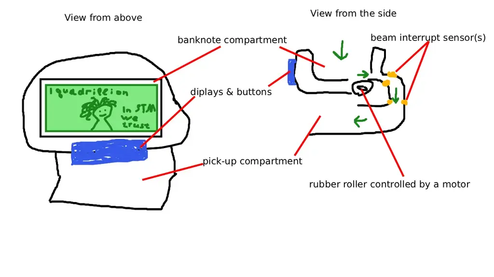

# Cash Counting Machine
A device that would count stack of banknotes and display the sum

:::info 

**Author**: Oleksandr Kozoriz \
**GitHub Project Link**: link_to_github

:::

<!-- do not delete the \ after your name -->

## Description

A simplified version of a cash counting machine, where the user would place a stack of banknotes in it and enter the value of one banknote. The machine would pull the banknotes one by one with a roller, count them using a beam interrupt sensor, and display the total sum.

## Motivation

Why did you choose this project?

## Architecture 

The user would place a stack of banknotes into the dedicated compartment. Then they would input the value of one banknote. After pressing the start button, the motor would push the bottom banknote into a narrow slit, then, employing the gravity, the banknote would trigger the beam interrupt sensor, thus, increase the counter. If after a certain amount of time nothing triggers the sensor, the motor would stop. The front panel would feature the display, which would show the total sum along with the current value of one banknote; and a bunch of buttons, such as start, clear (set the counter and sum to 0), number inputs and preset banknote values (10/20/50/100 etc).



## Log

<!-- write your progress here every week -->

### Week 6
I have ordered all of the components, waiting for them to arrive

### Week 7
All of the components have arrived, and I decided to build an MVP prototype fully on breadboard, without the screen and actual pulling mechanism, just the logic.


There were some issues, such as elecric noice generated by the spining motor interfering with the sensor signals. I had to add a capacitor and also filter the pulses in software, for now everything works fine. 

So I've finished the coding part, added a bit of concurrency and it works as expected, now, I am ready move on to the most important part - the actual pulling mechanism

### Week 19 - 25 May

## Hardware

Detail in a few words the hardware used.

### Schematics

Place your KiCAD or similar schematics here in SVG format.

### Bill of Materials

<!-- Fill out this table with all the hardware components that you might need.

The format is 
```
| [Device](link://to/device) | This is used ... | [price](link://to/store) |

```

-->

| Device | Usage | Price |
|--------|--------|-------|
| [STM32 Nucleo U545RE-Q](https://www.st.com/en/evaluation-tools/nucleo-u545re-q.html) | The microcontroller | [~130 RON*]() |
| [Mini Infrared Interruption Sensor Module](link://to/device) | Detection of the passing banknote | [6.99 RON](https://www.optimusdigital.ro/en/all-products/5826-mini-infrared-interruption-sensor-module.html) |
| [1602 LCD with Blue Backlight 3.3 V](link://to/device) | The main display | [19.99 RON](https://www.optimusdigital.ro/en/lcds/868-modul-lcd-1602-cu-backlight-galben-verde-de-33-v.html) |
| [DC Motor](link://to/device) | Pulling the banknotes into the slit | [3.99 RON](https://www.optimusdigital.ro/en/others/13612-dc-motor-f130-3v.html) |
| [L293D Motor Driver](link://to/device) | The motor driver | [3 RON](https://www.optimusdigital.ro/en/brushed-motor-drivers/13613-driver-de-motoare-l293d.html) |
| [18 mm Rubber Wheel](link://to/device) | The roller | [5 x 0.89 RON](https://www.optimusdigital.ro/en/gears/571-18-mm-rubber-wheel.html) |
| [2x150 mm Shaft](link://to/device) | The shaft for the roller | [1.95 RON](https://www.optimusdigital.ro/en/metal-axes/298-ax-metalic-2x150-mm.html) |
| [2x50 mm Shaft](link://to/device) | Shaft extention | [0.95 RON](https://www.optimusdigital.ro/en/metal-axes/312-ax-metalic-2x50-mm.html) |
| [2 mm to 2 mm Coupling Hub](link://to/device) | Shaft connections | [2 x 5.99 RON](https://www.optimusdigital.ro/en/coupling-hubs/451-2mm-to-2mm-coupling-hub.html) |
| [Miniature Ball Bearing (2 mm Internal Diameter)](link://to/device) | Shaft support | [2.89 RON](https://www.optimusdigital.ro/en/bearings/402-rulment-in-miniatura-cu-diametru-interior-2-mm.html) |
| [4x4 Push Button Keyboard Matrix](link://to/device) | User input | [3.99 RON](https://www.optimusdigital.ro/en/touch-sensors/2441-tastatura-matriceala-4x4-cu-butoane.html) |
| [Red Button with Round Cover](link://to/device) | Start / Reset buttons | [2 x 1.99 RON](https://www.optimusdigital.ro/en/buttons-and-switches/1114-red-button-with-round-cover.html) |
| [Breadboard HQ (830 points)](link://to/device) | Prototyping | [9.98 RON](link://to/store) |
| [Breadboard Jumper Wires Set](link://to/device) | Wiring | [7.99 RON](link://to/store) |
| [10 cm 10p Male-Female Wires](link://to/device) | Wiring | [8 x 2.99 RON](https://www.optimusdigital.ro/en/wires-with-connectors/650-fire-colorate-mama-tata-10p.html) |
| [Device](link://to/device) | This is used ... | [price](link://to/store) |
| [Device](link://to/device) | This is used ... | [price](link://to/store) |

*was borrowed from the class


## Software

| Library | Description | Usage |
|---------|-------------|-------|
| [st7789](https://github.com/almindor/st7789) | Display driver for ST7789 | Used for the display for the Pico Explorer Base |
| [embedded-graphics](https://github.com/embedded-graphics/embedded-graphics) | 2D graphics library | Used for drawing to the display |

## Links

<!-- Add a few links that inspired you and that you think you will use for your project -->

1. [link](https://example.com)
2. [link](https://example3.com)
...
