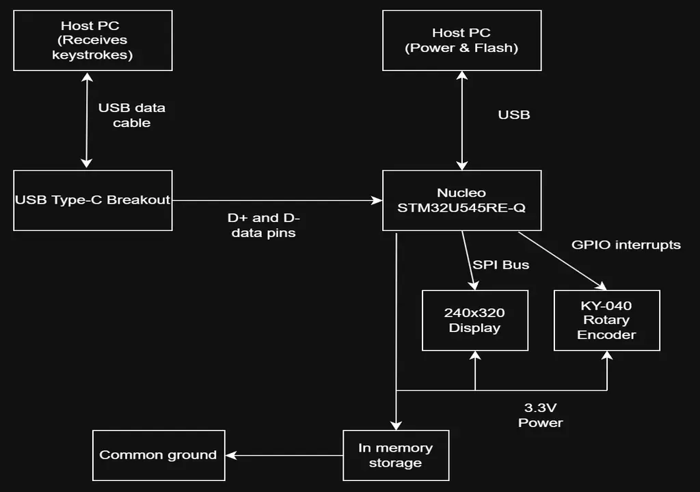
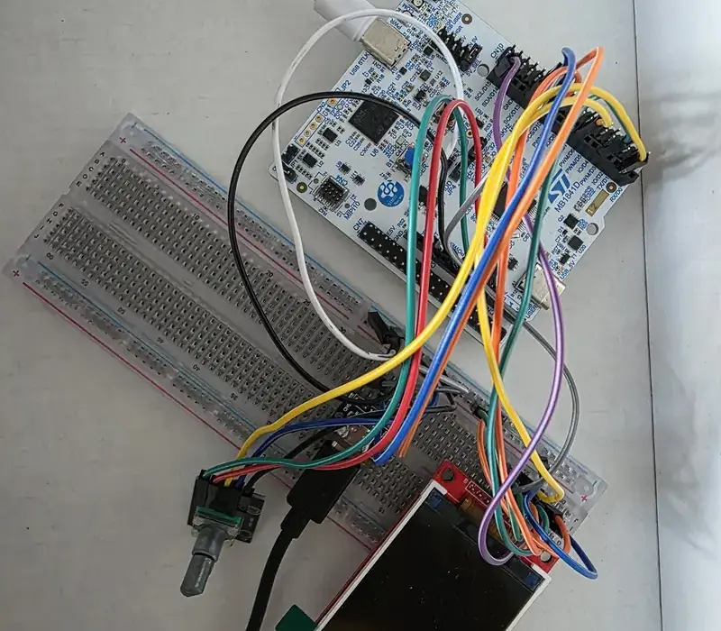
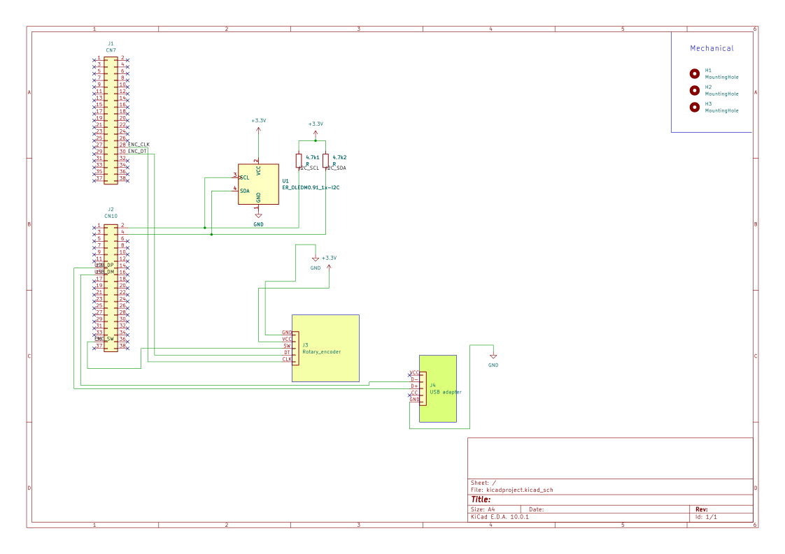

# Hardware password vault
A secure password manager that stores credentials on-chip and acts as a physical USB keyboard to inject them.

:::info
**Author**: Draghici Paul Adrian \
**Group:** 1221EA \
**GitHub Project Link**: https://github.com/UPB-PMRust-Students/fils-project-2026-UserT101
:::

## Description

My project aims to build a hardware-based password manager using the STM32U545RE microcontroller. The device securely stores user credentials in its volatile memory(storing passwords and remembering user sessions will be implemented later as an upgrade). 

Through a physical rotary encoder and an 2.2" 240x320 SPI display interface, the user can unlock the vault using a Master PIN and select a specific account. Then, the STM32 will retrieve the associated password and will act as a standard Human Interface Device (HID) keyboard, injecting the keystrokes directly into the host computer.

## Motivation

Firstly, I thought this idea is something very useful on a daily basis. The goal is to design a highly secure credential vault that mitigates software-based keylogging and not depending on an external software for password autocompletion. By acting as an isolated external hardware device, the host PC never has direct access to the raw password database. This physical separation ensures that sensitive passwords never touch the host system's vulnerable clipboard. 

## Architecture

The system architecture centers around the STM32U545RE microcontroller, which orchestrates user input, visual feedback, cryptographic operations, and USB communication. The user interacts with the device via a KY-040 Rotary Encoder, navigating a text-based interface rendered on the ILI9341 SPI display. 

Because the development board's onboard USB port is hardwired to the ST-LINK programmer, a dedicated USB Type-C breakout board is used to establish a direct data connection to the host PC. 
Upon selecting an account, the STM32 retrieves the decrypted payload from volatile memory and formats it as standard Human Interface Device (HID) keyboard reports, injecting the keystrokes over the Type-C connection. 

Finally, to satisfy strict USB enumeration timing constraints, the USB peripheral is deliberately initialized only after the system completes its primary boot sequence and renders the initial UI.

## Component connections

## Log

### Week 3-4
I have defined the hardware architecture and ordered all the necessary components. 

### Week 5-7
I studied the technical documentation and datasheets for the ILI9341 LCD and the KY-040 rotary encoder to prepare the necessary firmware communication protocols and SPI peripheral configurations. I also researched the STM32's USB 2.0 Full Speed capabilities. Decided to go with the SPI screen because after testing the former I2C screen proved to be faulty, and because of better functionality. 

### Week 8-9
I began the hardware assembly phase by soldering the necessary header pins to the USB Type-C breakout board. I set up the initial breadboard prototype, establishing the first communication links between the ILI9341 screen and the STM32 via SPI, while testing the initial USB HID enumeration to ensure the host PC correctly recognized the microcontroller as a standard keyboard. 
I also researched methods on character injection.

### Week 9-12
Modularizing the code, creating separate files display.rs and serial.rs. Created display states, built the underlying logic. Graphics rendering using embbeded-graphics(PIN entry screen and the scrollable selection menu), implemented the asynchronous executor in order for the USB peripheral to poll in the background. Input interpretation: Developed the logic for the KY-040 rotary encoder. 

### Week 13-14
Final code testing phase, bug fixing, improving efficiency(choosing to refresh only the key that is modified, not the entire screen, for example). Making the USB data transmition from the STM to the clipboard work.

# Hardware
The central component of the system is the STM32U545RE microcontroller, which currently utilizes its internal volatile memory (RAM) to securely manage credentials during an active session. This stateless approach ensures that no sensitive data persists after power is removed. 

The user interface consists of a KY-040 Rotary Encoder—providing tactile navigation and selection via its integrated push-button—paired with an ILI9341 SPI TFT screen for clear visual feedback. To bridge the hardware to the host PC, a USB Type-C Breakout Board is used to route the STM32's native USB data pins, allowing the device to act as a standalone standard keyboard (HID).

### Bill of Materials

| Device | Usage | Price |
|--------|--------|-------|
| [STM32 Nucleo-U545RE](https://www.st.com/en/evaluation-tools/nucleo-u545re-q.html) | The main microcontroller acting as the vault brain | 120 RON |
| [KY-040 Rotary Encoder](https://sigmanortec.ro/Encoder-rotativ-KY-040-p126258216) | User input interface (navigation and tactile button) | 6.50 RON |
| [LCD SPI 2.2'' 240x320 px](https://www.optimusdigital.ro/ro/optoelectronice-lcd-uri/1260-lcd-spi-22-240x320-px.html?search_query=spi&results=223) | Display interface | 59.99 RON |
| [USB Type-C Data Module](https://sigmanortec.ro/modul-type-c-la-pini-de-panou-tensiune-si-date-usb-31) | Host connectivity to establish a direct HID connection | 11.53 RON |
| [Breadboard 400 points](https://sigmanortec.ro/Breadboard-400-puncte-p125633800) | Prototyping hub and resistor mounting | 5.00 RON |
| [40 Dupont Wires Female-Female](https://sigmanortec.ro/40-fire-Dupont-10cm-Mama-Mama-p129872525) | Direct board-to-module connections | 4.50 RON |
| [40 Dupont Wires Male-Male](https://sigmanortec.ro/40-fire-Dupont-10cm-Tata-Tata-p129872516) | Breadboard connections | 4.50 RON |
| [4.7kΩ Resistors (20x)](https://sigmanortec.ro/Rezistor-p126025265) | Hardware pull-ups for I2C and signal integrity | 3.20 RON |

## Schematics

## Software

| Library | Description | Usage |
|---------|-------------|-------|
| [embassy-stm32](https://github.com/embassy-rs/embassy) | Async embedded framework | Initializing communication and connecting peripherals |
| [embassy-executor](https://github.com/embassy-rs/embassy) | Async/await executor | Spawning the main hardware tasks |
| [embassy-usb](https://github.com/embassy-rs/embassy) | USB protocol stack | Establishing the USB 2.0 Full Speed connection |
| [embassy-sync](https://github.com/embassy-rs/embassy) | Async synchronization | Providing thread-safe channels to pass payloads between the UI and USB tasks |
| [usbd-hid](https://github.com/rust-embedded-community/usb-device) | USB HID class definitions | Transmitting decrypted keystrokes to the host PC |
| [embedded-graphics](https://github.com/embedded-graphics/embedded-graphics) | 2D graphics library | Drawing the text-based menu UI |
| [embedded-hal-bus](https://github.com/rust-embedded/embedded-hal) | Shared bus abstractions | Providing the ExclusiveDevice wrapper to safely manage the SPI Chip Select pin
| [ili9341](https://github.com/sharebrained/rust-lcd-ili9341) | Display driver | Initializing the specific 240x320 LCD screen and managing orientation |
| [display-interface-spi](https://github.com/therealprof/display-interface) | Display communication | Abstracting the SPI bus and Data/Command pin for the ILI9341 driver
| [heapless](https://github.com/rust-embedded/heapless) | No-std data structures | Providing memory-safe, fixed-capacity dynamic arrays (Vec, String) without allocators
| [defmt](https://github.com/knurling-rs/defmt) | Deferred formatting | Generating highly efficient, compressed debug logs
| [defmt-rtt](https://github.com/akiles-dev/defmt-rtt-target) | RTT transport for defmt | Transmitting the compressed logs to the host PC via Real-Time Transfer
| [panic-probe](https://github.com/knurling-rs/probe-run) | Panic handler | Catching fatal errors and routing the stack trace through the debug interface

## Links

1. [STM32U5 Series Documentation](https://www.st.com/en/microcontrollers-microprocessors/stm32u5-series.html)
2. [USB Human Interface Device (HID) Class](https://en.wikipedia.org/wiki/USB_human_interface_device_class)
3. [Embassy Framework](https://embassy.dev/)