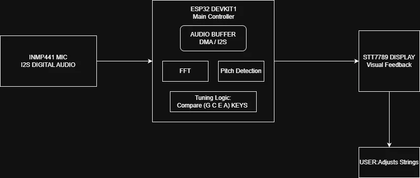

# ESP32 Ukulele Tuner (Rust)

:::info

A one line project description
A real-time ukulele tuner using ESP32 and Rust with visual feedback on a TFT display.

**Author**: Oprea Radu - Gabriel \
**GitHub Project Link**: https://github.com/OpreaRadu2/website

:::

## Description

A simple real-time ukulele tuner that captures audio using a digital microphone, detects pitch, and displays tuning accuracy (flat, sharp, or correct) on a TFT screen.

## Motivation

This project was chosen to explore embedded systems programming with Rust, real-time audio processing, and hardware interfacing. It combines signal processing with a practical and interactive use case (musical instrument tuning), making it both educational and useful.

## Architecture

### Main components:

Audio Input Module (INMP441 microphone)
Signal Processing Module (pitch detection using FFT)
Control Unit (ESP32 microcontroller)
Output Interface (TFT display)

### Connections:

The microphone captures sound via I2S and sends it to the ESP32.
The ESP32 processes the signal to detect frequency (pitch detection).
The detected pitch is compared with standard ukulele tuning values (G4, C4, E4, A4).
Results are sent to the TFT display, showing whether the note is flat, sharp, or in tune.

### System Data Flow

## Log

### Week 5 - 11 May

Initial project setup, component selection, and environment configuration for Rust on ESP32.

### Week 12 - 18 May

Implemented audio capture via I2S and basic signal processing (FFT).

### Week 19 - 25 May

Integrated display output and completed pitch detection logic with visual feedback.

## Hardware
ESP32 DevKit1 (ESP-WROOM-32)
INMP441 I2S Digital Microphone
1.3” TFT Display (ST7789V, 240x240)

### Schematics

KiCAD schematics will be added here as soon as it's done.

## Bill of Materials
Device	Usage	Price
ESP32 DevKit1	Main microcontroller	42 RON
INMP441 I2S Microphone	Audio input for pitch detection	20 RON
1.3” TFT Display (ST7789)	Displays tuning feedback	40 RON

## Software
Library	Description	Usage
embedded-hal	Hardware abstraction layer	Used for interfacing with ESP32 peripherals
microfft / rustfft	FFT libraries	Used for pitch detection
embedded-graphics	2D graphics library	Used for drawing to the display
esp_idf_hal::i2s	I2S module	Used for audio input processing
espup	ESP Rust tooling	Used for setting up and building the project

## Links